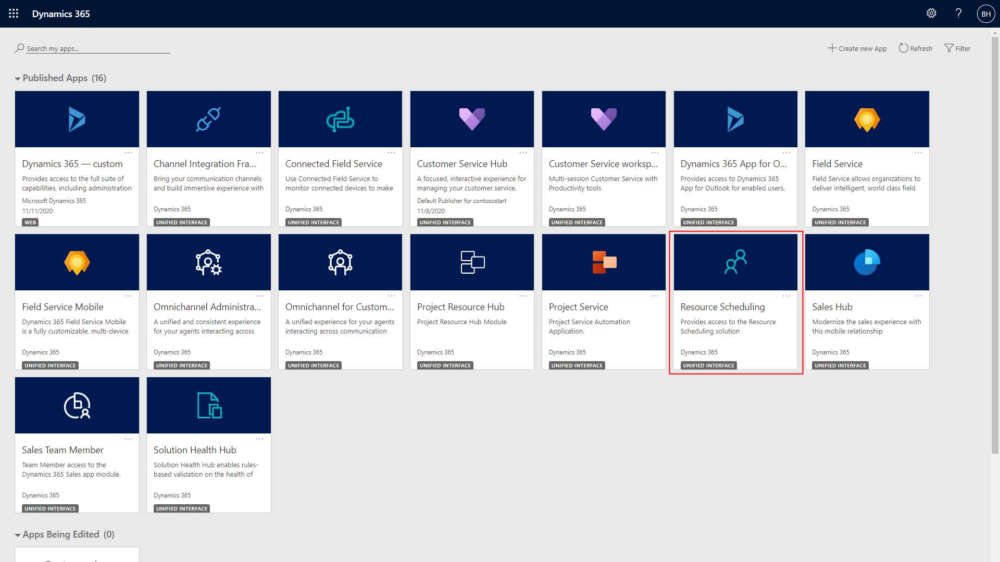
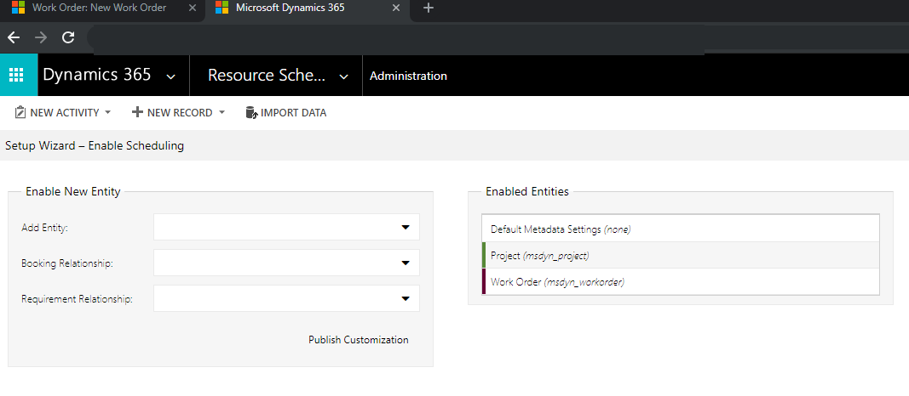

# Perform initial configurations in Dynamics 365 Field Service

After installing Dynamics 365 Field Service, there are a few important initial configurations, whether you're using the application for learning, development, testing, demonstrations, or live usage.

Estimated Duration: 10 minutes

## Prerequisites

1. A Dynamics 365 environment with the Field Service app installed.  
2. Verify you can sign into Dynamics 365 with a **system administrator** security role.

See below for common prerequisite troubleshooting questions.

### Make sure the Field Service application is installed

Sign in as a system administrator and verify that the Field Service application is listed in the main menu. See the following screenshot for reference. If you don't see Field Service, ensure you are signed in as a system administrator. If you still don't see the app, go to the article on [installing Field Service](install-field-service.md).

> [!div class="mx-imgBorder"]
> 

## Step 1: Field Service settings

Review Field Service settings. 

Go to the **Work Order / Booking** section and enter a work order prefix and work order starting number.

An example is **WO** and **100**. This is recommended, but not required.

## Step 2: Resource scheduling

### Scheduling parameters

First, you need to enable mapping and location services for the application. Maps and locations are important in Field Service because knowing the location of work orders and resources allows the solution to effectively route the closest field technician (resource) to the service request (work order).

This is all accomplished by **geocoding**, where the solution associates a latitude and longitude to an address.

> [!div class="mx-imgBorder"]
>  

Go to **Resource Scheduling app** > **Administration** > **Scheduling Parameters**.

> [!div class="mx-imgBorder"]
>  

Set **Connect to Maps** to **Yes**.

> [!div class="mx-imgBorder"]
>   

> [!Note]
> In Field Service version 8.8.10.44+ the Bing Maps API key is hidden.

Save and close.

Later in this article, we'll test geocoding and location services to make sure they're working properly.

### Enable resource scheduling for entities

Next up, navigate to **Resource Scheduling > Administration > Enable Resource Scheduling for Entities**.

> [!div class="mx-imgBorder"]
>   

This is where administrators decide which entities can be scheduled to Resources. When Field Service is installed, work orders are enabled for resource scheduling, and when Project Service is installed, projects are enabled. This is made possible by a solution called [Universal Resource Scheduling](universal-resource-scheduling.md) that adds scheduling capabilities to entities and makes use of the schedule board. Any entity (including custom entities) can be enabled for scheduling; typical examples include cases, opportunities, and orders.

Next, verify that work orders are enabled for resource scheduling.

### Enable map and location settings

To enable maps and location settings on work orders and other relevant records: 

1. Connect to map service.
2. Enable auto geocoding of addresses.
3. Enable address suggestions.
4. Enable Bing Maps (Show Bing Maps on forms).

For more information, see this article: [Location and map settings](field-service-maps-address-locations.md)

## Step 3: Test geocoding

Finally, let’s test geocoding.

Geocoding is associating a latitude and longitude to an address. This allows dispatchers to locate work orders more effectively than an address.

If addresses are geocoded, the system will automatically attempt to locate and populate the lattitude and longitude after entering an address on entities such as accounts, contacts, users, and work orders. Disallowing auto geocoding for addresses requires the user to select a manually select a geocode option in order to geocode an address.

Go to **Field Service** > **Work Orders** and select **+New**.

Begin typing an address.

> [!div class="mx-imgBorder"]
>   

The system will find the address and present it as a suggestion.

> [!div class="mx-imgBorder"]
>   

After selecting the correct address, the form will populate the rest of the address, **including the latitude and longitude**.

> [!div class="mx-imgBorder"]
>   

If you don't want the system to auto geocode addresses, select the geocode button in the top ribbon.

> [!div class="mx-imgBorder"]
>   

>[!Note]
> **Pro Tip \#1:** When using the Field Service application, it's uncommon to enter addresses on a work order. The standard process is to geocode accounts, and when a service account is entered on a work order as the service location, the geocoded address is pulled from the account and added to the work order.

>[!Note]
> **Pro Tip \#2:** It's possible to geocode multiple records at one time by selecting the records from a view. In the screenshot below, we are mass geocoding accounts.

> [!div class="mx-imgBorder"]
>   

[!INCLUDE[footer-include](../includes/footer-banner.md)]