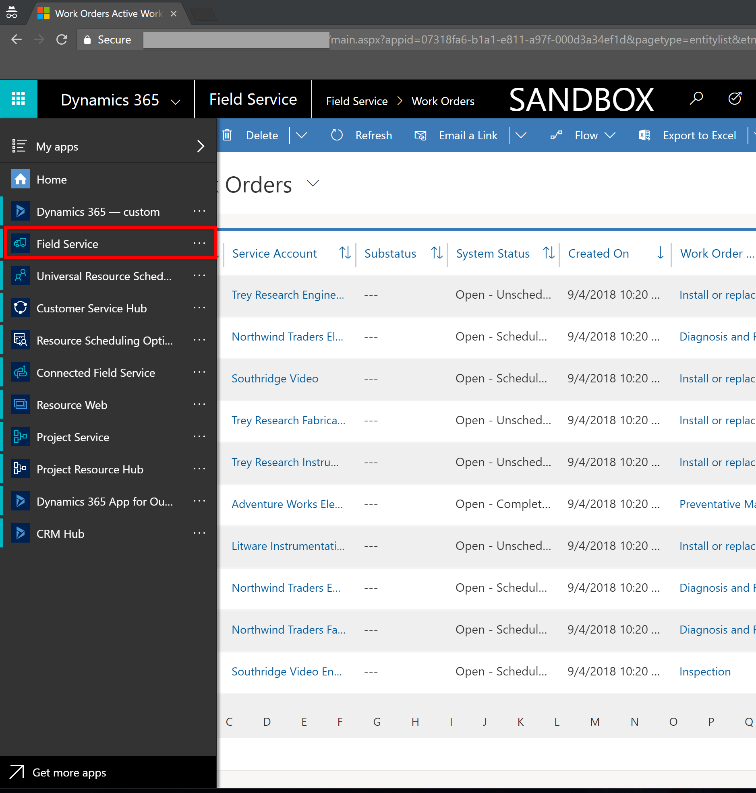
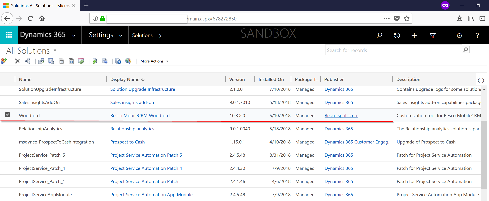
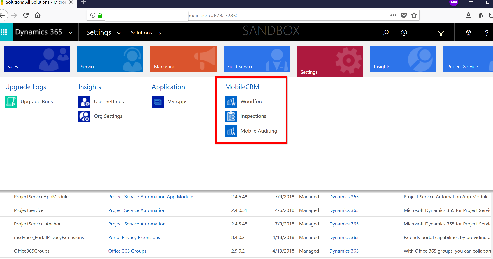
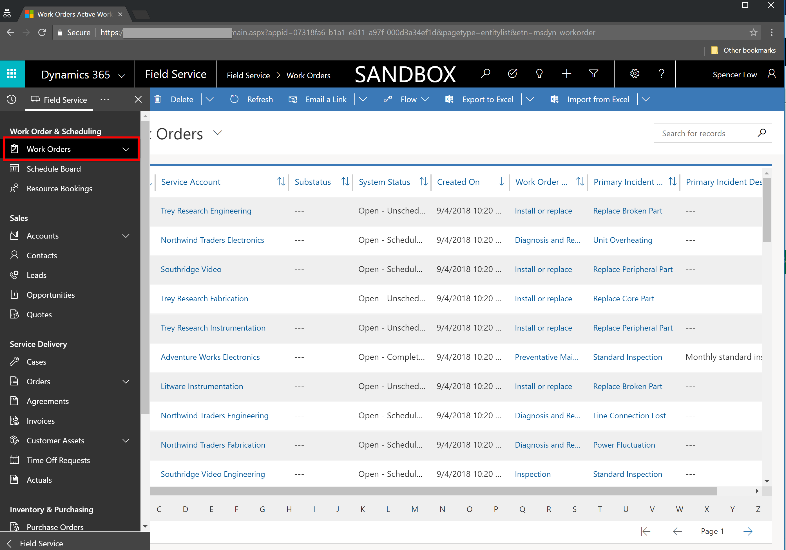
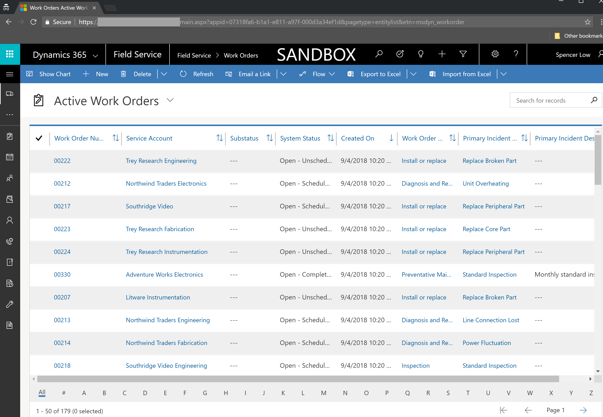
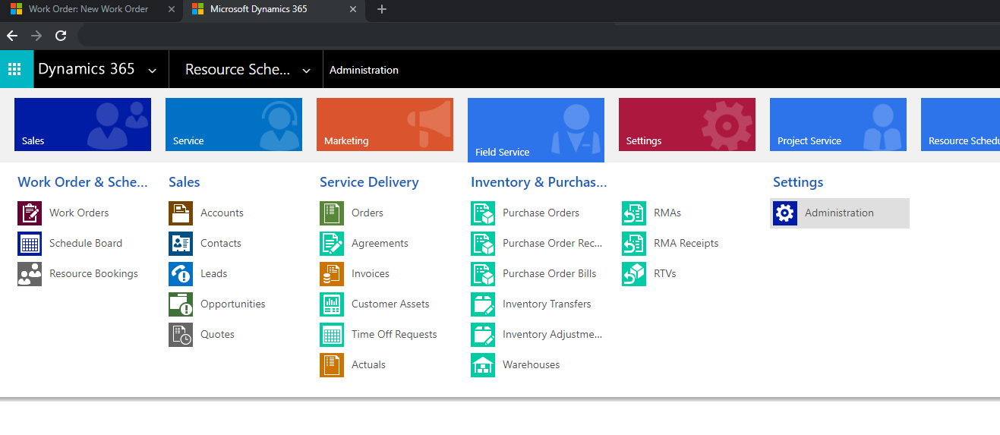
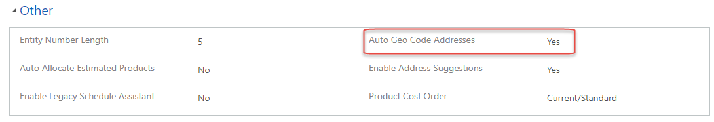
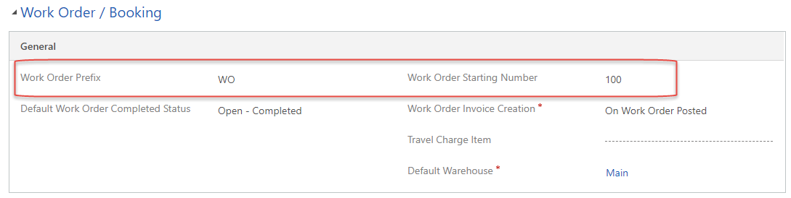
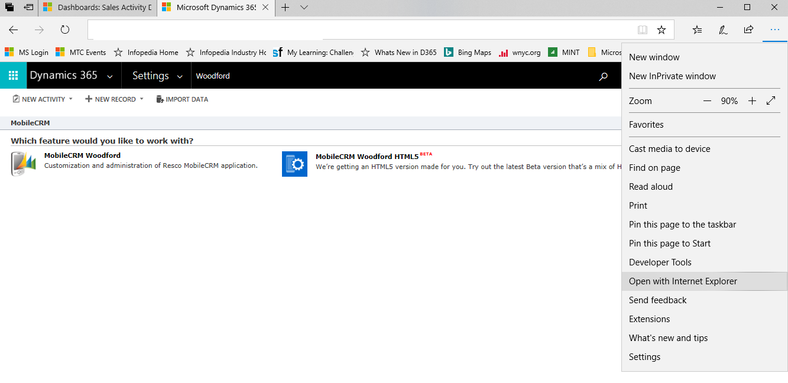
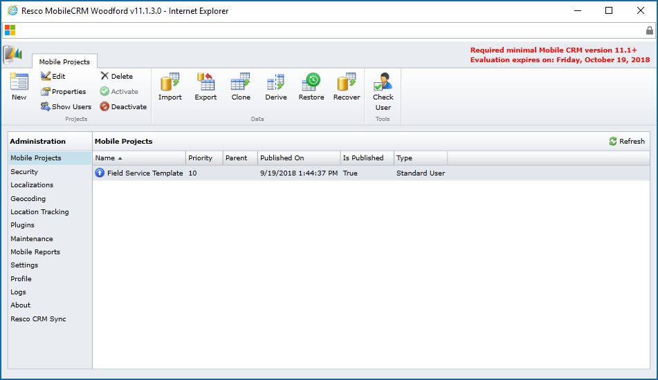

# Perform initial configurations 

After installing Dynamics 365 Field Service, there are a few important initial configurations, whether you're using the application for learning, development, testing, demonstrations, or live usage.

Estimated Duration: 10 minutes

## Prerequisites

1. A Dynamics 365 environment with the Field Service solution and the mobile solution (Resco Woodford) installed. You'll also need to import the mobile project. [Instructions for importing the mobile project can be found here](./install-field-service.md).  

2. Sample data installed (recommended). Installing sample data with the [package deployer](./install-sample-data-8-x.md) will complete many recommended initial configurations.  

3. Verify you can log into Dynamics 365 with a **system administrator** security role.

See below for common prerequisite troubleshooting questions.

### How do I know if the Field Service solution is installed?

When logged in to Dynamics 365 as an administrator or Field Service role, you'll see the Field Service module, as seen in the screenshot below.

> [!div class="mx-imgBorder"]
>   

### How do I know if the mobile solution is installed?

When logged in as an administrator, Woodford will appear under **Settings > Solutions** and as an icon under Settings.

> [!div class="mx-imgBorder"]
>   

> [!div class="mx-imgBorder"]
>   

### How do I know if sample data is imported?

If sample data has already been imported, you'll see multiple records under **Field Service > Work Orders**.

> [!div class="mx-imgBorder"]
>   

> [!div class="mx-imgBorder"]
>   

## Step 1: Resource scheduling

### Scheduling parameters

First, you need to enable mapping and location services for the application. Maps and locations are very important in Field Service because knowing the location of work orders and resources allows the solution to effectively route the closest field technician (resource) to the service request (work order).

This is all accomplished by **geocoding**, where the solution associates a latitude and longitude to an address.

Navigate to **Resource Scheduling > Administration > Scheduling Parameters**.

> [!div class="mx-imgBorder"]
>   

Set **Connect to Maps** to **Yes**.

The API key will populate automatically and use the Bing Maps API.

> [!div class="mx-imgBorder"]
>   

> [!Note]
> In Field Service version 8.8.10.44+ the Bing Maps API key is hidden.

Save and close.

To enable maps for the work order form, go to the topic on [managing Bing Maps](https://docs.microsoft.com/dynamics365/customer-engagement/admin/manage-bing-maps-organization) for details.

> [!div class="mx-imgBorder"]
>  

Later in this topic, we'll test geocoding and location services to make sure they're working properly.

### Enable resource scheduling for entities

Next up, navigate to **Resource Scheduling > Administration > Enable Resource Scheduling for Entities**.

> [!div class="mx-imgBorder"]
>   

This is where administrators decide which entities can be scheduled to Resources. When Field Service is installed, work orders are enabled for resource scheduling, and when Project Service is installed, projects are enabled. This is made possible by a solution called [Universal Resource Scheduling](universal-resource-scheduling.md) that adds scheduling capabilities to entities and makes use of the schedule board. Any entity (including custom entities) can be enabled for scheduling; typical examples include cases, opportunities, and orders.

Next, verify that work orders are enabled for resource scheduling.

## Step 2: Field Service settings

Navigate to **Field Service > Administration > Field Service Settings**.

> [!div class="mx-imgBorder"]
>   

> [!div class="mx-imgBorder"]
>   

In the **Other** section, decide if you would like the application to auto geocode addresses. The recommended setting is **Yes.**

> [!div class="mx-imgBorder"]
>   

"Auto geocode addresses" means that after entering an address on entities such as accounts, contacts, users, and work orders, the system will automatically attempt to locate the address and populate latitude and longitude values. Disallowing auto geocoding for addresses  requires the user to select a Geocode button.

Next, navigate to the **Work Order / Booking** section and enter a work order prefix and work order starting number.

An example, as seen below, is **WO** and **100**. This is recommended, but not required.

> [!div class="mx-imgBorder"]
>   

## Step 3: Test Geocoding

Finally, let’s test geocoding, as it's a very important feature to use and understand.

Navigate to **Field Service > Work Orders** and select **+New**.

Begin typing an address.

> [!div class="mx-imgBorder"]
>   

The system will find the address and present it as a suggestion.

> [!div class="mx-imgBorder"]
>   

After selecting the correct address, the form will populate the rest of the address, **including the latitude and longitude**.

> [!div class="mx-imgBorder"]
>   

If you don't want the system to auto geocode addresses, select the geocode button in the top ribbon.

> [!div class="mx-imgBorder"]
>   

>[!Note]
> **Pro Tip \#1:** When using the Field Service application, it's uncommon to enter addresses on a work order. The standard process is to geocode accounts, and when a service account is entered on a work order as the service location, the geocoded address is pulled from the account and added to the work order.

>[!Note]
> **Pro Tip \#2:** It's possible to geocode multiple records at one time by selecting the records from a view. In the screenshot below, we are mass geocoding accounts.

> [!div class="mx-imgBorder"]
>   

## Step 4: Mobile

There are a few mobile application configurations worth considering that field technicians will use to carry out work orders.

The following steps in this section require that you have the mobile configuration tool (Resco Woodford solution) installed, along with the imported mobile project. [Instructions can be found here](./install-field-service.md).  

In a **non-private Internet Explorer browser**, log into your Dynamics 365 organization as a system administrator and navigate to **Settings > Woodford > MobileCRM Woodford**.

> [!div class="mx-imgBorder"]
>   

You will land on the Woodford interface, as seen in the following screenshot.

> [!div class="mx-imgBorder"]
>   

Next, navigate to **Plugins > Delete**.

Select work orders and related work order entities, such as work order products, services, and service tasks.

This helps ensure that when work orders or related records are deleted on the server, they are removed from the mobile app too. For more details, [see the Woodford Guide (PDF)](https://www.resco.net/downloads/Woodford_Guide.pdf).

> [!div class="mx-imgBorder"]
>   

**Save**.

Next up, navigate to Mobile Projects and double-click on your mobile project template.

Select **Configuration** in the left pane.

> [!div class="mx-imgBorder"]
>   

This section details many configurations regarding the Field Service Mobile (2017) app user interface and how data passes back and forth between the mobile application and the server.

Here are a few important configurations for administrators to consider when initially setting up the mobile app.

**Auto Sync** dictates when the mobile app sends data to the server. Setting auto sync to **OnStart** is recommended for learning and demonstration purposes.

**Auto Sync Delay** is a timer that dictates when the mobile app will automatically try to send and receive data from the server.

**Save Password** dictates whether the mobile app will remember a user’s password. Setting to **True** is recommended for learning and demonstration purposes.
