# Quickstart \#1: Schedule a work order and view it on the mobile application

This quickstart will show you how to create and schedule a work order as a dispatcher, and view the work order on the mobile application as a field technician.

Estimated Duration: 20 minutes

Steps:

1.  Prerequisites

2.  Set up a dispatcher role

3.  Create a work order or select a sample one

4.  Set up a resource (field technician) role

5.  Create a bookable resource

6.  Add the bookable resource to the schedule board

7.  Schedule the work order to the bookable resource

8.  Download the Field Service Mobile (2017) mobile app

9.  Sign into the mobile application as a technician

10. View the Work Order on the mobile application

## 1. Prerequisites

This quickstart assumes you have the [Field Service solution](install-field-service.md) and the mobile solution installed. Sample data imported from the [package deployer](install-sample-data-8-x.md) is **highly recommended**.  

### Ensure the Field Service application is installed

When logged in to Dynamics 365 as a system administrator, you will see the Field Service module

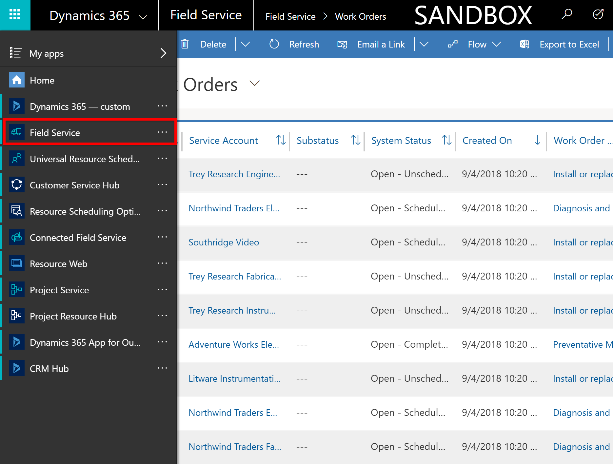  

### Ensure the mobile solution is installed

When logged in as a system administrator, Woodford will appear under **Settings > Solutions** and as an icon under Settings

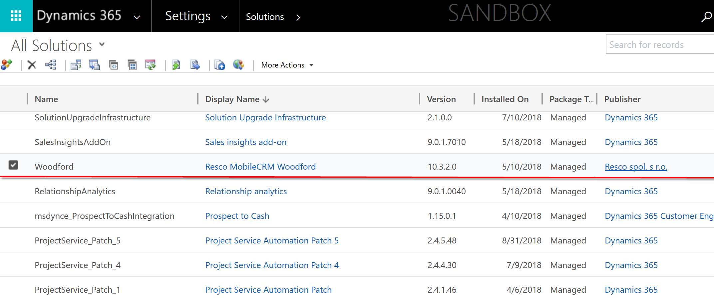  

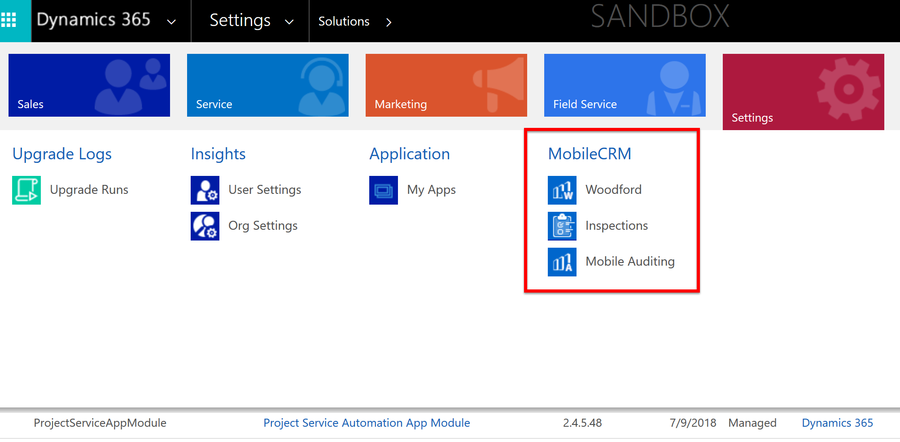  

### Ensure the sample data in imported

If the sample data has been properly imported, you'll see multiple records under **Field Service &gt; Work Orders**.

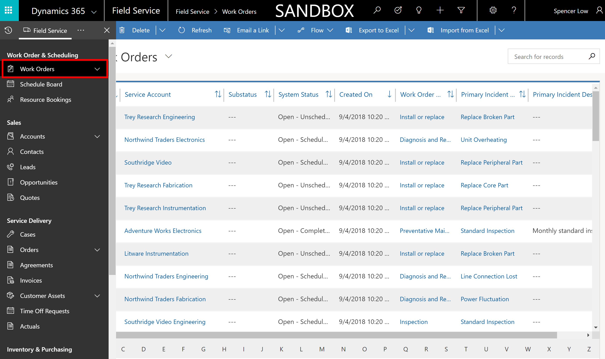  

### 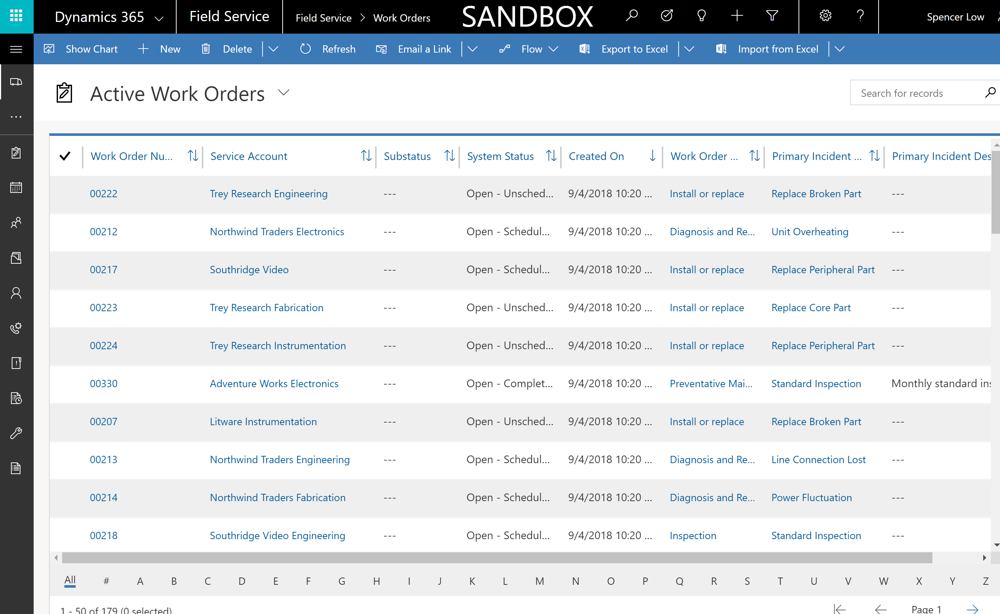  

## 2. Set up a dispatcher role 

Within Dynamics 365, navigate to **Settings** &gt; **Security** &gt; **Users**

Select your user and then **Manage Roles** at the top.

Assign your User the **Field Service – Administrator** role. This will give your User schedule and dispatch capabilities as well as configuration abilities. If this user is solely a dispatcher, then assign the **Field Service—Dispatcher** role.

## 3. Create a work order or select a sample one

If you have sample data, skip this step.

Navigate to **Field Service &gt; Work Orders**

Select +New

Create new Work Order with…

Service Account = **\[select from list or create a new one. Ex: Contoso\]**

Work Order Type = **\[select from list or create a new one. Ex: Inspection\]**

System Status = **Open-Unscheduled**

Price List = **\[select from list or create new one. Ex: Default Price List\]**

Taxable = **No**

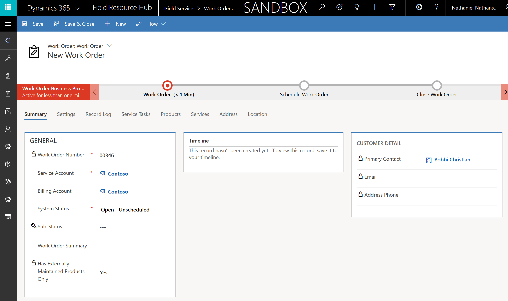  

> [!NOTE]
> **Hint:** You may have to click on another tab to access more required fields. In this example, the **Settings** tab.

  

Enter a valid address

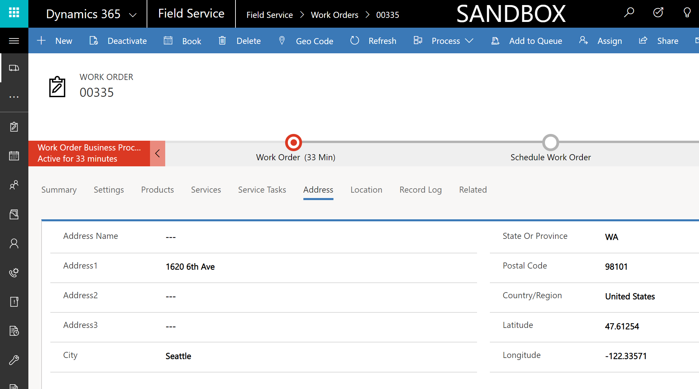  

Click Save

## 4. Set up a resource (field technician) role 

First, let’s designate one of our users as a field technician.

Navigate to **Settings** > **Security** > **Users**

Select the D365 User (different than your dispatcher/administrator User) that will be a field technician and assign him/her the **Field Service – Resource** security role (and only this role).

Next, open the Field technician’s User record and select “**Field Security Profiles**” in the ribbon

Then assign your Field technician User the **Field Service – Resource** Field Security Profile

**WARNING:** This is a very important step. Field Technicians will not be able to edit fields on the mobile work order form without completing this step.

If you do not have a User to assign this role to, you can create a new one by navigating to the Admin center in the Office 365 interface from <https://login.microsoftonline.com>.

> [!NOTE]
> **Hint:** This user must have a Dynamics 365 license that is valid for Field Service. It is recommended to verify you can log into D365 with the new user record as you may need to reset a temporary password.

Finally, we want to **geocode** our field technician user record. Field technician locations are very important in Field Service because it is used for scheduling and routing. We want every field technician user record to be geocoded, so we can use this information to define where each resource starts and/or ends his/her day.

> [!NOTE]
> **Pro Tip:** the solution can also accommodate scenarios where field technicians begin and/or end their day at a central location.

Back in Dynamics 365…

Navigate to your field technician’s user record in **Settings &gt; Users**

Every user record has an address that is taken from the user record in Office 365. Ensure an address is present.

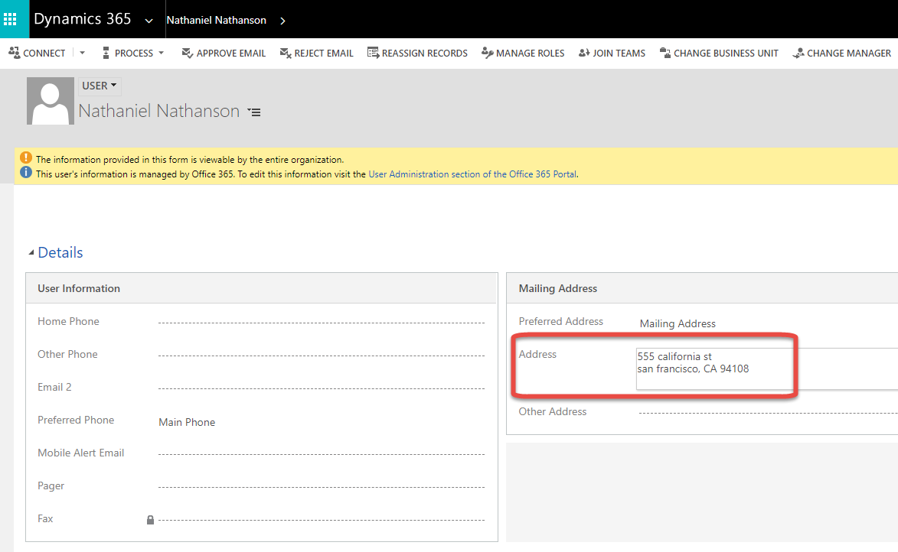  

If one is not present, navigate to the Office 365 admin center and enter an address for the user.

  

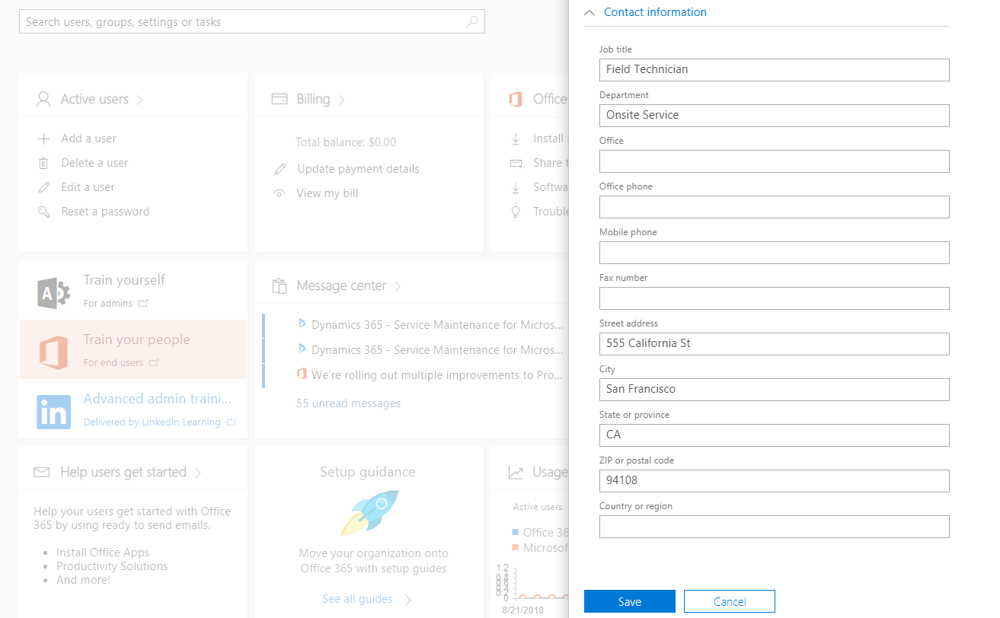  

Back in Dynamics 365, refresh the field technician user record to see the address from Office 365 appear.

Next, we need to enable geocoding in your Dynamics 365 organization. Geocoding allows the solution to stamp latitudes and longitudes to addresses.

Navigate to **Resource Scheduling &gt; Administration &gt; Scheduling Parameters**

  

  

Set **Connect to Maps** to **Yes**.

The API key should be filled out automatically and uses Bing Maps API

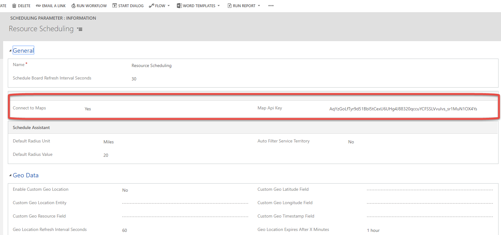  

This will allow us to tag a latitude and longitude to the address on the user record.

Navigate back to the user record and select **Geocode** in the ribbon.

  

  

This will geocode the address on the user record taken from Office 365

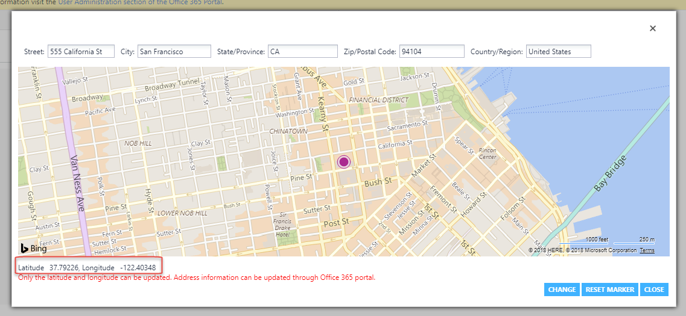  

Select **Change** and the Latitude and Longitude will be populated under the Scheduling section of the user record

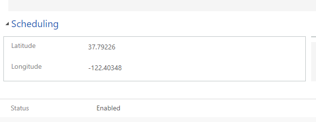  

> [!Note]
> **Pro Tip:** if you are having trouble populating an address or geocoding an address, it is acceptable to manually enter a latitude and longitude into the fields on the user record.

Congratulations! You have successfully set up a dispatcher and resource (field technician) users and security roles. You are on your way to using Field Service. A recommended next step is to create a bookable resource related to your resource (field technician) user to schedule work orders that he/she will view on the mobile application.

## 5. Create a bookable resource

Back in Dynamics 365…

Navigate to **Field Service** &gt; **Administration** &gt; **Resources**

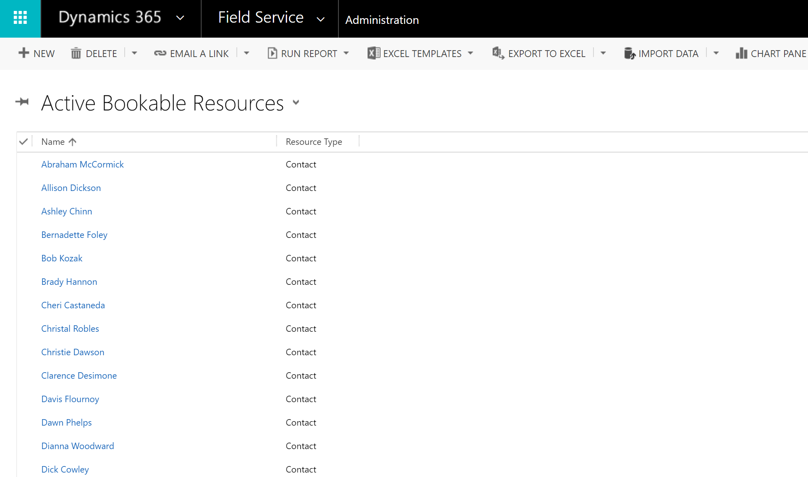

Select **+New**

Create new Resource (Field Technician) with..

Resource Type = **User**

User = **\[User record you assigned Resource role to\]**

Warehouse = **\[assign a warehouse or create a new one. Ex: Truck 1\]**

Hourly Rate = **$60**

Start Location = **Resource Address**

End Location = **Resource Address**

Display on Schedule Board = **Yes**

Enable for Availability Search = **Yes**

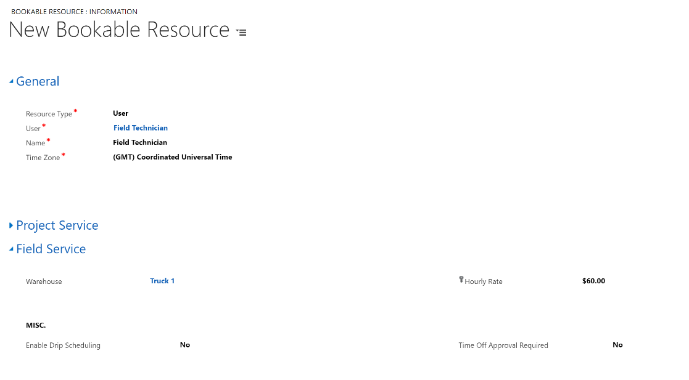

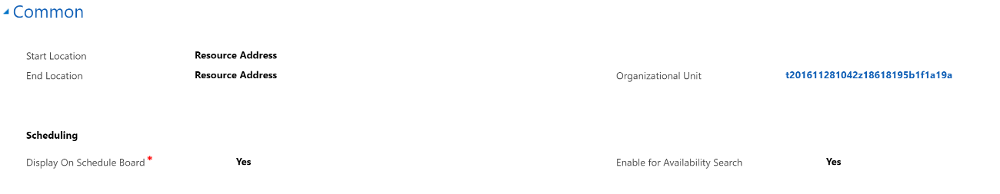  

**Optional:** Related to the Resource (Field technician) assign a…

Resource Characteristic: **\[Add an existing one or create a new one: Ex: Electrical\]**

Resource Territory: **\[Add an existing one or create a new one: Ex: WA\]**

### 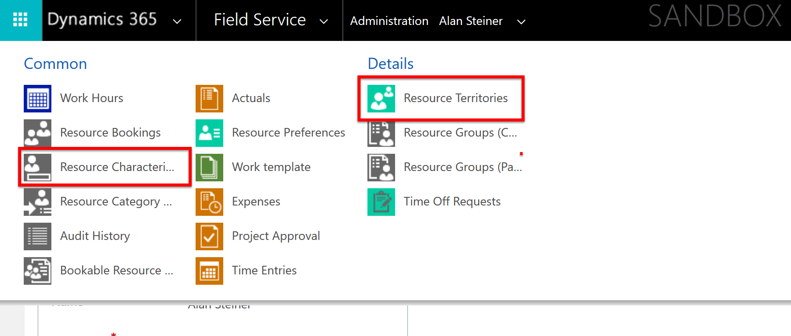  

## 6. Add the bookable resource to the schedule board

Lets add this new field technician to the schedule board

Navigate to **Field Service** &gt; **Schedule Board**

In the left pane of the Schedule Board, select **Options** &gt; **Select Resources**

Find your new **Field Technician** with a Resource Type = **User** and move him/her to the right to selected resources, then choose **Apply**

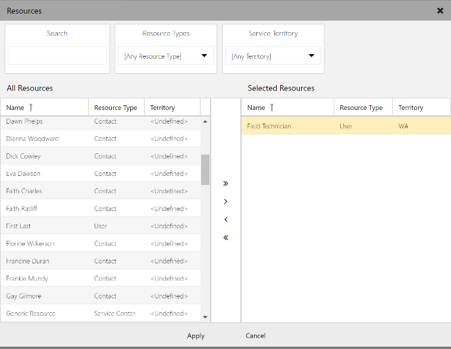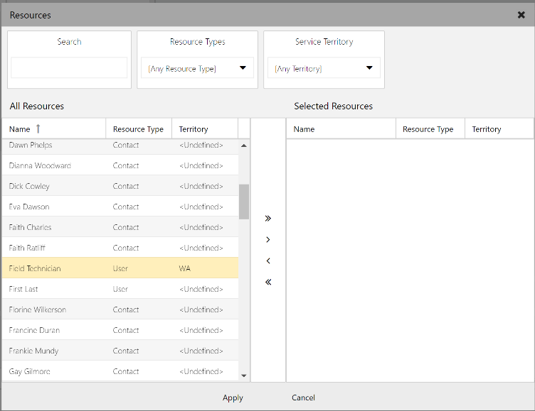

## 7. Schedule the work order to the bookable resource

In the lower pane, find the work order you created or select a sample work order. This work order should be found in both the Open Requirements view and the Unscheduled Work Orders view, click and drag the work order from the bottom to the new Field technician

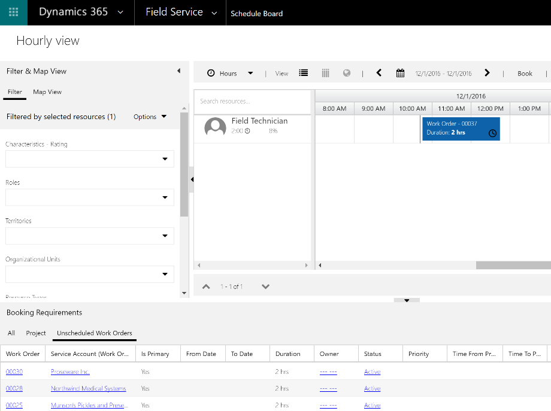

Let’s now view this scheduled work order on the mobile application as a field technician.

## 8. Download the Field Service Mobile (2017) mobile app

First, download the **Field Service Mobile (2017)** mobile app from the Windows, iOS, or Android app stores onto your phone, tablet, or Windows 10 device.

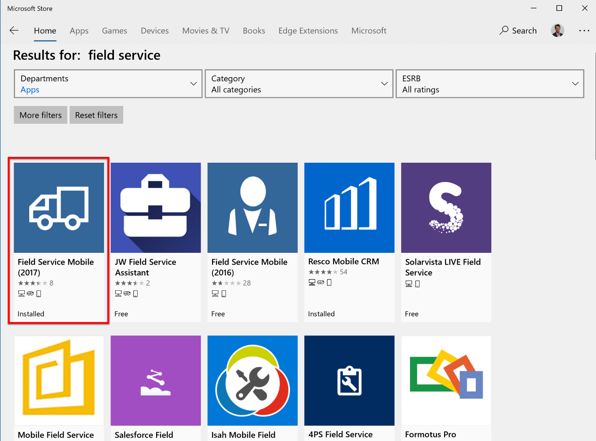

## 9. Sign into the mobile application as a technician

Navigate to the **Field Service Mobile (2017)** mobile application on your Windows, iOS, or Android device, then **Setup** and sign in with the credentials of the User record of your Field Technician

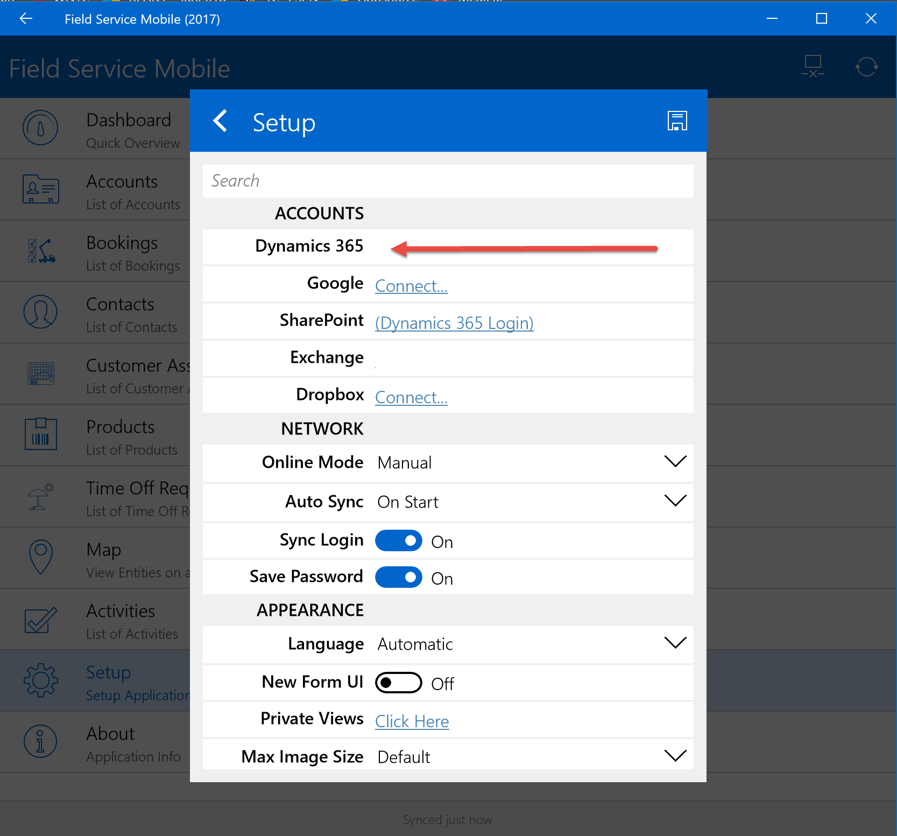

URL: **\[enter the URL of your Dynamics 365 org. Ex: https://org.crm.dynamics.com]\**

Username: **\[enter the username of the User associated with your Field Technician. Ex: username@org.onmicrosoft.com]\**

Password: **\[enter the password of the User associated with your Field Technician\]**

> [!NOTE]
> **Hint:** If you recently created a User to be a field technician, it is recommended to log in to the web browser with this user first as you may need to reset a temporary password.

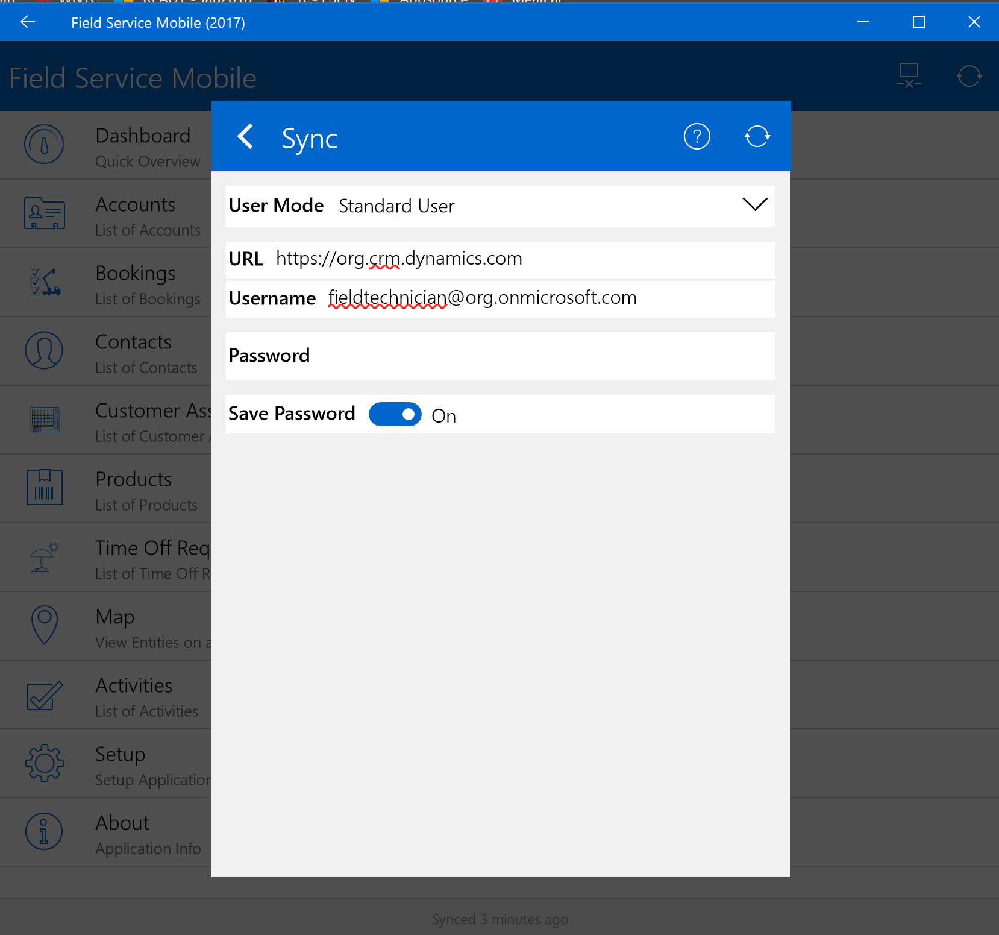

##  10. View the Work Order on the mobile application 

In the **Booking** tab you will now see the Booking (Work Order) scheduled to the field technician.

> [!NOTE]
> **Hint:** You should see only bookings assigned to the Field Technician resource, in the above example only a single booking. This is because the Field Technician has a security role of Field Service – Resource. If you are seeing many bookings for many different resources, this most likely means you are signed in to the mobile application as an administrator.

**Congratulations!** You are now on your way to using Field Service!
