# Quickstart: Set up users to create, schedule, and view work orders

In this quickstart, we will walk through the core Field Service scenario of creating and scheduling a work order to resolve a customer's issue.

We will do this in 4 steps:

- **Step 1:** Install Dynamics 365 Field Service
- **Step 2:** Assign Field Service licenses to users
- **Step 3:** Get started with creating frontline workers, customers, and scheduling work orders
- **Step 4:** View the scheduled work order on the Field Service (Dynamics 365) mobile app

## Step 1: Install Dynamics 365 Field Service

You need a Dynamics 365 organization with the Field Service application installed. For more information, see the topic on [installing Field Service](install-field-service.md). 

### Verify the Field Service application is installed

Sign in as a system administrator and verify that the Field Service application is listed in the main menu. See the following screenshot for reference. If you don't see Field Service, ensure you are signed in as a system administrator. 

> [!div class="mx-imgBorder"]
> 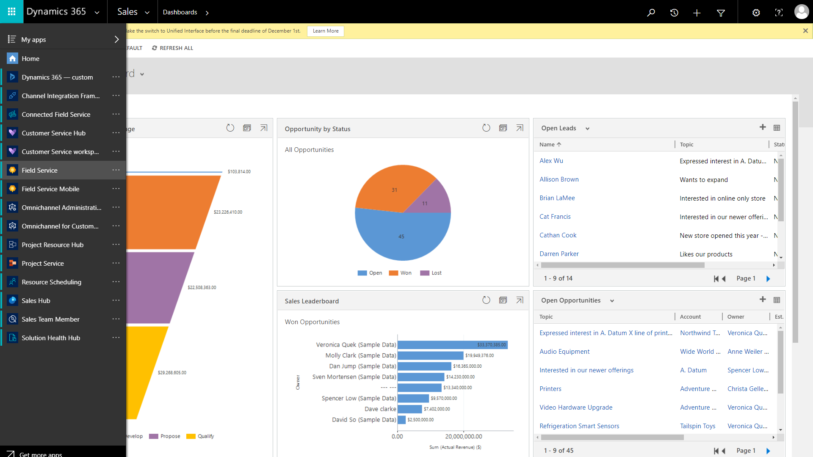

## Step 2: Assign Field Service licenses to users

Once you have a Dynamics 365 environment with Field Service, you need to create users or select existing users and assign them a license that includes Dynamics 365 Field Service. For more information see the topic on [setting up Field Service users](view-user-accounts-security-roles.md).

Many different roles interact with Field Service like system administrators, technicians, dispatchers, service managers, inventory managers, customer service representatives and more.

For this quickstart, we'll create two users:

1. Back-office administrator and dispatcher
2. Frontline worker

Sign into [https://admin.microsoft.com/](https://admin.microsoft.com/) as a system administrator.

> [!div class="mx-imgBorder"]
> 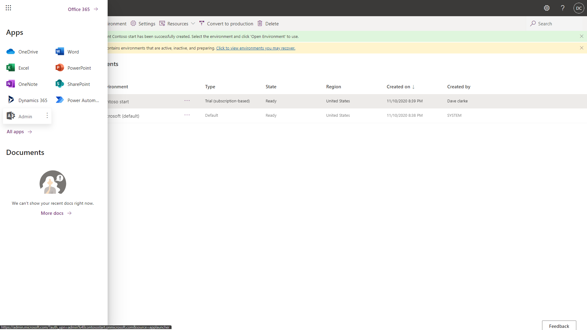

Go to **Users** and create at least two users. One to represent a back-office administrator and dispatcher, and another to represent a frontline worker.

Assign each user a license or trial license that includes Dynamics 365 Field Service.

> [!div class="mx-imgBorder"]
> 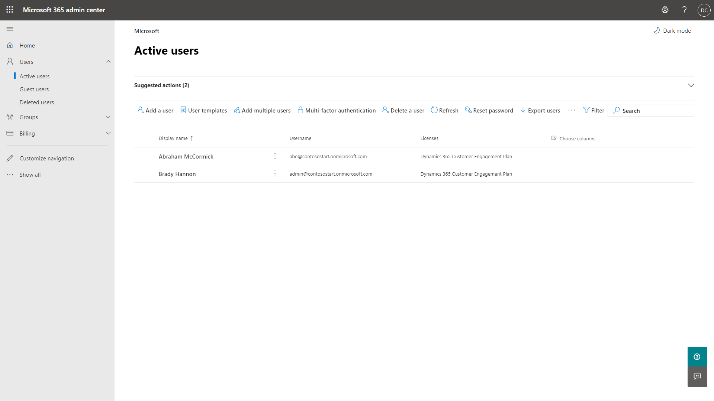

## Step 3: Create and schedule a work order 

Go to the _Getting Started_ page which can be found in the left navigation pane.

> [!div class="mx-imgBorder"]
> 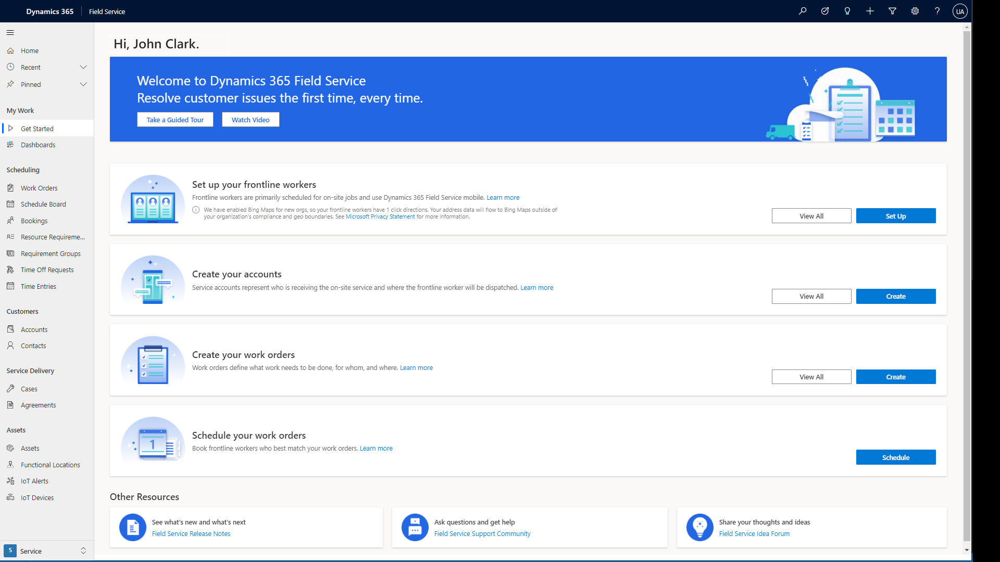

By the end of this getting started page you will have successfully scheduled a work order to a frontline worker to resolve a customer's issue. 

### Set up your frontline workers

Start by creating a frontline worker who represents someone in your company who completes work orders. Select the **Set Up** button.

> [!div class="mx-imgBorder"]
> 

In the form that displays, enter required information. Recommended values are prepopulated and should not be changed unless necessary. 

Start by choosing the frontline worker user in the _User_ field.
> [!div class="mx-imgBorder"]
> 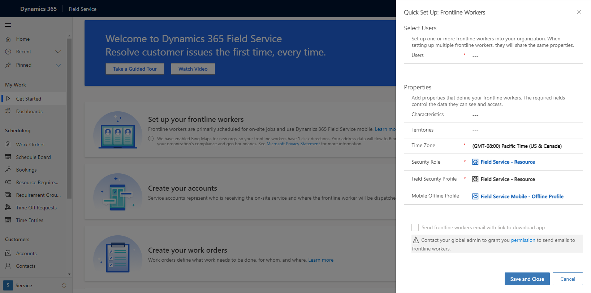

Optionally you can send an email to the frontline worker user to download the mobile app if [mailboxes are set up](frontline-worker-set-up-email-approval.md).

> [!Note]
> **Note 1:** Repeat the frontline worker set up for your back office user but instead choose **Field Service-Dispatcher** for the security roles and field security profiles.

> [!Note]
> **Note 2:** If you are not able to see your users in the dropdown list during the frontline worker set up, see the additional notes section at the bottom of this article. 

### Create your accounts

Next create an account that represents one of your customers. Select the **Create** button.

> [!div class="mx-imgBorder"]
> 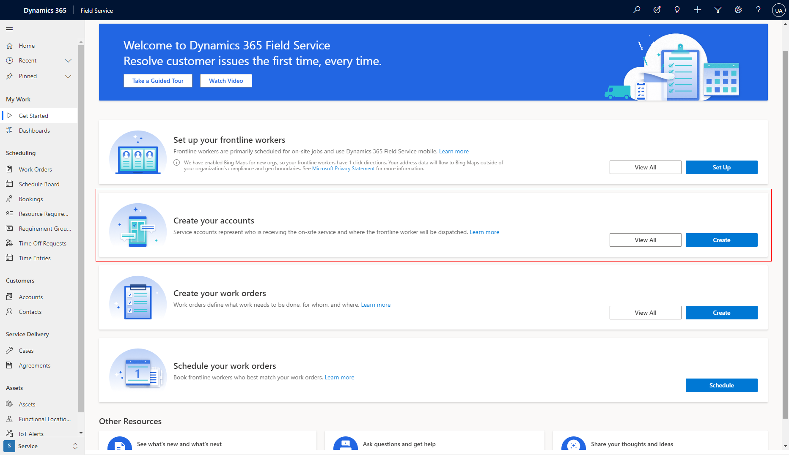

Follow the form to enter relevant information.

> [!div class="mx-imgBorder"]
> 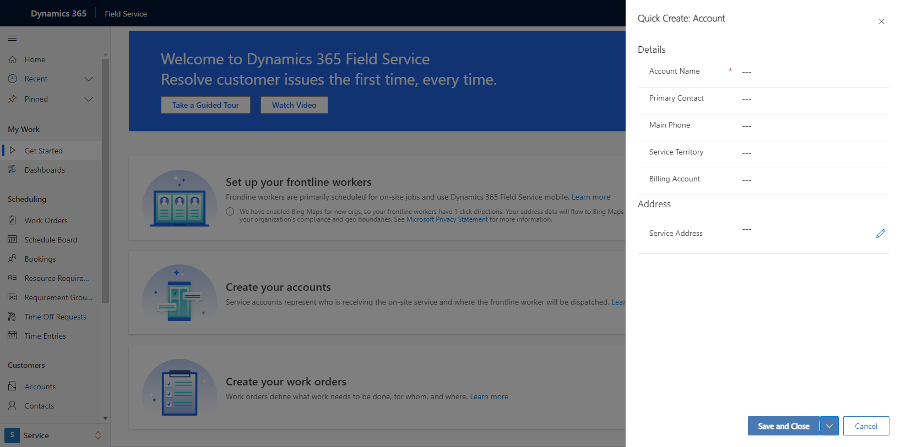

### Create your work orders

Create a work order that outlines work that needs to be done for a customer, typically at the customer's location or at the location of an asset or equipment. Select the **Create** button.

> [!div class="mx-imgBorder"]
> 

 Follow the form to enter relevant information. 
 

> [!div class="mx-imgBorder"]
> 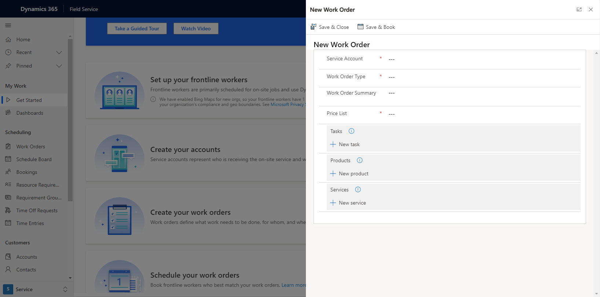

- The Service Account represents the customer who the work order relates to. 
- Tasks are a checklist of things that need to be done.
- Products are parts that may be needed to complete the work order.
- Services are labor items that may be needed to complete the work order.

### Schedule your work orders

The last step is to schedule the work order to a frontline worker who will complete it for the customer. Select the **Schedule** button to go to the schedule board.

> [!div class="mx-imgBorder"]
> 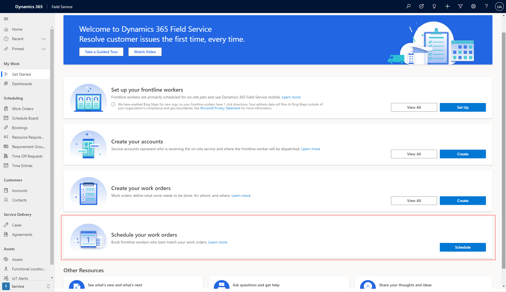

Find your work order in the lower pane and click and drag it to your frontline worker.

> [!div class="mx-imgBorder"]
> 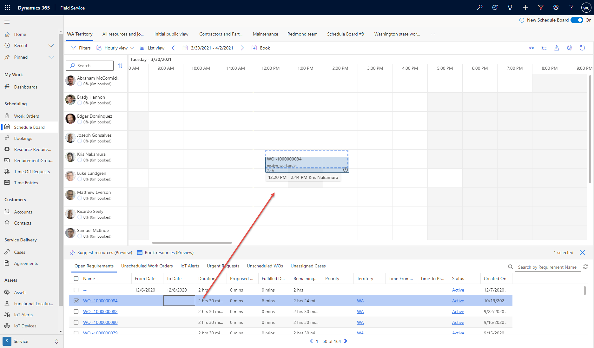

> [!NOTE]
> Make sure you don't schedule the work order in the past. There is a blue vertical line that represents the current time. You may need to adjust the time zone of the schedule board by selecting the gear icon in the top right of the schedule board.

## Step 4: View the scheduled work order on the Field Service (Dynamics 365) mobile app

Frontline workers should download the Field Service (Dynamics 365) mobile app from the iOS or Android app stores onto their phone or tablet. 

- [iOS - Field Service (Dynamics 365) mobile app](https://aka.ms/fsmobile-apple)
- [Android - Field Service (Dynamics 365) mobile app](https://aka.ms/fsmobile-google)

Sign in with the username and password of the frontline worker user.

- For the **Username**, enter the username of the frontline worker user. For example, username@org.onmicrosoft.com
- For the **Password**, enter the password you set for the frontline worker.

Select your app in the list.

> [!div class="mx-imgBorder"]
> 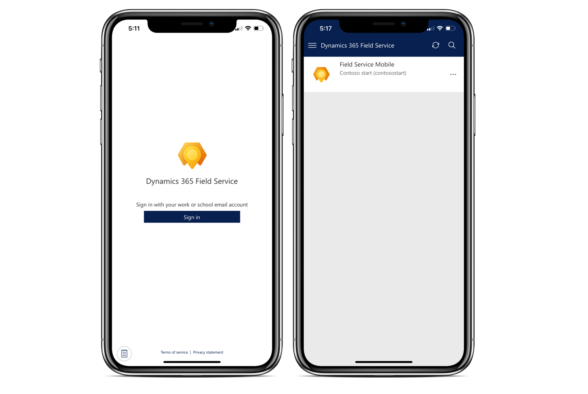

If you do not see your app, but instead see "Contact your administrator for access to your organization's mobile apps," then select the menu icon and toggle the **Show non-production apps** to _Yes_.

> [!div class="mx-imgBorder"]
> 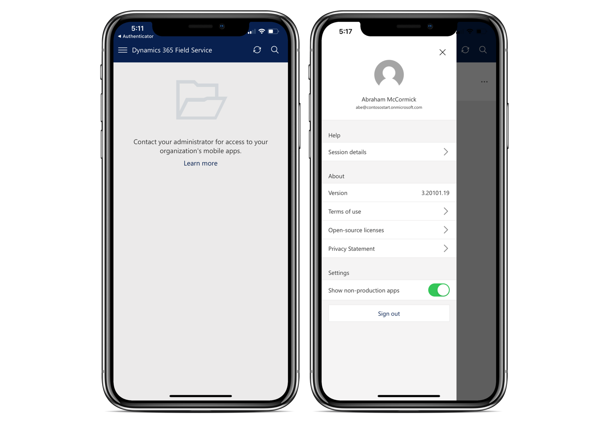

In the **Booking** tab, see the work order you scheduled to your frontline worker. 

> [!div class="mx-imgBorder"]
> 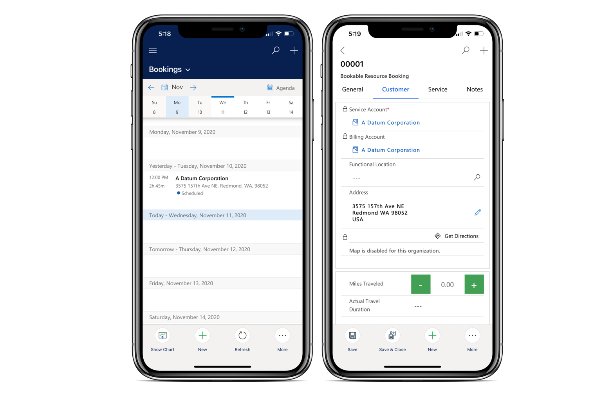

For more information, see the article on [getting started with the Field Service (Dynamics 365) mobile app](mobile-power-app-get-started.md).

## Additional notes

If you are not able to see your users in the frontline worker set up, make sure the users are added to your enviornment: 

Go to the [Power Apps admin center](https://admin.powerplatform.microsoft.com/).

> [!div class="mx-imgBorder"]
> 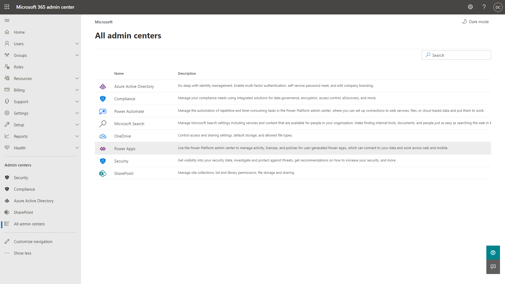

Select your environment that has Field Service installed. Select **Settings** > **Users + permissions** > **Users**.

Add the two users you created if they are not already added.

> [!div class="mx-imgBorder"]
> 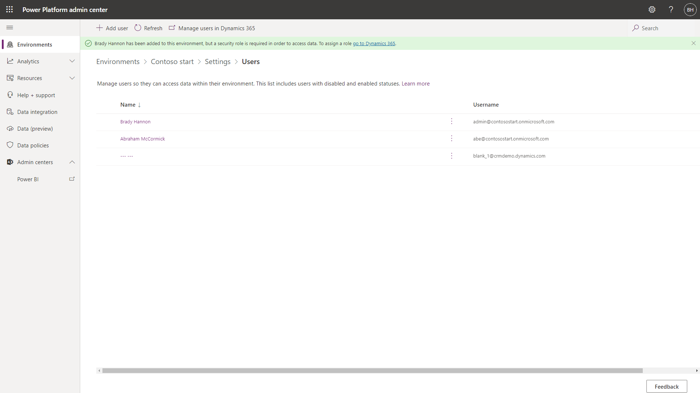

## See also

- [Perform initial configurations](perform-initial-configurations-setup.md)

[!INCLUDE[footer-include](../includes/footer-banner.md)]