# Quickstart: Schedule a work order and view it on the mobile application

This quickstart shows how a dispatcher creates and schedules a work order that a field technician then views on the mobile app.

Steps:

1.  Assign the dispatcher role to a user

2.  Create a work order or use one from sample data

3.  Assign the resource role (for field technicians) to a user

4.  Create a bookable resource

5.  Add the bookable resource to the schedule board

6.  Schedule the work order to the bookable resource

7.  View the scheduled work order on mobile

## Prerequisites

You need a Dynamics 365 organization with the Field Service application and the mobile solution installed. Using sample data 
imported from the Package Deployer is recommended. You also need a phone or tablet for viewing a scheduled work order.

### Make sure the Field Service application is installed

Sign in as a system administrator and verify that the Field Service application is listed in the main menu. See the following screenshot for reference. If you don't see Field Service, go to the [Field Service installation walkthrough](install-field-service.md) for steps to install it. 

> [!div class="mx-imgBorder"]
> 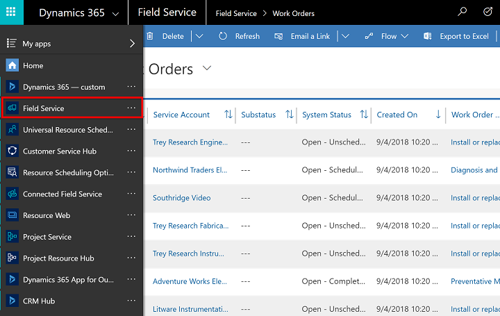 

### Make sure the mobile solution is installed

Sign in as a system administrator and verify that the Woodford solution listed in **Settings** > **Solutions**. See the following screenshot for reference. If you don't see the Woodford solution go to [mobile solution activation walkthrough](activate-fs-mobile-app-license.md) for steps to install it.

> [!div class="mx-imgBorder"]
> 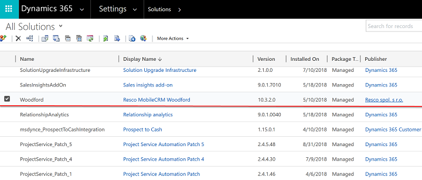 

### Make sure sample data is installed

When sample data is installed, you see multiple records in **Field Service** > **Work Orders**. If you don't see any sample records, check out these [instructions for importing sample data](install-sample-data-8-x.md) for more information.

> [!div class="mx-imgBorder"]
> 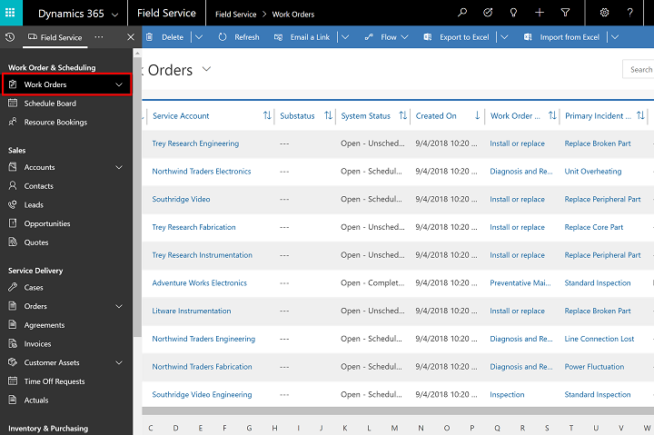 

 ## 1. Assign the dispatcher role to a user 

- Navigate to **Settings** > **Security** > **Users**.

- Select a user, and then choose **Manage Roles**.

- Assign the user the **Field Service – Administrator** role to give the user scheduling, dispatching, and configuration capabilities. If this user is only acting as a dispatcher, then assign the **Field Service—Dispatcher** role.

> [!div class="mx-imgBorder"]
> 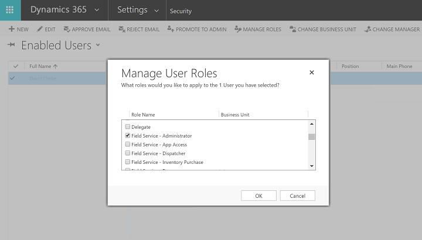

## 2. Create a work order or use one from sample data

If you're using sample data, you can skip this step. Otherwise, you need to create a work order.

1. Navigate to **Field Service** > **Work Orders**.

2. Choose **New**.

3. On the **Summary** tab: 
    - For **Service Account**, select an account from the list or create a new one.
    - For **Work Order Type**, select a work order type from the list or create a new one. 
    - For **System Status**, select **Open-Unscheduled**.
    
> [!div class="mx-imgBorder"]
> 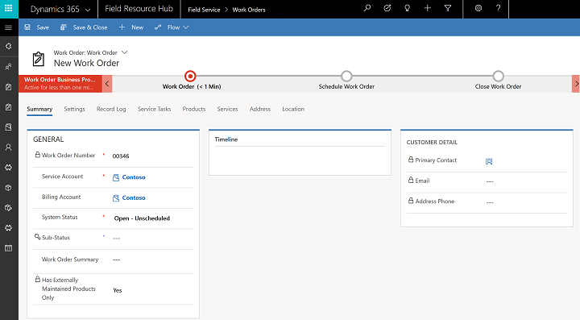  
 
4. On the **Settings** tab: 
    - For **Price List**, select a price list from list or create new one. 
    - Set **Taxable** to **No**.
    
> [!div class="mx-imgBorder"]
> 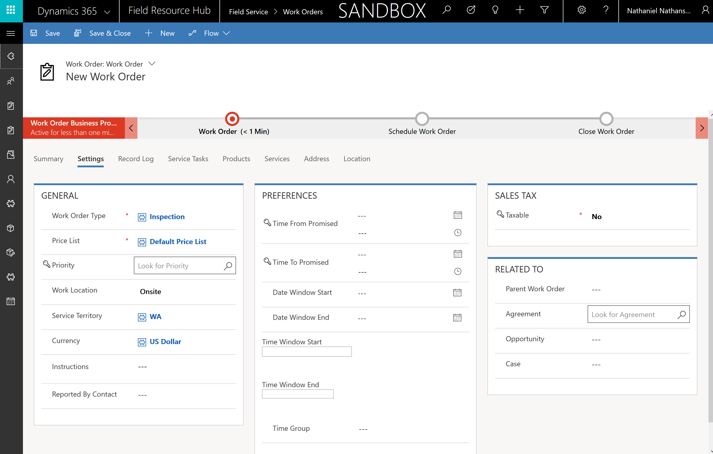 

5. On the **Address** tab, enter a valid address. Then choose **Save and close**.

> [!div class="mx-imgBorder"]
> 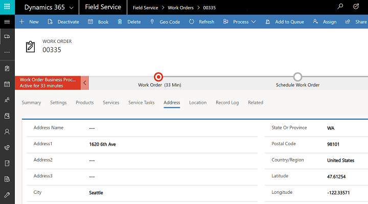  

## 3. Assign the field technician role to a resource 

1. Navigate to **Settings** > **Security** > **Users**.

2. Select a user other than the dispatcher/administrator, and then assign **only** the **Field Service – Resource** security role. If you don't have a user to assign this role, create a new one in the [Admin center](https://login.microsoftonline.com). 

> [!NOTE]
> The user needs a Dynamics 365 Field Service license. After you create the user, verify that you can sign in with the new user record. You may be prompted to set a temporary password.

> [!div class="mx-imgBorder"]
> 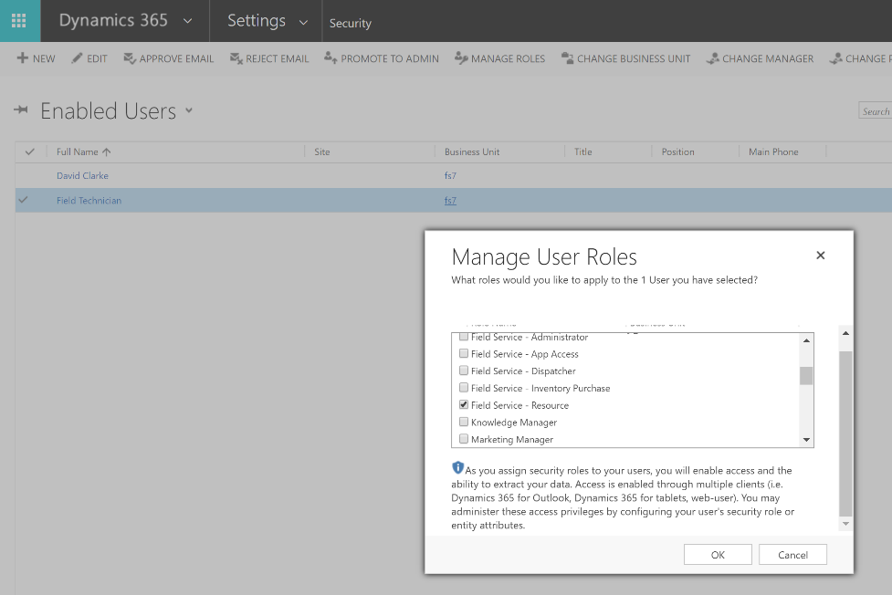

3. Open the field technician’s user record.

> [!div class="mx-imgBorder"]
> 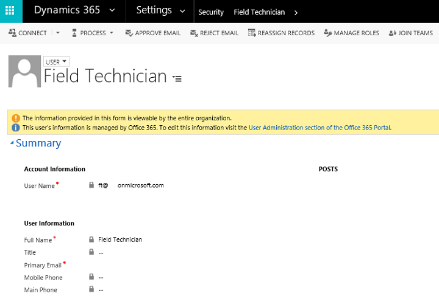

4. Select **Field Security Profiles**.

> [!div class="mx-imgBorder"]
> 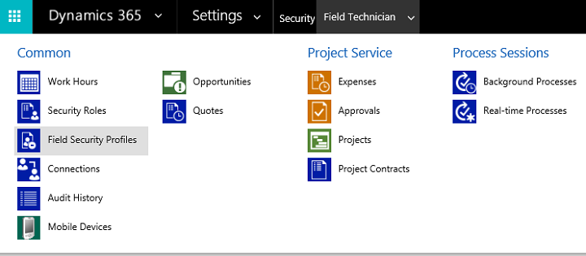

5. Assign the **Field Service – Resource** field security profile to the field technician user. Note that field technicians can't edit fields on mobile work orders unless they have this profile assigned. 

> [!div class="mx-imgBorder"]
> 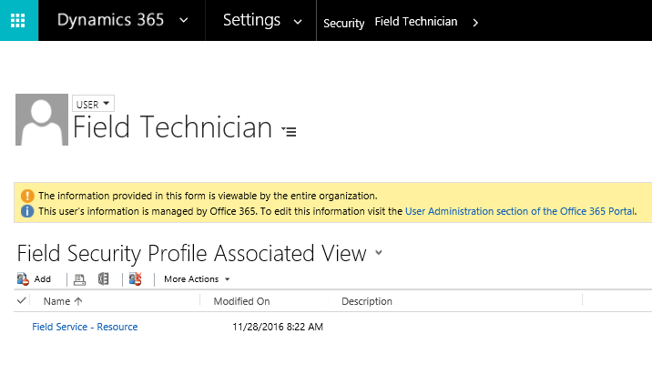

### Set up geo-coding for the field technician user
Next you need to set up geo-coding for the field technician user. Field technician location is used for scheduling and routing.

1. Navigate to **Settings** > **Users**, and then open the user record to verify there is an address. Addresses are based on the address for the user's record set in Office 365. 

> [!div class="mx-imgBorder"]
> 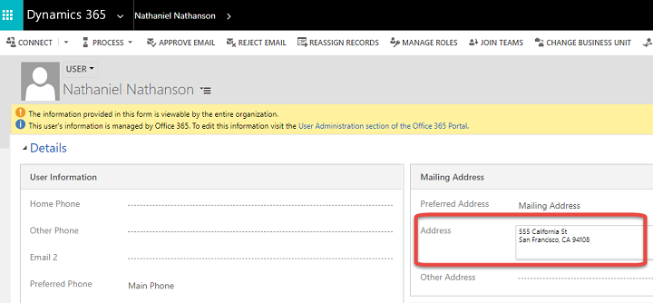  

2. If there isn't an address for the user, navigate to the Admin center. Find the user record.

> [!div class="mx-imgBorder"]
> 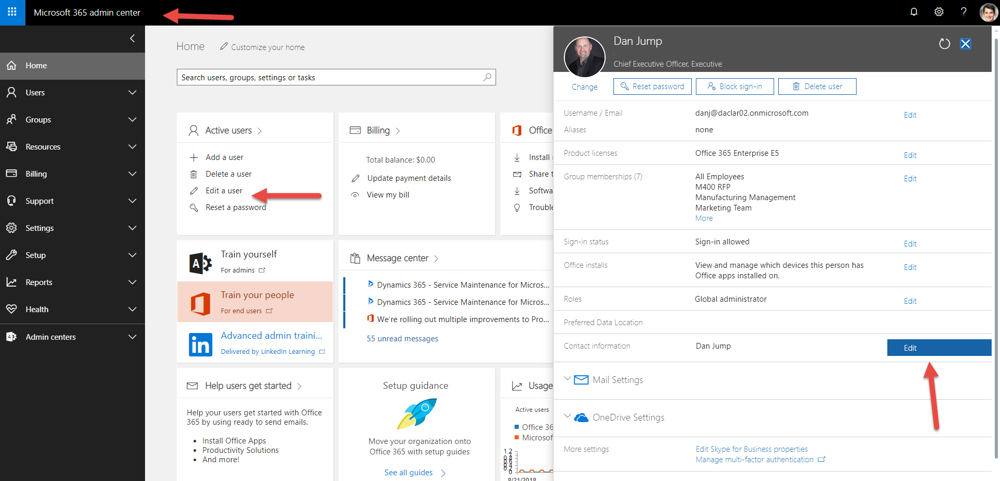  

1. Enter an address, and then choose **Save**. To see the updated address in the Dynamics 365 organization, go back to the field technician user record and refresh the page.

> [!div class="mx-imgBorder"]
>   

### Set up geo-coding for the organization

Setting up geocoding for an organization enables the system to attach latitudes and longitudes to addresses.

1. Navigate to **Resource Scheduling** > **Administration** > **Scheduling Parameters**.

> [!div class="mx-imgBorder"]
> 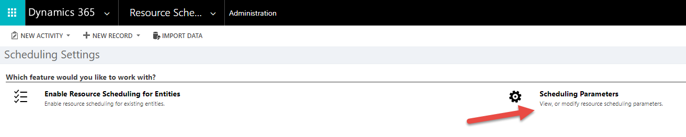  

2. Set **Connect to Maps** to **Yes**. The API key fills in automatically to use the Bing Maps API, which enables the system to assign a latitude and longitude to the user record's address.

> [!div class="mx-imgBorder"]
> 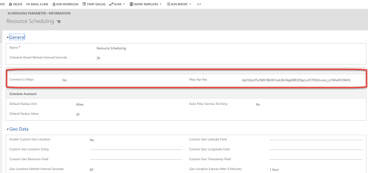  

3. Navigate to the user record, and then select **Geocode**. 

> [!div class="mx-imgBorder"]
> 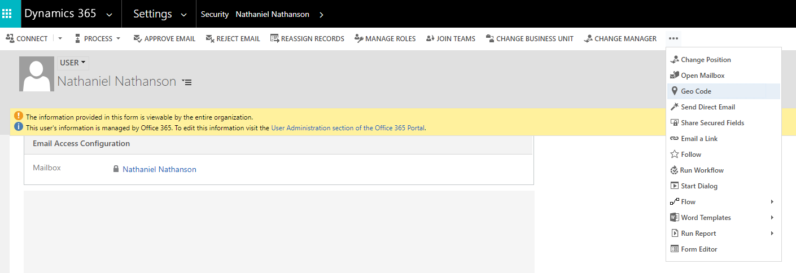  

4. Confirm the address, and then choose **Close**.

> [!div class="mx-imgBorder"]
> 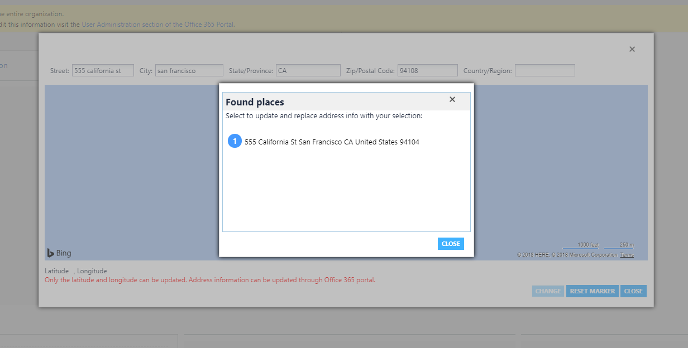  

5. Choose **Change** to populate the **Scheduling** section of the user record with the latitude and longitude.

> [!div class="mx-imgBorder"]
> 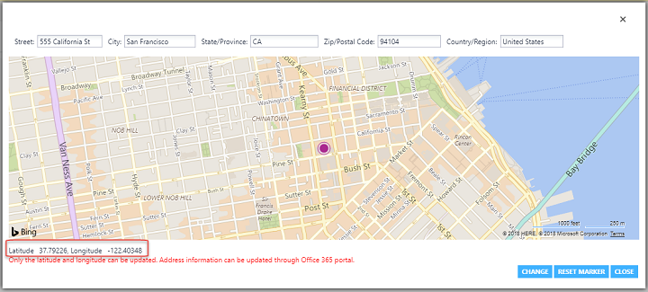   

> [!NOTE]
> Alternatively, you can type the latitude and longitude into the address fields on the user record.

## 4. Create a bookable resource

Next, create a bookable resource record for the field technician user. Creating a bookable resource lets you schedule work orders for the field technician, which the field tecnician sees in the mobile app.

1. Navigate to **Field Service** > **Administration** > **Resources**.

> [!div class="mx-imgBorder"]
> 

2. Choose **New**.

- Create a new field technician resource  with the following settings: 

    - Resource Type = **User**
    - User = **\[User record you assigned Resource role to\]**
    - Warehouse = **\[assign a warehouse or create a new one. Ex: Truck 1\]**
    - Hourly Rate = **$60**
    - Start Location = **Resource Address**
    - End Location = **Resource Address**
    - Display on Schedule Board = **Yes**
    - Enable for Availability Search = **Yes**

> [!div class="mx-imgBorder"]
> 

## 5. Add the bookable resource to the schedule board

Next, you add the field technician to the schedule board.

1. Navigate to **Field Service** > **Schedule Board**.

> [!div class="mx-imgBorder"]
> 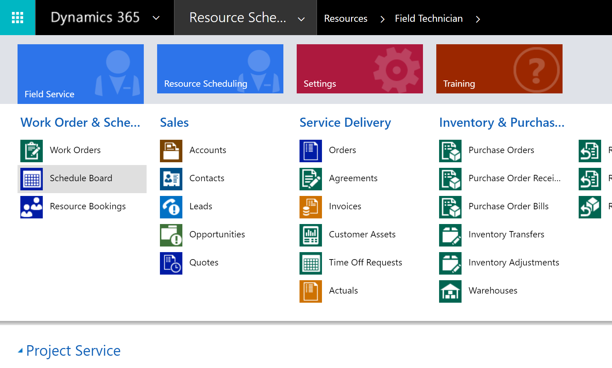

2. In the **Filter and Map View** panel, select **Options** > **Select Resources**.

> [!div class="mx-imgBorder"]
> 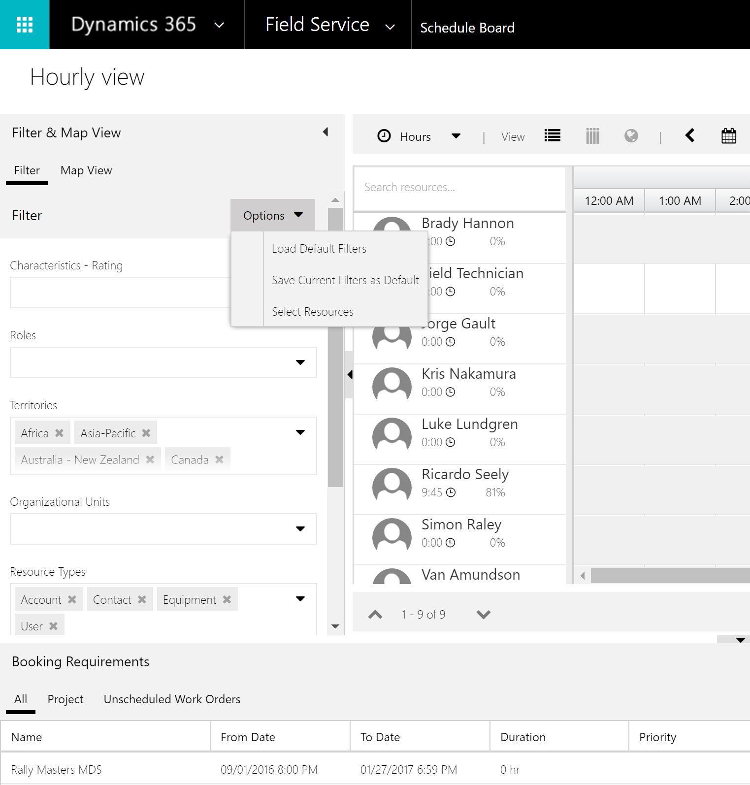

3. Find the new field technician with the **Resource Type** set to **User**, and then move the user to selected resources. Choose **Apply**.

> [!div class="mx-imgBorder"]
> 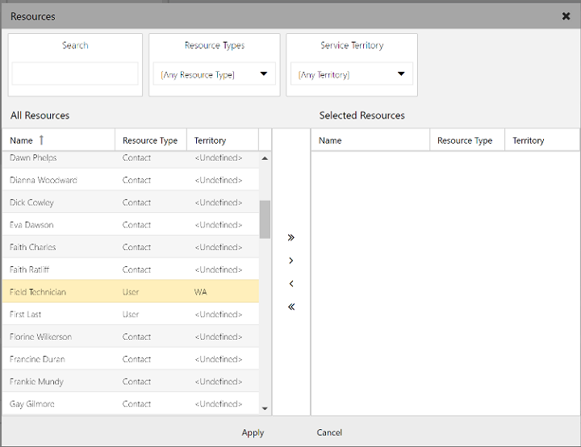

## 6. Schedule the work order to the bookable resource

In the lower pane, find the work order to schedule. This work order is listed in the **Open Requirements** view, and the **Unscheduled Work Orders** view. To schedule the work order, drag it to the field technician.

> [!div class="mx-imgBorder"]
> 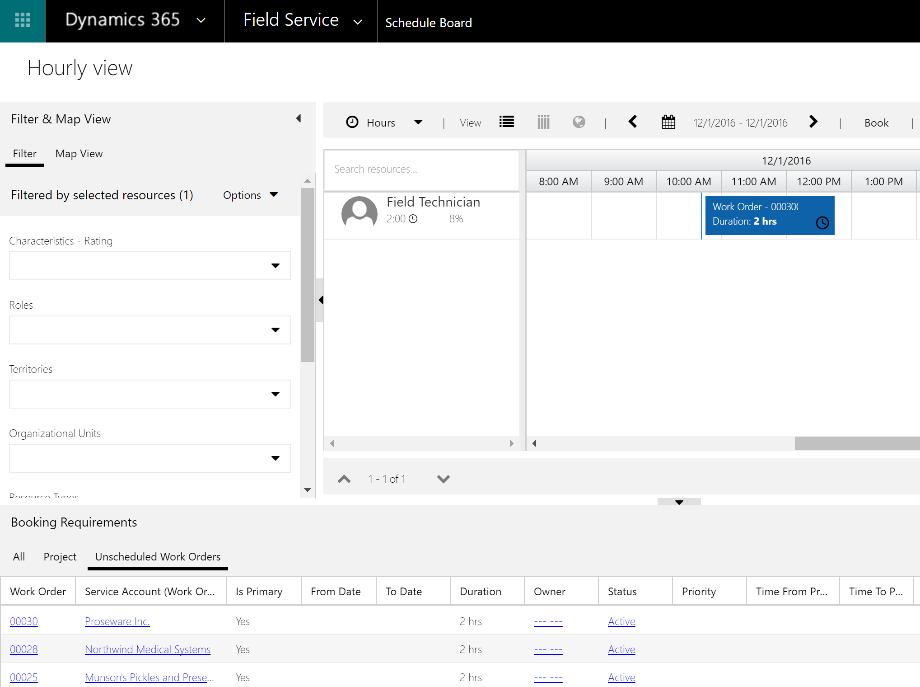

## 7. View the scheduled work order on mobile

If necessary, download the **Field Service Mobile (2017)** mobile app from the app store for your phone or tablet.

> [!div class="mx-imgBorder"]
> 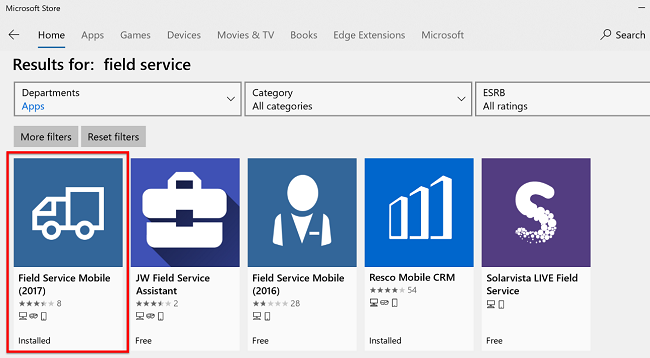

1. Navigate to the **Field Service Mobile (2017)** mobile app, and then choose **Setup**. 

> [!div class="mx-imgBorder"]
> 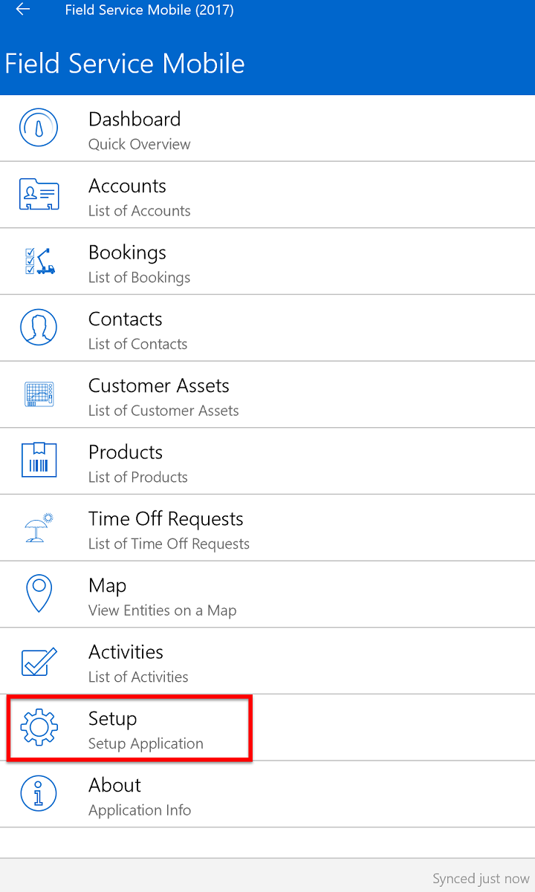

1. Select the Dynamics 365 account.

> [!div class="mx-imgBorder"]
> 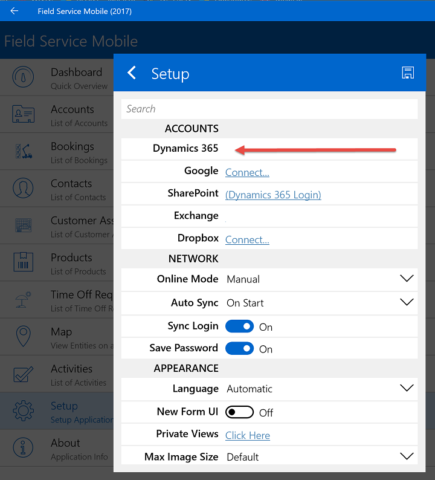

3. Sign in with the username and password for the field technician:

- For the **URL**, enter the URL of your Dynamics 365 organization. For example, https://org.crm.dynamics.com.
- For the **Username**, enter the username of the field technician. For example, username@org.onmicrosoft.com
- For the **Password**, enter the password you set for the field technician.

> [!div class="mx-imgBorder"]
> 

1. In the **Booking** tab, verify that the work order (or booking) is scheduled for the field technician.

> [!div class="mx-imgBorder"]
> 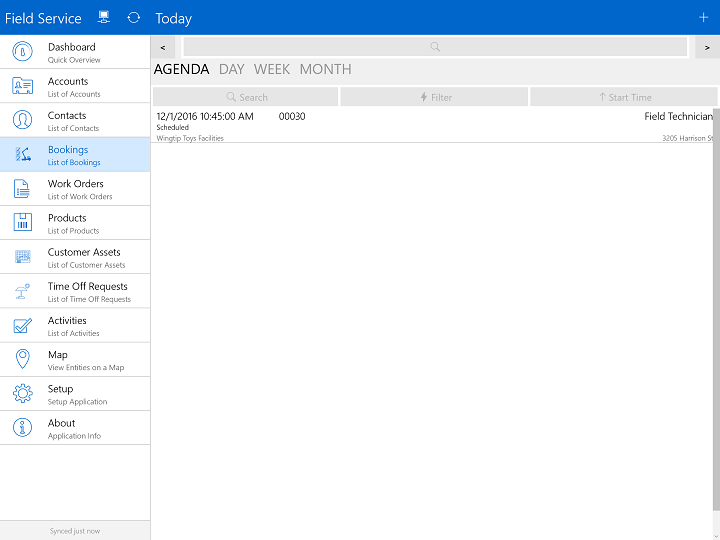
