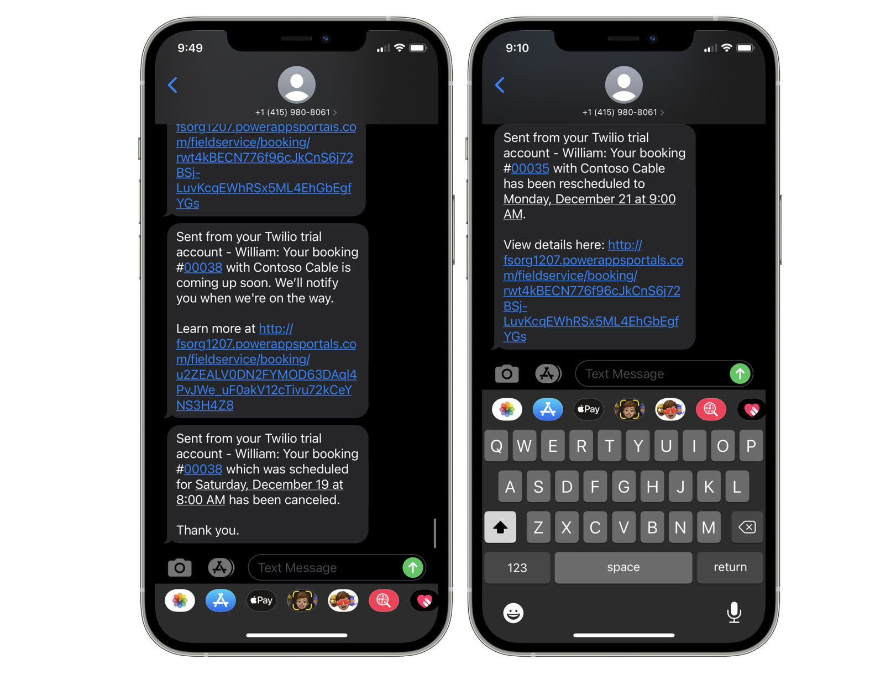

# Send technician arrival times to customers

> [!Note]
> Feature currently in Public Preview and only available in English language in North American environments.

Improve your customers Field Service experience by providing automated reminders for upcoming service visits and notifications with estimated arrival time when the technician is on their way. Providing your customers with a branded online desination will allow them to view their technicians progress on a live map and better plan their time around the service vist. 

> [!div class="mx-imgBorder"]
> 

Key Features:
- Automated service schedule reminders and updates delivered to your customers via Email and/or SMS.  
- Responsive online destination providing accessible from Mobile, Tablet, or Desktop.
- Customers can see information about the technician and their estimated arrival time, with the ability to track progress to destination via live map.
- Accessibility compliant experience for end customers.

## Prerequisites
- Field Service version (8.8.30.103+)
- Field Service Mobile application
- Technician Location Sharing enabled within CRM and allowed from the Technicians Mobile Device. 
- SMS provider supporting Power Automate connector for mobile SMS communication.
- Office 365 Exchange Account for Email communication.

# Setup & Configuration
This document will show you how to deploy and configure this experience for your organization with the following steps.

1. Provision the Field Service Customer Experiences Portal.
2. Configure Email & SMS connectors within Power Automate.
3. Configure details of the experience.
4. Testing the experience as an end user.

## Step 1: Provision the Field Service Customer Experiences Portal (Preview) 

Customers primary means of interacting with the experience is via a Power Apps Portals. 

To provision teh portal:
* Navigate to  http://make.powerapps.com > Create
* Select Field Service Customer Experiences (Preview)

> [!div class="mx-imgBorder"]
> 

* Enter your Portal name and desired subdomain and display language then click "Create"

The Portal provisoning includes all reuired Power Automate and Field Service packages. When the Portal is porvisioned you will receive an email can can move to step 2.

## Step 2: Configure Email & SMS connectors within Power Automate

Your portal is accessible through a unique link sent to your customers via Email and/or SMS. It is required to configure at least one communication method to use this experience.

To configure Email & SMS within Power Automate:
* Navigate to https://make.powerapps.com > Solutions and location the solution "Dynamics 365 Field Service PowerApps Portal – Flow" 

> [!div class="mx-imgBorder"]
> 

There are three Power Automate Flows under this solution. By default, email and SMS flows will be shipped “off” and will need to be configured to enable.

 > [!div class="mx-imgBorder"]
> 

To Configure Email:
* Click into "Field Service PowerApps Power Flow Email Notification"
* Click Edit
* Click into the "Send an Email" Exchange* connector.
* Add your O365 Exchange account connection
* Save and Turn On the Flow

To Configure SMS:
* Click into "Field Service PowerApps Power Flow SMS Notification"
* Click Edit
* Click into the Twilio* connector
* Add your Twilio account details
* Save and Turn On the Flow

*By default Twilio & Exchange are used as popular SMS & Email providers. You can substitute an alternate connector by cloning the Flows and configuring desired connector.

## Step 3: Configure details of the experience

> [!Note]
> When enabling this experience messages can be sent to Contacts of the Account associated with bookings. If testing in non-production orgs, please ensure your test data does not have real customer email or phone numbers. If your org contains real data you can preventing unnecessary communication by adding accounts to Exclusion Lists.

Configuration is primarily done from within Field Service Settings > Customer Portal > Customer Portal Settings.

Key Configuration areas to review include:
* Enable Notifications: Toggles notifications on or off. See [Notifications](#notifications).
* Reminder Timing: Send Reminder notifications between 0 and 7 days before scheduled booking time.  
    * Setting to 0 will disable reminder notifications, but other notifications will be sent. 
* Communication Type: Define if your customer will receive Email, SMS or both message types.
* Show Resource Details: When in traveling state the customer will see the resource name and photo as configured in CRM. 
* Exclusion lists: These lists allow you to exclude specific Service Accounts or Service Types from all messaging.
    * Service Accounts
    * Service Types

> [!div class="mx-imgBorder"]
> 

### Branding and Content
Branding & Content updates are done via Field Service Settings > Customer Portal > Customer Portal Settings > Display
Branding Options:
- Font Type & Color of the online portal experience.
- Background & Foreground Colors of the online portal experience.
- Code Snippets: Dynamic content strings that when updated can reflect consistent content across the Portal, Email and SMS when applicable. Important Content Snippets to update include:
    - Contact Email
    - Contact Phone
    - Company Name
    - Page Title
    - Page Footer

> [!div class="mx-imgBorder"]
> 

> [!Note]
> To upload and update the Portal header image you will need to access the Power Portal Makers website. See [Portal Designer](#portal-designer).

# Additional Details & FAQ

## Notifications

After configuring your portal and enabling notifications, Email and or SMS messages will be sent to the Primary Contact of the Booking Service Account.

Messages are automatically generated with the following events:

- Service Reminder: Reminder messages are sent within 7 days of the scheduled service time. This message will carry the scheduled service time and a link to your portal with basic details including confirmation of service account location shown on a map.
    * By default Service Reminders will be scheduled to send daily at 10:00 AM UTC for any bookings within your configured time period. This time can be adjusted in Power Automate. See [update reminder timing](#faq)
> [!div class="mx-imgBorder"]
> 

> [!div class="mx-imgBorder"]
> 

- Technician Traveling: Sent when Booking status is “Traveling”. This message communicates estimated time of arrival while considering traffic on expected route. This message links to your Portal with a map which your customer can use to view progress to your service location.

> [!div class="mx-imgBorder"]
> 

> [!div class="mx-imgBorder"]
> 

- Service Complete: Sent when Booking status is “Complete”. This message confirms work was completed with date/time of completion. 

> [!div class="mx-imgBorder"]
> 

> [!div class="mx-imgBorder"]
> 

- *Service Rescheduled: Sent when a scheduled service appointment changes by >10 minutes from previously scheduled start time.

> [!div class="mx-imgBorder"]
> 

> [!div class="mx-imgBorder"]
> 

- Service Canceled: When a scheduled service appointment is canceled.

> [!div class="mx-imgBorder"]
> 

> 
> [!Note] Service Reschedule & Service Cancel messages are only sent if a Reminder message had previously been sent.

## Portal States

- Remind, Traveling, and Completion messages include a link to an online web experience hosted on Power Portals.

> [!div class="mx-imgBorder"]
> 

- Responsive design makes this portal accessible from mobile, tablet, or desktop. 
- The customer portal renders different states depending on state of the associated Booking.
- When Booking is in “Traveling” state, the experience includes details of the Technician as well as the Technicians current location on an Azure map. The map will show near real-time location of technician based on signal from the Field Service Mobile application.

> [!Note] Technician must be sharing their location from their Field Service Mobile application to provide estimated travel time and display real time location on the portal when technician is traveling.

> [!div class="mx-imgBorder"]
> 

> [!div class="mx-imgBorder"]
> 

## Portal Designer

As an alternative to using Content Snippets, you can update content and some more advanced configuration as part of the Portal Designer experience. 

- Navigate to https://make.powerapps.com
- Select “Apps”
- Select “Edit” on the portal you created.

> [!div class="mx-imgBorder"]
> 

In the Portal Designer experience, selected content can be updated and will be reflected in the Portal experience offered to your customers. Updating Content Snippets portal maker will also influence content in the messages when applicable.

Portal Designer also allows you to upload a customized header image or make more fine-tuned adjustments to CSS and the header or footer of your experience.

> [!div class="mx-imgBorder"]
> 

> [!Note] Elemetnf the portal outside of header/footer and the highlighted "Content Snippets" are not editable.

## Notification settings
Notification settings provides a real-only view of all messages which have been sent to customers. Here you can view which customers have received a message, which type of message, and which state of the message.

> [!div class="mx-imgBorder"]
> 

> [!div class="mx-imgBorder"]
> 

## Booking Notification Codes
Booking Notification provides visibility the Field Service Admin a way to extend, expire, or block access to a portal link which has been shared with a customer. 

> [!div class="mx-imgBorder"]
> 

> [!div class="mx-imgBorder"]
> 

## FAQ

Q: How do I change the timing of Reminder message?

A: Reminder messages are triggered by a flow which runs daily at 10:00 AM UTC. Any Bookings which fall into your remider message time period which are not part of exclusion lists will receive a reminder message.

To edit the reminder message:
* Navigate to https://make.powerapps.com > Solutions and location the solution "Dynamics 365 Field Service PowerApps Portal – Flow"
* Edit Flow titled "Create notification items for bookings".
* Location Recurrance connector and edit the Flow Recurrence value to new desired time. 

> [!div class="mx-imgBorder"]
> 

Q: I have an existing Power App Portal, can I still provision this Field Service Customer Experience Portal?

A: Yes, you can have multiple portals, however you can only have one copy of the Field service Customer Experience Portal per environment.

Q: I have an an existing Power Apps Portal, can i integrate this experience within it?

A: Not at this time - check back for future updates.

Q: Does my Field Service Customer Experiences Portal receive updates?

A: Yes, we may continue to add new features and enhancements to the Portal. Updates will come un-published and require the Org Admin to publish the update before they reflect on the live experience.

Q: I don't have a Twilio or O365 Exchange account! Are there other services I can use for messaging?

A: Yes - you can use alterative SMS or Email providers as long as they have connectors supported by D365 Power Automate.  Simply clone the existing [Email and SMS flows](#step-2-configure-email--sms-connectors-within-power-automate), remove the current connectors and add desired connectors.

