# Send current technician location and arrival times to your customers with Dynamics 365 Field Service

> [!Note]
> This feature is currently in public preview and only available in English language in North American environments.

Provide your customers with automated service reminders and notifications that include estimated technician arrival times; these reminders make it so customers can better plan their time around service visits.

> [!div class="mx-imgBorder"]
> 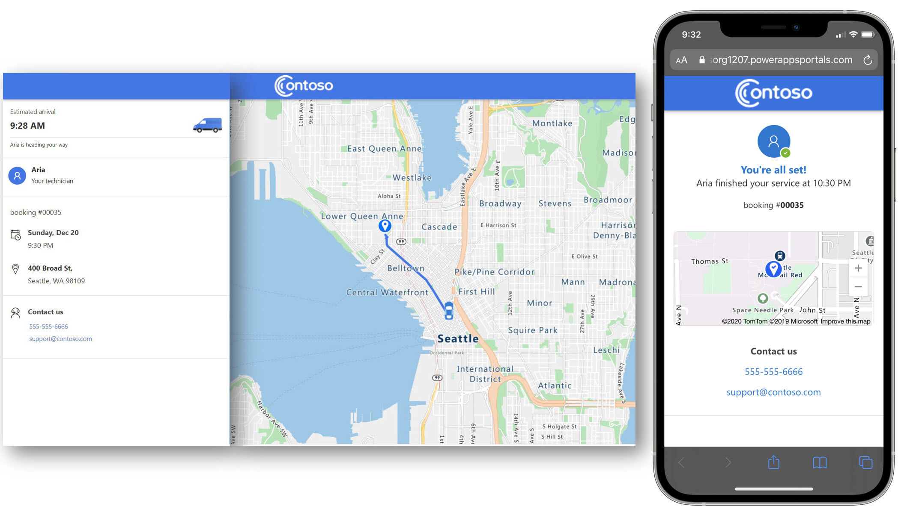

With this functionality, you can:

- Send customers automated service reminders and updates by email or text message.
- Provide customers with a responsive, accessible, and customizable online portal that shows them information about their upcoming service, including: 
  - Technician location
  - Estimated arrival time
  - Service updates

> [!VIDEO https://www.microsoft.com/videoplayer/embed/RWymMU]

  
In this article, we'll walk through how to set up and configure service notifications, and how to set up the customer portal.

## Prerequisites

- Field Service version (8.8.30.103+)
- The Field Service mobile app
- [Technician location sharing](https://docs.microsoft.com/en-us/dynamics365/field-service/mobile-powerapp-location-auditing) must be enabled in Field Service, and also allowed from the technician's mobile device.
- SMS provider supporting Microsoft Power Automate connector for mobile SMS communication.
- Office 365 Exchange account for email communications.

## Step 1: Set up the Field Service customer experiences portal (preview)

First, we need to set up the customer experience portal with Power Apps portals.

Go to  http://make.powerapps.com and select **Create**.

Select **Field Service Portal (Preview)**.

> [!div class="mx-imgBorder"]
> 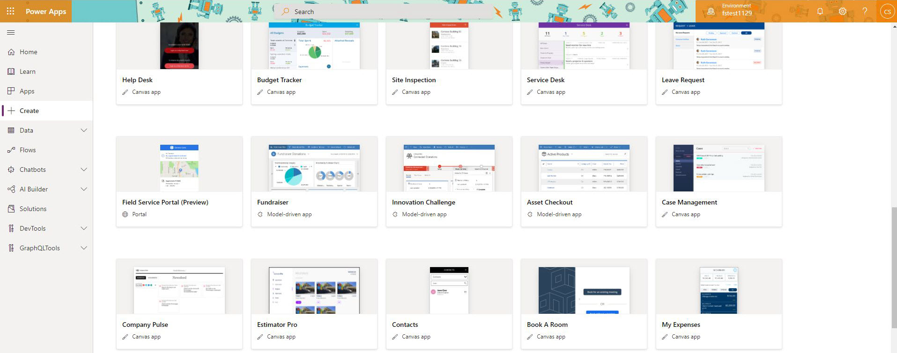

Enter your portal's name and desired subdomain and display language, then select **Create**.

You'll get an email when the portal has been provisioned, and you can move on to the next step.

## Step 2: Configure email and SMS connectors within Power Automate

Customers will be able to access their service portal with a unique link sent to their email or as a text message. To set this up, you'll need to configure one or both communication methods.

To configure email and SMS within Power Automate:

Go to https://make.powerapps.com > **Solutions**. Select **Dynamics 365 Field Service PowerApps Portal – Flow** in the list.

> [!div class="mx-imgBorder"]
> 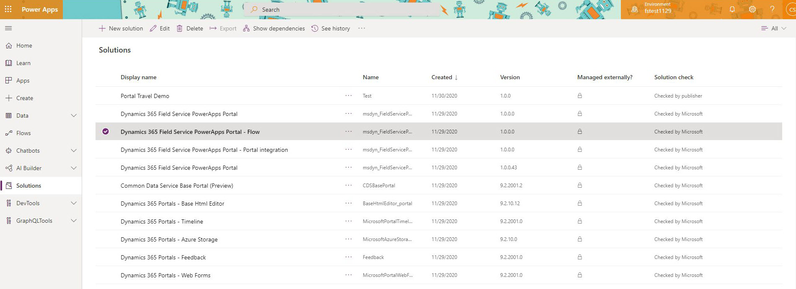

Here you'll find three Power Automate flows. Email and SMS flows are off by default, so we'll need to configure both in order to enable them. 

 > [!div class="mx-imgBorder"]
> 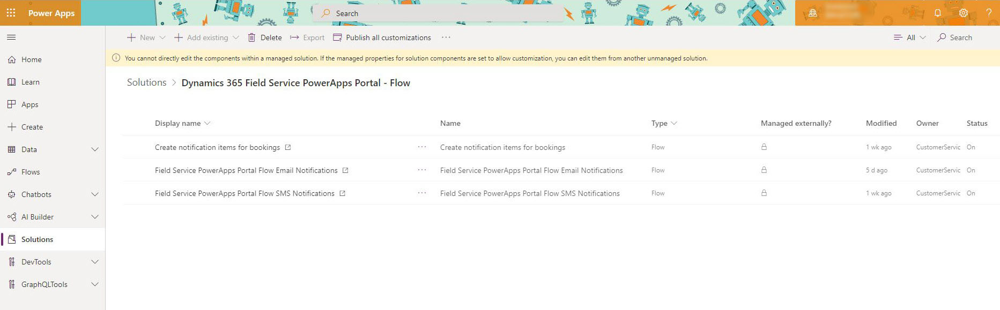

>[!Note]
> Exchange and Twilio are used here by default as popular providers. You can substitute an alternate connector by cloning the flows and configuring desired connector.

To configure email:

- Select **Field Service PowerApps Power Flow Email Notification**.
- Select **Edit**.
- Select the **Send an Email** Exchange connector.
- Add your Office 365 Exchange account connection.
- Save and **Turn On** the flow.

To configure SMS:

- Select **Field Service PowerApps Power Flow SMS Notification**.
- Select **Edit**.
- Select the Twilio connector.
- Add your Twilio account details.
- Save and **Turn On** the flow.

## Step 3: Set up the customer experience

> [!Note]
> When enabling this experience, messages can be sent to contacts of the account associated with bookings. If testing in non-production orgs, make sure your test data does not have real customer email addresses or phone numbers. If your org contains real data, you can prevent unnecessary communication by adding accounts to exclusion lists.

In Field Service, Go to **Field Service Settings** > **Customer Portal** > **Customer Portal Settings**.

Configure the following settings as needed: 

- **Enable Notifications**: Toggles notifications on or off. For more information, see this section: [Notifications](#notifications).
- **Reminder Timing**: Send reminders between *0* and *7* days before scheduled booking time.  
    - Setting to *0* will disable reminder notifications, but other notifications will be sent. 
- **Communication Type**: Define whether your customer will receive email, SMS, or both message types.
- **Show Resource Details**: When the technician is traveling, the customer will see the technician's name and photo as configured in Field Service. 
- **Exclusion lists**: These lists allow you to exclude specific service accounts or service types from all messaging.

> [!div class="mx-imgBorder"]
> 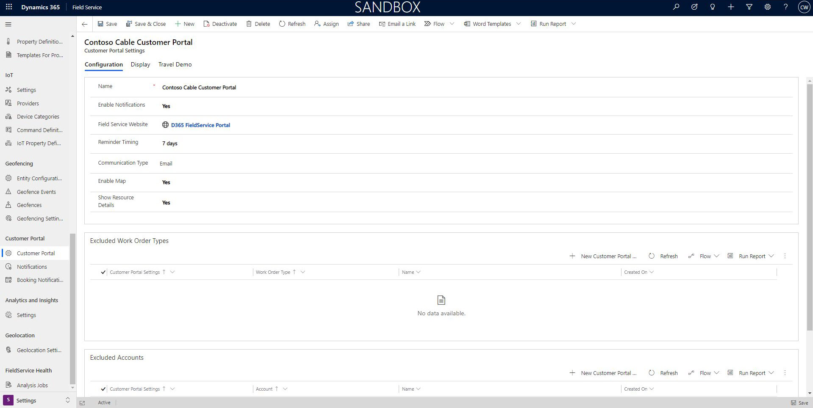

### Branding and content

You can also customize the branding and content for your customer portals.

From the customer portal settings, go to the **Display** tab.

Here you can customize:

- Font type and color for the online portal.
- Background and foreground colors.
- Code snippets: These snippets are dynamic content strings that when updated, can reflect consistent content across the portal, email, and SMS when applicable. Some important code snippets to include:
  - Contact email
  - Contact phone
  - Company name
  - Page title
  - Page footer

> [!div class="mx-imgBorder"]
> 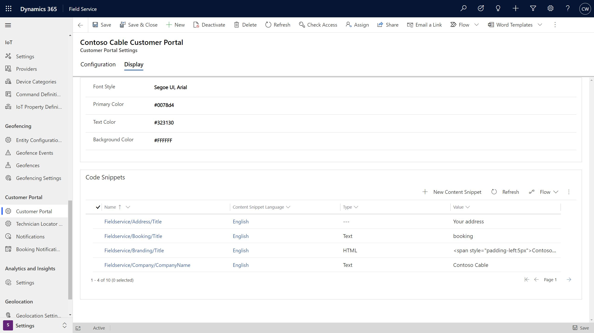

> [!Note]
> To upload and update the portal header image, you will need to access the Power Portal Makers website. For more information, see the section: [Portal Designer](#portal-designer).

## Step 4: Testing the experience as an end user

To review and test changes, we recommend setting up an account and contact as if you are an end customer.  

1. Create an account in Field Service with an address local to your area.
2. Next, create a contact in Field Service with a test email address and mobile phone number.
3. Assign the contact as the primary contact of the test account you created.
4. Create a work order and assign the service account you created.
5. Create a booking for the work order, and set the status to *Scheduled*. Set the start date within the range of your **Booking Reminder** notifications.
6. Assign a resource to the booking. The resource assigned to the booking should have access to the Field Service mobile app, with **Location Sharing** enabled. For more information, see: [FAQ to manually enter a resource location](#q-how-can-i-manually-enter-a-resource-location-without-sharing-location-from-field-service-mobile).
7. After saving the booking, you will receive an email or SMS notification to the test email address and mobile phone number associated with the test contact. Follow the link the notification to review the portal, and you'll find a map showing the location of the service account.
8. Change the booking status to *Traveling*. You will receive a second email or SMS notification. This notification will include a map showing the current location of the technician and their estimated arrival time to the service account location.
9. Finally, change the booking status to *Complete*, which will trigger the booking complete notification.

To test reschedule notifications and cancel notifications, perform steps 1-6; then after the scheduled booking is in place, reschedule the time slot of the booking or cancel the booking.

## Configuration considerations

### Notifications

After configuring your portal and enabling notifications, emails and SMS messages will be sent to the primary contact of the booking service account.

Messages are automatically generated by the following events:

- Service reminder: Reminder messages are sent within *7* days of the scheduled service time. This message will carry the scheduled service time and a link to your portal with basic details including confirmation of service account location shown on a map.
  - By default, service reminders will be scheduled to send daily at 10:00 AM UTC for any bookings within your configured time period. This time can be adjusted in Power Automate. For more information, see this section: [How do I change the timing of reminder messages](#how-do-i-change-the-timing-of-reminder-message)?

> [!div class="mx-imgBorder"]
> 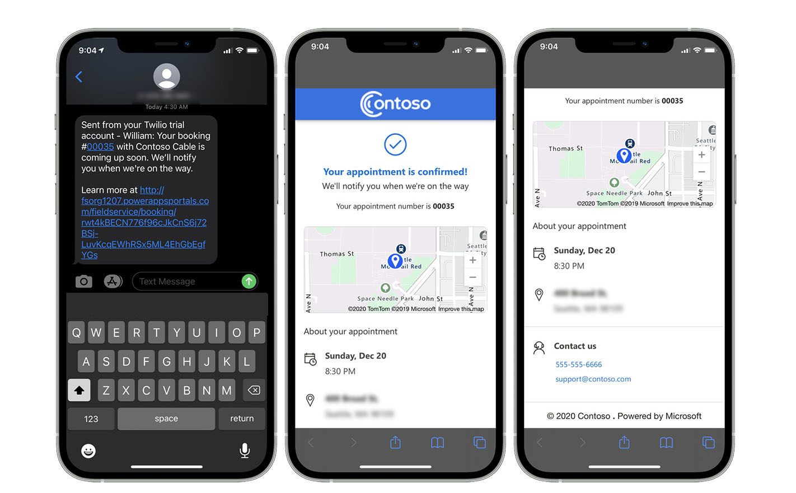

> [!div class="mx-imgBorder"]
> 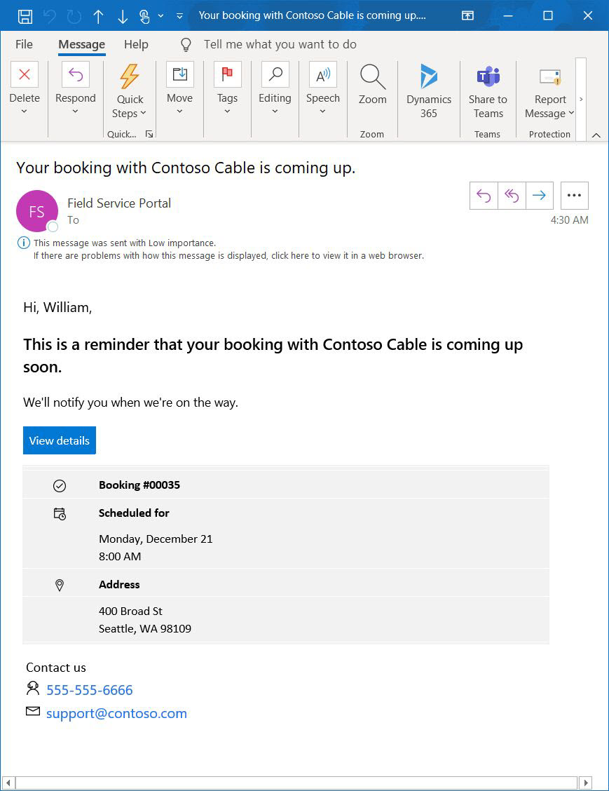

- Technician traveling: Sent when the booking status is *Traveling*. This message communicates estimated time of arrival while considering traffic on expected route. This message links to your customer portal with a map, so your customer can see progress to your service location.

> [!div class="mx-imgBorder"]
> 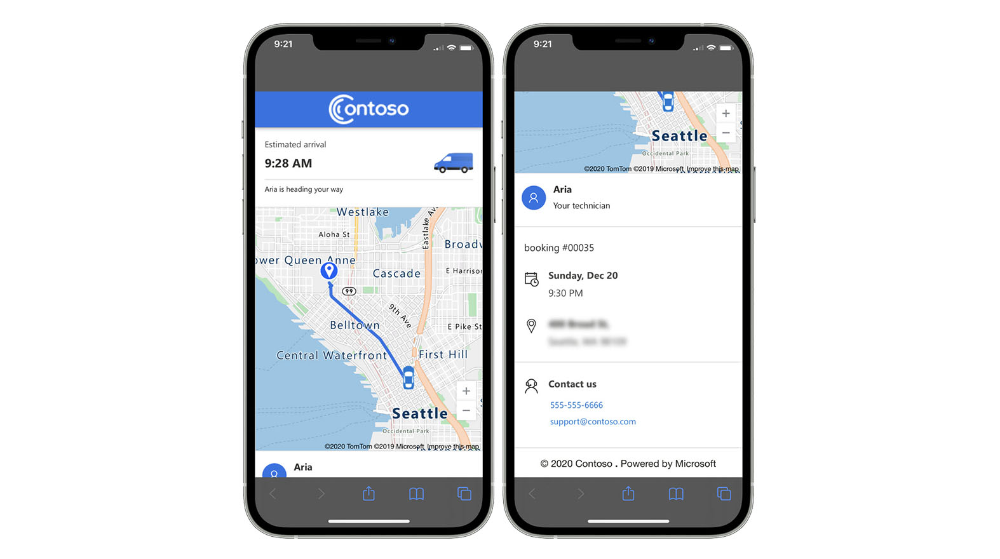

> [!div class="mx-imgBorder"]
> 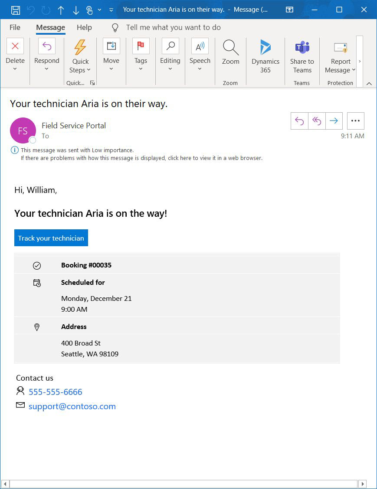

- Service complete: Sent when booking status is *Complete*. This message confirms work was completed, along with date and time of completion. 

> [!div class="mx-imgBorder"]
> 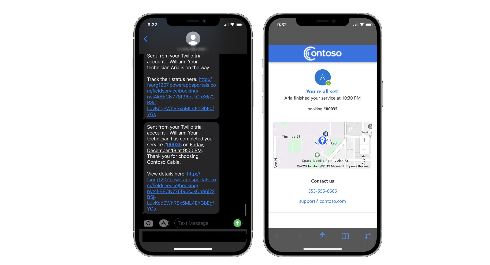

> [!div class="mx-imgBorder"]
> 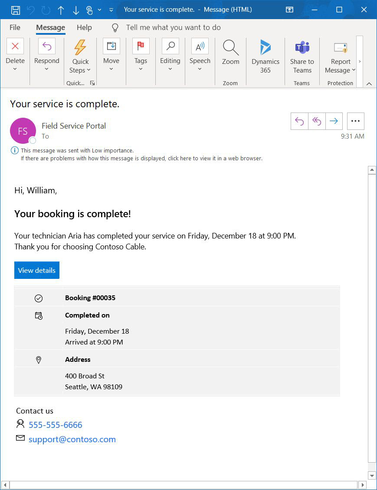

- Service rescheduled: Sent when a scheduled service appointment changes by more than 10 minutes from previously scheduled start time.

> [!div class="mx-imgBorder"]
> 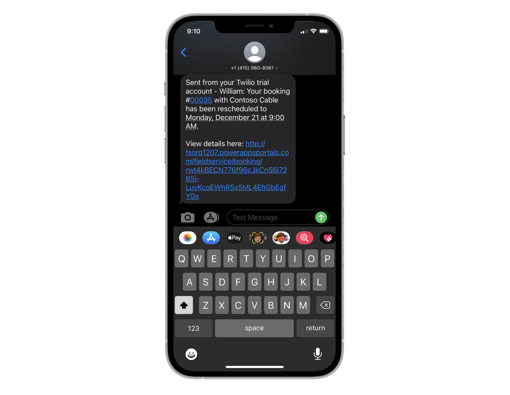

> [!div class="mx-imgBorder"]
> 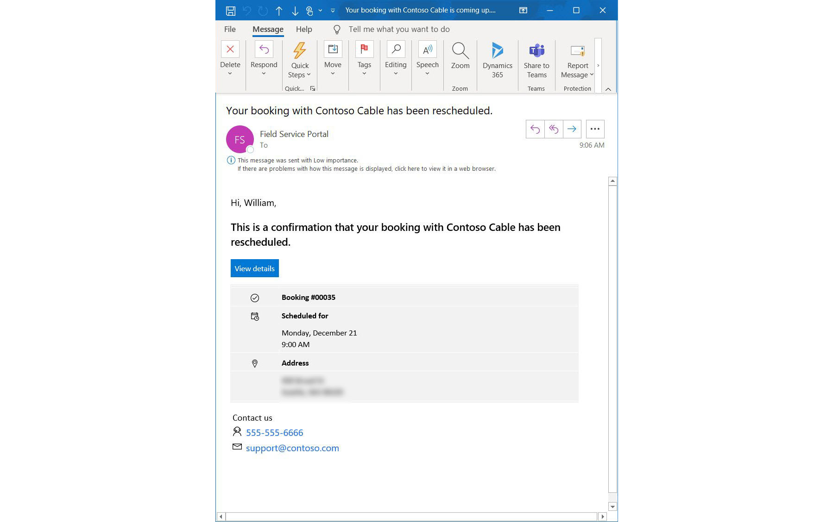

- Service canceled: When a scheduled service appointment is canceled.

> [!div class="mx-imgBorder"]
> 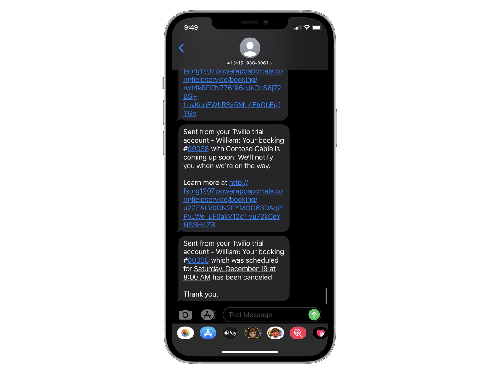

> [!div class="mx-imgBorder"]
> 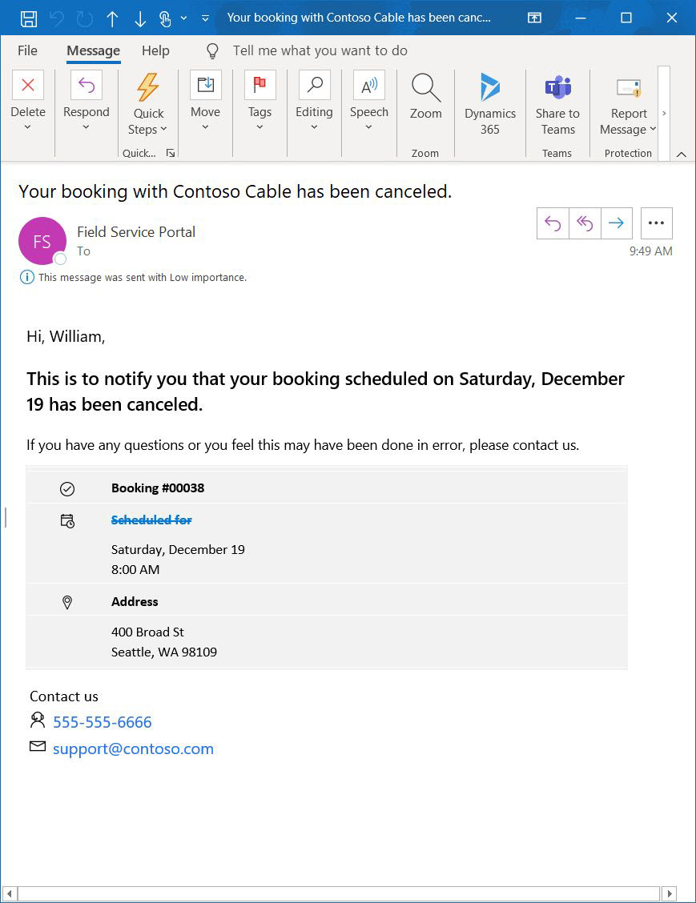

> [!Note] 
> Service rescheduling and service canceling messages are only sent if a reminder message had previously been sent.

### Portal states

- Reminders, traveling, and completion messages include a link to an online web experience hosted on Power Portals.

> [!div class="mx-imgBorder"]
> 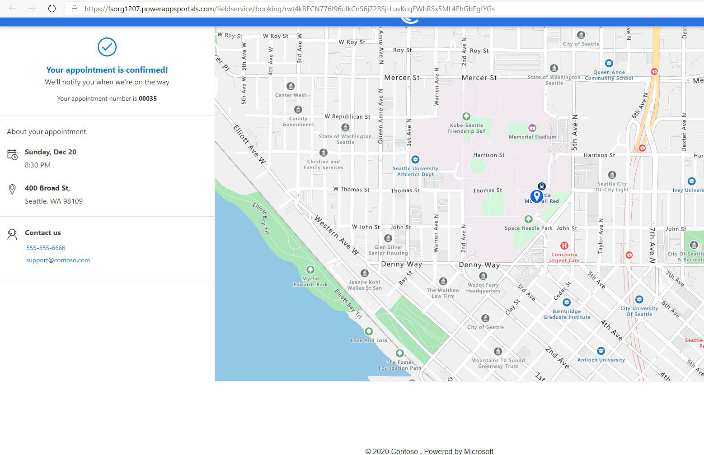

- Responsive design makes this portal accessible from mobile, tablet, or desktop. 
- The customer portal renders different states depending on state of the associated booking.
- When the booking is in a *Traveling* state, the experience includes technician details current technician location on an Azure map. The map will show near real time location of technician based on signal from the Field Service mobile application.

> [!Note] 
> Technicians must be sharing their location from their Field Service mobile application to provide estimated travel time and display real time locations on the portal.

> [!div class="mx-imgBorder"]
> 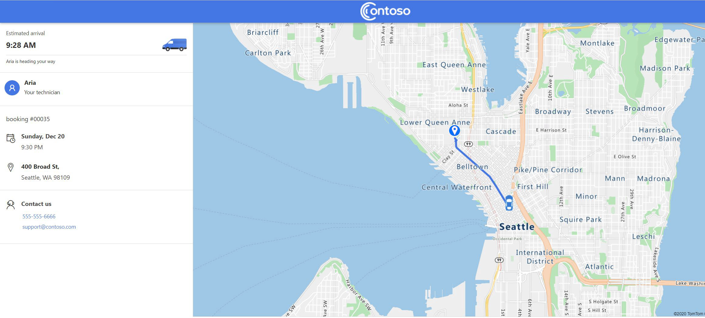

> [!div class="mx-imgBorder"]
> 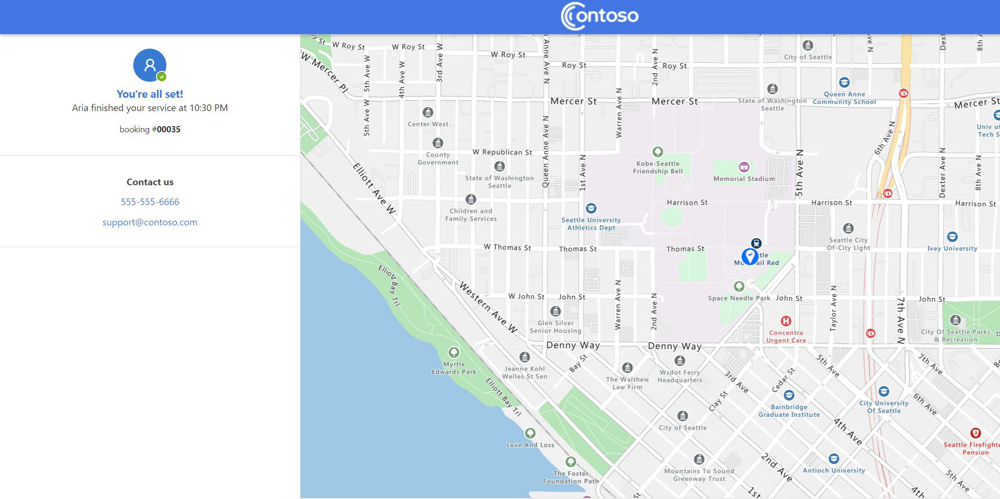

### Portal designer

As an alternative to using content snippets, you can update content and access some more advanced configuration as part of the portal designer experience. 

- Go to https://make.powerapps.com.
- Select **Apps**.
- Select **Edit** on the portal you created.

> [!div class="mx-imgBorder"]
> 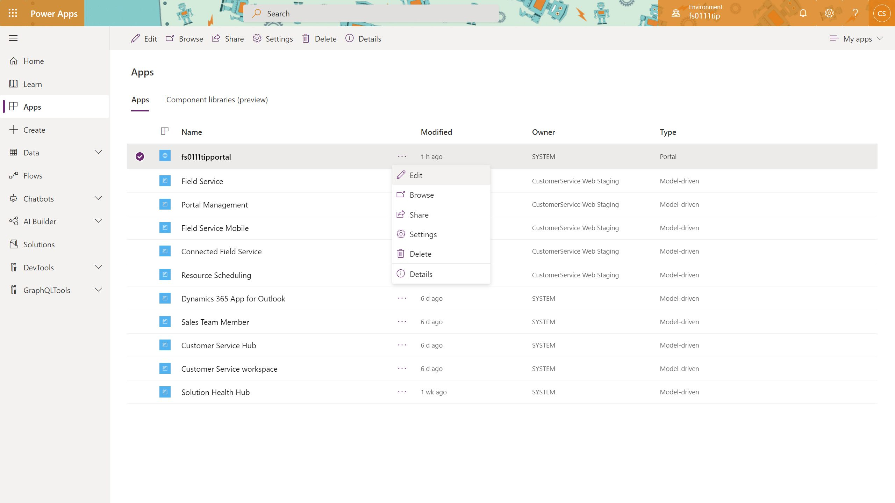

In the portal designer, selected content can be updated and will be reflected in the customer portal. Updating content snippets in the portal maker will also influence content in the messages when applicable.

The portal designer also lets you upload a customized header image or make more fine-tuned adjustments to CSS and the portal's header or footer.

> [!div class="mx-imgBorder"]
> 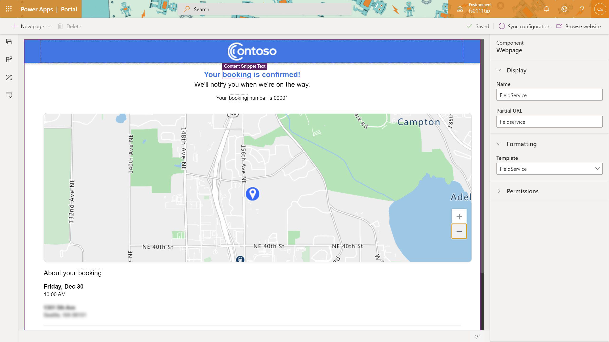

> [!Note] Elements of the portal outside of header and footer - and the highlighted content snippets - are not editable.

### Notification settings

Notification settings provide a read-only view of all messages sent to customers. Here you can see which customers have received a message, the type of message, and the state of the message.

> [!div class="mx-imgBorder"]
> 

> [!div class="mx-imgBorder"]
> 

### Booking notification codes

With booking notification codes, Field Service admins can extend, expire, or block access to a portal link that has been shared with a customer.

> [!div class="mx-imgBorder"]
> 

> [!div class="mx-imgBorder"]
> 

## Additional notes

### How do I change the timing of reminder message?

Reminder messages are triggered by a flow that runs daily at 10:00 AM UTC. Any bookings that fall into your reminder message time period that are not part of exclusion lists will receive a reminder message.

To edit the reminder message:

- Go to https://make.powerapps.com > **Solutions** and find the solution **Dynamics 365 Field Service PowerApps Portal – Flow**.
- Edit the flow called **Create notification items for bookings**.
- Find the location recurrence connector and edit the **Flow Recurrence** value to new desired time.

> [!div class="mx-imgBorder"]
> 

### Can I still provision this Field Service customer experience portal if I already have an existing Power Apps portal?

Yes, you can have multiple portals; however, you can only have one copy of the Field Service customer experience portal per environment.

### Can I integrate this experience within an existing Power Apps portal?

Currently the Field Service customer portal is deployed as a standalone experience and cannot be integrated into an existing Power Apps portal.

### Will the Field Service customer experiences portal receive updates?

When we make updates to the customer experience portal, new features or enhancements will be unpublished and require the org admin to publish the update before they reflect on the live experience.

### I don't have a Twilio or Office 365 Exchange account. Are there other services I can use for messaging?

Yes, you can use alterative SMS or email providers as long as they have connectors supported by Power Automate. Clone the existing email and SMS flows, remove the current connectors, and add desired connectors.

### How can I manually enter a resource location without sharing location from the Field Service mobile app?

To inject a new location, use advanced find in **Field Service** and search for **Geolocation Tracking**. Choose **New Geolocation Tracking**. Enter the resource and the desired latitude and longitude values.

### How do I edit email and SMS content?

General content and format of the notifications are following a fixed template and cannot be changed. You can update individual words within the email and SMS content with content snippets found in Field Service settings. 

### How do I update my Field Service Customer Experiences portal?

We will publish updates over time to introduce new features and functionality for the portal. Updates are not automically published to your portal and would be applied by the organization administrator of your environment. To apply an update, navigate to https://admin.powerplatform.microsoft.com/, select your environment which has the Field Service Customer Experiences (Preview) portal installed, select "Portals". If an update is avialable you will see a message stating that with option to Update now. Select your Portal and apply the update to our environment. 
