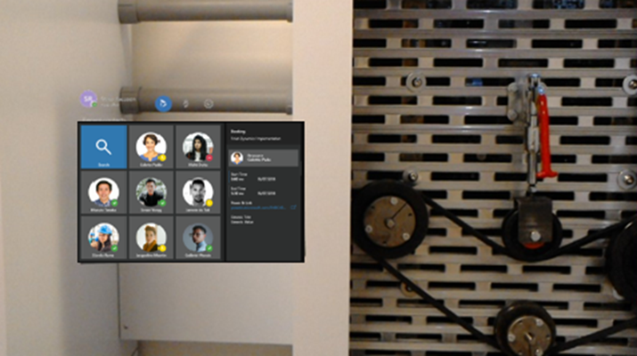
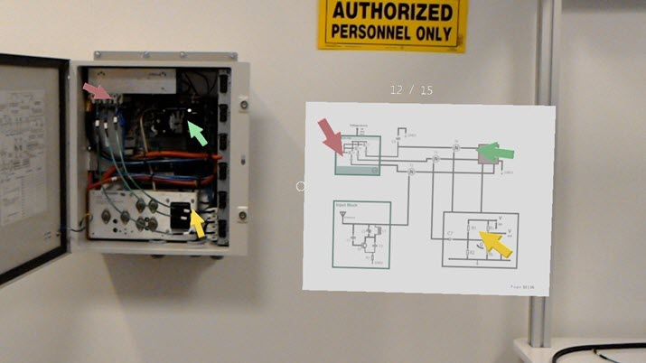

# Collaborate in mixed reality with Field Service, Dynamics 365 Remote Assist, and HoloLens

Empower field technicians to solve problems faster by pairing the Field Service business application with the Dynamics 365 Remote Assist mixed reality app. This allows field technicians to view their field service bookings from Dynamics 365 Remote Assist. 

With heads-up, hands-free video calling on Microsoft HoloLens, technicians using Dynamics 365 Remote Assist are able to collaborate with remote experts on a computer or a mobile device to troubleshoot issues in context. In the photograph, collaboration using Teams is displayed in the technician’s field of view on the HoloLens as the technician performs work on a piece of equipment. Either party in the video call can take advantage of holographic annotations or file sharing.

 

Additionally, product documentation with annotations is displayed in the technician’s field of view on the HoloLens in context of a piece of equipment. 

 

### How does it work?

The technician, also referred to as the first-line worker, can view Field Service bookings on their HoloLens using Remote Assist and quickly call the expert listed in the Support Contact field when needed. This enables first-line workers to do heads-up, hands-free calling through HoloLens in the context of a work orders. See the topic on [Integrating Dynamics 365 Field Service with Dynamics 365 Remote Assist](https://docs.microsoft.com/en-us/dynamics365/mixed-reality/remote-assist/troubleshoot-field-service) for instructions.

### See also
[Buy and deploy Dynamics 365 Remote Assist](https://docs.microsoft.com/dynamics365/mixed-reality/licensing/buy-and-deploy)

[Dynamics 365 Remote Assist FAQ](https://docs.microsoft.com/dynamics365/mixed-reality/remote-assist/faq)

[Dynamics 365 Remote Assist User Guide](https://docs.microsoft.com/dynamics365/mixed-reality/remote-assist/user-guide/)
