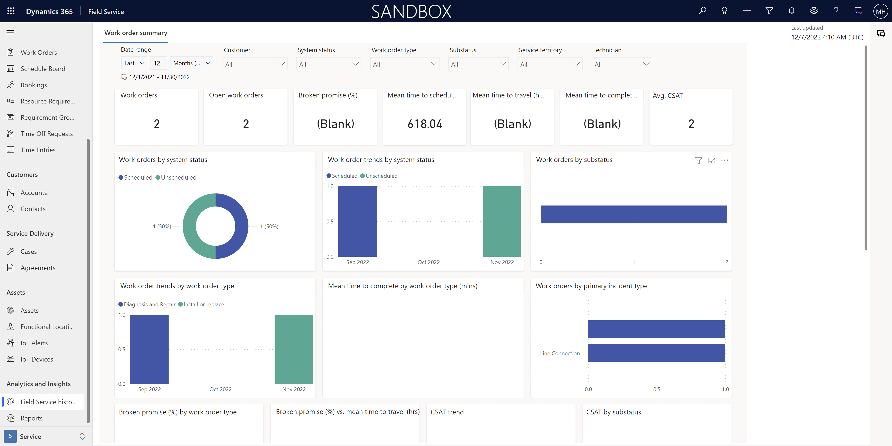
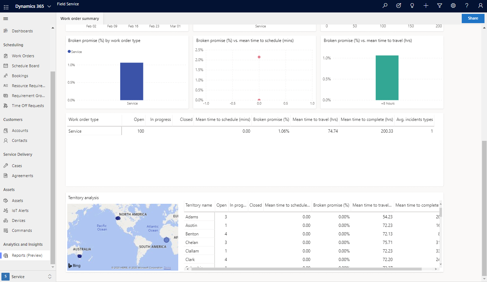
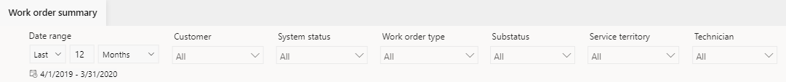
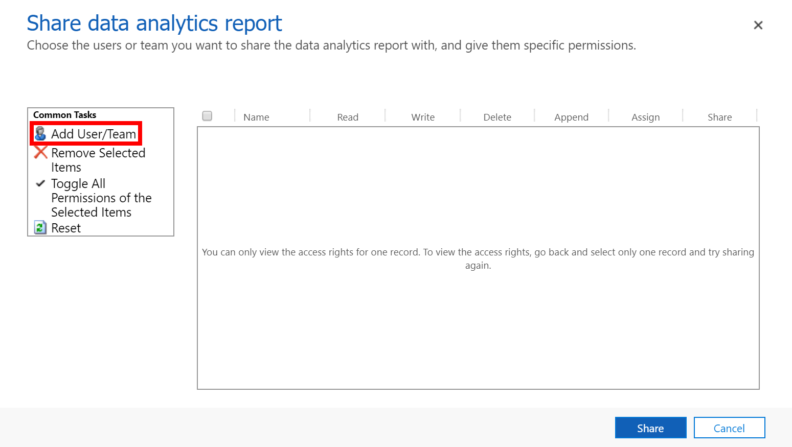
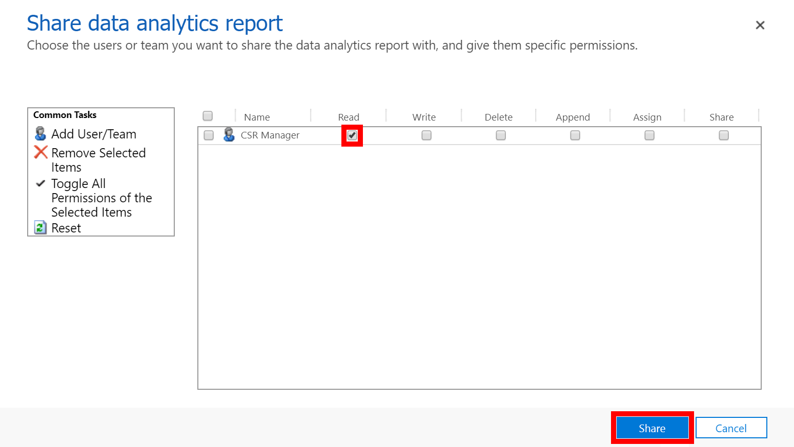

# Work order summary reports in Dynamics 365 Field Service

Operations managers are responsible for managing work orders in order to provide timely support for their customers. To better understand what actions may be needed for better field service performance, these managers need to be able to monitor key operational metrics. 

Reports in Dynamics 365 Field Service can help you get a birds-eye understanding of ongoing work across your organization, such as: 

- The number of open work orders at any given point in time
- Average time to complete a work order
- Average time it takes for technicians to travel to a customer location
- Whether or not you are meeting customer expectations around travel time or other needs
- How an individual technician performs on all key metrics
- Insights around specific territories, from work order volume to travel time and more

## Reports overview

To find reports, go to **Field Service** > **Service** > **Analytics and Insights** > **Reports (Preview)**.

Let's take a look at what you can see from these work order summary reports.

|    Visuals                                               |    Description                                                                                                                                                                                                                                                                                              |
|----------------------------------------------------------|-------------------------------------------------------------------------------------------------------------------------------------------------------------------------------------------------------------------------------------------------------------------------------------------------------------|
|    Work orders                                           |    Total number of work orders created for the selected filters.                                                                                                                                                                                                                                          |
|    Open work orders                                      |    Total number of currently open work orders.                                                                                                                                                                                                                          |
|    Broken promise (%)                               |    percentage of work orders that were completed within the promise window.                                                                                                                                                                                                                                        |
|    Mean time to schedule (mins)                          |    Average time to schedule from the time the work order was created to the time of the first booking.                                                                                                                                                                                                        |
|    Mean time to travel (hrs)                             |    Average time taken by an agent to travel to the customer. Calculated for all non-agreement work orders.                                                                                                                                                                                        |
|    Mean time to complete (hrs)                           |    Average time taken to complete all the bookings for a specific work order from the date the work order was created.                                                                                                                                                                                  |
|    Number of incidents types                             |    Distinct count of the incident types that have been mapped to the work orders.                                                                                                                                                                                                                        |
|    Work orders by system status                          |    Represents the number of work orders by   status.                                                                                                                                                                                                                                           |
|    Work order trends by system status                    |   Represents the trend of work orders created and their associated statuses.                                                                                                                                                                                                                      |
|    Work orders by substatus                              |   Represents the number of work orders created and their current substatuses.                                                                                                                                                                                                                     |
|    Work order trends by work order type                  |    Represents the trend of work orders created by types.                                                                                                                                                                                                                               |
|    Mean time to complete by work order type (mins)     |    Represents average time to complete the work   order.                                                                                                                                                                                                                                           |
|    Work orders by primary incident type                  |    Represents  work orders by primary incident type.                                                                                                                                                                                                                  |
|    Broken promise (%) by work order type                 |    Represents the correlation between broken promise percentage and work order type.                                                                                                                                                                                                                    |
|    Broken promise (%) vs mean time to schedule (mins)    |    Represents the correlation between broken promise percentage and mean time to schedule in minutes.                                                                                                                                                                                                       |
|    Broken promise (%) vs mean time to travel (hrs)       |    Represents the correlation between broken promise percentage and mean time to travel  in hours.                                                                                                                                                                                                          |
|    Territory analysis                                    |    Shows a filled map for each territory. Upon hover on a specific territory, you'll see the number of bookings. Note: The territory is based on the territory entity. For this report to properly render, the territory needs to be a physical geolocation rather a logical geolocation.       |

## View and filter reports

You can filter reports by the following criteria: 

- **Customer** 
- **System status**
- **Work order type**
- **Substatus**
- **Service territory**
- **Technician**
- **Date range**

See the following screenshot of the work order summary report for reference. 

## Refresh reports
The information in reports is refreshed every 24 hours. You may see a yellow, triangular warning icon next to the label **Last refresh (UTC)** in the top-right of the report. This icon indicates whether there is a delay or issue with the data refresh. If the data has not been refreshed in the last 24 hours, you'll see a tooltip message when you hover over the icon.

|    Refresh   status                       |    Indicator   Icon    |    Tooltip   message                                                                                                                       |
|-------------------------------------------|------------------------|--------------------------------------------------------------------------------------------------------------------------------------------|
|    Within or close to SLA (24 hours)    |    Not visible         |    The data set is up to date.                                                                                                             |
|    Missed SLA (>24 hours)               |    Visible             |    Due to the delay with the refresh process, the data set has not been refreshed and you can reach out to your system administrator.    |

## Share reports

By default, the tenant administrator will be able to view all the reports, but by following the below steps, they can also share reports with other users or teams.

1. To share a report, select **Share** in the top-right corner of the report. 
 
2. Select the **Work order summary** report.

3. Select **Share**.

4. Select **Add User/Team** and then choose the user you want to share the report with.

    

5. Make sure the **Read** access is selected and then select **Share**.

    

The user or team you selected will now be able to see the report. 

## Additional notes

- We don't support environment minimal copy operations available for sandbox environments. If you perform any of these operations, you may encounter unexpected results.
- Data is refreshed every 24 hours. Reports will continue to be available during the refresh. If the reports are not refreshed within 24 hours, you can contact Microsoft Support. Currently, we do not support a custom refresh schedule.
- Data refresh for inactive environments: if there's no active usage of the reports for two continuous weeks, the data refresh will pause. When a report is opened, the data will be refreshed in the next refresh cycle.
- Report filters will not persist.
- In **Resource and Utilization**, the **Next** control in the date range is not currently operational.
- Currently, we don't support report customizations.
- Data retention lasts for 24 months.
- Data availability for entities: Field Service uses the following list of entities to generate these reports. If there is no data for any of the following entities, then the report may appear blank. If you have customized these entities or if you're not using the out-of-box entities, then the reports will show blank too.

    - account
    - bookableresource
    - bookableresourcebooking
    - msdyn_resourcerequirement
    - territory
    - calendarrule
    - bookableresourcegroup
    - bookingstatus
    - msdyn_bookingtimestamp
    - organization
    - msdyn_incidenttype
    - msdyn_workorder
    - msdyn_workordersubstatus
    - msdyn_workordertype

### Supported regions
- North America
- South America
- Canada
- Europe (except France)
- Asia Pacific Japan
- Australia
- Japan
- India
- Great Britain

### Error messages and what to do about them

Get an error message? See the following table for a list of errors and what you can do mitigate the underlying issue.

|    Error Message                                                                                                                  |    Action                                                                                                |
|-----------------------------------------------------------------------------------------------------------------------------------|----------------------------------------------------------------------------------------------------------|
|    Oops! No reports were found in CRM. You may not have access to these reports. Contact your system administrator.    |    Contact admin to access the reports.                                                        |
|    Oops! Internal service error, please contact your system administrator with Error Code: {numeric value}.                   |    Contact Microsoft Support and create a ticket.                                               |
|    Oops! There was a problem rendering the report.                                                                              |    Refresh the report; if it doesn’t work, contact Microsoft Support and create a support ticket.    |
|    Oops! There was a problem rendering the report, please try again.                                                            |    Refresh the report; if it doesn’t work, contact Microsoft Support and create a support ticket.    |

### Disabling custom actions 

**msdyn_AnalyticsSaveDataInConfigStore custom action**

Do not disable this custom action because insights and analytics features in Dynamics 365 will not function properly; the **msdyn_AnalyticsSaveDataInConfigStore custom action** is for internal use only. Contact Microsoft support if you have any questions.

#### Parameters

| Name | Type | Required | Description |
|----------|----------|----------|---------|
| Key | String  |Yes | For internal use only. |
| Value | String | Yes | For internal use only. |
| ConfigName | String | No | For internal use only. |

### Known issues

- Reports don't render in Internet Explorer 11.

[!INCLUDE[footer-include](../includes/footer-banner.md)]