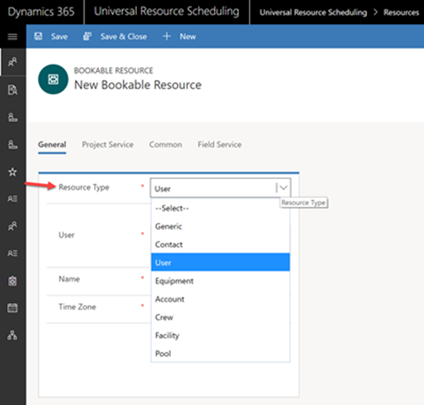

# Resource Pools

Resource Pool Scheduling allows you to assemble groups of similar resources to manage capacity and give schedulers the option to assign specific resources at a later time. 

The major reasons for implementing Resource Pool scheduling are:

-	Avoid being forced to book specific resources up front and instead book the “resource pool” while ensuring you are not overcommitting
> - **Example:** A hotel must search for generic room availability but travelers are not assigned a specific room until they arrive at the hotel.  
-	Enable central schedulers to be shielded from details and leave the details to a local resource manager
> - **Example:** Customers make laptop repair appointments by calling a central dispatch service who books appointments at Microsoft Retail stores countrywide. Each morning the manager of the local store assigns specific specialists.
-	Specific resources may not be named yet but capacity of the pool is established, and resources will be named later. Schedulers can still schedule since capacity of the pool can be set as if all the resources were named. 
> - **Example:** A tradeshow offers different booth options to sponsors. Capacity of booths is considered when booking, but specific booths can be confirmed later. Organizers can take reservations well in advance of having a defined floor layout. In fact, the layout may even be decided based on how many reservations there are! 
-	Deliberately enable overbooking for expected cancellations
> - **Example:** A doctor's office has a fixed number of rooms to help patients but may inflate capacity and schedule more appointments than rooms to account for cancellations.

Let's consider two scenarios to explain Resource Pool scheduling:

1. Schedule a pool then assign specific resources later
2. Overbook a pool for expected cancellations

## Prerequisites 

Universal Resource Scheduling (URS) v3.0

## Scenario 1: Schedule a pool then assign specific resources later

In this scenario the office staff at a health clinic wants to book appointments between patients and pediatrician doctors. Because there are five pediatricians working each day, the office staff must ensure that no more than five appointments are scheduling during any single time slot. However, though appointments are booked weeks or even months in advance, a specific pediatrician is not assigned an appointment until the day before because of variable schedules. 

To configure this scenario, we will create a pool to represent the pediatrician doctors, schedule appointments to the pediatrician pool, then reassign appointments to specific doctors within the pool. 

### 1. Create a resource pool
   
   1. From the Field Service or Universal Resource Scheduling solutions, navigate to **Resources** > **Active Bookable Resources** view > click **+New**.  

> [!div class="mx-imgBorder"]
> 

> [!div class="mx-imgBorder"]
> 

   2. Set **Resource Type** to **Pool**. Once you select the resource type “Pool”, a new field will appear called “Pool Type”
   3. Set **Pool Type** to **Users, Contacts, Accounts** because this pool will consist of people resources (doctors).
      1. Pool types can either be set to: Facility, Equipment, any combination of Account/Contact/User (e.g. People)
      2. It is recommended to create homogenous pools. Since you may not be naming specific resources at all, it is important to setup pools in a way that the resources who are named later can actually fulfill the backlog of work that has been scheduled to the pool. For example, if you schedule a “facility” requirement to a pool, the pool should consist of of facility resources who can later be assigned.
   4. Enter a **Name**
   5. Select a **Time Zone**

> [!div class="mx-imgBorder"]
> 

  6. Set **Start/End Location** to **Organizational Unit Address** and assign an Organizational Unit with latitude and longitude values because the pediatrician doctors work at a defined health clinic of a location.
     1. Start/End Location can be set to either **Organizational Unit Address** to represent a physical location where the Pool works or **Location Agnostic** for a pool of resources that will perform work remotely (e.g. Customer Service phone calls). Resource address is not an option as pools are currently excluded from **Onsite** scheduling (requirements where Work Location is set to Onsite).
  7. Set **Derive Capacity From Group Members** to **Yes** 
     1. **Setting to Yes**: Capacity will increase and decrease as pool members are added to or removed from the pool. In this scenario we want to set to Yes which will allow us to add five pediatricians to the pool in the next step and allow the pediatrician pool to be booked up to five times for any single time slot. 
     2. **Setting to No**: The capacity of the pool will default to one and can be manually edited. Pool members can still be added and removed. See scenario 2 in this article for more details.  
  8. Add more pool resource attributes
     1. You can add any additional information about the pool that you would like considered when it comes to scheduling. Consider the pool as if it is a standard resource as it relates to adding skills, roles, organizational units, territories, etc. For example, if you have a requirement that requires “skill A”, when searching for availability using the Schedule Assistant, only pools with “skill A” will be considered.

### 2. Add pool members

Members can be added to a pool through the Bookable Resource Group entity (bookableresourcegroup).

1. From the pool you just created navigate to **Related > Resource Children**

> [!div class="mx-imgBorder"]
> 

2. Select +Add New Bookable Resource Group
   1. Assign a **Name**
   2. In the **Resource 2** field, select the resource you would like to add to the pool.
   3. Select a **date range** the resource will be part of the pool. This will effect capacity if the pool is set to derive capacity from pool members.
   1. Repeat these steps for each pool member

**Pro Tip:** Resources can be associated as children of the Pool with date effectivity. As an example, on Monday Resources 1, 2, and 3 can make up the Pool, while on Tuesday, Resources 4, 5, and 6 can make up the Pool. This can be done by (1) creating a new Bookable Resource Group record, (2) setting the Parent Resource to the Pool, and the Child Resource to the Resource that is in that Pool and (3) setting the “From Date” to the date and time that the Resource is part of the Pool and set the “To Date” to the date and time when the Resource is no longer associated to the Pool. 

### 3. Add the pool to the schedule board

Navigate to **Universal Resource Scheduling** > **Schedule Board**

1. Add the pool resource by adjusting the schedule board filters the same way you would add any resource to the schedule board.
   1. In this case we selected **Resource Types** of **Pool** and **Pool Types** of **Users, Accounts, and Contacts** because this matches our Pediatrician Resource Pool. 
2. Right click the Resource Pool and select **View Resources in Split View** to see the pool and pool members below a lower pane.
3. Select **Options > Save Current Filters as Default** to save the changes you have made to the schedule board tab for the next time you vi
> [!div class="mx-imgBorder"]
> 

### 4. Create a single requirement

Next let's schedule a requirement to our newly created resource pool.

Navigate to **Universal Resource Scheduling > Resource Requirements > +New**

   1. Enter a **Name**
   2. Select a **From/to date** - these values become Search Start and Search End dates in the Schedule Assistant
   3. Enter a **Duration**
   4. Set Resource Type to **Pool** and **Pool Types** to **Users, Accounts, and Contacts** - this will ensure our Pediatrician pool shows in results
      1. This allows you to decide which type of Resources should be searched when searching for availability using the Schedule Assistant on a requirement. If this field is left empty, all resource types are searched. If certain values are selected, then only those Types of resource will be considered. 
   5. Add other constraints such as characteristics. In this example we want resources with "Pediatric" skills

> [!Note]
> Notice the Requirement Group field on the requirement record is blank. This means this is a single requirement intended to be scheduled to one resource. One benefit of single requirements is they can be scheduled and rescheduled via manual drag and drop. This will be useful if dispatchers want to manually reschedule bookings from a pool to a pool member.  
 
> [!div class="mx-imgBorder"]
> 

The Resource Types chosen on the requirement are compared to the Resource Type selected on each Bookable Resource. See the image below. 

> [!div class="mx-imgBorder"]
> 

### 5. Book the pool

Select Book at the top of the requirement from to trigger the schedule assistant.

> [!div class="mx-imgBorder"]
> 

When searching for availability with the schedule assistant for a Requirement or Requirement Group, both the Pool and its child resources (pool members) can be returned in the results.

Select the pool resource (in this case our Pediatrician Pool) and select **Book & Exit**

### 6. Book the pool to more requirements

Next lets schedule another requirement to the Pediatrician Pool for the same time slot.

In the image below is a near identical requirement for a pediatrician.

> [!div class="mx-imgBorder"]
> 

We will select the same resource pool and the same time slot 9:00am to 10:00 am.  

> [!div class="mx-imgBorder"]
> 

The resource pool will show as a result in the schedule assistant for the 9:00am time slot up to five times since five pediatric resources were added to the pool making the capacity five.

Next, head to the schedule board and then to the schedule board tab where your pool resource is displayed.

Load the **Hourly** Schedule Board and find your pool resource. Right click the Pool Resource and choose to **View Pool Resources in Split View**. This will split the Schedule Board and a new dedicated Schedule Board will be displayed showing just the Pool and its members. Based on the dates being displayed on the Schedule Board, only the members of the pool with membership during that date range will appear in the Pool Schedule Board. If a resource is part of the pool for only some of the days being displayed on the Schedule Board, they will be displayed, and there will be a mask showing the days where they are not part of the pool.

Here we see five bookings at the 9:00am time slot. 

> [!div class="mx-imgBorder"]
> 

> [!Note]
> The Schedule Board **sorting** functionality applies to the split view, but the Schedule Board **filtering** functionality does not.

### 7. Reassign pool bookings to specific pool members

Fulfilling our scenario, the health clinic office staff want to assign specific pediatric doctors as the appointment nears.

From the schedule board split view, we will accomplish this three ways:

1. Manually drag and drop
2. Substitution
3. Rebook

#### 1. Manually drag and drop

Simply click and hold a booking from the resource pool and drag it to one of the pool members.

> [!div class="mx-imgBorder"]
> 

#### 2. Substitution

Right click a booking for the resource pool and select substitute resource then select a pool member.

> [!div class="mx-imgBorder"]
> 

#### 3. Rebook

1. Right click a pool booking and select Rebook.
2. Edit the filter criteria to no longer search for pools, but to search for User, Contact, and Account type resources.

> [!div class="mx-imgBorder"]
> 

When rebooking a previously fulfilled booking, the duration will default to the Default Booking Duration as defined in **Universal Resource Scheduling > Settings > Administration > Enable Resource Scheduling for Entities > Booking Setup Metadata**.

Therefore, in the image below the user must edit the end time to match the original duration.

> [!div class="mx-imgBorder"]
> 

Finally, cancel the original pool booking.

**Pro Tip:** Create a custom Booking Status to match your business needs rather than changing the status to cancelled.

> [!div class="mx-imgBorder"]
> 

As an alternative to rebooking from the schedule board. navigate to the requirement record, edit the resource types and book again. 

> [!div class="mx-imgBorder"]
> 

## Scenario 2: Overbook a pool for expected cancellations

In this scenario, hotel managers want to schedule reservations for travelers by first checking for availability for a specific date range, and then assigning the traveler a specific room when he/she arrives. Furthermore, hotel managers want to overbook the hotel to account for expected cancellations.

To configure this scenario, we will create a pool of facilities with extra capacity to represent the hotel rooms, schedule reservations to the hotel pool, then reassign reservations to specific rooms within the hotel pool.

### 1. Create a pool resource

First lets create a pool resource to represent the hotel.

1. From the Field Service or Universal Resource Scheduling solutions, navigate to **Resources** > **Active Bookable Resources** view > click **+New**.
2. Set **Resource Type** to **Pool**
3. Set **Pool Type** to **Facility**
4. Enter a Name.
5. Set **Start/End Location** to **Organization Unit Address**
6. Assign an **Organization Unit** from the lookup to represent the location of the hotel
   1. The chosen organizational unit must have latitude and longitude values 
7. Set **Derive Capacity from Group Members** to **No**
   1. We are going to manually override capacity to allow for overbooking rather than have the number of facilities in the pool (ie the number of rooms in the hotel) dictate capacity

> [!div class="mx-imgBorder"]
> 

### 2. Create and add pool members

   1. Create resources with resource type = facility to represent each room in the hotel
   2. Navigate to the hotel pool resource you created in the previous step and add each room resource as a child by selecting **Related > Resource Children**   
> [!div class="mx-imgBorder"]
> 

> [!div class="mx-imgBorder"]
> 

### 3. Manually add additional capacity

   1. While on the hotel pool resource, navigate to **Show Working Hours** at the top of the form
   2. Select **Show Capacity**
   3. Enter the desired capacity. In this example, we are entering a capacity of six though our pool has only five child resources (ie five rooms).

> [!div class="mx-imgBorder"]
> 

### 4. Create requirement

Next let's create a requirement to represent a reservation for a traveler.

1. Navigate to **Universal Resource Scheduling > Resource Requirements > +New**
2. Fill out Name, Date Range, Duration, and any other constraints
3. Set **Resource Type** to **Pool**
4. Set **Pool Type** to **Facility**
   1. This ensures our hotel pool will be considered in schedule assistant results
5. **Work Location**
   1. Set to **Facility** and enter the customer's latitude and longitude if schedulers want to utilize travel and distance calculations in the schedule assistant results. This is useful in scenarios where the hotel may have many locations and the scheduler wants to use time and distance calculations when communicating to the customer.
   2. Set to **Location Agnostic** and leave latitude and longitude blank 

> [!div class="mx-imgBorder"]
> 

### 5. Book requirement

Select Book at the top of the requirement form to trigger the schedule assistant.

Up to six requirements (reservations) can be booked for a single time slot. 

The schedule assistant results in the image below assume five reservations have already been scheduled to the hotel and the user is attempting to book a sixth reservation utilizing extra capacity.

> [!div class="mx-imgBorder"]
> 

### 6. View overbooking on the schedule board

Navigate to **Universal Resource Scheduling** > **Schedule Board**

1. Expose the hotel pool to the schedule board by filtering for **Resource Types** of **Pool** and **Pool Types** of **Facility**
2. View the hotel pool and all related pool members (rooms) by right clicking the hotel pool resource and selecting **View Pool Resources in Split View**

> [!div class="mx-imgBorder"]
> 

### 7. Reassign bookings

Reassign the hotel pool bookings to specific rooms via the three methods described in scenario 1.

1. Manually drag and drop
2. Substitution
3. Rebook

## Configuration considerations
- Resource pools will **not display** in schedule assistant results for requirements where Work Location = Onsite. By default Work Order related requirements are set to Onsite. Requirements with a Work Location = Facility or Location Agnostic are elligible to display in schedule assistant results. 
- Crew resources and pool resources cannot be made children of a pool.
- **Location of Pool Members:** If a resource is the child of a pool through a bookable resource groups (bookableresourcegroup) record, the location of the child resource is taken from the pool. Additionally, if a resource pool is related to a facility/facility pool resource via bookable resource association (msdyn_bookableresourceassociation), this means the pool works at the location established on the related facility/facility pool, and the location is therefore taken from the facility/facility pool.

- When a pool resource has **Derive Capacity from Group Members** set to **Yes**, the pool's capacity for a given time slot is effected by (1) the number of pool members (2) the dates the pool members are part of the pool and (3) the working hours of the pool members.

 
### Choosing the right Resource Type
- Whether the pool resource, pool members, or both show in schedule assistant results depends on the Resource Types selected on a requirement record. If Resource Type “Pool” is selected, and if the resource pool has availability along with all other matching constraints expressed on the requirement such as characteristics and roles/categories, the pool itself can return as an option to book. If the Resource Type “Pool” is **not selected** on the requirement, pool members can still return in the results presuming that the Pool member’s “Resource Type” is checked off on the Requirement. **Reminder** that if no resource types are selected, all resource types are considered.
  - **Example:** let’s say there is a requirement that only has Resource Type of “Account” selected, and there is a resource with Resource Type of “Pool”, and Pool Type of “Account, Contact, User”. In this example, the pool resource itself will not be returned in the Schedule Assistant search, but the child pool members (of Resource Type “Account”) will be returned by the Schedule Assistant. 

### Using characteristics with pools
  The same logic that is applied to the requirement Resource Type attribute applies to all constraints. Consider the following example: A requirement has a required characteristic called **Electric Vehicle Mechanic**. There is a pool that has the characteristic **Mechanic**, but not **Electric Vehicle Mechanic**. The pool has a child member that has the Characteristics of both **Mechanic** and **Electric Vehicle Mechanic**. When running the Schedule Assistant on the requirement, presuming there is availability, the pool resource itself will not be presented to book since it is missing the required characteristic (**Electric Vehicle Mechanic**), but the pool member will be presented since this child resource has the necessary characteristic for this job. The idea of this implementation is the pool members should have all the attributes expressed on the pool, but they may have additional attributes as well if they have specialties. Since not all the pool members have these additional attributes, like the **Electric Vehicle Mechanic**, if this requirement gets booked to the pool and the one pool member who has this characteristic is not available as you get closer to the appointment time, what happens? Who will be assigned to this booking which is currently booked to the pool? You may not have other resources to pickup the work. Therefore, the idea is to book the actual resource itself to ensure that this unique job has coverage.

 
## Additional Notes
- Requirement Groups cannot be dragged and dropped or substituted 
- When changing the working hours of a resource, it does not recalculate capacity

### Pool availability affects member availability and vice versa

- Being part of a pool can severely limit a resource's ability to be scheduled. Resources cannot be expected to operate as part of a pool and independently at the same time. If a pool resource itself is booked to capacity for a given time slot, pool members will not show as available for that time slot and vice versa. If all pool members are booked for a given time slot, the pool will not show as available for that time slot.
  - **Example 1: Pool Resource Only** When searching for availability, the Schedule Assistant will look at the Pool capacity set on the Pool Resource and will subtract existing bookings that are booked to the Pool Resource itself, or any of the Pool’s child Resources. By way of example, let’s assume that the Pool capacity is set to 10 continuing the scenario from above. Let’s also assume there are no child Resources for this pool. When finding availability using the Schedule Assistant, the Pool will be looked at as if there are 10 resources associated to the pool. For example, let’s say you are searching for a 30-minute requirement. If the pool has 10 bookings from 10 to 10:30, the pool will not be recommended for the requirement between 10 and 10:30. This is because the total capacity of the Pool at 10 AM is 10, but there are 10 bookings scheduled to this Pool Resource at 10 AM. However, if the pool only has 9 bookings between 10 and 10:30, then the pool can be recommended between 10 and 10:30.
  - **Example 2: Pool Resource and Child Resources** If the bookings for the Pool and its members exceed the total capacity established on the pool, every Resource in the Pool and the Pool itself is considered unavailable. But if there is overall aggregate availability, then each Resource still has its own availability calculation. As an example, if the Pool Resource has a capacity of 10, and there are 9 bookings between 10 and 10:30 on the Pool Resource, and the child Resource has one booking from 10 to 10:30. In this case, since in aggregate, the Pool and its children have as many or more bookings (10) than the capacity on the Pool (10), the entire Pool and its child Resources are considered not available for that timeframe (10:00 to 10:30). **However**, if the Pool Resource has 8 bookings and the child Resource has 1 booking, since this is a total of 9 bookings, the Pool and its child Resources will not be removed between 10 and 10:30. In this case, the Pool itself will show as available, however the child Resource will not return as available since there is already a booking at 10 o’clock for the child resource.

### Pools vs. Crews: when to use each?
- One main difference between pools and crews is crews are expected to do work together and bookings cascade (at least by default). This means scheduling a crew will create bookings for crew members, whereas booking a pool does not create bookings for pool members. Additionally, crews can be a compilation of different types of resources such as a person and a piece of equipment. In contrast, pools are designed to be homogeneous meaning entirely people, equipment, or facilities.

.

