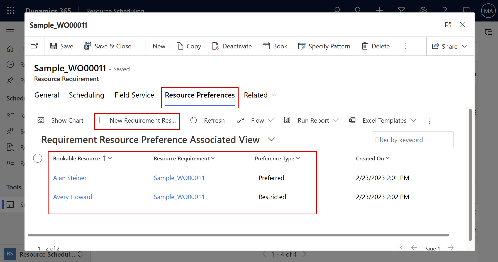
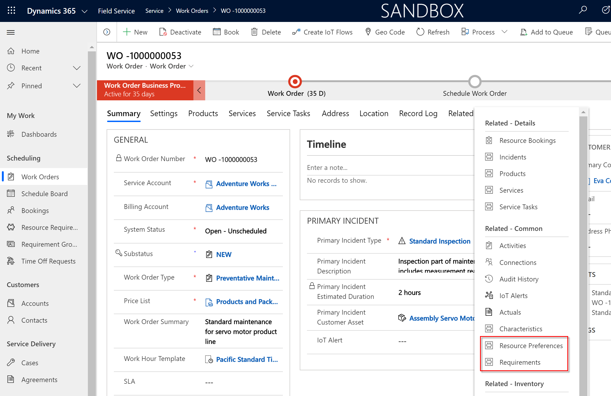
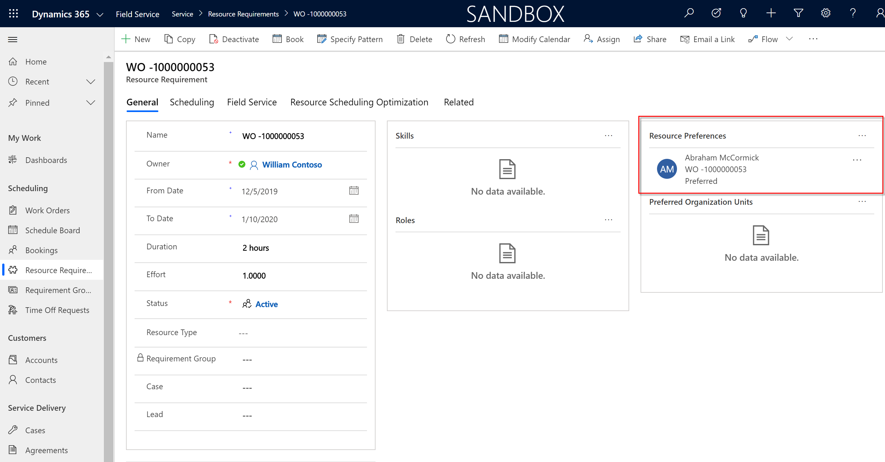
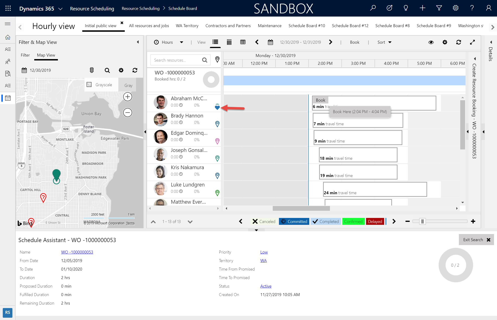
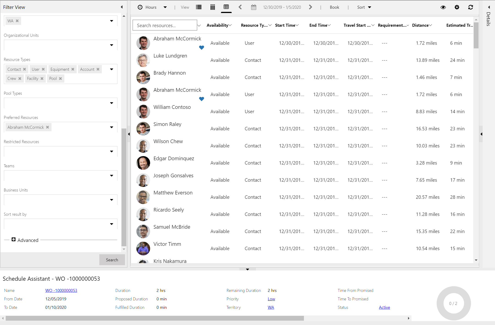
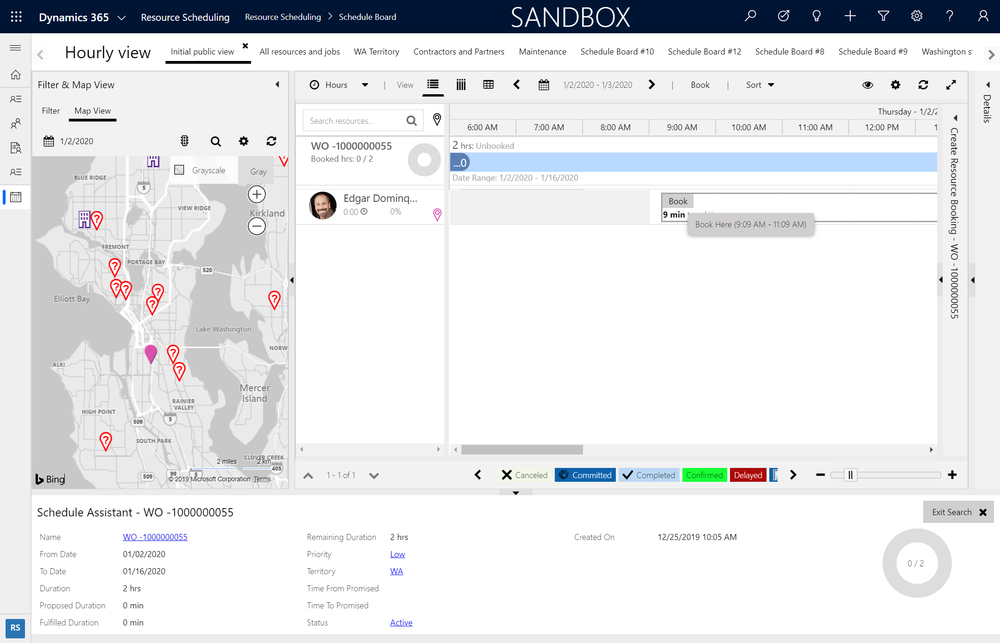
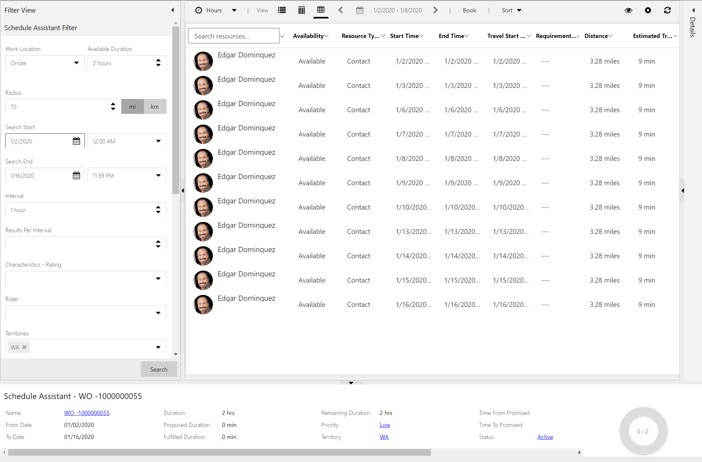
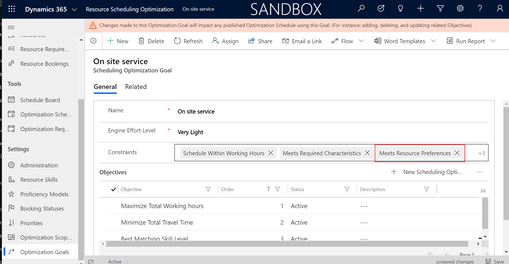

# Resource preferences in Dynamics 365 Field Service

Resource preferences allow dispatchers to give preference to specific resources over others when scheduling with the schedule assistant or resource scheduling optimization. This is helpful for scenarios where a particular person or list of people are the only people that can perform a work order or job requirement. It's also helpful for scenarios where a person or group of people should *not* be eligible for a work order or job requirement.

From a requirement, the dispatcher can add one or more resource preferences. 

> [!div class="mx-imgBorder"]
> 

For each resource added as a resource preference, you can define a **Preference Type**:

- **Preferred:** these resources will show at the top of schedule assistant results. Resource scheduling optimization will prioritize these resources over others, but will not guarantee the requirement is scheduled to them.
- **Restricted:** these resources will be excluded from schedule assistant results. Resource scheduling optimization will not auto schedule the requirement to them.
- **Must choose from:** only these resources will show in schedule assistant results. Resource scheduling optimization will schedule to one of them. If none of these resources are available, the requirement will not be scheduled.

Because you can add multiple resource preferences to a single requirement, you can note both preferred resources and restricted resources on the same requirement.

To explain resource preferences, let's look at one example for each preference type: preferred, restricted, and must choose from.

## Prerequisites

- Field Service v8.8.7+
- For resource scheduling optimization to consider the "Must choose from" resource preference, you must be using resource scheduling optimization v3.0.19263.1+ 

## Preferred

Preferred resources will show at the top of schedule assistant results. Resource scheduling optimization will prioritize these resources over others, but will not guarantee the requirement is scheduled to them.

First create a work order.

Then go to **Related** > **Requirements** to view the requirement that is automatically created when a work order is created. This is where you can add details for the kinds of resources eligible to perform the work order including resource preferences. 

> [!div class="mx-imgBorder"]
> 

You can go to **Related** > **Resource Preferences** directly from the work order.

Alongside where you can add skills and resource roles that are required, add a new resource preference record.

> [!div class="mx-imgBorder"]
> 

Select a resource and choose **Preferred** for **Preference Type**.

In this example, we created a work order (WO-1000000053) and then added Abraham McCormick as a preferred resource to the related resource requirement.

From the schedule board, select and highlight the requirement and choose **Find Availability** to trigger the schedule assistant. You will notice your preferred resource is shown at the top of the list with a heart icon indicating they are preferred.

> [!div class="mx-imgBorder"]
> 

In the schedule assistant grid view, you'll see the same heart icon next to preferred resources as seen in the following screenshot.

> [!div class="mx-imgBorder"]
> 

> [!Note]
> The preferred resource will only show if it meets the other filter criteria such as location, skills, resource types, etc.

## Restricted

Restricted resources will be excluded from schedule assistant results. Resource scheduling optimization will not auto schedule the requirement to restricted resources.

Following the same steps from the previous section, go to the requirement and add a resource preference with preference type of **Restricted**. For restricted resources, you have the option of adding a date range for which the restriction takes effect.

Then trigger the schedule assistant for the requirement.

> [!div class="mx-imgBorder"]
> 

The restricted resource will show as restricted in the filter panel and will not display in results. Dispatchers have the option to edit or delete the resource preference in the filter panel as needed. 

## Must choose from

The "Must choose from" resource preference means only these resources will show in schedule assistant results, and resource scheduling optimization will schedule to one of them. If none of these resources are available, the requirement will not be scheduled.

In the following example, the resource "Edgar Dominguez" was added to a requirement as a "must choose from" resource preference (preference type set to **Must choose from**).

> [!div class="mx-imgBorder"]
> 

In the schedule assistant grid view, the available time slots for only the "must choose from" resource(s) is shown. 

> [!div class="mx-imgBorder"]
> 

> [!Note]
> You can add multiple resources as "must choose from" resource preferences. All will show as schedule assistant results (given they meet other filters) and resource scheduling optimization will schedule to one of them.

## Using resource preferences with resource scheduling optimization

- For resource scheduling optimization to consider restricted and "Must choose from" resource preferences when automatically scheduling, add the **Meets Resource Preferences** constraint to the related optimization goal. 

> [!div class="mx-imgBorder"]
> 

- For resource scheduling optimization to consider preferred resource preferences, add the **Maximize Preferred Resources** objective to the optimization goal. Preferred resources are considered an objective and not a constraint because resource scheduling optimization does not guarantee requirements are scheduled to preferred resources. Not scheduling to restricted resource and scheduling to "Must choose from" resources are both guaranteed.  

## Additional notes
- The resource that is added as a preferred resource (including the "Must choose from" preference type) must meet the other conditions of the requirement. For example, if a requirement calls for "Skill A," and a resource without Skill A is added as a preferred or "Must choose from" resource preference, the resource will *not* show in results or be automatically scheduled.

[!INCLUDE[footer-include](../includes/footer-banner.md)]