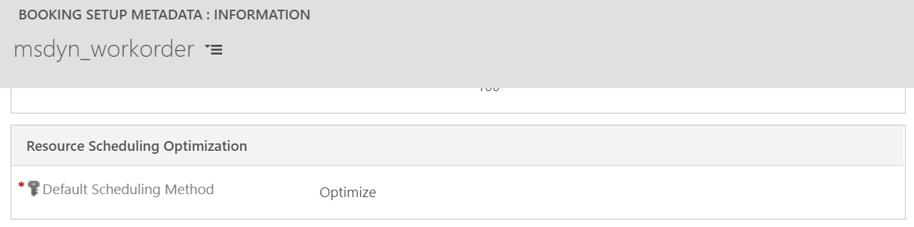
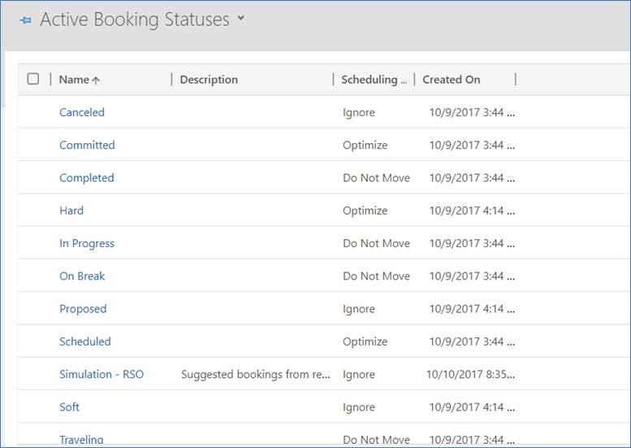

# Resource scheduling optimization configuration 

Perform these configuration steps after you deploy the resource scheduling optimization solution.

## Enable resource scheduling optimization

1. Go to **Resource Scheduling Optimization** \> **Administration** \>
    **Resource Scheduling Parameters**.

   - Set **Enable Resource Scheduling Optimization** to **Yes**.

   - Set **Default Goal** if needed. A default goal helps speed up interactions with
     resource scheduling optimization through the schedule board by predefining how the engine optimizes
     data. Users can still pick different goals. 
   > [!div class="mx-imgBorder"]
   > 

   - Set **Connect to Maps** as **Yes**. The connect to maps feature allows this
     organization to interact with the Bing Maps service that the schedule board
     uses.
    > [!div class="mx-imgBorder"]
    > 

     > [!NOTE]
     > Only a user with the system administrator role can enable this setting. 

## Add required security roles to users who will configure and run resource scheduling optimization

2. Go to **Settings** \> **Security** \> **Users**, navigate to the
    **Application Users** view, and assign the Field Service - Administrator
    security role to the Resource Scheduling Optimization application user.

3. Go to **Settings** \> **Security** \> **Field Security Profiles**, open
    **Field Service – Administrator**, and add **Resource Scheduling
    Optimization** to the field security profile.

  Steps 2 and 3 help ensure that resource scheduling optimization is able to optimize work order-related requirements and bookings. 
  
  For dispatchers who want to interact with resource scheduling optimization:
   1. Go to **Settings** \> **Security** \> **Users**.
  2. Locate the user or team of dispatchers.
   3. Select **Manage Roles**.
   4. Grant **RSO Dispatcher** a security role.
  5. Select **Save**.
   6. Go to **Settings** \> **Security** \> **Field Security Profiles**.
   7. Open **Resource Scheduling Optimization - Dispatcher** and add the user or
team to the profile and then select **Save**.

## Make data changes to prepare for optimizations 

The settings described here are selected and applied to all optimization scopes.

1. Update **Optimize Schedule** to **Yes** for resources. Go to
    **Resource Scheduling Optimization** \> **Resources**. Navigate to the
    **Scheduling Summary** view, select one or more resource records, and then
    select **Edit** to bulk edit the **Optimize Schedule** field to **Yes**.

   > [!NOTE]
   > - After you enable your resources for resource scheduling optimization, you need to set the latitude
    and longitude for the resources’ organizational unit or personal address,
    depending on whether their start/end location is an organizational unit or a
    personal address.
   > - Start location and end location must have the same setting. For example,
    you cannot have the start location be a personal address and the end
    location be location agnostic. 
  
2. Configure booking setup metadata for the entity. Set
    **Default Scheduling Method** to **Optimize**. For example, if enabled for
    work order entity’s booking setup metadata, every newly created work order
    and related resource requirement will be configured to optimize
    automatically.
    
    

3. For existing resource requirement records, update the resource
    requirements scheduling Method. Go to **Resource Scheduling
    Optimization** \> **Resource Requirements,** navigate to the **Unscheduled
    Work Order Requirements** view, select some or all records, and select
    **Edit** to bulk edit the **Optimize Schedule** field to **Yes**.

    > [!NOTE]
    > Work location must be set to **On Site** or **Location Agnostic**. If **On Site** is the requirement, you must specify latitude and longitude.  
    
    
4. Check **From Date** and **To Date** for resource requirements to make sure
    the dates fall into the window you would like to schedule. You can use the
    bulk edit feature to update values for selected records as well.

5. Go to **Resource Scheduling Optimization** \> **Settings** \> **Booking
    Statuses** and configure **Scheduling Method** for booking status.
    > [!div class="mx-imgBorder"]
    > 

    > [!NOTE]
    > Any booking status with an empty scheduling method will be treated as Do Not Move.
    
   - **Optimize**: This status means resource scheduling optimization is free to move this booking around. 
   - **Do Not Move**: This means resource scheduling optimization doesn't alter the booking. Resource scheduling optimization preserves the estimated arrival time and assigned resource. The booking’s
    start time and estimated travel duration may be changed if resource scheduling optimization schedules a
    booking in a new location before the Do Not Move booking). This operates the
    same as if the user set the booking to **Locked to resource + time** on the
    scheduling lock options field.
   - **Ignore**: Resource scheduling optimization will completely ignore this booking. It will ignore for both
    location and time, meaning there will be overlaps. It is as if the booking
    doesn’t exist. Use this when the booking status is in the state of proposed or canceled.

[!INCLUDE[footer-include](../includes/footer-banner.md)]