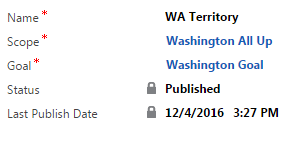
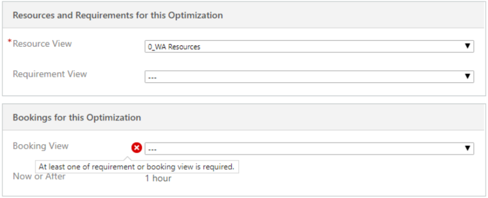
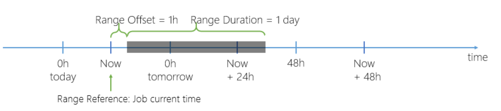
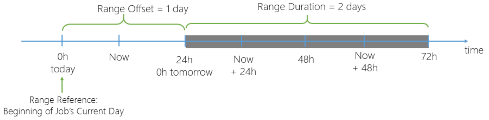
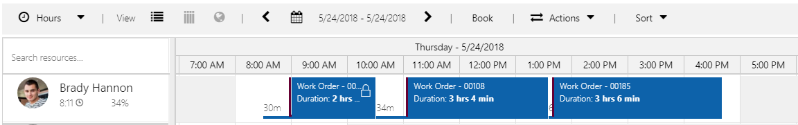
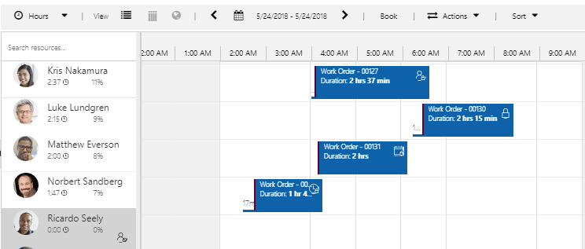
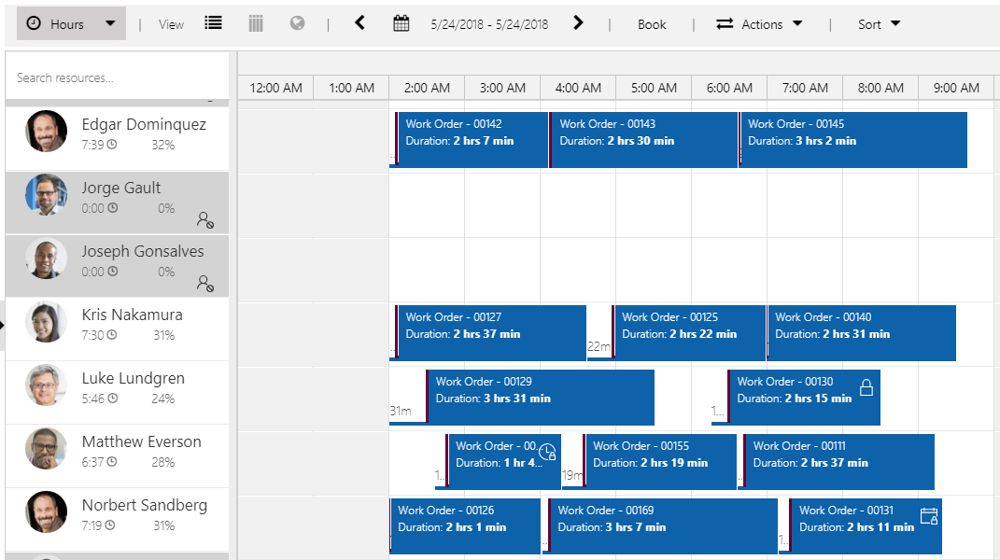

# Resource Scheduling Optimization (RSO) configuration

[!INCLUDE[cc-applies-to-update-9-0-0](../includes/cc_applies_to_update_9_0_0.md)]

Perform these configuration steps after you deploy the RSO solution.

1. Go to **Resource Scheduling Optimization** \> **Administration** \>
    **Resource Scheduling Parameters**.

   - Set **Enable Resource Scheduling Optimization** to **Yes**.

   - Set **Default Goal** if needed. A default goal helps speed up interactions with
     RSO through the schedule board by predefining how the engine optimizes
     data. Users can still pick different goals. 
   > [!div class="mx-imgBorder"]
   > 

   - Set **Connect to Maps** as **Yes**. The connect to maps feature allows this
     organization to interact with the Bing Maps service that the schedule board
     uses.
    > [!div class="mx-imgBorder"]
    > 

     > [!NOTE]
     > Only a user with the system administrator role can enable this setting. 

2. Go to **Settings** \> **Security** \> **Users**, navigate to the
    **Application Users** view, and assign the Field Service - Administrator
    security role to the Resource Scheduling Optimization application user.

3. Go to **Settings** \> **Security** \> **Field Security Profiles**, open
    **Field Service – Administrator**, and add **Resource Scheduling
    Optimization** to the field security profile.

  Steps 2 and 3 help ensure that RSO is able to optimize work order-related requirements and bookings. 
  
  For dispatchers who want to interact with RSO:
   1. Go to **Settings** \> **Security** \> **Users**.
  2. Locate the user or team of dispatchers.
   3. Click **Manage Roles**.
   4. Grant **RSO Dispatcher** a security role.
  5. Click **Save**.
   6. Go to **Settings** \> **Security** \> **Field Security Profiles**.
   7. Open **Resource Scheduling Optimization - Dispatcher** and add the user or
team to the profile and then click **Save**.

## Settings to prepare data for optimization 

The settings described here are selected and applied to all optimization scopes.

1. Update **Optimize Schedule** to **Yes** for resources. Go to
    **Resource Scheduling Optimization** \> **Resources**. Navigate to the
    **Scheduling Summary** view, select one or more resource records, and then
    click **Edit** to bulk edit the **Optimize Schedule** field to **Yes**.

   > [!NOTE]
   > - After you enable your resources for RSO, you need to set the latitude
    and longitude for the resources’ organizational unit or personal address,
    depending on whether their start/end location is an organizational unit or a
    personal address.
   > - Start location and end location must have the same setting. For example,
    you cannot have the start location be a personal address and the end
    location be location agnostic. 
  
2. Configure booking setup metadata for the entity. Set
    **Default Scheduling Method** to **Optimize**. For example, if enabled for
    work order entity’s booking setup metadata, every newly created work order
    and related resource requirement will be configured to optimize
    automatically.
    
    

3. For existing resource requirement records, update the resource
    requirements scheduling Method. Go to **Resource Scheduling
    Optimization** \> **Resource Requirements,** navigate to the **Unscheduled
    Work Order Requirements** view, select some or all records, and click
    **Edit** to bulk edit the **Optimize Schedule** field to **Yes**.

    > [!NOTE]
    > Work location must be set to **On Site** or **Location Agnostic**. If **On Site** is the requirement, you must specify latitude and longitude.  
    
    
4. Check **From Date** and **To Date** for resource requirements to make sure
    the dates fall into the window you would like to schedule. You can use the
    bulk edit feature to update values for selected records as well.

5. Go to **Resource Scheduling Optimization** \> **Settings** \> **Booking
    Statuses** and configure **Scheduling Method** for booking status.
    > [!div class="mx-imgBorder"]
    > 

    > [!NOTE]
    > Any booking status with an empty scheduling method will be treated as Do Not Move.
    
   - **Optimize**: This status means RSO is free to move this booking around. 
   - **Do Not Move**: This means RSO doesn't alter the booking. RSO preserves the estimated arrival time and assigned resource. The booking’s
    start time and estimated travel duration may be changed if RSO schedules a
    booking in a new location before the Do Not Move booking). This operates the
    same as if the user set the booking to **Locked to resource + time** on the
    scheduling lock options field.
   - **Ignore**: RSO will completely ignore this booking. It will ignore for both
    location and time, meaning there will be overlaps. It is as if the booking
    doesn’t exist. Use this when the booking status is in the state of proposed or canceled.

## Create an optimization schedule 

You can define when RSO should optimize requirements and bookings for selected resources, for example, at 1 AM on weekdays. Creating a schedule also includes creating a scope and a goal.
> [!div class="mx-imgBorder"]
> 

Give the schedule a logical name to express which resource requirements and bookable resources will be optimized. If a scope and goal have not been created, you will need to create those for this schedule. 

> [!div class="mx-imgBorder"]
> 

- **Timer**: Defines how often this schedule will run.
- **Timer Mode**: The reference instant when the schedule starts the
    timer (**Fixed** or **After Job Completion**). For example, if a timer is set to 30
    minutes, the first run starts 30 minutes from the publish date/time.
    **Fixed** mode means the optimization runs every 30 minutes. **After Job Completion** mode means the optimization runs 30 minutes from the
    end of the last RSO job execution. **Job** refers to the RSO job.
- **Valid From** and **Valid To**: The first/last date and time when this
    schedule is valid for execution.

Filter is used to set a variety of combinations. For example, the schedule will run at 1 AM and 7 PM every Monday through Friday.

The Filter section of the schedule is an advanced feature. The Filter window allows for a variety of combinations to be selected:

- You can filter by month, numerical day, weekday, hour, and minute, and refer
    to a configured time zone.
- Leaving all filters blank means no filters will be applied.

### How timers work with filters

If you configure your timer and filter as shown here, RSO will run every 30 minutes after the previous job is completed, from 12/3/2016 at 9 AM to 12/4/2018 at 9 AM, except on Saturdays and Sundays.
> [!div class="mx-imgBorder"]
> 
> [!div class="mx-imgBorder"]
> 
> [!div class="mx-imgBorder"]
>

## Define the optimization scope

You can define what RSO optimizes, including resources, requirements, or bookings.

Scope is the RSO mechanism for defining the relevant inputs: resource requirements, resources, and existing resource bookings. It also includes the timeframes to be considered for optimization. Extensible scope leverages Dynamics 365 for Customer Engagement entity views, providing an easy and flexible way to define what to optimize (resource requirements, resources, and existing resource bookings).

> [!IMPORTANT]
> Scopes should be as small as possible. RSO will be quicker and more effective if optimization requests contain few resources, requirements, bookings, and shorter range durations. Usually companies already have partitions that could be used for RSO; for instance: 
> - Temporally defined: optimize technicians who work in the day separately from
    those who work at night.
> - Geographically defined: neighborhoods, cities.
> - Logically defined: support level, incident type.

After opening the **Scheduling Optimization Scope** form, users can select existing system views or personal views (for which they have read permissions) from the Resource, Requirement, and Booking view drop-down menus. If a personal view is selected, it is shared with the Resource Scheduling Optimization application user and other users who have access to the scope.
> [!div class="mx-imgBorder"]
> 
> [!div class="mx-imgBorder"]
> 

1. Using **Resource View** as an example, 0_WA Resources has been defined with
    the filter conditions shown in the following screenshot. This is equivalent
    to configuring WA territory as an optimization scope in the previous version
    of RSO. Users can apply more filter conditions as needed to specify
    resources they need to optimize. RSO will respect the Optimize Scheduling
    setting on individual resource records on top of the resource view filters.
    > [!div class="mx-imgBorder"]
    > 
    > [!div class="mx-imgBorder"]
    > 

2. Select at least one requirement or booking view for what needs to be
    optimized.
    
   > [!div class="mx-imgBorder"]
   > 

3. If you select booking view, you can set it to **Now or After**. For example,
    maybe you want to optimize bookings for the next 5 days, from 2 hours on
    (while excluding bookings within the next 2 hours and bookings in the past).
    The current, out-of-the-box Dynamics 365 for Customer Engagement entity view filter doesn’t support
    this Now or After condition; RSO enabled this additional setting on top of
    whatever filter conditions are defined for that booking view.
    
   > [!div class="mx-imgBorder"]
   > 

4. Optimization Range Settings is the time range where bookings can be created,
    updated, and deleted.

   **Example 1:** You want to have a booking created/moved ahead 24 hours but from 1 hour on; in other words, bookings will be moved into a range starting Now+1hour and ending Now+1hour+1day (which might partly still be today).
  
   > [!div class="mx-imgBorder"]
   > 

   - **Range Reference**: The start moment for all subsequent work order range
     calculation (Job current time or Beginning of the Job’s current day).
   - **Range Offset**: Amount of time added to the range reference to define the
     range start.
   - **Range Duration (days)**: Number of days added to the range reference.
  
     > [!div class="mx-imgBorder"]
     > 

   **Example 2**: You want to have a booking created/moved into the next two days.
  
   > [!div class="mx-imgBorder"]
   > 
   > [!div class="mx-imgBorder"]
   > 

   > [!NOTE]
   > If bookings or resource requirements are defined in the Requirement/Booking view, but the promised date/time windows are outside the optimization range, RSO won't create or update these requirements or bookings after respecting the scheduling window constraint. If the promised date/time windows are overlapping the optimization range, RSO will create/update these requirements/bookings after respecting the scheduling window constraint.

5. You can preview resources, requirements, and bookings for optimization scope
    through the schedule board:

   - Resource filters on the schedule board are prepopulated from the
        Resource View. The resource list matches the number of resources defined
        in the Resource View. RSO will display a lock icon and tooltip to
        indicate if a resource is not enabled for optimization (even though it
        was added into Resource View).
   - Requirements under Eligible for Optimization match the records from the
        Requirement View.
        
     > [!div class="mx-imgBorder"]
     > 

6. You can modify filters on the left panel and save it into scope:

   - If Resource View referred by optimization scope is a system view,
        modified filters through the schedule board will be saved as a new
        personal view.
   - If Resource View referred by optimization scope is a personal view,
        modified filters through the schedule board will be saved back into the
        same personal view.
        
     > [!div class="mx-imgBorder"]
     > 

## Define the optimization goal 

A goal is what the RSO solution aspires to optimize. An example of a goal is to maximize working hours or minimize travel time. You define how bookings should be optimized (constraints and objectives). The Resource Scheduling Optimization engine processes a list of resources and a list of resource requirements, along with existing bookings, to create the optimal route or list of bookings for the resources. Bookings are considered optimally scheduled if they:

- Meet all company constraints.
- Have the highest possible score for the company’s objectives.

### Default optimization goal

When Resource Scheduling Optimization is deployed for the first time, the system automatically creates a default goal with some constraints and objectives enabled. Users can modify as needed or create a new optimization goal and associate it as a default goal.

> [!div class="mx-imgBorder"]
> 

**Engine Effort Level** determines how much effort RSO makes to find the best combination of resources, route, and day or time. The higher the effort, the longer RSO takes to complete the execution. For example, the effort might be very light, light, moderate, intense, or very intense. The higher the intensity, the more iterations of possible combinations the RSO engine considers.

> [!div class="mx-imgBorder"]
> 

The default goal is used when single resource optimization is selected from the schedule board.

> [!div class="mx-imgBorder"]
> 
 

### Define constraints

#### Schedule Within Working Hours
This creates the booking if it can be completed within the resource’s working hours. Verifies the booking is not scheduled out of the resource’s working hours. This includes travel time from the last booking to the resource’s end location, although it’s not visually displayed on the schedule board.
> [!div class="mx-imgBorder"]
> 

#### Meets Required Characteristics
This verifies the resource has all the required characteristics and should have minimum required skill level.

#### Scheduling Lock Option
If marked, this will respect lock options configured on a booking record.
    
#### Matches resource type
RSO will match the resource type between requirements and resources to decide which type of resource can fulfill a requirement. **Available with RSO v2.8+**

Bookable resources include these types:

- Generic *
- Users *
- Contacts *
- Accounts *
- Equipment *
- Facility *
- Crew
- Pool

\* Indicates resource types the optimization will consider

In general, resource types define how the resource relates to the organization. For example, resources with the resource type **Users** are typically employees, whereas the resource type **Contacts** or **Accounts** are typically contractors.

Additionally, requirements allow multi-select so you can specify which resource types you need for a given requirement.

> [!div class="mx-imgBorder"]
> 
    
#### Scheduling Windows 
If marked, RSO will schedule work to comply within the time window start and end fields on the resource requirement or booking record.

- If **From Date** and **To Date** on resource requirement or **Date Window Start** and **Date Window End** on resource booking are set as shown in the following example, it indicates you want RSO to schedule the booking on 5/24/2018 and time of day doesn’t matter.
 > [!div class="mx-imgBorder"]
 > 

- If **Time Window Start** and **Time Window End** are set as shown in the following example, it indicates you want RSO to schedule a booking from 2 AM to 6 AM and the date doesn’t matter.
 > [!div class="mx-imgBorder"]
 > 

- If **Time From Promised** and **Time To Promised** are set as shown in the following example, it indicates you want RSO to schedule a booking between 4 AM and 8 AM on 5/24/2018. It has to be a specific date and specific time range.
 > [!div class="mx-imgBorder"]
 > 
  
> [!NOTE]
> 
> - If these fields are conflicting, RSO uses **Time From Promised** and > **Time To Promised** first. Then it will use one or a combination of other fields.
> - RSO will ensure the **Estimated Arrival Time** falls into the window specified above. It does not guarantee that the booking’s end time will fall within the time window.
  - **Empty time values (v3.0+)** 
  RSO will respect scenarios when only a start or end time is defined on a requirement.
     
  In the following example, a requirement has only a time window start value; RSO schedules the requirement any time after 1:00 PM regardless of date.

  > [!div class="mx-imgBorder"]
  > 

  This logic applies to the following fields. 

  On the Resource Requirement entity: 
        -	Time Window Start/End 
        -	Time From Promised/ Time To Promised 
        -	From Date/ To Date 

  On the Resource Booking entity: 
        -	Time Window Start/End 
        -	Time From Promised/ Time To Promised 
        -	From Date/ To Date 

#### Restricted Resources
If marked, RSO will not schedule a restricted resource to the booking.

### Define objectives

Add and rank the objectives of RSO scheduling by using the **Move Up** and **Move Down** buttons, as seen in the following screenshot.

> [!div class="mx-imgBorder"]
> 

- **Maximize total working hours**: The combination of the engine results
    (iteration) with the total highest aggregate work time will best meet this
    objective.

- **Minimize total travel time**: The version of the engine results
    (iteration) with the total lowest aggregate travel time will best meet this
    objective.

    > [!NOTE]
    > This cannot be the first objective in the list. RSO might not schedule anything with the travel time as 0 minutes in order to meet the first objective.

- **Locked bookings**: Once a booking is created, a lock can be set on the
    scheduling lock options field in the RSO section of the booking. The options
    are Time Range, Resource, Time, and Resource and Time. When the locked
    bookings objective is selected, RSO will try to include locked bookings into
    the optimal route. For example, the following screenshot shows that Norbert
    has a booking that starts at 2:30 AM, and this booking is locked to
    **Time**. When RSO runs, the system detects a 30-minute idle time for
    Norbert in the morning, but none of the other requirement durations fit into
    that slot with the locked booking next to it, even though RSO tries to move
    it to other resources’ time.
    > [!div class="mx-imgBorder"]
    > 

    If locked booking is a high-ranking objective, RSO will keep the locked
        booking there with 30 minutes of idle time before it by sacrificing the
        other objectives. The following screenshot shows the result.
    > [!div class="mx-imgBorder"]
    > 

    If locked booking is not a selected objective or is ranked lower in the
    order of importance for objectives, RSO might ignore this locked booking
    (exclude this locked booking from the optimal route) and schedule other
    bookings for Matthew at 2:30 AM in order to achieve the highest score for
    top-ranking objectives, with the result shown in the following screenshot.
    It looks as if a booking overlaps, but actually the locked booking was
    ignored in this case. RSO would not delete the locked booking because it
    would lose the lock information defined on the booking record, which can’t
    be retrieved from the backing requirement.
    > [!div class="mx-imgBorder"]
    > 

- **High priority requirements**: RSO will evaluate this objective and give
    priority to the resource/booking combination with the highest score for
    priority. The priority is set on the resource requirement record and is an
    option set with weighted values. RSO checks **Level of Importance** on
    priority to determine how important that priority is—for example, set
    **Level of Importance**=10 for urgent priority and set **Level of
    Importance**=1 for low priority and RSO will score 1 urgent requirement the
    same as 10 low-priority requirements because both scores are 10.

- **Maximize Preferred Resources (v3.0+)**:  RSO will consider the list of preferred resources noted on related requirements. The optimizer will try to assign bookings to preferred resources first while meeting other constraints and objectives.

This is achieved by adding the "Maximize Preferred Resources" objective to your RSO goal and adding a preferred resource(s) on the requirement that will be optimized.

> [!div class="mx-imgBorder"]
> 

The following screenshot shows an example of adding a resource to a requirement (for example: Jorge Gault) as a preferred resource.
> [!div class="mx-imgBorder"]
> 

After running an optimization schedule, the requirement is scheduled to the preferred resource. In the following example, work order 00100 is scheduled to Jorge Gault.

> [!div class="mx-imgBorder"]
> 

> [!Note]
> The Maximize Preferred Resources objective only applies to **preferred** resources. 

- **Best Matching Skill Level (v3.0+)**: RSO will consider the proficiency rating when matching characteristics required by requirements and the resources who possess those characteristics. This is dependent on the **Meets Required Characteristic** constraint within the optimization goal.

    If the "Meets Required Characteristics" constraint **is checked**: 
    - Resources without the characteristic (skill) or lower-than-required proficiency ratings are not eligible at all
    - Resources with the exact skill level (best matching) get the highest score
    - The more overqualified a resource is, the lower score their score will be  

    If the "Meets Required Characteristics" constraint **is unchecked**: 
    - Less qualified resources and resources without the skill can still be booked
    - Overqualified resources get a higher score than less qualified resources
    - The more overqualified a resource is, the lower their score will be 
    - The less qualified a resource is, the lower their score will be 
    - Resources without the skill get the lowest score

For example, if a characteristic (skill) rating model ranges from 1 to 10, and the requirement asks for a skill level of 4, the following example shows the score distribution based on skill level of the resource.

> [!div class="mx-imgBorder"]
> 

> [!div class="mx-imgBorder"]
> 
