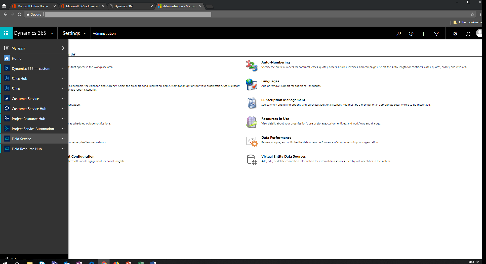
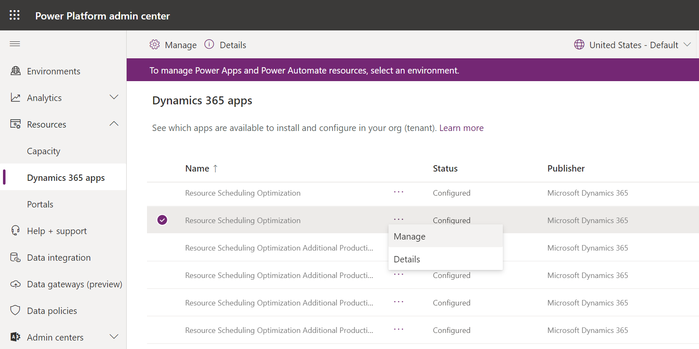
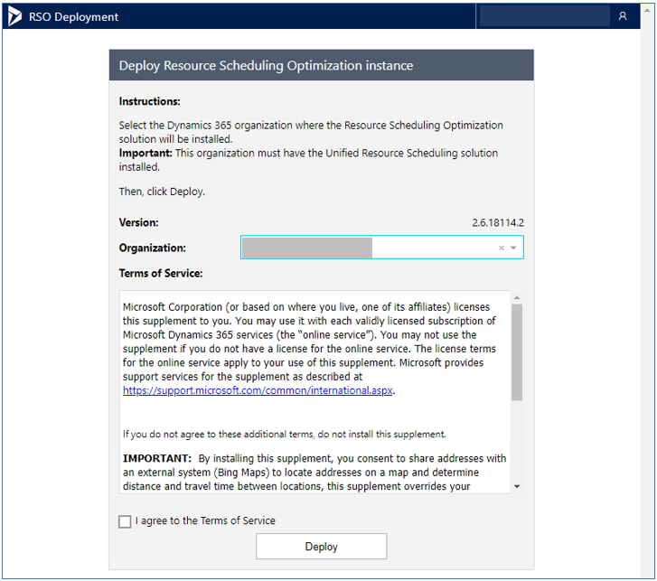
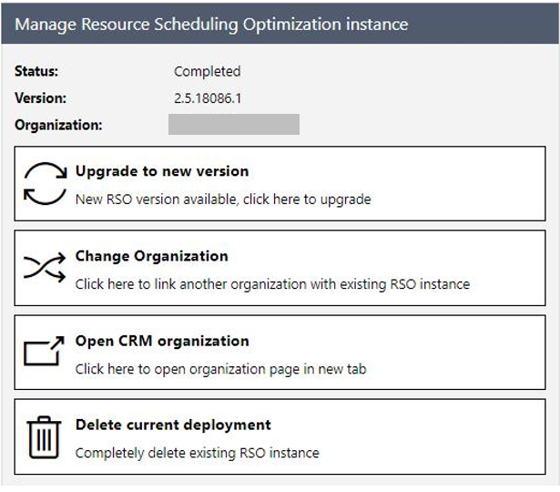

# Deploy resource scheduling optimization for Dynamics 365 Field Service

After [getting access to resource scheduling optimization](./rso-get-install.md) either by purchasing a license or through your local Microsoft representative, you must deploy it to your Dynamics 365 Field Service environment.

## Deployment steps 

1. Verify Field Service is installed in your environment. The Field Service app will appear in the Dynamics 365 main menu when logged in as a system administrator.
> [!div class="mx-imgBorder"]
> 

2. Go to the Power Platform admin center: [https://admin.powerplatform.microsoft.com/](https://admin.powerplatform.microsoft.com/). In the left pane, select **Resources** > **Dynamics 365 apps**. 

3. Find resource scheduling optimization and select **Manage**.

> [!div class="mx-imgBorder"]
> 

4. Select the organization where the resource scheduling optimization solution will be installed, review the Terms of Service and select the agreement box, and then select **Deploy** to start the resource scheduling optimization deployment.

    > [!div class="mx-imgBorder"]
    > 
    
Resource scheduling optimization is associated with a single Dynamics 365 organization in the tenant. You can change the associated organization through the resource scheduling optimization deployment app’s page. If additional resource scheduling optimization instances are needed for development and testing environments and you have an Enterprise Agreement with Microsoft, contact your technical account manager. Such instances are not yet available to Cloud Solution Providers or retail purchase.

5. Select **Upgrade to new version** to apply a new update if one is available.

6. Use **Change Organization** to change the resource scheduling optimization deployment from a Dynamics 365 organization to another. This action will not delete data inside of the original Dynamics 365 organization and you can always change it back.

7. Use **Delete current deployment** to delete resource scheduling optimization Azure resources. The resource scheduling optimization solution will remain, which will not impact anything inside of the Dynamics 365 organization.

    > [!div class="mx-imgBorder"]
    > 

## Privacy notice  
[!INCLUDE[cc_privacy_rso_location_info_bing_maps](../includes/cc-privacy-rso-location-info-bing-maps.md)]

[!INCLUDE[footer-include](../includes/footer-banner.md)]