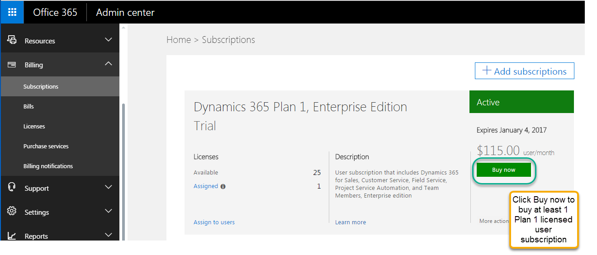
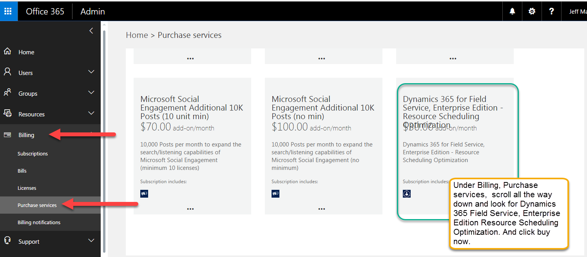
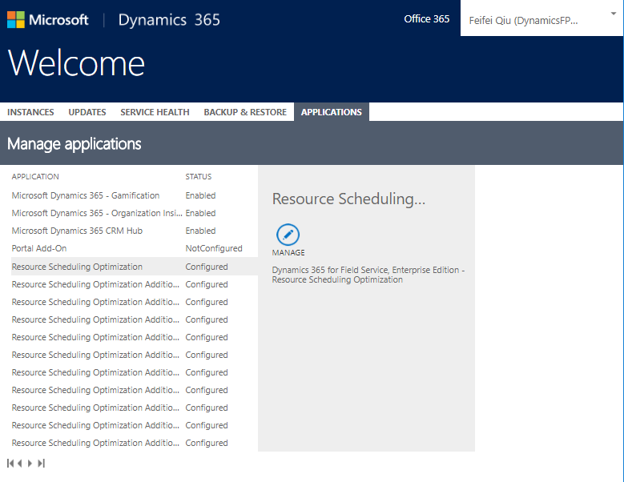
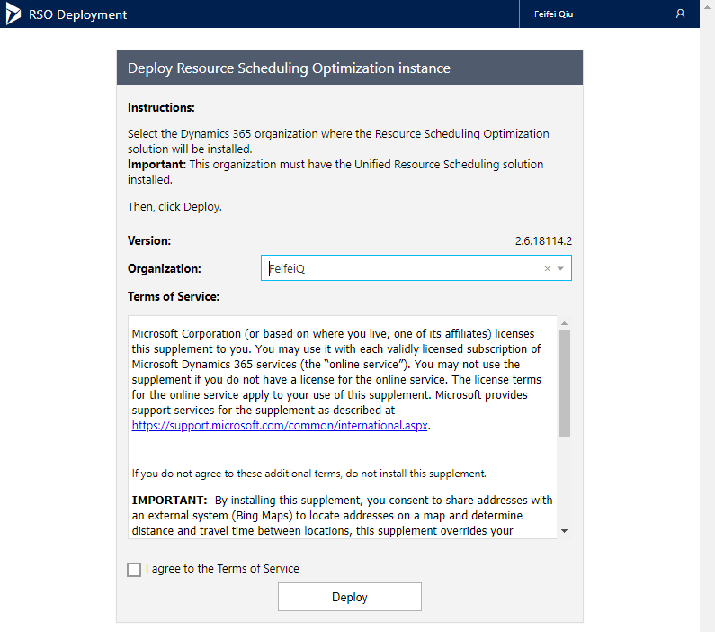
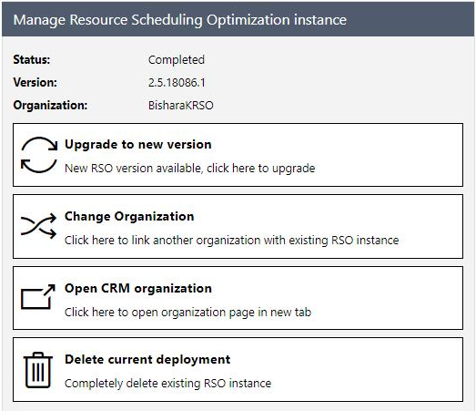

---

title: Deployment
author: shellyhaverkamp
manager: shellyha
ms.date: 06/08/2018
ms.topic: article
ms.custom:
  - dyn365-fieldservice
ms.service: dynamics-365-customerservice
ms.author: shellyha

---

Deployment 
===========

Prerequisites 
--------------

To deploy Resource Scheduling Optimization, you must first do the following:

- Purchase Plan 1 for Dynamics 365 and RSO licenses. RSO does not work on earlier versions of Dynamics 365 Online.

  > [!NOTE]
  > At the time of publication, a paid Plan 1 subscription is required for purchasing and enabling RSO. 

- Install Dynamics 365 for Field Service.

    > [!div class="mx-imgBorder"]
    > 

-  Under Purchase Services, find Resource Scheduling Optimization. After buying
    at least one Plan 1 user subscription, add RSO, which you will find under
    **Billing** \> **Purchase services**. Scroll down to find Dynamics 365 for
    Field Service, Enterprise Edition – Resource Scheduling Optimization. The price of RSO is based on schedulable resources.

    > [!div class="mx-imgBorder"]
    > 

    The RSO instance is associated with a single Dynamics 365 organization in
    the tenant. You can change the associated organization through the RSO
    deployment app’s page. If additional RSO instances are needed for dev/test,
    contact your technical account manager.

Deployment steps 
-----------------

> [!NOTE]
> **Do not** install the Resource Scheduling Optimization solution from the solution page. Follow the next steps using the RSO deployment app to deploy.

1. Go to the Dynamics 365 admin center and select the **APPLICATIONS** tab.

2. Select the **Resource Scheduling Optimization** application to configure or
    manage.

    > [!div class="mx-imgBorder"]
    > 

3. Select the organization where the RSO solution will be installed, review the
    Terms of Service and select the agreement box, and then select **Deploy** to
    start the RSO deployment.

    > [!div class="mx-imgBorder"]
    > 

4. Click **Upgrade to new version** to apply a new update if one is available.

5. Use **Change Organization** to change the RSO deployment from a Dynamics 365
    organization to another. This will not delete anything inside of the
    original Dynamics 365 organization.

6. Use **Delete current deployment** to delete RSO Azure resources. The RSO
    solution will remain, which will not impact anything inside of the Dynamics
    365 organization.

    
