# FAQ and troubleshooting tips for resource scheduling optimization in Dynamics 365 Field Service

## Why doesn’t resource scheduling optimization on Org B work anymore after I copied Dynamics 365 Org A to Org B (with resource scheduling optimization deployed)? 

Resource scheduling optimization Endpoint, which is used for connecting Dynamics 365 org and resource scheduling optimization Azure resources on Org B, will be broken after copying an org or rest org. The recommended approach is to delete the current resource scheduling optimization deployment (this will not delete anything inside of the Dynamics 365 Org), copy and reset the org, and then redeploy resource scheduling optimization to target the Dynamics 365 org as needed.

## My resource scheduling optimization deployment takes a long time and won’t finish. What should I do?

If your resource scheduling optimization deployment won’t complete (it neither fails nor succeeds), you will need to contact the Microsoft Support team.

## My resource scheduling optimization deployment or upgrade failed. What should I do?

If you’re able to see the **Delete Current Deployment** option through the resource scheduling optimization deployment app, you can try to delete the existing deployment first (this will not delete anything inside of the Dynamics 365 org) and then try to redeploy the latest version. If it fails again, check the admin settings. If the settings are correct but it still fails, contact the Microsoft Support team.

- Make sure your Dynamics 365 org is NOT in administration mode.

  > [!div class="mx-imgBorder"]
  > 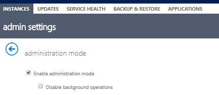

- Check to see that the resource scheduling optimization add-on user has the resource scheduling optimization security role.

## Installing the resource scheduling optimization solution failed through the Dynamics 365 admin center solution management page. What are my options?

Don’t install the resource scheduling optimization solution from the solution management page. Use the resource scheduling optimization deployment app to deploy resource scheduling optimization. This includes both the Dynamics 365 side solution as well as Azure resources. 

## Can I modify the out-of-box resource scheduling optimization security role?

Modifying the out-of-box resource scheduling optimization security role can cause issues such as resource scheduling optimization upgrade failure, resource scheduling optimization job not pulling requirements/bookings as expected, and more. We don’t recommend modifying the out-of-box security role directly. Instead, copy it as a new role and customize as needed.

## How do I cancel a long-running schedule or blocked schedule?

If your schedule has been running for a long time and seems stuck or blocked, use the **Reset Resource Scheduling Optimization** button to clear the blocked job and reset the schedules into a good state.

## I’m seeing the message “SAS Key has not been configured” when I publish a schedule. Is this ok?

This means the resource scheduling optimization Azure resources are not set up correctly. We recommend going to the resource scheduling optimization deployment app to check the resource scheduling optimization deployment status. Redeploy as needed to fix the issue.

> [!div class="mx-imgBorder"]
> 

## An optimization request failed and gave the message “Object reference not set to an instance of an object.” What does that mean? 

This typically means a custom plug-in ran into an unhandled null value. This can occur because of a custom plug-in that is triggered synchronously on the creation of a booking, the update of a work order, or other booking-related record, or one of the other records that could be impacted when the results are returned by an optimization run. System customizers can leverage the plug-in trace log capability to identify which plug-in is failing. Warning: don’t forget to disable plug-in trace logging as soon as debugging is over to avoid overloading the organization’s database.

## An optimization request failed with the message “System failed to modify some bookings.” How should I handle this?

Sometimes you see this message for the following scenarios:

- If you manually update the same bookings in the middle of a resource scheduling optimization run, resource scheduling optimization
    will not overwrite the changes and will fail the request.
- If you have a workflow/plug-in updating the same bookings during a resource scheduling optimization run,
    resource scheduling optimization will not overwrite the changes your other system logic did and will fail
    the request.
- If you have multiple resource scheduling optimization schedules that share the same resources and run at
    the same time, resource scheduling optimization might show this message. To better understand the
    situation and further troubleshoot, check the following:
    - Scroll through the optimization request booking grid and inspect the
        operation details column for each individual requirement and booking.
    - Do you have multiple schedules that share the same resources,
        requirements, and bookings running at the same time?  
    - If you have only one schedule, is there any other user or workflow
        trying to update a booking during the run?

## An optimization request failed with the message “The start time of a time window must be less than or equal to the end time.” What should I do?

This indicates some invalid booking data got included in the optimization scope—the following is an example. The user can query a booking entity to see if any booking record has an invalid estimated travel duration. These are the expressions you can specify for the view:

- *Estimated travel duration \> Booking.EndTime - Booking.StartTime*
- *Estimated travel duration \> Booking.Duration*

## Why aren’t my resources getting any bookings assigned? 

There are various reasons for this. First, review the optimization results from the schedule board and corresponding optimization request \> resource view to look for reasons why bookings are not being scheduled. Here are more details to analyze:

- Territories:
  - Do your resources have related resource territories that match
        requirement territories?
- Resource attributes:
  - Is the **Optimize Schedule** field set to **Yes**?
  - Do your resources have a start and end location set?
  - Do their locations have geocodes?
    - Organizational Unit Address’ geocode is held in the related
            Organizational Unit.
    - Resource Address’ geocode is held on the related resource’s user/contact/etc.
- Characteristics:
  - Do your resources have any of the required characteristics and required
        skill levels?
- Work hours:
    - Are work hours configured and available during the optimization range?
      - If they are unconfigured, they could still be scheduled.
      - They might be set to not work on the days being optimized per the
            resource scheduling optimization run scope.
    - Do they have any time off requests created or approved for the period of
        time that is being optimized?
- Resource preferences:
    - While unlikely, would resource preferences exclude them from
        consideration from all of their possible work orders and resource
        requirements?
- Status:
    - Is the resource’s status **Active**?

## Why aren’t my work orders/requirements being scheduled?

There are various reasons why requirements might not get booked. First, review
the optimization results from the schedule board and corresponding optimization
request \> Booking view to look for reasons why they’re not being scheduled.
Here are more details to analyze:

- A quick validation for this is to select one of the resource requirements
    that won’t schedule and use the Schedule Assistant to see if it finds
    results.
  - While the schedule assistant and the resource scheduling optimization are not exactly the same, they
        evaluate based on similar criteria and if the Schedule Assistant finds
        results, resource scheduling optimization generally will, too.

    > [!NOTE]
    > There are some scenarios where the Schedule Assistant may find
        results and the resource scheduling optimization won’t.
      > - If your resources found as potential matches do not have **Optimize
            Schedule** set to **Yes** (meaning resource scheduling optimization would not consider them).
      > - If your date windows on the requirement are outside of the scope of
            your resource scheduling optimization run.
      > - If your territory for the requirement doesn’t match the resources’
            territory.
            
- Scheduling method:
  - Is the requirement’s **Scheduling Method** set to **Optimize**?

    > [!NOTE]
    > This field is set to **Do Not Optimize** by default. You
        either need to set it manually or configure Optimize on work order
        metadata setup.

- Territories:
  - The resource scheduling optimization scope doesn’t necessarily depend on territory, but the resource scheduling optimization run
        still does a territory match between requirement and resource:
    - If a requirement is assigned to a territory, then the resource must
            also be assigned to that territory for the requirement to be
            scheduled.
    - If a requirement is not assigned to a territory, then only resources
            that don’t belong to any territory are eligible for that
            requirement.
- Characteristics:
  - Does your requirement require a characteristic that any of your
        resources have?
    - Do those resources have available working hours that are part of the
            scope of the run?
    - Based on those resources, are there other jobs that were/should be
            scheduled first based on the goals of your run?
- Restricted resources:
  - Is the requirement excluded from being assigned to a resource because
        that resource is marked as restricted? This is only applicable if the
        **Restricted Resources** constraint is enabled.
- Date/time parameters:
  - Does your requirement have a **From Date** and **To Date** window that
        falls inside the scope of the optimization run’s scope?
  - Does your requirement have a **Time From Promise** and **Time to
        Promised** window that falls inside of the scope?
  - Do any of your date fields create an impossible scenario? For example:
    - Your **From Date** is after your **Time to Promised**.
    - Your **To Date** is before your **Time From Promised**.
- Capacity:
  - Is there sufficient capacity to pick up all of the work in your scope?
    - If not, is there a valid reason that this requirement might not have
            been selected based on your goals over other possible requirements?
  - Is there sufficient capacity based on the required characteristics and
        resource preferences within the scope of the run (with all other
        contributing factors)?
- Geolocation:
  - If the **Work Location** for the requirement is set to **Onsite**, the
        resource requirement needs to have a valid latitude and longitude. Also,
        does the resource have time to get to and from the job?
- Duration:
  - Does the resource requirement have a duration greater than 0? Does
        fulfilled duration = 0?
  - Does the requirement have a duration that would fit within a resource’s
        shift? Resource scheduling optimization does not currently support splitting a requirement into
        multiple bookings.
- Status:
  - Is the **Status** of the resource requirement set to **Active**?
- Related bookings:
  - Does this requirement already have a related booking record? If so, does
        the related booking record have a related booking status with a
        **Scheduling Method** field with a value other than **Ignore**?
- A schedule that might cause the requirement to impact/lower the score of
    optimization objectives.
- Optimization engine effort level: Larger optimization requests might require
    more time to optimize. Consider increasing the engine’s effort level to give
    it more time to find a suitable assignment.

## Why are my completed, canceled, or other bookings being optimized when they shouldn’t be moved?

Booking Status has a **Scheduling Method** field that dictates how resource scheduling optimization should consider booking records of that status:

- If Booking Status is set to **Optimize**, resource scheduling optimization will move those bookings
    around.
- If Booking Status is set to **Do Not Move**, resource scheduling optimization will not move or optimize
    those bookings.
- If Booking Status is set to **Ignore**, resource scheduling optimization will not consider that booking
    record; it will be as if the booking record doesn’t exist.

  > [!NOTE]
  > Typical setup would dictate:
    > - Booking statuses that mean the visit is complete or in some stage of
        progress should be set to **Do Not Move**.
    > - Booking statuses that mean the visit is canceled should be set to
        **Ignore**.
    > - Booking statuses that mean the visit is scheduled or any other status
        where you want resource scheduling optimization to consider moving the work around should be set to
        **Optimize**.

## Why are some of my past bookings being removed?

A booking from the past might be moved if its booking status indicated that it should be optimized and if this booking is included in the optimization scope’s booking view. Because of this, it might appear (especially in a testing scenario where no one is actually completing work) that all of the bookings from the past are being rescheduled if no one changed the booking to a booking status that would keep the record from being moved. Here are a few ways you can block resource scheduling optimization from moving past bookings:

- Pick a booking status of **Do Not Move**.
- Remove the booking from the booking view.
- Lock the booking to a time or time range in the past.
- Set a promised date from/to or date from/to while enabling the time window
    constraint.

## What happens if I remove the "Schedule within Working Hours" constraint?
When you remove this constraint, resource scheduling optimization will still respect working hours and create bookings within the resource's working hours but _can_ schedule **travel** outside of working hours. It might not leave time at the end of the day to travel to the resource's end location. All bookings will end within a resource's working hours. 

## Why are some of my past or future bookings that are outside of the optimization start and end range being removed?

With extensible scope, optimization range settings (Range Reference, Range Offset, Range Duration (days)) are the time range where bookings can be created, updated, or deleted. It has nothing to do with the scope of bookings. Here are some scenarios:

- Optimization Booking View and Optimization Range Settings configured as in
    the following screenshot. There are five bookings (A, B, C, D, E) included
    in the **Scheduling Summary – Scheduled by RSO-WA** booking view when they
    are being scheduled, with this configuration:
  - All five bookings will possibly be moved into the optimization range start/end area if there is enough capacity.
  - If a booking locked to **Time Range** overlaps with the optimization range, the booking will be moved. If the locked time range is outside of the optimization range, the booking will be ignored.

    > [!div class="mx-imgBorder"]
    > 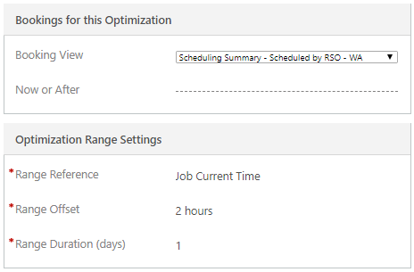

    > [!div class="mx-imgBorder"]
    > 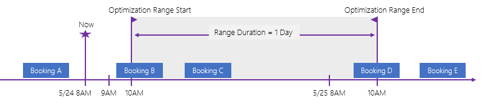

- If you add **Now or After** = 1 hour and other settings remain the same,
    there are still five bookings (A, B, C, D, E) included in the **Scheduling
    Summary – Scheduled by RSO-WA** booking view when they are being scheduled,
    with this configuration:
  - Only three bookings (C, D, E) will be possibly moved into the
        optimization range start/end area if there is enough capacity.
  - Booking A is in the past before **Now or After** will be excluded from
        the scope.
  - Booking B is overlapping with the **Now or After** line and will be considered as virtually locked.
  - For a booking locked to **Time Range**, if a locked time range overlaps with the optimization range, the booking will be moved. If the locked time range is outside of the optimization range, the booking will be ignored.

    > [!div class="mx-imgBorder"]
    > 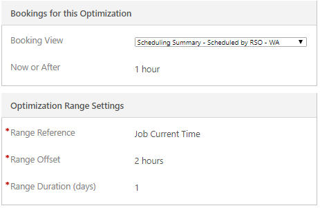

    > [!div class="mx-imgBorder"]
    > 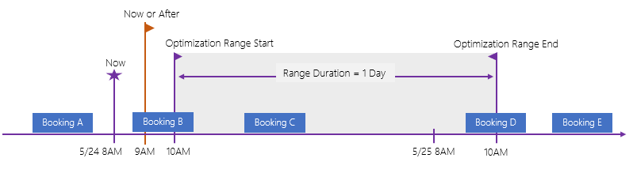

- If you add **Now or After** = 4 hours and the other settings remain the
    same, there are still five bookings (A, B, C, D, E) included in the
    **Scheduling Summary – Scheduled by RSO-WA** booking view when they are
    being scheduled, with this configuration:
  - Only two bookings (D, E) will possibly be moved into the optimization
        range start/end area if there is enough capacity.
  - Bookings A and B are in the past before **Now or After** will be
        excluded from the scope.
  - Booking C is overlapping with the **Now or After** line and will be considered as locked.
  - For a booking locked to **Time Range**, if a locked time range overlaps with the optimization range, the booking will be moved. If the locked time range is outside of the optimization range, the booking will be ignored.

    > [!div class="mx-imgBorder"]
    > 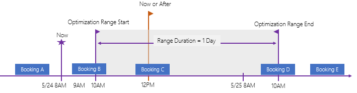

- If you add **Now or After** = 27 hours and the other settings remain the
    same, there are still five bookings (A, B, C, D, E) included in the
    **Scheduling Summary – Scheduled by RSO-WA** booking view when they are
    being scheduled, with this configuration:
  - Only one booking (E) will possibly be moved into the optimization range
        start/end area if there is enough capacity.
  - Bookings A, B, C, and D are in the past before **Now or After** will be excluded from the scope.
  - For a booking locked to **Time Range**, if the locked time range overlaps with the optimization range, the booking will be moved. If the locked time range is outside of the optimization range, the booking will be ignored.

    > [!div class="mx-imgBorder"]
    > 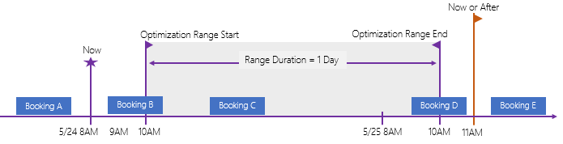

## Why are so many bookings in simulation status? 

If any exception or error happens when an optimization schedule is still running, you might see some overlap on the schedule board because some bookings are created or updated from the latest run while other bookings from the previous run failed to be deleted due to an exception. To avoid this, we are making the optimization process atomic and transactional by introducing a **Simulation** status. During the optimization process, the create, update, and deleted operations are now visible. All new, updated, and to-be-deleted bookings are in a **Simulation** staging area. If the whole optimization request is completed and correct, these simulation bookings will be flipped into real bookings. Before the optimization request completes, you can see some simulation status (transparent) bookings move around the schedule board until the run is complete. Then all simulation bookings will be flipped into real bookings (solid blue). If an exception occurs and the optimization request fails, these simulation bookings will remain in simulation status for troubleshooting purposes unless you manually delete them. Otherwise, a system job will delete them automatically every two weeks.

> [!NOTE]
> You can hide simulation bookings by changing the schedule board settings. Select the gear icon on the top right and select the **Hide Canceled** option. 

> [!div class="mx-imgBorder"]
> 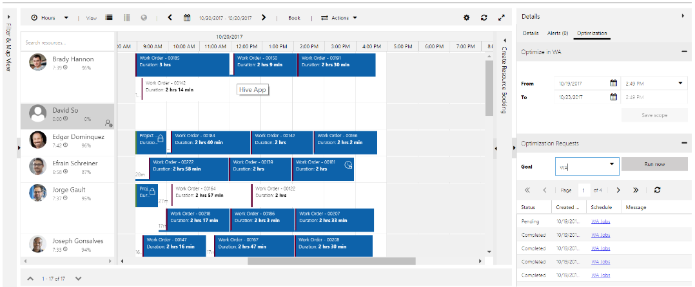

## Why is resource scheduling optimization scheduling bookings that overlap with resource break times? 

Right now, resource scheduling optimization can’t split travel time from the booking from a visual perspective. It looks like resource scheduling optimization is scheduling bookings that overlap break time, but actually they are not because resource scheduling optimization can’t split travel time from its working duration tile from the schedule board visualized view perspective. What you see on the schedule board may look like this:

> [!div class="mx-imgBorder"]
> 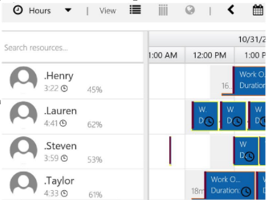

Ideally, it should look like this:

> [!div class="mx-imgBorder"]
> 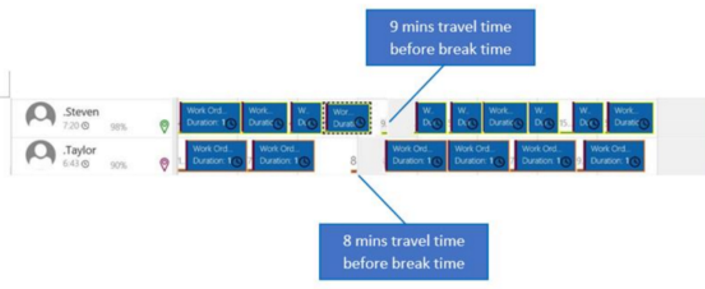

## Why am I seeing the error message "User lacks privileges"?

If you experience an optimization job failure with the error message "Related failed to update bookings," go to the bookings tab and search for failed bookings. There is a more detailed error message: "User lacks privileges."

To fix this issue, make your resource scheduling optimization user has the correct security roles and field security profiles: 

Security roles:

- Resource Scheduling Optimization

Field security:

- Resource Scheduling Optimization - Administrator
- Resource Scheduling Optimization - Dispatcher 

### How to copy security user roles

Sign into the environment as administrator.

Go to **Settings** > **Security** > **Users** > **Application Users** view.

> [!div class="mx-imgBorder"]
> 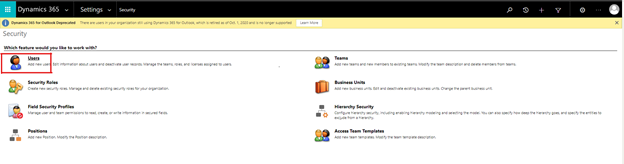

Find the user named "Resource Scheduling Optimization." This user is created when resource scheduling optimization is deployed. 

You can also use advanced find to create a query to find users that have first name containing "Resource Scheduling." 

Edit columns to include created date to easily decipher when the resource scheduling optimization user was created. 

> [!div class="mx-imgBorder"]
> 

> [!div class="mx-imgBorder"]
> 

Go to the newly created user view and make sure both resource scheduling optimization users have the same roles including "Resource Scheduling Optimization".

> [!div class="mx-imgBorder"]
> 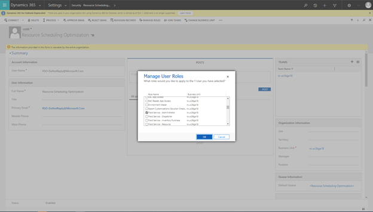

### How to copy field security profiles

Sign into the environment as an administrator.

Go to **Settings** > **Security** > **Field Security Profiles** view.

> [!div class="mx-imgBorder"]
> 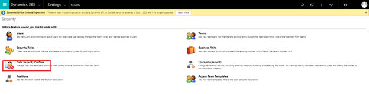

> [!div class="mx-imgBorder"]
> 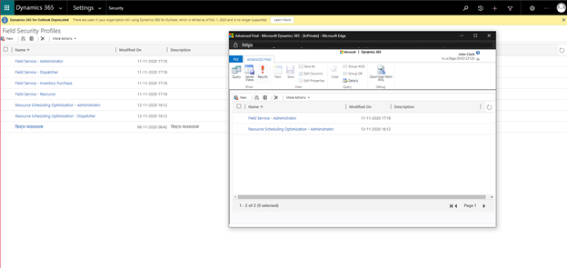

Find the user named "Resource Scheduling Optimization." This user is created when resource scheduling optimization is deployed. Use advanced find field security profiles that have users with the first name containing "Resource Scheduling."

> [!div class="mx-imgBorder"]
> 
> 
> [!div class="mx-imgBorder"]
> 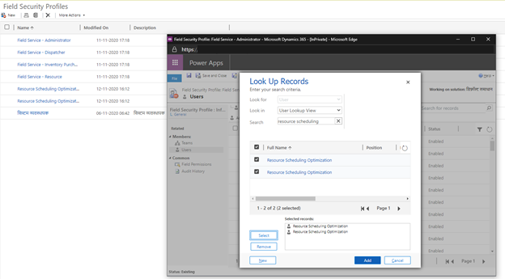

Add resource scheduling optimization users to the "Resource Scheduling Optimization - Administrator" and "Resource Scheduling Optimization-Dispatcher" field security profiles.
 
Ensure field security profiles have consistent permissions when comparing the old and new app users.

[!INCLUDE[footer-include](../includes/footer-banner.md)]
