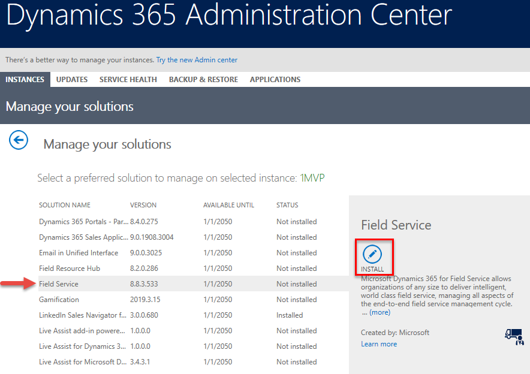

# Get Resource Scheduling Optimization

To purchase access to Resource Scheduling Optimization, you need access to Field Service. If a product bundle your organization owns includes the Field Service license, you don't have to repurchase it. With Field Service already installed, you can skip the first three steps.

1. Purchase Field Service. Go to the **Microsoft 365 Admin Center** > **Billing > Purchase Services**.

1. Find and buy whichever Field Service license works best for you and your organization. Visit the [Field Service pricing page](https://dynamics.microsoft.com/pricing/#Service) for more information. And for even more details, visit the [Dynamics 365 Licensing Guide (PDF)](https://go.microsoft.com/fwlink/?LinkId=866544).

1. After purchasing, install Dynamics 365 Field Service.

   - Go to **Admin Centers** > **Dynamics 365** > **Instances**.
   - Select your instance and choose **Solutions**.
   - Select Field Service and choose **Install**.

> [!div class="mx-imgBorder"]
> 

1. Purchase Resource Scheduling Optimization. Go to the **Microsoft 365 Admin Center** > **Billing** > **Purchase services**. The price of Resource Scheduling Optimization is based on the number of resources whose schedules are optimized.

> [!NOTE]
> Resource Scheduling Optimization is licensed per resource.The add-in license allows for unlimited use of schedule optimization, whether on a regular cadence or ad-hoc.

## Next steps

After purchasing Resource Scheduling Optimization, follow the [Resource Scheduling Optimization deployment steps](rso-deployment.md).
Resource Scheduling Optimization isn't visible from the main product catalog. It can be found only on the Field Service product details page, via the **Add On** tab.

[!INCLUDE[footer-include](../includes/footer-banner.md)]
