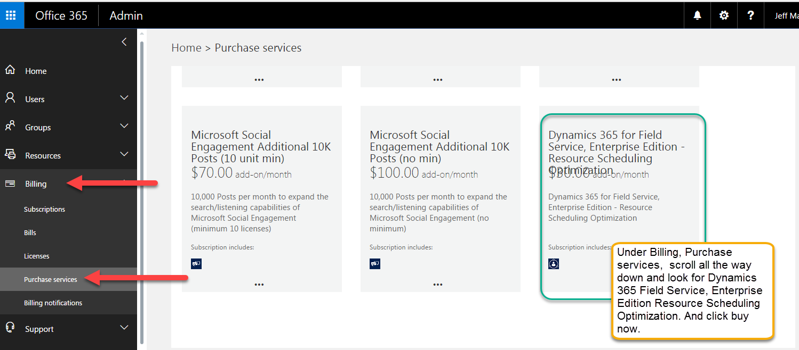

## Get Resource Scheduling Optimization (RSO)

There are two ways to get Resource Scheduling Optimization:

- Buy an RSO license
- Request a trial from your local Microsoft representative

## Option 1: Buy RSO

You can get access to RSO by buying an RSO license in addition to purchasing a Field Service or Dynamics 365 Customer Engagement Plan license. 

First, purchase a Dynamics 365 Field Service  Purchase Plan 1 for Dynamics 365 and RSO licenses. RSO does not work on earlier versions of Dynamics 365 Online.

  > [!NOTE]
  > A paid Plan 1 or Dynamics 365 Field Service subscription is required for purchasing and enabling RSO. 

- Install Dynamics 365 Field Service.

    > [!div class="mx-imgBorder"]
    > 

-  Under Purchase Services, find Resource Scheduling Optimization. After buying
    at least one Plan 1 user subscription, add RSO, which you will find under
    **Billing** \> **Purchase services**. Scroll down to find Dynamics 365 Field Service, Enterprise Edition – Resource Scheduling Optimization. The price of RSO is based on schedulable resources.

    > [!div class="mx-imgBorder"]
    > 

    The RSO instance is associated with a single Dynamics 365 organization in
    the tenant. You can change the associated organization through the RSO
    deployment app’s page. If additional RSO instances are needed for dev/test and you have an
    Enterprise Agreement with Microsoft, contact your technical account manager. Such instances are
    not yet available to Cloud Solution Providers or retail purchase.

## Option 2: Request trial

Request a trial environment from your local Microsoft representative. 

## Next steps

After getting access to RSO, follow the [RSO deployment steps](./rso-deployment.md). 