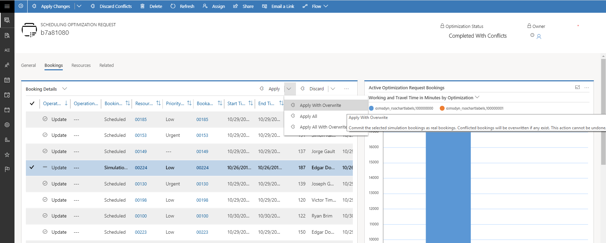
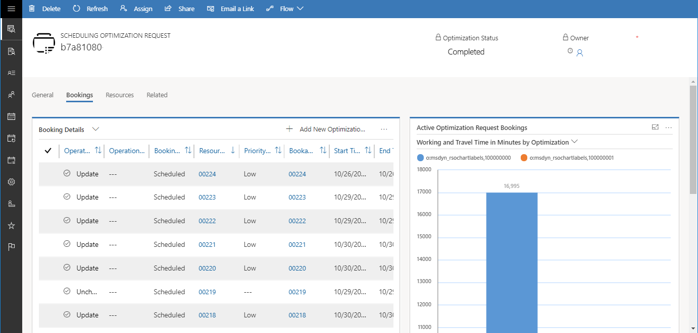

# Resolve booking conflicts in Resource Scheduling Optimization

Booking conflicts happen when a related resource, requirement, or booking is edited by a dispatcher or field technician during an optimization run. Resource Scheduling Optimization provides a way to understand these conflicts and resolve them.

In conflict scenarios, the optimization request will have the status **Completed with Conflicts**.

Within the optimization request booking view, you can see the conflicted bookings that were edited during optimization. These bookings will have a booking status of **Simulation**, along with a conflicted icon.

The **Operation Details** column shows additional details, like the specific data modified during optimization.

> [!div class="mx-imgBorder"]
> 

To resolve the issue, select one or more conflicted bookings (with a Simulation status), and choose either:

- **Apply with Overwrite**: commit the simulation booking, favoring optimization results
- **Discard**: remove simulation booking, favoring the manual booking edits from the dispatcher or field technician

> [!div class="mx-imgBorder"]
> 

After selecting **Apply with Overwrite** or **Discard**, the optimization status changes to **Completed**, and the conflict is resolved.

> [!div class="mx-imgBorder"]
> 

[!INCLUDE[footer-include](../includes/footer-banner.md)]
