# Define the optimization goal 

A goal is what the RSO solution aspires to optimize. An example of a goal is to maximize working hours or minimize travel time. You define how bookings should be optimized (constraints and objectives). The Resource Scheduling Optimization engine processes a list of resources and a list of resource requirements, along with existing bookings, to create the optimal route or list of bookings for the resources. Bookings are considered optimally scheduled if they:

- Meet all company constraints.
- Have the highest possible score for the company’s objectives.

## Default optimization goal

When Resource Scheduling Optimization is deployed for the first time, the system automatically creates a default goal with some constraints and objectives enabled. Users can modify as needed or create a new optimization goal and associate it as a default goal.

> [!div class="mx-imgBorder"]
> 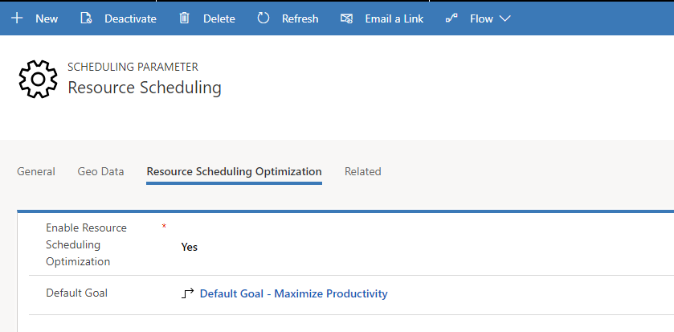

**Engine Effort Level** determines how much effort RSO makes to find the best combination of resources, route, and day or time. The higher the effort, the longer RSO takes to complete the execution. For example, the effort might be very light, light, moderate, intense, or very intense. The higher the intensity, the more iterations of possible combinations the RSO engine considers.

> [!div class="mx-imgBorder"]
> 

The default goal is used when single resource optimization is selected from the schedule board.

> [!div class="mx-imgBorder"]
> 
 

## Define constraints

### Schedule Within Working Hours
This creates the booking if it can be completed within the resource’s working hours. Verifies the booking is not scheduled out of the resource’s working hours. This includes travel time from the last booking to the resource’s end location, although it’s not visually displayed on the schedule board.
> [!div class="mx-imgBorder"]
> 

### Meets Required Characteristics
This verifies the resource has all the required characteristics and should have minimum required skill level.

### Meets Required Roles

ENTER INFORMATION HERE

### Scheduling Lock Option
If marked, this will respect lock options configured on a Bookable Resource Booking record.
- Time Range
- Resource
- Time
- Resource + Time

> [!div class="mx-imgBorder"]
> 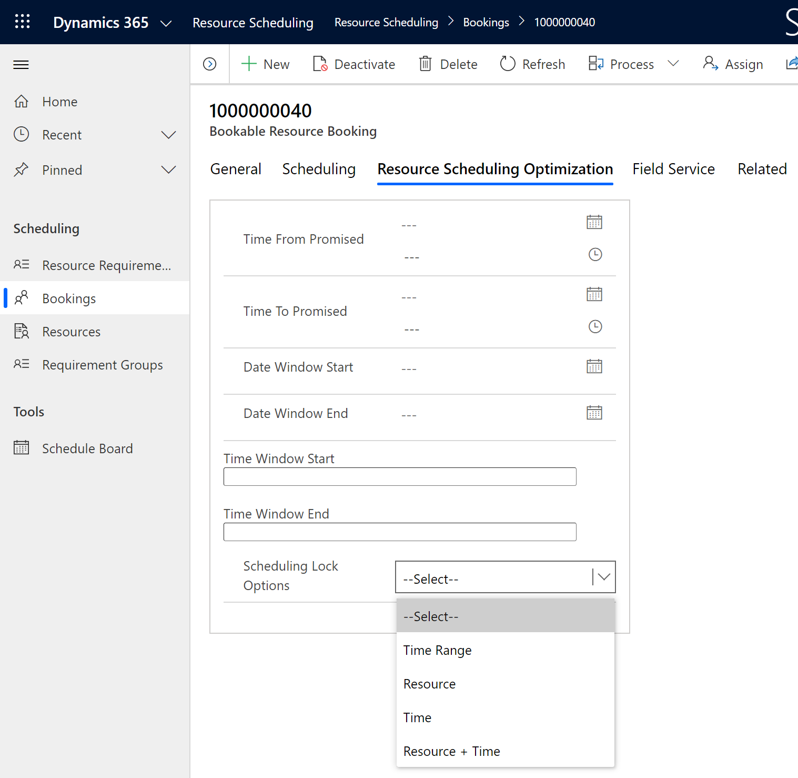

### Scheduling Windows 
If marked, RSO will schedule work to comply within the time window start and end fields on the resource requirement or booking record.

- If **From Date** and **To Date** on resource requirement or **Date Window Start** and **Date Window End** on resource booking are set as shown in the following example, it indicates you want RSO to schedule the booking on 5/24/2018 and time of day doesn’t matter.
 > [!div class="mx-imgBorder"]
 > 

- If **Time Window Start** and **Time Window End** are set as shown in the following example, it indicates you want RSO to schedule a booking from 2 AM to 6 AM and the date doesn’t matter.
 > [!div class="mx-imgBorder"]
 > 

- If **Time From Promised** and **Time To Promised** are set as shown in the following example, it indicates you want RSO to schedule a booking between 4 AM and 8 AM on 5/24/2018. It has to be a specific date and specific time range.
 > [!div class="mx-imgBorder"]
 > 
  
> [!NOTE]
> 
> - If these fields are conflicting, RSO uses **Time From Promised** and > **Time To Promised** first. Then it will use one or a combination of other fields.
> - RSO will ensure the **Estimated Arrival Time** falls into the window specified above. It does not guarantee that the booking’s end time will fall within the time window.
  - **Empty time values (v3.0+)** 
  RSO will respect scenarios when only a start or end time is defined on a requirement.
     
  In the following example, a requirement has only a time window start value; RSO schedules the requirement any time after 1:00 PM regardless of date.

  > [!div class="mx-imgBorder"]
  > 

  This logic applies to the following fields. 

  On the Resource Requirement entity: 
        -	Time Window Start/End 
        -	Time From Promised/ Time To Promised 
        -	From Date/ To Date 

  On the Resource Booking entity: 
        -	Time Window Start/End 
        -	Time From Promised/ Time To Promised 
        -	From Date/ To Date 
    

    

### Meets Resource Preferences

Formerly called "Restricted Resources" constraint, the constraint was expanded to include all Resource Preferences on requirements as of **RSO v3.0.19263.1**.

If marked, RSO will respect the three different types of resource preferences on a requirement:

- **Preferred** - RSO will give scheduling preference to the resource if he or she is available but will not guarantee as RSO may need to balance overall objectives such as minimizing travel time. 
- **Restricted** - RSO will not schedule to resources who are added to requirements with this resource preference
- **Must choose from** - RSO will schedule to this resource given he or she is available during the time range of RSO. You can add multiple resources with a "Must choose from" preference and RSO will schedule to one of them; the first that is available. 

### Matches Resource Type
RSO will match the resource type between requirements and resources to decide which type of resource can fulfill a requirement. **Available with RSO v2.8+**

Bookable resources include these types:

- Generic *
- Users *
- Contacts *
- Accounts *
- Equipment *
- Facility *
- Crew
- Pool

\* Indicates resource types the optimization will consider

In general, resource types define how the resource relates to the organization. For example, resources with the resource type **Users** are typically employees, whereas the resource type **Contacts** or **Accounts** are typically contractors.

Additionally, requirements allow multi-select so you can specify which resource types you need for a given requirement.

> [!div class="mx-imgBorder"]
> 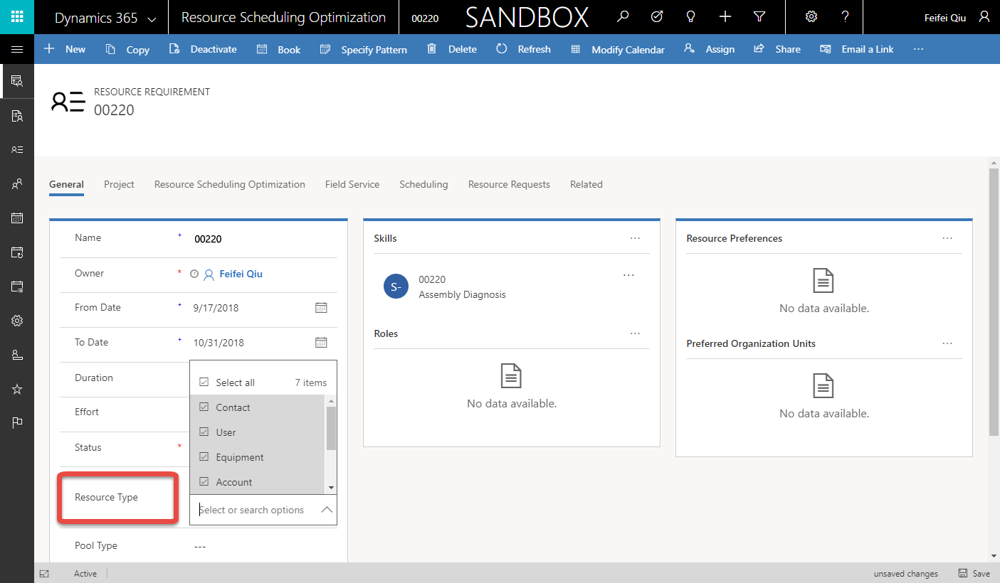

## Define objectives

Add and rank the objectives of RSO scheduling by using the **Move Up** and **Move Down** buttons, as seen in the following screenshot.

> [!div class="mx-imgBorder"]
> 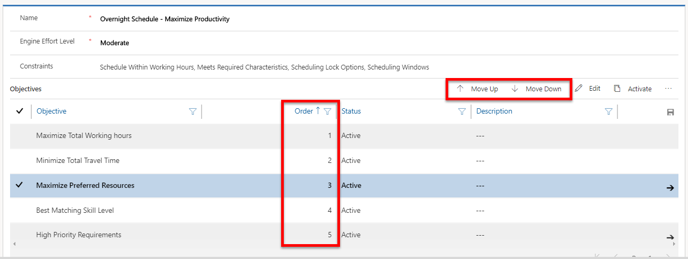

- **Maximize total working hours**: The combination of the engine results
    (iteration) with the total highest aggregate work time will best meet this
    objective.

- **Minimize total travel time**: The version of the engine results
    (iteration) with the total lowest aggregate travel time will best meet this
    objective.

    > [!NOTE]
    > This cannot be the first objective in the list. RSO might not schedule anything with the travel time as 0 minutes in order to meet the first objective.

- **Locked bookings**: Once a booking is created, a lock can be set on the
    scheduling lock options field in the RSO section of the booking. The options
    are Time Range, Resource, Time, and Resource and Time. When the locked
    bookings objective is selected, RSO will try to include locked bookings into
    the optimal route. For example, the following screenshot shows that Norbert
    has a booking that starts at 2:30 AM, and this booking is locked to
    **Time**. When RSO runs, the system detects a 30-minute idle time for
    Norbert in the morning, but none of the other requirement durations fit into
    that slot with the locked booking next to it, even though RSO tries to move
    it to other resources’ time.
    > [!div class="mx-imgBorder"]
    > 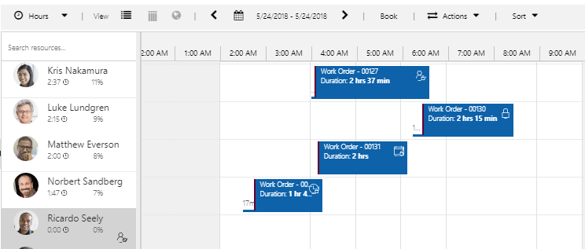

    If locked booking is a high-ranking objective, RSO will keep the locked
        booking there with 30 minutes of idle time before it by sacrificing the
        other objectives. The following screenshot shows the result.
    > [!div class="mx-imgBorder"]
    > 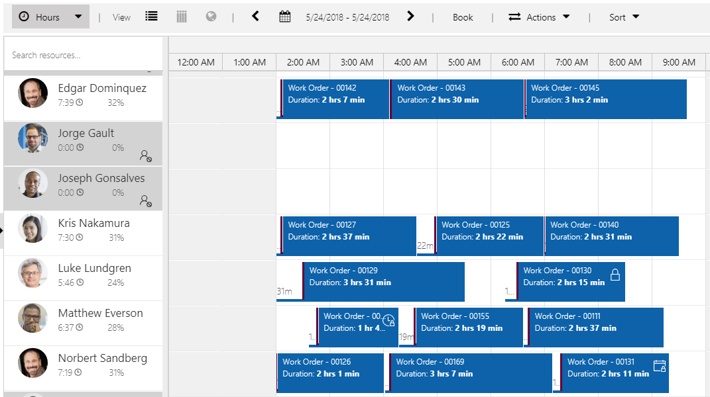

    If locked booking is not a selected objective or is ranked lower in the
    order of importance for objectives, RSO might ignore this locked booking
    (exclude this locked booking from the optimal route) and schedule other
    bookings for Matthew at 2:30 AM in order to achieve the highest score for
    top-ranking objectives, with the result shown in the following screenshot.
    It looks as if a booking overlaps, but actually the locked booking was
    ignored in this case. RSO would not delete the locked booking because it
    would lose the lock information defined on the booking record, which can’t
    be retrieved from the backing requirement.
    > [!div class="mx-imgBorder"]
    > 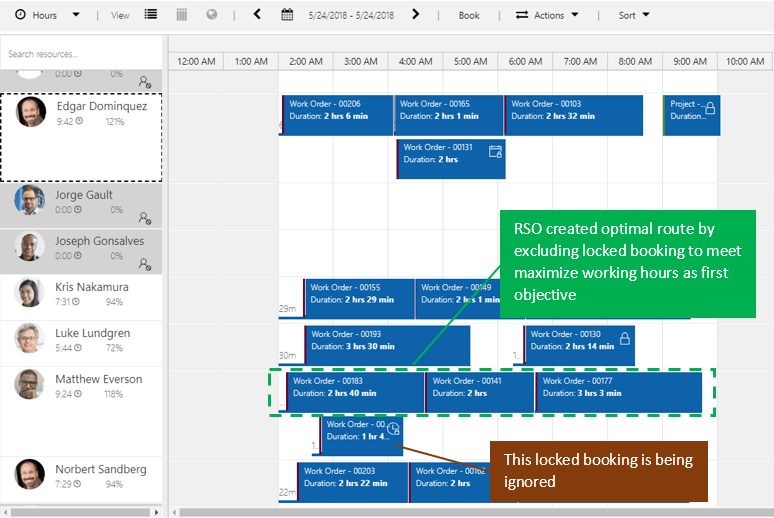

- **High priority requirements**: RSO will evaluate this objective and give
    priority to the resource/booking combination with the highest score for
    priority. The priority is set on the resource requirement record and is an
    option set with weighted values. RSO checks **Level of Importance** on
    priority to determine how important that priority is—for example, set
    **Level of Importance**=10 for urgent priority and set **Level of
    Importance**=1 for low priority and RSO will score 1 urgent requirement the
    same as 10 low-priority requirements because both scores are 10.

- **Maximize Preferred Resources (v3.0+)**:  RSO will consider the list of preferred resources noted on related requirements. The optimizer will try to assign bookings to preferred resources first while meeting other constraints and objectives.

This is achieved by adding the "Maximize Preferred Resources" objective to your RSO goal and adding a preferred resource(s) on the requirement that will be optimized.

> [!div class="mx-imgBorder"]
> 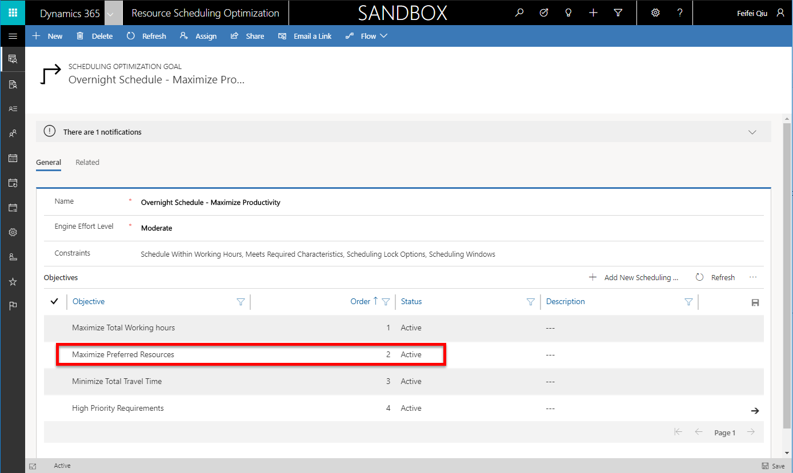

The following screenshot shows an example of adding a resource to a requirement (for example: Jorge Gault) as a preferred resource.
> [!div class="mx-imgBorder"]
> 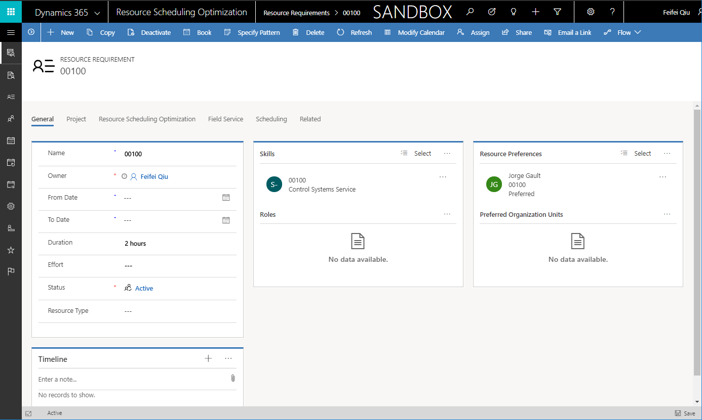

After running an optimization schedule, the requirement is scheduled to the preferred resource. In the following example, work order 00100 is scheduled to Jorge Gault.

> [!div class="mx-imgBorder"]
> 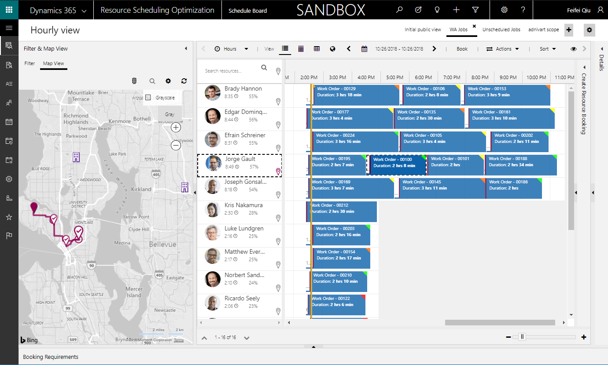

> [!Note]
> The Maximize Preferred Resources objective only applies to **preferred** resources. 

- **Best Matching Skill Level (v3.0+)**: RSO will consider the proficiency rating when matching characteristics required by requirements and the resources who possess those characteristics. This is dependent on the **Meets Required Characteristic** constraint within the optimization goal.

    If the "Meets Required Characteristics" constraint **is checked**: 
    - Resources without the characteristic (skill) or lower-than-required proficiency ratings are not eligible at all
    - Resources with the exact skill level (best matching) get the highest score
    - The more overqualified a resource is, the lower score their score will be  

    If the "Meets Required Characteristics" constraint **is unchecked**: 
    - Less qualified resources and resources without the skill can still be booked
    - Overqualified resources get a higher score than less qualified resources
    - The more overqualified a resource is, the lower their score will be 
    - The less qualified a resource is, the lower their score will be 
    - Resources without the skill get the lowest score

For example, if a characteristic (skill) rating model ranges from 1 to 10, and the requirement asks for a skill level of 4, the following example shows the score distribution based on skill level of the resource.

> [!div class="mx-imgBorder"]
> 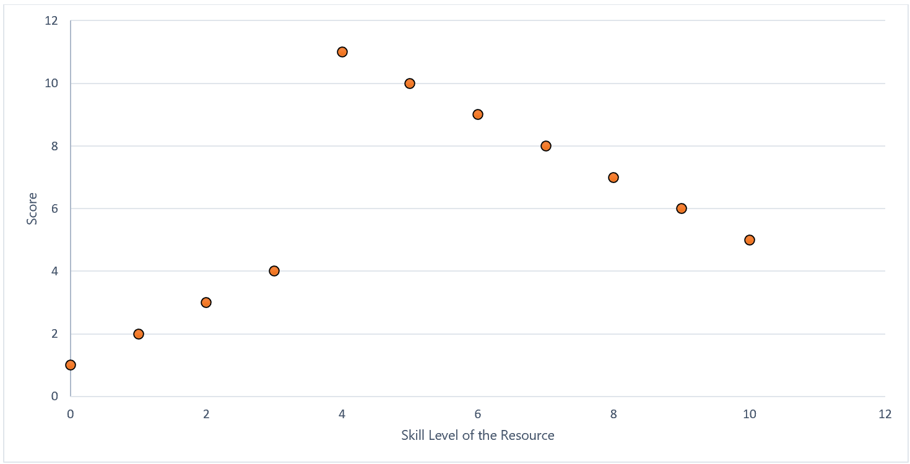

> [!div class="mx-imgBorder"]
> 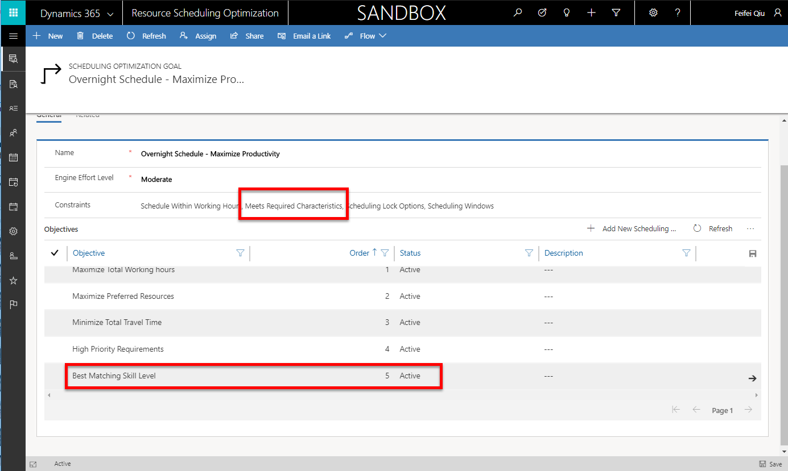
