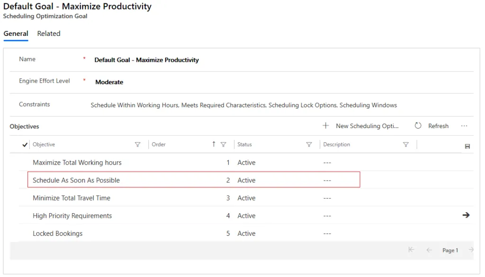

# Optimization goals in RSO

A goal defines some conditions and expectations that RSO should consider when performing an optimization. A goal consists of the following three parts - 
- **Contraints**: Restrictions that are imposed on the bookings to be created. Multiple constraints can be selected. For example - selecting "Meets Required Characteristics" would only allow bookings to be created if the resource has the skills listed in the requirement. [All constraints](##Definingconstraints) are explained in detail below.
- **Objectives**: Overall expectations from the resulting routes. Multiple objectives can be selected, but the order matters. The higher it is on the list, the more preference RSO will give to the objective. For example - "Maximize Total Working Hours" would ensure that the resources are allocated with as much work as possible. [All objectives](##Definingobjectives) are explained in detail below.
- **Effort level**: Amount of effort that RSO puts in to find the best combination of resources, route, and day or time. The effort can be be 'Very Light', 'Light', 'Moderate', 'Intense', or 'Very Intense'. The higher the effort level, the more iterations of possible combinations the RSO engine considers, and therefore, the longer it takes to complete the execution.
- **Travel Time Calculation**: Method of calculating travel distance between resources and requirements. All possible options are explained in detail below.

Using the above elements of a goal, you define how bookings should be optimized. The RSO engine processes a list of resources and a list of resource requirements, along with existing bookings, to create the optimal route or list of bookings for the resources. Bookings are considered optimally scheduled if they:

- Meet all company constraints.
- Give the highest importance to the first objective listed, and decreasing importance to the ones following it.
 

## Defining constraints

### Schedule Within Working Hours

This constraint creates the booking if it can be completed (both travel to work location and the work itself) within the resource’s working hours. This includes travel time from the last booking to the resource’s end location, although this travel time is not visually displayed on the schedule board.
> [!div class="mx-imgBorder"]
> 

If the constraint is removed from the goal, work will still be scheduled within working hours, but travel to and from bookings _can_ happen outside of the resource's working hours. It might not leave time at the end of the day to travel to the resource's end location. All bookings will end within a resource's working hours. See here for more information on [travel outside working hours.](https://docs.microsoft.com/en-us/dynamics365/field-service/rso-travel-outside-working-hours)

### Meets Required Characteristics

This constraint ensures that a resource has all the required characteristics (or skills) and corresponding level of expertise needed to be scheduled to a requirement. The required characteristics are listed on the requirement form and existing characteristics are listed on the resource form.

### Meets Required Roles

As of **RSO v3.0.19263.1+**, RSO will respect the resource roles added to a requirement. If for example, the requirement calls for a resource with the role "Robotics Engineer", RSO will schedule to a resource who has that role. If the requirement calls for two resource roles, RSO will schedule the requirement to resources that have either of those roles, following "OR" logic.

### Scheduling Lock Options

Bookings can be assigned to one of the four Scheduling Lock Options -  
- Time Range - This booking is locked to the time range dictated on the requirement or booking record; it cannot be moved outside the specified time range, but can be moved to a different resource or a different time slot, as long as the time range is respected.   
- Resource - The booking is locked to current resource; it cannot be moved to another resource, but can be moved to a different slot within the resource's hours. This is also known as a soft locked booking.
- Time - The booking is locked to the current time slot; it cannot be moved to another time slot, but can be moved to a different resource for the same time slot. This is also known as a soft locked booking.
- Resource + Time - The booking is locked to both resource and time. It absolutely cannot be moved. This is also known as a hard locked booking.

When this constraint is selected, RSO will respect the lock option configured on a bookable resource booking record. If this constraint is not selected, the hard lock or soft lock configured on the booking will not be respected.

> [!div class="mx-imgBorder"]
> 

### Scheduling Windows

This constraint ensures that RSO created a booking work within the time window start and end fields of the resource requirement or booking record.

- If **From Date** and **To Date** on requirement or **Date Window Start** and **Date Window End** on booking are set as shown in the following example, it indicates you want RSO to schedule the booking on 5/24/2018 and time of day doesn’t matter.
 > [!div class="mx-imgBorder"]
 > 

- If **Time Window Start** and **Time Window End** are set as shown in the following example, it indicates you want RSO to schedule a booking from 2:00 AM to 6:00 AM and the date doesn’t matter.
 > [!div class="mx-imgBorder"]
 > 

- If **Time From Promised** and **Time To Promised** are set as shown in the following example, it indicates you want RSO to schedule a booking between 4:00 AM and 8:00 AM on 5/24/2018. It has to be a specific date and specific time range.
 > [!div class="mx-imgBorder"]
 > 
  
> [!NOTE]
> 
> - If these fields are conflicting, RSO uses **Time From Promised** and **Time To Promised** first. Then it will use one or a combination of other fields.
> - RSO will ensure the **Estimated Arrival Time** falls into the window specified above. It does not guarantee that the booking’s end time will fall within the time window.

  - **Empty time values (v3.0+)** 
  RSO will respect scenarios where either the start or end time is not defined on a requirement.
     
  In the following example, a requirement has only a time window start value; RSO schedules the requirement anytime after 1:00 PM regardless of date.

  > [!div class="mx-imgBorder"]
  > 

  This logic applies to the following fields. 

  On the resource requirement entity: 
        -	**Time Window Start** and **Time Window End** 
        -	**Time From Promised** and **Time To Promised** 
        -	**From Date** and **To Date** 

  On the resource booking entity: 
        -	**Time Window Start** and **Time Window End** 
        -	**Time From Promised** and **Time To Promised** 
        -	**From Date** and **To Date** 

### Meets Resource Preferences

Formerly called "Restricted Resources" constraint, the constraint was expanded to include all resource preferences on requirements as of **RSO v3.0.19263.1**.
Preferred resources can be added to the requirement entity. See (Resource Preferences)[https://docs.microsoft.com/en-us/dynamics365/field-service/resource-preferences] for more information. 
When this constraint is selected, RSO will respect three different types of resource preferences on a requirement:

- **Preferred** - RSO will give scheduling preference to the resource if available but will not guarantee that the requirement is scheduled to them. This can happen if RSO has to choose a different resource for the most optimal schedule. 
- **Restricted** - RSO will strictly not schedule to the resources added to requirements with this resource preference.
- **Must choose from** - RSO will schedule to this resource if available during the time range of RSO. You can add multiple resources with a "Must choose from" preference and RSO will schedule to one of them; the first that is available. If none of them are available, this requirement will not be scheduled.

### Matches Territories

When this constraint is selected, RSO will respect the (Territory field)[https://docs.microsoft.com/en-us/dynamics365/field-service/set-up-territories] values on the requirement and resource records, and schedule bookings only when the territory values on both records match. A requirement can only belong to one territory, but resources can belong to multiple territories.

### Matches Resource Type

As of **RSO v2.8+**, RSO will respect the (Resource Type field)[https://docs.microsoft.com/en-us/dynamics365/field-service/set-up-bookable-resources#create-frontline-workers-and-other-bookable-resources-manually] values on the requirement and resource records, and schedule bookings only when the resource type values on both records match.

Bookable resources include these types:

- Generic
- Users *
- Contacts *
- Accounts *
- Equipment *
- Facility *
- Crew
- Pool

\* *Indicates resource types the optimization will consider*

In general, resource types define how the resource relates to the organization. For example, resources with the resource type **Users** are typically employees, whereas the resource type **Contacts** or **Accounts** are typically contractors.

Additionally, requirements allow multi-select so you can specify which resource types you need for a given requirement.

> [!div class="mx-imgBorder"]
> 

## Defining objectives

Add and rank the objectives of the RSO goal by using the **Move Up** and **Move Down** buttons, as seen in the following screenshot. The higher an objective is on a list, the more important it is to RSO. In this example, the most important objective is "Maximize Total Working Hours".

> [!div class="mx-imgBorder"]
> 

### Maximize total working hours

Iteration with the total highest aggregate work time will best meet this objective. Aggregate work is calculated by taking all bookings that were created or updated during the optimization process.

### Minimize total travel time

Iteration with the total lowest aggregate travel time will best meet this objective. The travel time here is calculated based on the "Travel Type Calculation" method chosen above. It also takes into consideration the travel time for resource to get back to their end location after their last booking, although this travel time isn't shown on the schedule board.

> [!NOTE]
> This cannot be the first objective in the list. This is because, mathematically speaking, in order to truly minimize travel time, RSO might not schedule any requirement that requires travel time (0 minutes travel) in order to meet the first objective.

### Locked bookings

Once a booking is created, a lock can be set on the scheduling lock options field in the resource scheduling optimization section of the booking. The options are Time Range, Resource, Time, and Resource and Time. When the locked bookings objective is selected, RSO will try to include as many soft-locked (locked to Time, Resource, or Time Range) bookings into the optimal route as possible. Hard locked (locked to TIme and Resource) bookings will always be a part of the schedule regardless of this objective. For example, the following screenshot shows that Norbert has a booking that starts at 2:30 AM, and this booking is locked to **Time**. When RSO runs, the system detects a 30-minute idle time for Norbert in the morning, but none of the other requirement durations fit into that slot with the locked booking next to it, even though RSO tries to move it to other resources’ time.
    
> [!div class="mx-imgBorder"]
> 

If locked booking is a high-ranking objective, RSO will keep the locked booking there with 30 minutes of idle time before it by sacrificing the other objectives. The following screenshot shows the result.

> [!div class="mx-imgBorder"]
> 

If locked booking is not a selected objective or is ranked lower in the order of importance for objectives, RSO might ignore this locked booking (exclude this locked booking from the optimal route) and schedule other bookings for Matthew at 2:30 AM in order to achieve the highest score for top-ranking objectives, with the result shown in the following screenshot. It looks as if a booking overlaps, but actually the locked booking was ignored in this case. RSO would not delete the locked booking because it would lose the lock information defined on the booking record, which can’t be retrieved from the backing requirement.

> [!div class="mx-imgBorder"]
> 

### High priority requirements 

RSO will evaluate this objective and give priority to creating bookings for requirements with the highest score for priority. The priority is set on the resource requirement record and is an option set with weighted values. RSO checks **Level of Importance** on priority to determine how important that priority is—for example, set **Level of Importance** = 10 for urgent priority and set **Level of Importance** = 1 for low priority. Mathematically speaking, when RSO looks at the importance of one urgent requirement (Level of Importance: 10 x Number of requirements: 1) same as that of 10 low-priority requirements (Level of Importance: 1 x Number of requirements: 10).

> [!NOTE]
> This objective doesn't optimize to book all high priority requirements ahead of the others within the day. It only optimizes to ensure that the high priority requirements are booked to the earliest possible day, not the earliest possible time slot within the day. 

### Maximize Preferred Resources (v3.0+):  

RSO will consider the list of preferred resources noted on related requirements. The optimizer will try to assign bookings to preferred resources first while meeting other constraints and objectives.

This is achieved by adding the "Maximize Preferred Resources" objective to your RSO goal and adding a preferred resource(s) on the requirement that will be optimized.

> [!div class="mx-imgBorder"]
> 

The following screenshot shows an example of adding a resource to a requirement (for example: Jorge Gault) as a preferred resource.
> [!div class="mx-imgBorder"]
> 

After running an optimization schedule, the requirement is scheduled to the preferred resource. In the following example, work order 00100 is scheduled to Jorge Gault.

> [!div class="mx-imgBorder"]
> 

> [!Note]
> The Maximize Preferred Resources objective only applies to **preferred** resources. 

### Best Matching Skill Level (v3.0+)

RSO will consider the proficiency rating when matching characteristics required by requirements and the resources who possess those characteristics. This is dependent on the **Meets Required Characteristic** constraint within the optimization goal.

If the "Meets Required Characteristics" constraint **is checked**: 
- Resources without the characteristic (skill) or lower-than-required proficiency ratings are not eligible at all
- Resources with the exact skill level (best matching) get the highest score
- The more overqualified a resource is, the lower score their score will be  

If the "Meets Required Characteristics" constraint **is unchecked**: 
- Less qualified resources and resources without the skill can still be booked
- Overqualified resources get a higher score than less qualified resources
- The more overqualified a resource is, the lower their score will be 
- The less qualified a resource is, the lower their score will be 
- Resources without the skill get the lowest score

For example, if a characteristic (skill) rating model ranges from 1 to 10, and the requirement asks for a skill level of 4, the following example shows the score distribution based on skill level of the resource.

> [!div class="mx-imgBorder"]
> 

> [!div class="mx-imgBorder"]
> 

> [!Note]
> In the 2020 release wave 2 update, the **Best matching skill level** objective was enhanced to prioritize assigning jobs to resources with fewer skills first. This is valuable for organizations that have a workforce with varying skillsets. Assigning jobs to resources with fewer skills or more common skills first when there is more capacity than demand allows RSO to reserve capacity for resources with multiple and unique skills for higher priority emergency situations. For example, imagine one resource has installation skills and another resource has installation _and_ repair skills. RSO will initially schedule installation jobs to the first resource who only has installation skills. This is advantageous because if a repair job needs to be scheduled later, the second resource will have capacity; if all the installation jobs were scheduled to the second resource, then no one would be available for the repair job since the first resource does not have the skills for repairs. This improvement to the **Best Matching Skill** level objective requires no additional configuration.

### Schedule as soon as possible

Occasionally, there may be more resource capacity than there is demand for resources (for example, total time of work orders is less than total available time of resources). In these circumstances, there is a business decision about whether to fully book some resources or leave resources with some capacity as a contingency for emergency or unplanned work.

In order to effectively front-load optimized bookings, add the **Schedule As Soon As Possible** objective into your optimization goal in the corresponding order:

> [!div class="mx-imgBorder"]
> 

## Default optimization goal

When RSO is deployed for the first time, the system automatically creates a default goal with some constraints and objectives enabled. Users can modify as needed or create a new optimization goal and associate it as a default goal.

> [!div class="mx-imgBorder"]
> 

**Engine Effort Level** determines how much effort RSO makes finding the best combination of resources, route, and day or time. The higher the effort, the longer RSO takes to complete the execution. For example, the effort might be very light, light, moderate, intense, or very intense. The higher the intensity, the more iterations of possible combinations the RSO engine considers.

> [!div class="mx-imgBorder"]
> 

The default goal is used when single resource optimization is selected from the schedule board.

> [!div class="mx-imgBorder"]
> 

[!INCLUDE[footer-include](../includes/footer-banner.md)]
