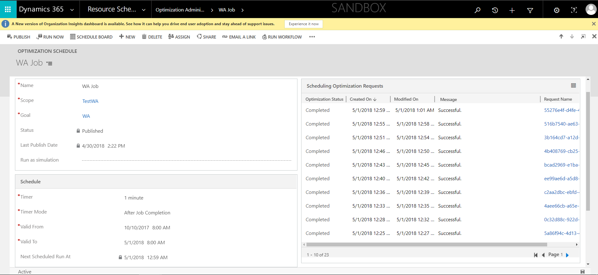
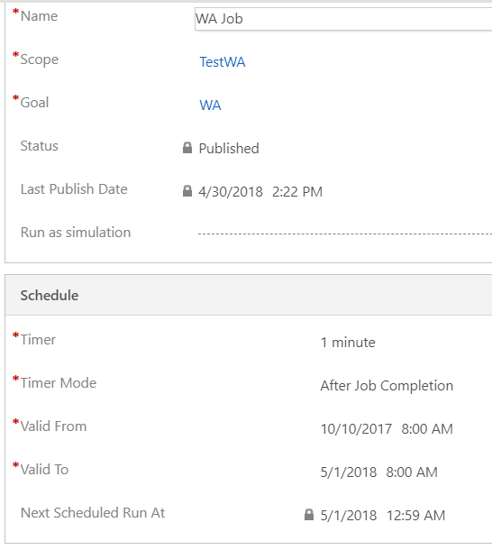
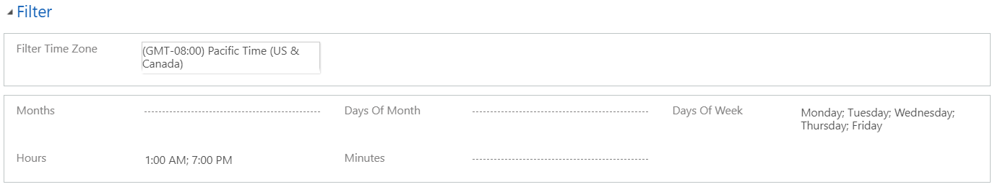
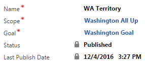
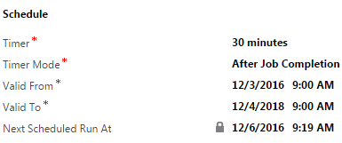
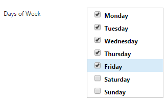

# Optimization schedules in resource scheduling optimization

After creating a scope and a goal, you can combine and schedule them in an optimization schedule.

You can define when resource scheduling optimization should optimize requirements and bookings for selected resources - for example, at 1:00 AM on weekdays. Creating a schedule also includes creating a scope and a goal.

> [!div class="mx-imgBorder"]
> 

Give the schedule a logical name to express which resource requirements and bookable resources will be optimized. If a scope and goal have not been created, you will need to create them for this schedule. 

> [!div class="mx-imgBorder"]
> 

- **Timer**: Defines how often this schedule will run.
- **Timer Mode**: The reference instant when the schedule starts the
    timer (**Fixed** or **After Job Completion**). For example, if a timer is set to 30
    minutes, the first run starts 30 minutes from the publish date/time.
    **Fixed** mode means the optimization runs every 30 minutes. **After Job Completion** mode means the optimization runs 30 minutes from the
    end of the last resource scheduling optimization job execution. **Job** refers to the resource scheduling optimization job.
- **Valid From** and **Valid To**: The first and last date and time when this
    schedule is valid for execution.

Filter is used to set a variety of combinations. For example, the schedule will run at 1:00 AM and 7:00 PM every Monday through Friday.

The Filter section of the schedule is an advanced feature. The Filter window allows for a variety of combinations to be selected:

- You can filter by month, numerical day, weekday, hour, and minute, and refer
    to a configured time zone.
- Leaving all filters blank means no filters will be applied.

### How timers work with filters

If you configure your timer and filter as shown here, resource scheduling optimization will run every 30 minutes after the previous job is completed, from 12/3/2016 at 9:00 AM to 12/4/2018 at 9:00 AM, except on Saturdays and Sundays.
> [!div class="mx-imgBorder"]
> 
> [!div class="mx-imgBorder"]
> 
> [!div class="mx-imgBorder"]
>

[!INCLUDE[footer-include](../includes/footer-banner.md)]