# Optimization scopes in resource scheduling optimization

You can define what resource scheduling optimization optimizes, including resources, requirements, or bookings.

Scope is the resource scheduling optimization mechanism for defining the relevant inputs: resource requirements, resources, and existing resource bookings. It also includes the timeframes to be considered for optimization. Extensible scope leverages Dynamics 365 entity views, providing an easy and flexible way to define what to optimize (resource requirements, resources, and existing resource bookings).

> [!IMPORTANT]
> Scopes should be as small as possible. Resource scheduling optimization will be quicker and more effective if optimization requests contain few resources, requirements, bookings, and shorter range durations. Usually companies already have partitions that could be used for resource scheduling optimization; for instance: 
> - Temporally defined: optimize technicians who work in the day separately from
    those who work at night.
> - Geographically defined: neighborhoods, cities.
> - Logically defined: support level, incident type.

After opening the **Scheduling Optimization Scope** form, users can select existing system views or personal views (for which they have read permissions) from the Resource, Requirement, and Booking view drop-down menus. If a personal view is selected, it is shared with the Resource Scheduling Optimization application user and other users who have access to the scope.
> [!div class="mx-imgBorder"]
> 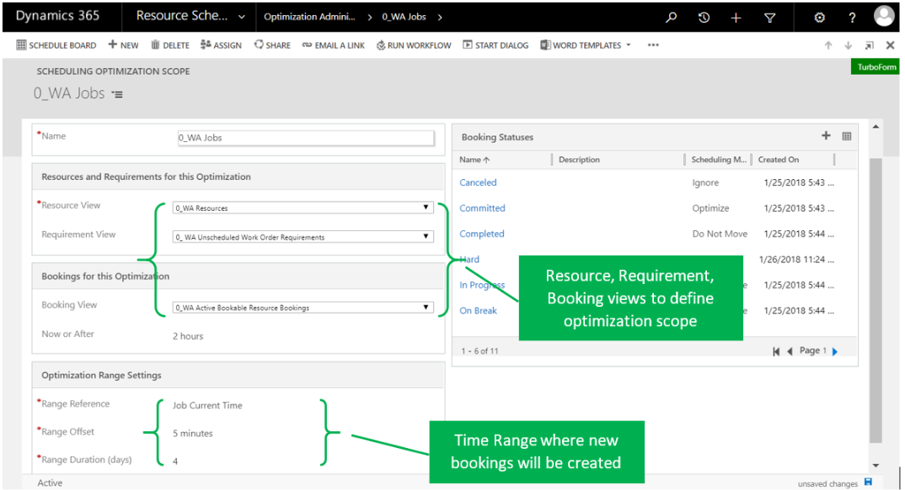
> [!div class="mx-imgBorder"]
> 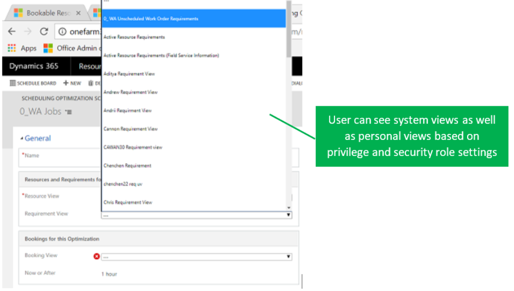

1. Using **Resource View** for example, 0_WA Resources has been defined with
    the filter conditions shown in the following screenshot. This is equivalent
    to configuring WA territory as an optimization scope in the previous version
    of resource scheduling optimization. Users can apply more filter conditions as needed to specify
    resources they need to optimize. Resource scheduling optimization will respect the Optimize Scheduling
    setting on individual resource records on top of the resource view filters.
    > [!div class="mx-imgBorder"]
    > 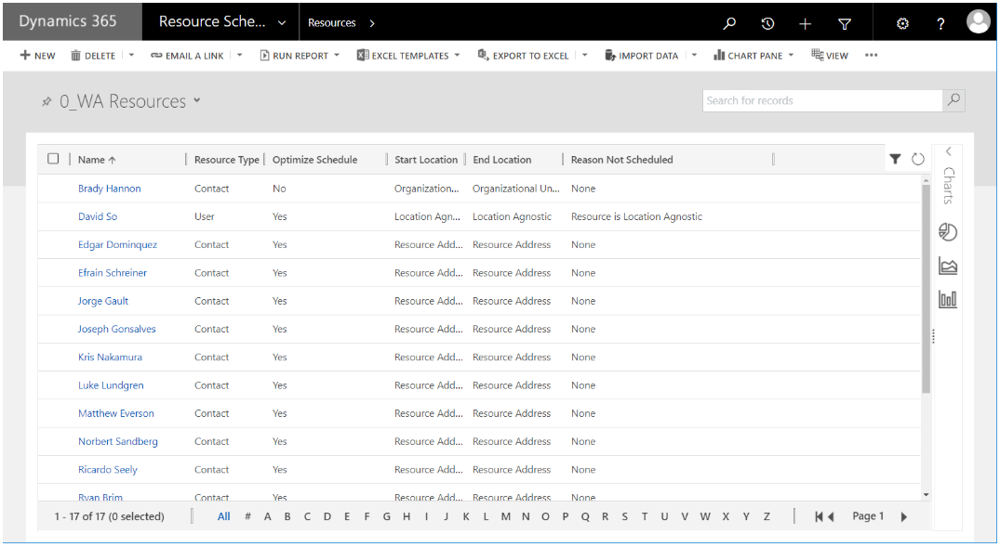
    > [!div class="mx-imgBorder"]
    > 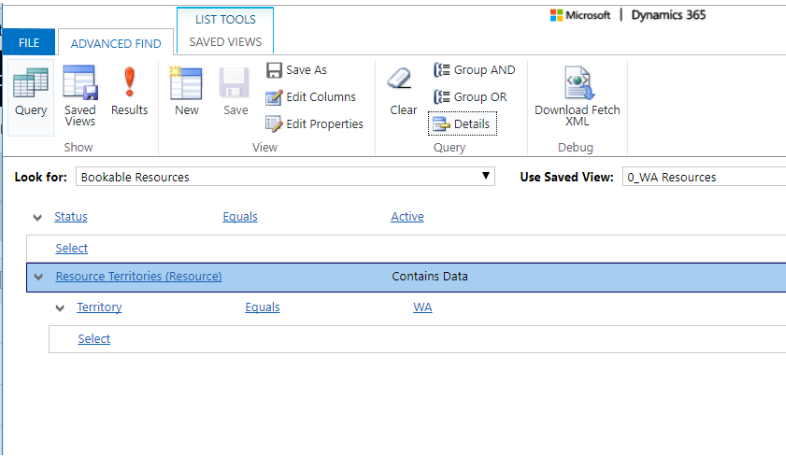

2. Select at least one requirement or booking view for what needs to be
    optimized.
    
   > [!div class="mx-imgBorder"]
   > 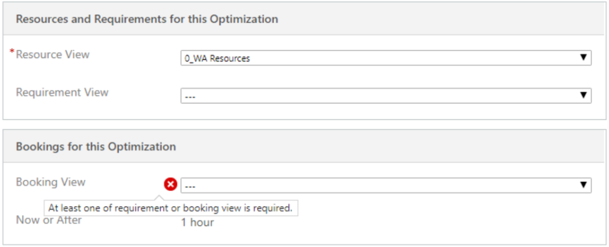

3. If you select booking view, you can set it to **Now or After**. For example,
    maybe you want to optimize bookings for the next five days, from 2 hours on
    (while excluding bookings within the next 2 hours and bookings in the past).
    The current, out-of-the-box Dynamics 365 entity view filter doesn’t support
    this Now or After condition; resource scheduling optimization enabled this additional setting on top of
    whatever filter conditions are defined for that booking view.
    
   > [!div class="mx-imgBorder"]
   > 

4. **Optimization Range Settings** is the time range where bookings can be created,
    updated, and deleted.

   **Example 1:** You want to have a booking created or moved ahead 24 hours but from 1 hour on; in other words, bookings will be moved into a range starting Now+1hour and ending Now+1hour+1day (which might partly still be today).
  
   > [!div class="mx-imgBorder"]
   > 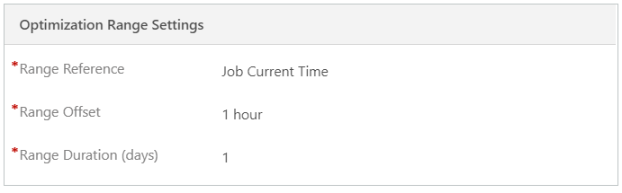

   - **Range Reference**: The start moment for all subsequent work order range
     calculation (Job current time or Beginning of the Job’s current day).
   - **Range Offset**: Amount of time added to the range reference to define the
     range start.
   - **Range Duration (days)**: Number of days added to the range reference.
  
     > [!div class="mx-imgBorder"]
     > 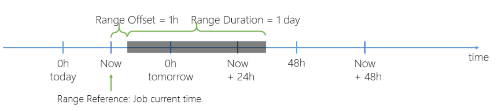

   **Example 2**: You want to have a booking created/moved into the next two days.
  
   > [!div class="mx-imgBorder"]
   > 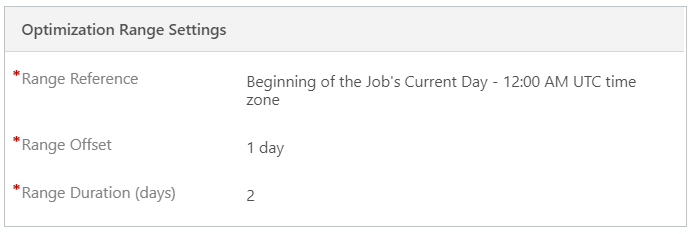
   > [!div class="mx-imgBorder"]
   > 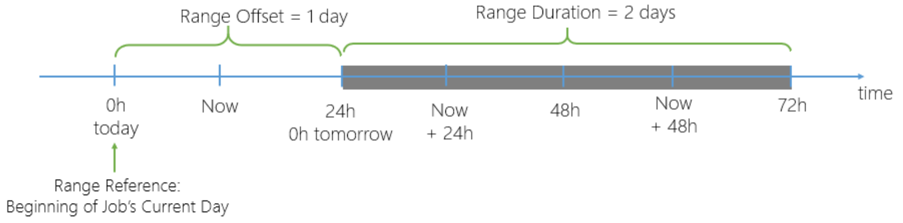

   > [!NOTE]
   > If bookings or resource requirements are defined in the Requirement/Booking view, but the promised date/time windows are outside the optimization range, resource scheduling optimization won't create or update these requirements or bookings after respecting the scheduling window constraint. If the promised date/time windows are overlapping the optimization range, resource scheduling optimization will create/update these requirements/bookings after respecting the scheduling window constraint.

5. You can preview resources, requirements, and bookings for optimization scope
    through the schedule board:

   - Resource filters on the schedule board are prepopulated from the
        Resource View. The resource list matches the number of resources defined
        in the Resource View. Resource scheduling optimization will display a lock icon and tooltip to
        indicate if a resource is not enabled for optimization (even though it
        was added into Resource View).
   - Requirements under Eligible for Optimization match the records from the
        Requirement View.
        
     > [!div class="mx-imgBorder"]
     > 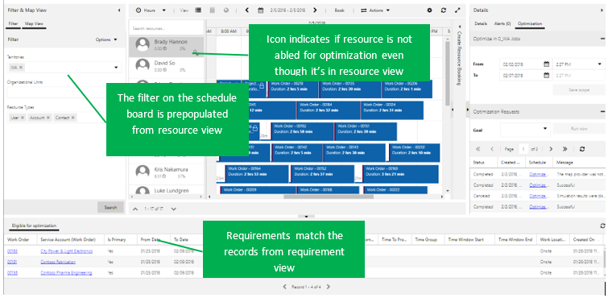

6. You can modify filters on the left panel and save it into scope:

   - If Resource View referred by optimization scope is a system view,
        modified filters through the schedule board will be saved as a new
        personal view.
   - If Resource View referred by optimization scope is a personal view,
        modified filters through the schedule board will be saved back into the
        same personal view.
        
     > [!div class="mx-imgBorder"]
     > 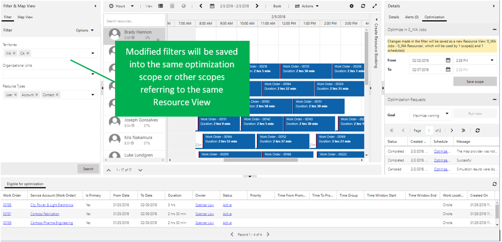

[!INCLUDE[footer-include](../includes/footer-banner.md)]