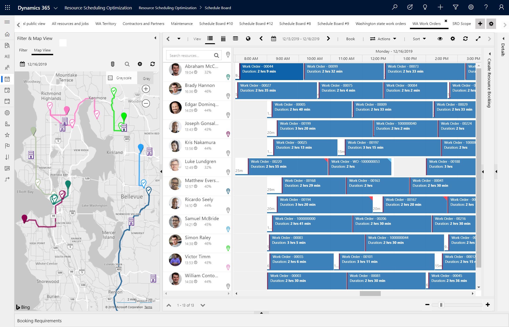
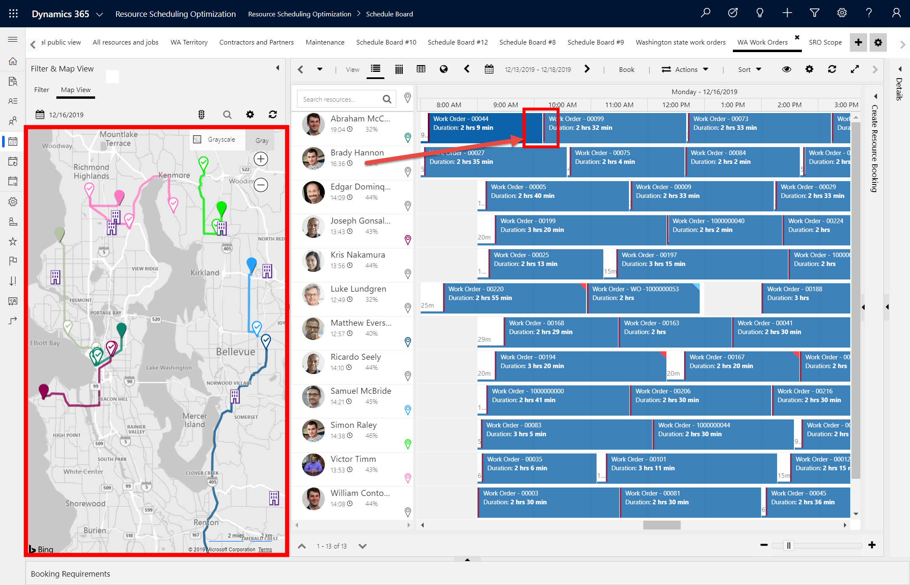
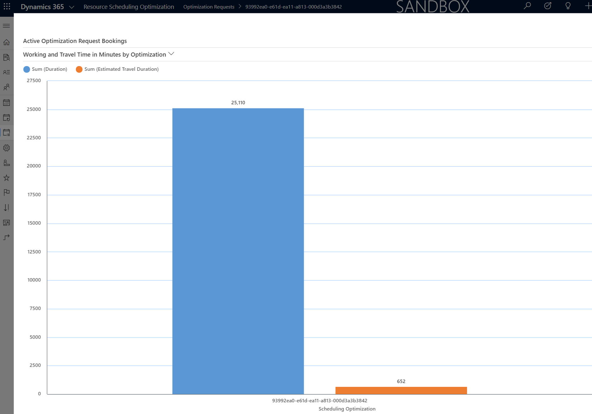

# Overview of resource scheduling optimization

Resource scheduling optimization automatically schedules jobs to the people, equipment, and facilities best equipped to complete them. This includes automatically scheduling work orders to field technicians, cases to customer service reps, and any other example based on how you are using Dynamics 365 Field Service, Customer Service, and Project Service Automation. 

Resource scheduling optimization is a more advanced form of scheduling for field service organizations, as you'll see in the [Five stages of scheduling adoption](5-stages-scheduling-adoption.md). Where the schedule board and the schedule assistant help dispatchers schedule a single job, resource scheduling optimization can schedule many jobs at once, maximizing overall utilization and minimizing total travel time. Furthermore, resource scheduling optimization considers the requirements of the job and the unique attributes of the resources like if the job requires an experienced manager with specific skills in the same area.

 > [!div class="mx-imgBorder"]
  > 

  

### Benefits of using resource scheduling optimization

Using resource scheduling optimization for automated scheduling is often a requirement because scheduling a high volume of jobs manually would take too long. For other organizations, they adopt resource scheduling optimization to aid their schedulers in job matching and to free up their time to focus on other tasks. Here are additional reasons organizations choose to adopt resource scheduling optimization.

- **Achieve scale**: Allows dispatchers to manage more resources, enabling the
business to scale to new territories or service offerings.

- **Customer satisfaction**: Improved efficiency drives more predictable arrival and completion times and seamlessly schedules alternate technicians for urgent situations.

- **Technician efficiencies and reduced cost**:
  -   Fitting more appointments into working hours drives revenue and reduces overtime costs.
  -   Matching work orders and technician skillsets reduces the cost of lost appointments.

- **Reduced travel time means reduced fuel consumption and less vehicle maintenance**:
  -   Ensuring your technicians are taking the shortest possible route with turn-by-turn directions from Bing Maps or your custom-mapping provider reduces fuel consumption and wear and tear on vehicles.
  -   If each field technician saves one tank of gas a month, the savings generally will surpass the cost of resource scheduling optimization. 

- **Improved customer retention**: Giving preference to higher-priority work orders helps avoid service level agreement (SLA) penalties and helps you meet customer service commitments. 

## Scenarios

Resource scheduling optimization is configurable based on your business needs and you have the option of running resource scheduling optimization differently based on jobs, resources, and different factors. Here are common scenarios where resource scheduling optimization is used.

- **Overnight scheduling** - resource scheduling optimization runs automatically each night and schedules new jobs and reoptimizes existing bookings for the next day.

- **Single Resource Optimization** - a dispatcher runs resource scheduling optimization for a single technician's schedule for the rest of today to recalculate an optimal travel route after a cancellation. [See more details](single-resource-optimization.md).

- **Simulation** - a service manager runs a simulation of resource scheduling optimization to understand how many jobs could be completed with a varying number of resources in a specific geographic territory.

- **Intraday scheduling** - resource scheduling optimization runs every 30 minutes to schedule and adjust for changing business needs as new jobs are created and others are canceled or rescheduled.

- **Emergency scheduling** - when an emergency job is created, a resource scheduling optimization run is triggered that schedules the high-priority-emergency job as soon as possible ahead of lower priority jobs.

## Glossary

- **Jobs**: Generic term referring to work that needs to be completed like work orders, cases, and projects; however there is no "jobs" entity in Field Service or Resource Scheduling Optimization. 
- **Resources**: Anyone or anything that needs to be scheduled to a job including people, equipment, and facilities.
- **Schedules, bookings**: Schedules and bookings are used interchangeably and refer to the appointment time slot when a resource is assigned to a job.
- **Requirements**: The entity related to a job that defines what type of resource is needed to complete the work. This is the entity that will ultimately be scheduled via resource scheduling optimization.
- **Run**: When resource scheduling optimization performs its scheduling and optimization functions, we call it a run. It consists of a send and receive to Azure and an update to schedules as seen on the Schedule Board.
- **Optimize**: We say that resource scheduling optimization *optimizes* jobs, meaning that it attempts to find the best schedules to reduce travel time and maximize utilization.
- **Scope**: The jobs and resources that resource scheduling optimization will consider. For example, you may not have resource scheduling optimization schedule every job in the system to every resource. You will most likely partition the jobs and resources into a scope.  
- **Goal**: Defines what the aim of a resource scheduling optimization run will be. What is most important for your company: minimizing travel time, maximizing utilization, handling high priority jobs, scheduling jobs as soon as possible? These are all goals that you will need to rank because sometimes there are trade-offs.
 
> [!div class="mx-imgBorder"]
> 
 
## System requirements

- Dynamics 365 online
- Resource scheduling optimization is a paid add-on to [Universal Resource Scheduling (URS)](../common-scheduler/schedule-anything-with-universal-resource-scheduling.md) and is built on top of its entities. Organizations that use either Dynamics 365 Field Service, Customer Service, and Project Service Automation are entitled to URS. If for example, you wanted to use resource scheduling optimization to automatically schedule Dynamics 365 Sales opportunities to sales reps, you would need either Dynamics 365 Field Service, Customer Service, or Project Service Automation in addition to Sales in order to access URS as a prerequisite.

## How it works

Resource scheduling optimization is an enhanced application of the famous "traveling salesperson problem" that asks the following question: "Given a list of cities and the distances between each pair of cities, what is the shortest possible route that visits each city and returns to the origin city?". It's a mathematical problem and the solution is a large part of the resource scheduling optimization computation. Nevertheless, resource scheduling optimization goes beyond finding the shortest routes because it also considers things like skills, territory, roles, priorities, resource preferences, promised time windows, and more. 

Here's how it works.

1. You create a list of jobs that need to be completed. These are generally work orders for onsite service, cases for remote service, and project tasks. 

2. For each job, you list what kind of resource is needed and when it needs to be completed. For example, for a work order you may need someone nearby with repair skills and the work order needs to be completed by the end of this week. Much of this information is automatically populated based on the job details. 

3. Next you pick a list of resources that are eligible to be considered for your list of jobs, and each resource has different attributes like where they are located, what role the resource has, what type of resource they are (employee, contractor, facility, equipment), and what skills they have. 

4. After that you run resource scheduling optimization, which can be run manually by pushing a button, based on a predefined schedule or timetable, or triggered by a workflow. Also, resource scheduling optimization can run differently depending on what it's scheduling. It can run differently for US jobs compared to Canadian jobs or differently for work orders compared to cases.

5. When resource scheduling optimization runs, the job requirements and the list of resources are sent to Azure and resource scheduling optimization computes an optimal schedule that is displayed on the schedule board.

6. After resource scheduling optimization runs, dispatchers can use the interactive schedule board and schedule assistant to makes changes as needed.

## Optimized schedules

Resource scheduling optimization _optimizes_ schedules in addition to automatically scheduling them. After running resource scheduling optimization, it's important to understand the optimized results. Lets look at a three examples.

### 1. Clustered routes 

In the following screenshot is an optimized schedule board. In the left pane, you'll see a map view of the optimized bookings. 

  > [!div class="mx-imgBorder"]
  > 

  One way you can see resource scheduling optimization working effectively is the travel routes are clustered around each resource's starting location where each color represents a different technician's route. When dispatchers manually schedule jobs without using resource scheduling optimization, the travel routes are often spread across the map zigzagging in different directions.

### 2. Sequential bookings at the same location
In the previous image, you can see some bookings are scheduled back-to-back with no travel time in between. This means resource scheduling optimization scheduled a job and understood there was another job at the same location for the same customer and decided to schedule them together. Simple types of optimization can be harder for dispatchers to do manually across many jobs.

### 3. Travel time vs working time
Every time resource scheduling optimization runs, it keeps track of the total travel time compared to working time in a graph as seen in the image below. This helps you understand how resource scheduling optimization will reduce the total travel time across all of your field technicians compared to manual or semi-automated scheduling (schedule assistant).

> [!div class="mx-imgBorder"]
> 

## Get started
- [Get resource scheduling optimization](rso-get-install.md)

- [Deploy resource scheduling optimization](rso-deployment.md)

- [Resource scheduling optimization Quickstart guide](rso-quickstart.md)

-  [Resource scheduling optimization Quickstart video](https://youtu.be/oJ-3HTJWRMo)

## See also

-  [Resource scheduling optimization overview and scenarios](https://youtu.be/fcQwIXgmnqk)

- [Five stages of scheduling adoption](5-stages-scheduling-adoption.md)

[!INCLUDE[footer-include](../includes/footer-banner.md)]