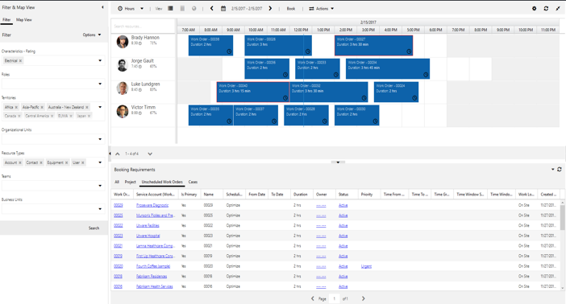
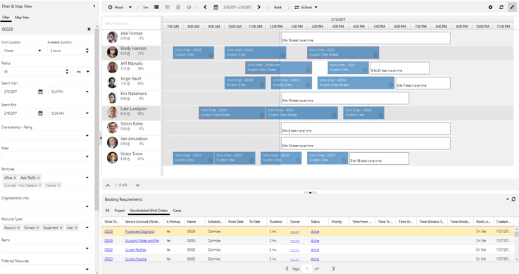

# Overview of the Resource Scheduling Optimization (RSO) solution

Resource Scheduling Optimization (RSO) is an add-on capability for the Dynamics 365 for Field Service application that enables you to automatically schedule work orders for the most appropriate resources, by optimizing bookings for the shortest travel time, available work hours, and many other constraints.

RSO is one of three ways to schedule with Dynamics 365 Field Service:

1.  **Manual scheduling**: Drag and drop work order requirements from the bottom panel to the resource’s calendar above.

    > [!div class="mx-imgBorder"]
    > 

2.  **Scheduling Assistant**: This allows you to filter resources on the left panel by travel range, skills, dates, roles, territories, and more. The system recommends available resources on the right and displays estimated travel times.

    > [!div class="mx-imgBorder"]
    > 

3.  **Resource Scheduling Optimization**: This add-on evaluates routes and automatically schedules bookable records to minimize travel time and maximize working hours and more, based on your configured objectives, such as “minimize travel time” and “maximize working hours.”

    > [!div class="mx-imgBorder"]
    > 

## Running RSO

## Optimized schedules

- same location
- reduce overall travel time
- traveling time vs working time

## Benefits of using Resource Scheduling Optimization 

- **Automated scheduling**: Automatically scheduling the majority of
requirements saves time and empowers dispatchers to focus on exceptions and
billing.

- **Achieve scale**: Allows dispatchers to manage more resources, enabling the
business to scale.

- **Customer satisfaction**: Improved efficiency drives more predictable
arrival and completion times and seamlessly schedules alternate technicians
for urgent situations.

- **Technician efficiencies and reduced cost**:
  -   Fitting more appointments into working hours drives revenue and reduces
    overtime costs.
  -   Matching work orders and technician skillsets reduces the cost of lost
    appointments.

- **Reduced travel time means reduced fuel consumption and less vehicle maintenance**:
  -   Ensuring your technicians are taking the shortest possible route with
    turn-by-turn directions from Bing Maps or your custom mapping provider
    reduces fuel consumption and wear and tear on vehicles.
  -   If each field technician saves one tank of gas a month, the savings
    generally will surpass the cost of RSO. 

- **Improved customer retention**: Giving preference to higher-priority work orders helps avoid service level agreement (SLA) penalties and helps you meet customer service commitments.

## More resources 

-   [What’s New for Dynamics 365 Resource Scheduling Optimization v2.6
    Release](https://blogs.msdn.microsoft.com/crm/2018/05/09/whats-new-for-dynamics-365-resource-scheduling-optimization-v2-6-release/)
-   [What’s New for Dynamics 365 Resource Scheduling Optimization v2.5
    Release](https://blogs.msdn.microsoft.com/crm/2018/04/02/whats-new-for-dynamics-365-resource-scheduling-optimization-v2-5-release/)
-   [Release Notes for Resource Scheduling Optimization (v2.0) – Dynamics
    365](https://blogs.msdn.microsoft.com/crm/2017/12/12/release-notes-for-resource-scheduling-optimization-v2-0-17335-1-dynamics-365/)
-   [What’s New for Dynamics 365 Resource Scheduling Optimization v1.5
    Release](https://blogs.msdn.microsoft.com/crm/2017/10/26/whats-new-for-dynamics-365-resource-scheduling-optimization-v1-5-17284-2-release/)
-   [Scheduling anything in Dynamics 365 with Universal Resource
    Scheduling](https://www.microsoft.com/en-US/dynamics/crm-customer-center/scheduling-anything-in-dynamics-365-with-universal-resource-scheduling.aspx)

   

## Next steps
Get RSO
Deploy RSO
Configure RSO

## Privacy notice  
[!INCLUDE[cc_privacy_rso_location_info_bing_maps](../includes/cc-privacy-rso-location-info-bing-maps.md)]

## See also

- Quickstart
- Quickstart video