# Quickstart for Resource Scheduling Optimization (RSO)

Resource Scheduling Optimization (RSO) automatically schedules work orders, cases, opportunities, and even custom entities to the resources that are most available and best qualified. Many field service organizations that perform work orders on site at their customers' locations benefit from automatic scheduling because it optimizes the routes and travel times of field technicians as they travel from work order to work order.

In this quickstart, we will configure RSO to schedule and optimize a group of work orders to a predefined list of resources (field technicians). We will do this by setting up a scope, goal, and schedule that will run once a day to schedule work orders in the Washington state service territory to resources in that territory up to 48 hours in advance to minimize travel time. 

For a guided walkthrough, see the following video.

> [!VIDEO https://www.microsoft.com/videoplayer/embed/RE4ylx7

> [!Note]
> For additional Field Service videos, see [this full playlist](https://aka.ms/fs-videos).

## Prerequisites

- The images and definitions in this quickstart reflect **Field Service v8.7** and **RSO v3.0**.

- This quickstart assumes you already have RSO deployed into your Field Service environment. You can do this by first purchasing a Field Service license and then purchasing a Resource Scheduling Optimization (RSO) license in the "Purchase Services" section of Office 365. For more details, visit the topic on [Deployment of the Resource Scheduling Optimization (RSO) solution](rso-deployment.md).

> [!div class="mx-imgBorder"]
> 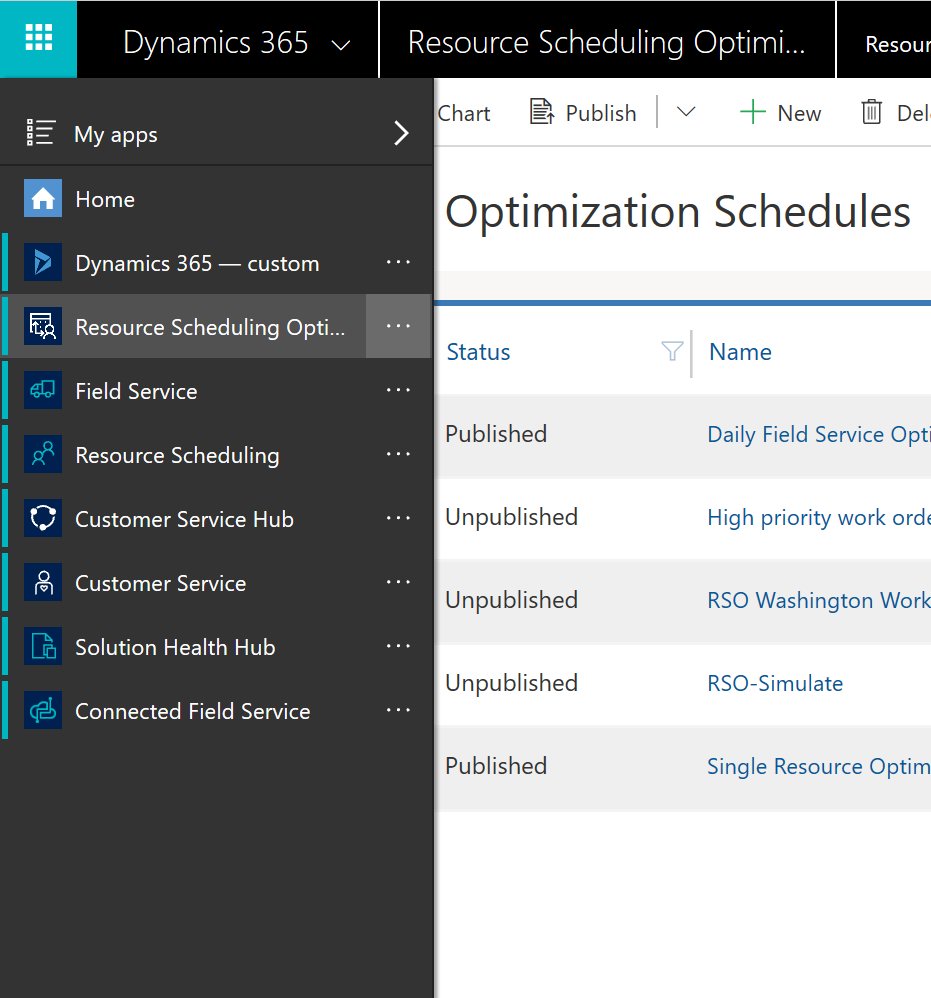

- Make sure the person who sets up RSO has the **Field Service-Administrator** and **Resource Scheduling Optimization** security roles and the **Field Service-Administrator** and **Resource Scheduling Optimization-Administrator** field security profiles. See [RSO configuration](./rso-configuration.md) for more details.

- Resource Scheduling Optimization works with Universal Resource Scheduling (URS) to schedule field service work orders. A working knowledge of how URS works will help with this quickstart. For more details, view the topic on [Universal Resource Scheduling for Field Service](universal-resource-scheduling-for-field-service.md).
## Step 1: Turn on RSO

After deploying RSO into your environment, you must enable it. 

Go to **Resource Scheduling** > **Settings** > **Administration** > **Scheduling Parameters** > **Resource Scheduling Optimization tab**

> [!div class="mx-imgBorder"]
> 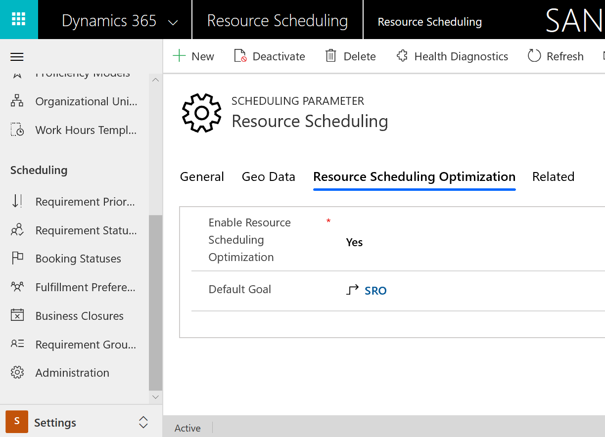

Set **Enable Resource Scheduling Optimization** to **Yes**.

Select a **Default Goal**. Among other uses, a default goal tells RSO what to prioritize by default (such as maximizing working hours) and is important for using [Single Resource Optimization](single-resource-optimization.md). If no default goal is present, select **+New** and create one. See the following screenshot for some recommended settings.

> [!div class="mx-imgBorder"]
> 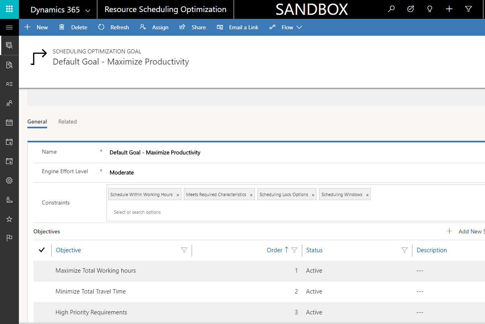

## Step 2: Verify Booking Statuses

Installing Field Service will import booking statuses, and installing RSO will add the scheduling methods **Ignore**, **Do Not Move**, or **Optimize** to those booking statuses. Make sure the highlighted booking statuses match your system.  

> [!div class="mx-imgBorder"]
> 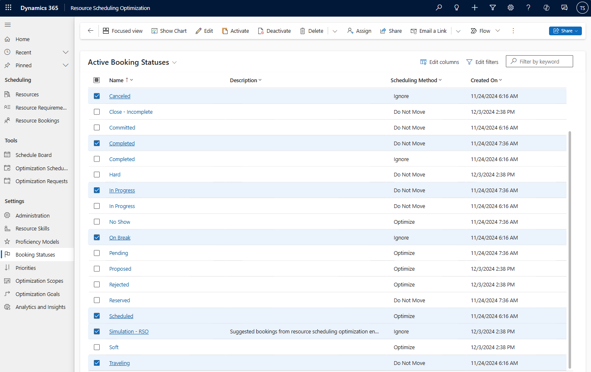

If they do not match, make sure RSO is finished installing. If it is finished, try Resetting RSO by going to **Resource Scheduling Optimization** > **Optimization Schedules** > and selecting **Reset** in the top ribbon.

## Step 3: Set work orders to optimize

Next, create a system view that filters resource requirements to the ones you want to optimize. 

Create a new view in **Settings** > **Customizations**

For our quickstart scenario, create a new view for the **Resource Requirement** entity for requirements related to work orders in the Washington (WA) service territory.

> [!div class="mx-imgBorder"]
> 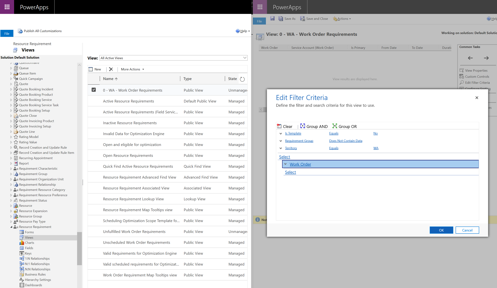

Next, ensure the requirements in that view are eligible for optimization.

Go to **Resource Scheduling** > **Resource Requirements** and select the view you just created; highlight and edit those records.

> [!div class="mx-imgBorder"]
> 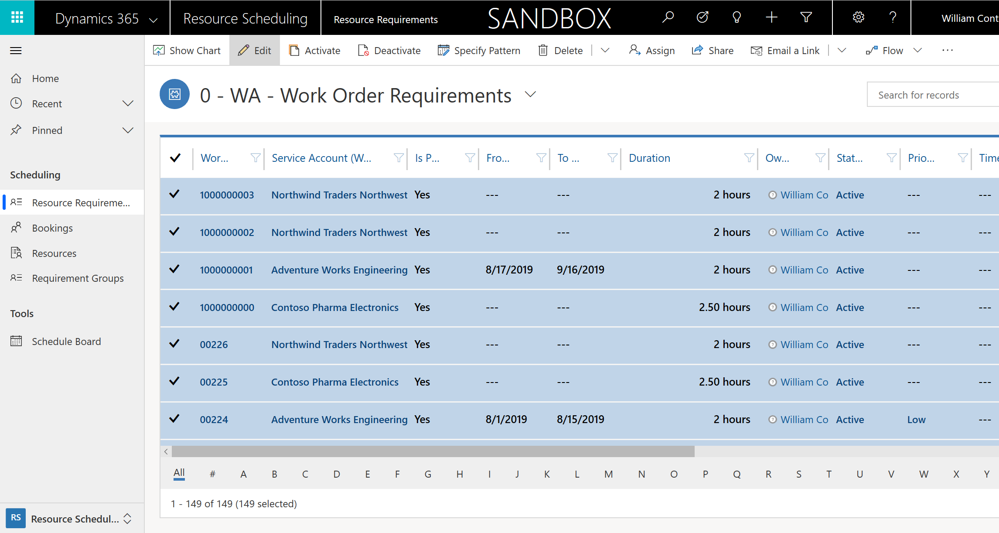

Set the **Scheduling Method** to **Optimize**. This means that if RSO runs and targets this requirement, it can be scheduled automatically. This field also allows you to add workflows and business processes to which requirements can be automatically scheduled.

> [!div class="mx-imgBorder"]
> 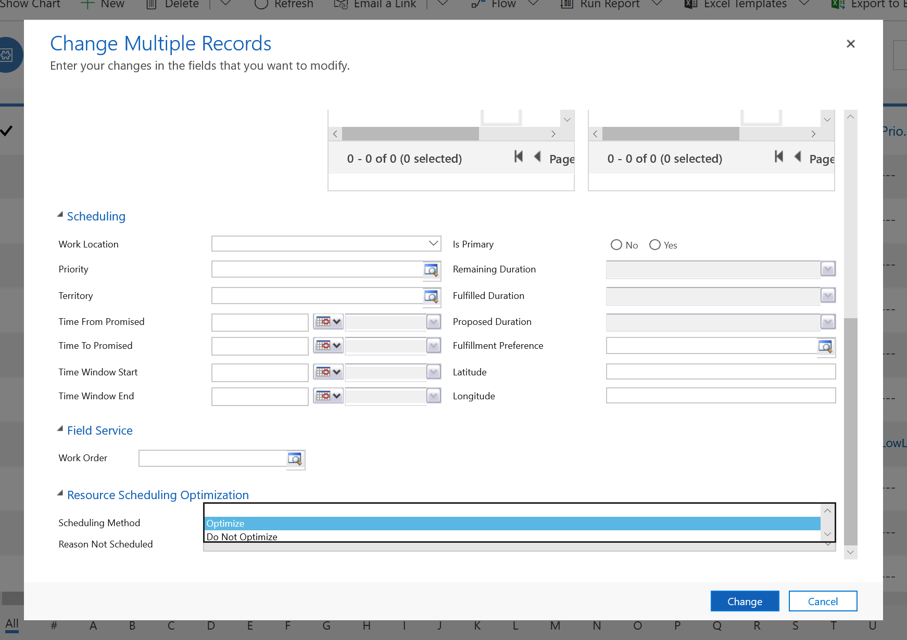

This can also be done individually for each requirement record.

> [!div class="mx-imgBorder"]
> 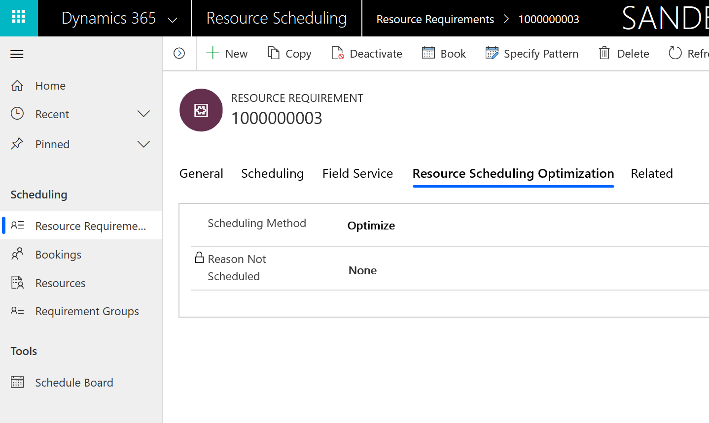

Additionally, you can have the system automatically set work order requirements to be optimized by default when a work order requirement is created in **Booking Setup Metadata**. 

Go to **Resource Scheduling** > **Settings** > **Administration** > **Enable Resource Scheduling for Entities**

Then double-click on **Work Order** and set **Default Scheduling Method** to **Optimize**.

> [!div class="mx-imgBorder"]
> 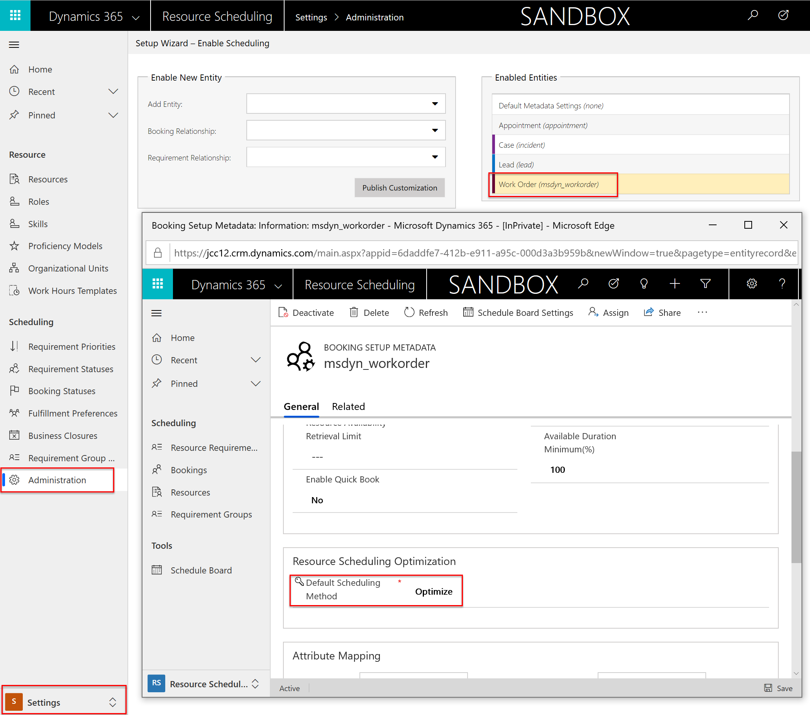

## Step 4:  Set resources as eligible for optimization 

So at this point you have a set of work orders in the Washington territory that need to be scheduled in an optimal way. But who could or should they be scheduled to?

Let's define the resources that are eligible for optimization.

To fulfill our scenario, we want to create a view of **Bookable Resources** that are part of the Washington (WA) state service territory. 

> [!div class="mx-imgBorder"]
> 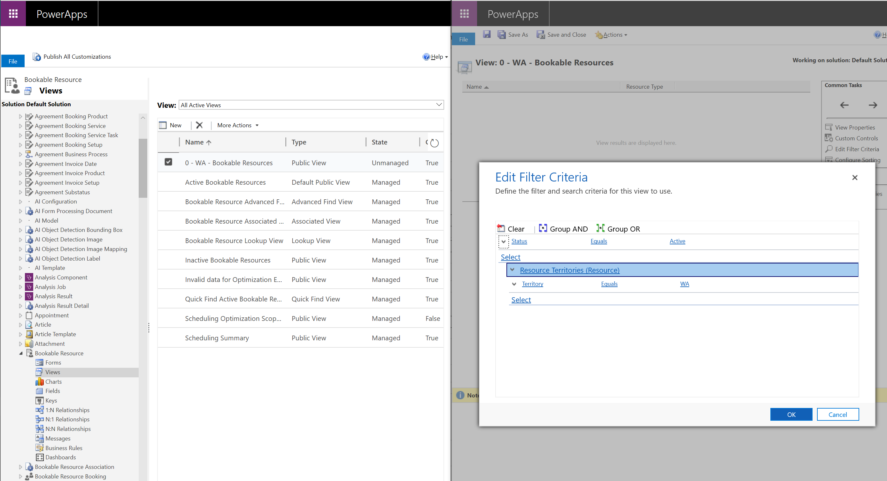

After the view is created to partition the bookable resources that will later be fed into RSO, make sure they are marked as eligible for optimization.

For each resource in your view, set the **Optimize Schedule** field to **Yes**.

> [!div class="mx-imgBorder"]
> 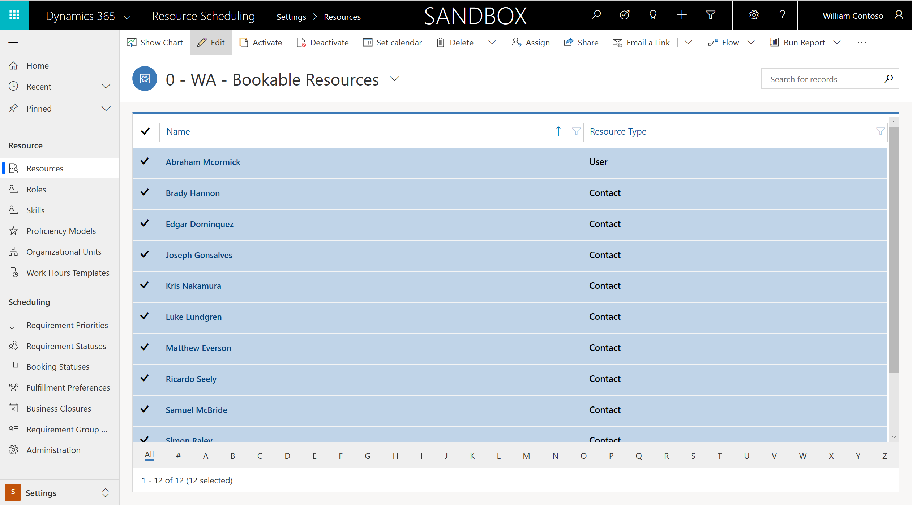

Similar to requirements, this can be done individually or with a bulk edit.

> [!div class="mx-imgBorder"]
> 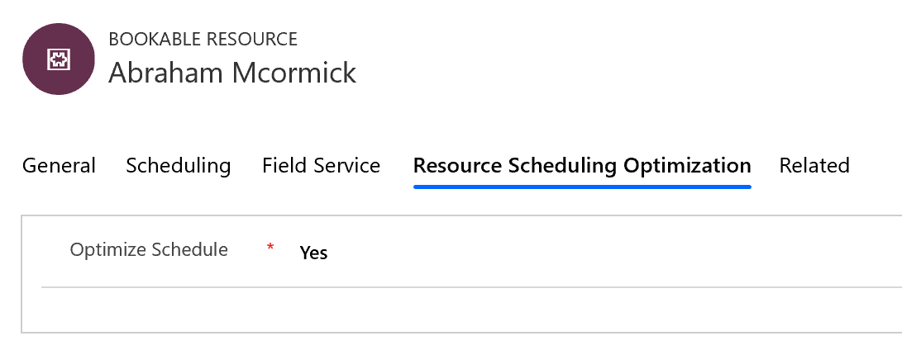

## Step 5: Create scope

Now that we have enabled RSO, and have:

1. A list of the requirements (work orders) we want to optimize 
2. A list of the resources that the requirements should be scheduled to 

You now need to set up an RSO run and input both of these lists.

Go to the **Resource Scheduling Optimization app** which is a separate app from the Field Service and URS apps. 

Choose **Optimization Scopes** in the left pane then **+New**.

Enter a **Name** that describes the requirements and resources you are optimizing.

In the **Resources and Unscheduled Requirements for this Optimization** section, select the **Resource View** and the **Requirement View** you created in the previous steps.

> [!div class="mx-imgBorder"]
> 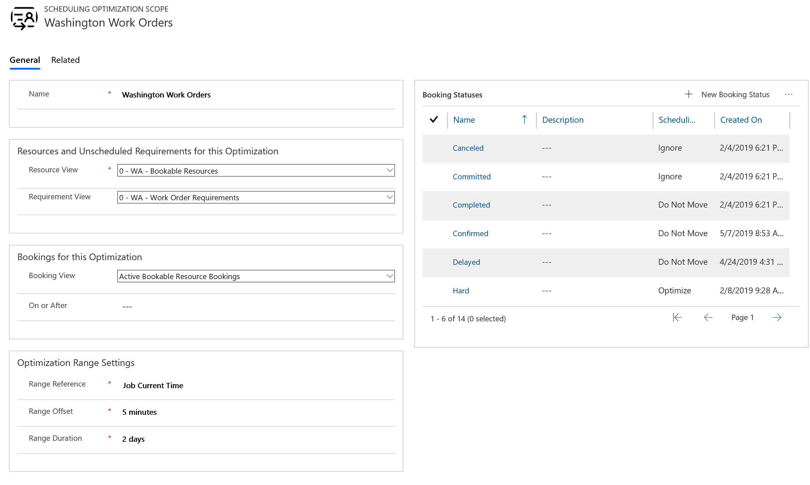

In the **Bookings for the Optimization** section, select the **Active Bookable Resource Bookings** view or a similar view for bookings.

> [!Note]
> By entering a view for unscheduled requirements *and* bookings, we are configuring RSO to optimize both unscheduled jobs and scheduled jobs. If you only select a booking view, then RSO will only optimize existing bookings and you must schedule the unscheduled jobs manually or with the schedule assistant. By only selecting an unscheduled requirement view, RSO will not move existing bookings and simply attempt to schedule the unscheduled jobs to available time slots.

For **Optimization Range Settings**, enter the following values:

- **Range Reference**: Job Current Time 

- **Range Offset**: 5 minutes. This means the first booking RSO can schedule will be 5 minutes after the time RSO is run. Some organizations would like RSO to schedule jobs starting tomorrow, in which case the **Range Offset** should be set to 1 day.

- **Range Duration**: 2 days. This means RSO will schedule requirements to fill up a maximum of 2 days. 

Then **Save**.

## Step 6: Create goal

Now we need to create goals or objectives for the RSO run.

Choose **Optimization Goals** in the left pane, then **+New**.

Enter a **Name** that describes the goal.

For **Engine Effort Level**, select **Very Light**, meaning RSO will run very quickly but may not find the most optimal solution. 

For constraints, select the following:

- **Schedule Within Working Hours**
- **Meets Required Characteristics** (if your requirements and resources both have characteristics)
- **Matches Territory** (if your requirements and resources both belong to the same service territory - in our example, Washington state (WA))

> [!Note]
> Start with fewer constraints and add more as you successfully run RSO. This makes it easier to troubleshoot if RSO produces unexpected results (or none at all).

For objectives, select the following order:

1. **Maximize Total Working Hours**
2. **Minimize Total Travel Time**
3. **Best Matching Skill Level**

> [!div class="mx-imgBorder"]
> 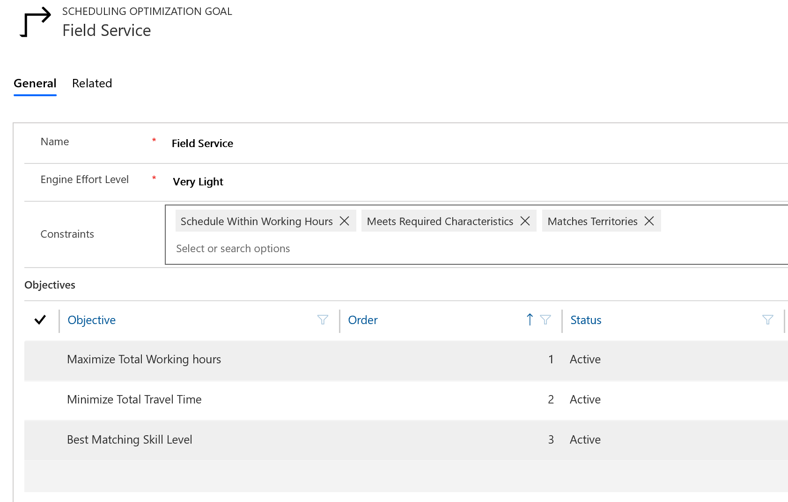

> [!Note]
> **Minimize Total Travel Time** **cannot** be the first objective

As usual, don't forget to **Save**!

## Step 7: Create schedule

The last configuration step is to combine your scope and goal into a schedule. 

Go to **Optimization Schedules** in the left pane, then **+New**.

Enter a **Name** that will define your schedule, such as "Overnight Schedule."

Select a lookup to the **Scope** and **Goal** you just created.

Set **Timer** to 1 hour. This represents how often RSO will check if it should run based on the time this schedule is published.

Enter **Valid From** and **Valid To** dates. 

If you plan to run RSO manually, enter dates in the past. 

> [!div class="mx-imgBorder"]
> 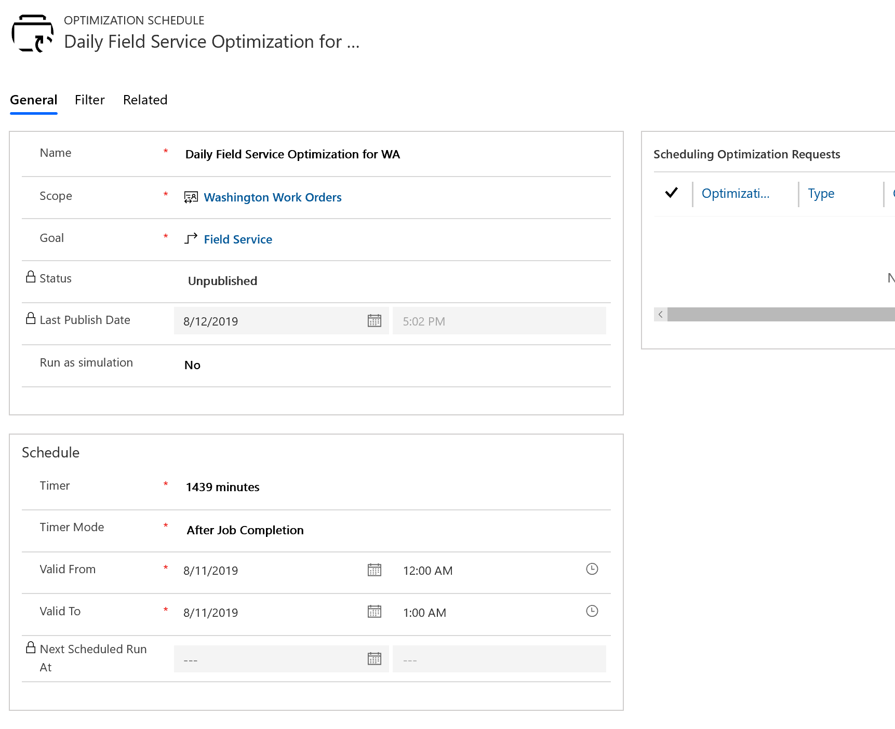

Next, the **Filter** section. If you want RSO to run every night, enter the date range during which you want it to run nightly. Also enter the time of night (and specify time zone) it should run. 

> [!div class="mx-imgBorder"]
> 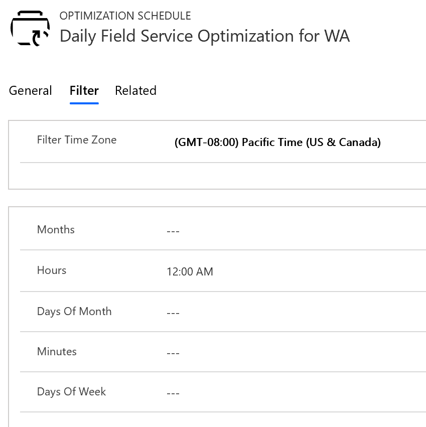

Every hour (based on the timer value previously set), RSO will check the filter values to see if it should run. In this example, every hour RSO will check to see if it should run, but only in the 12th hour of the morning (AM) will it actually run.

It is important to consider both timer and filter values when configuring RSO schedules.

Finally, **Save and Publish**.

## Step 8: Run RSO

Finally, after the schedule is **Published**, test RSO by selecting **Run Now** in the ribbon.

> [!div class="mx-imgBorder"]
> 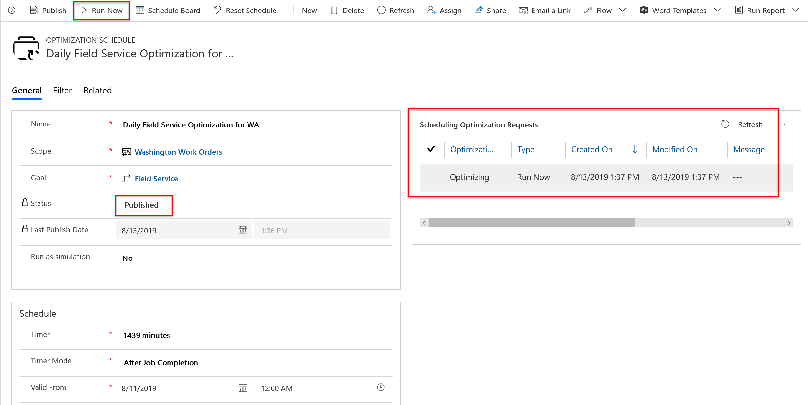

Every time RSO runs, either successfully or not, an optimization request record is created.

## Step 9: Analyze results

Once the **Optimization Request** status is **Completed**, go to the schedule board to see the optimized board.

A new schedule board tab named after your scope appears, and yellow bars indicate the beginning and ending time ranges of the optimization, in our case 2 days from the time RSO is run.

> [!div class="mx-imgBorder"]
> 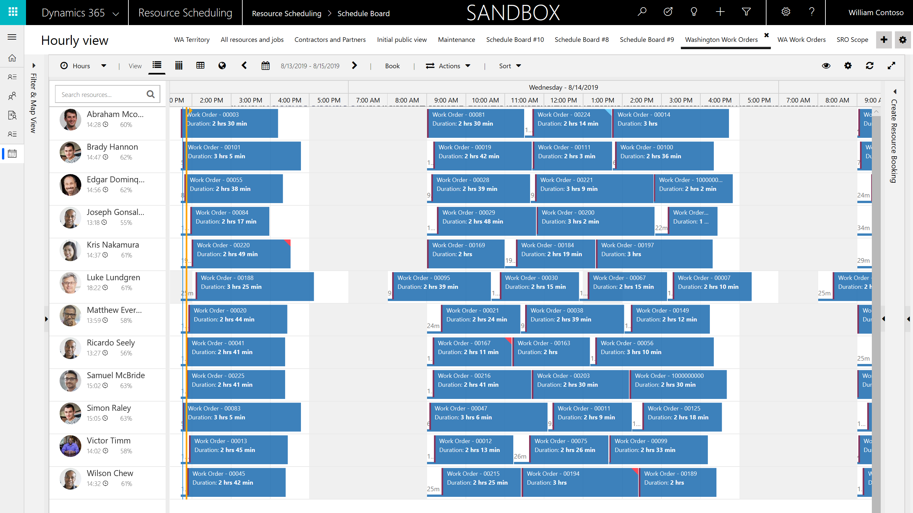

A simple example of RSO optimizing travel time is when there is no travel time between two bookings. This means there were two work orders at the same location with the same service account and RSO scheduled them back-to-back.

Back on the completed scheduling optimization request in the **Bookings** tab, you will see a list of bookings created or deleted, and a graph of the total travel time and working time of the optimized bookings.

> [!div class="mx-imgBorder"]
> 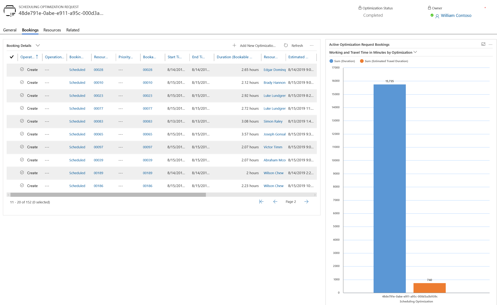

Congratulations! You have successfully run RSO!

### See also

-  [QuickStart: Auto schedule a list of work orders](https://youtu.be/oJ-3HTJWRMo)
- [RSO frequently asked questions](rso-faq.md)
- [RSO configurations](rso-configuration.md)
