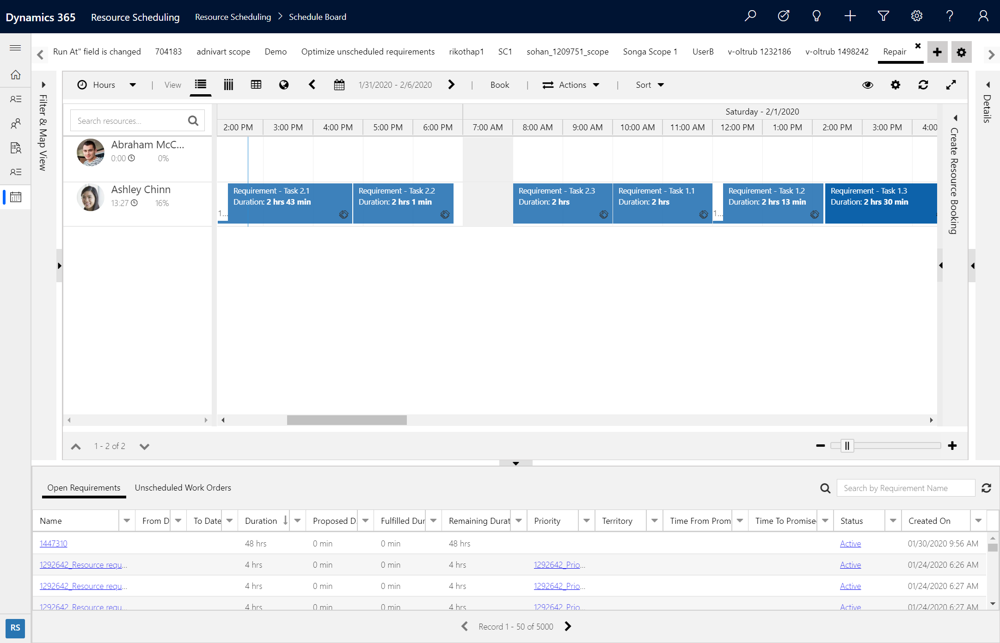
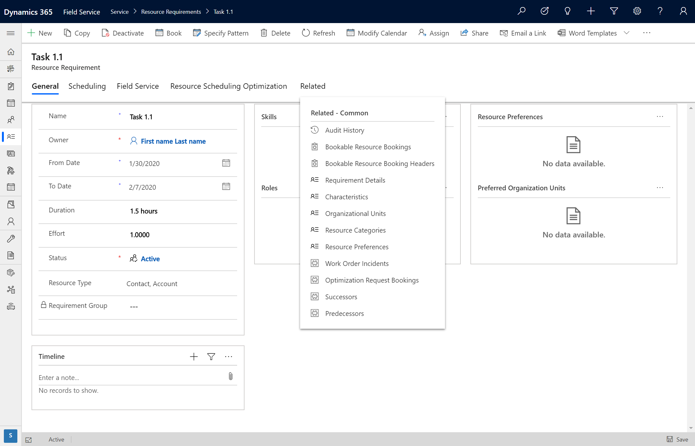
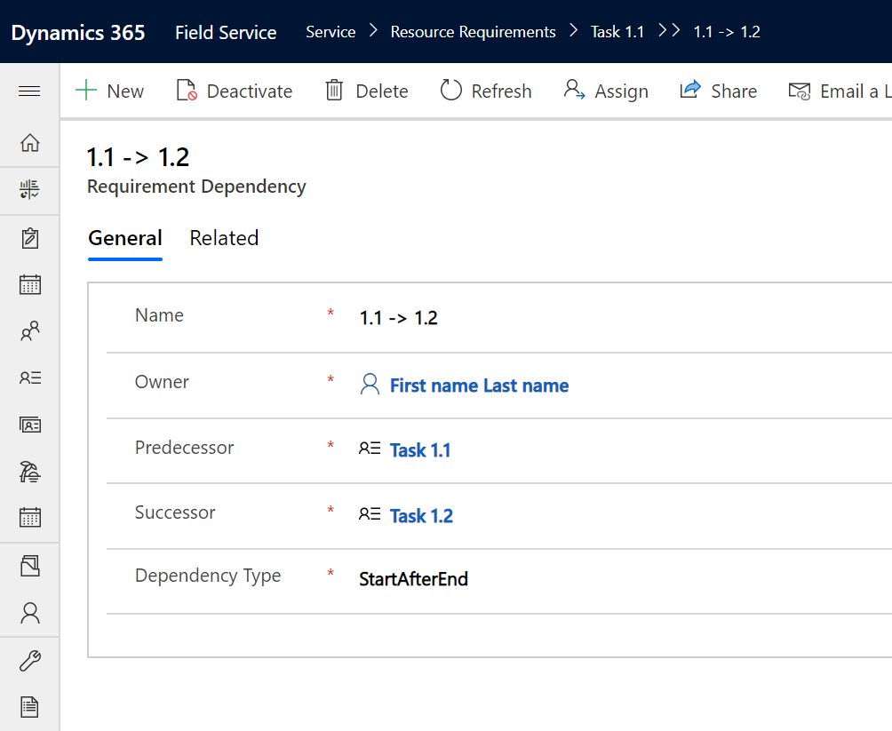
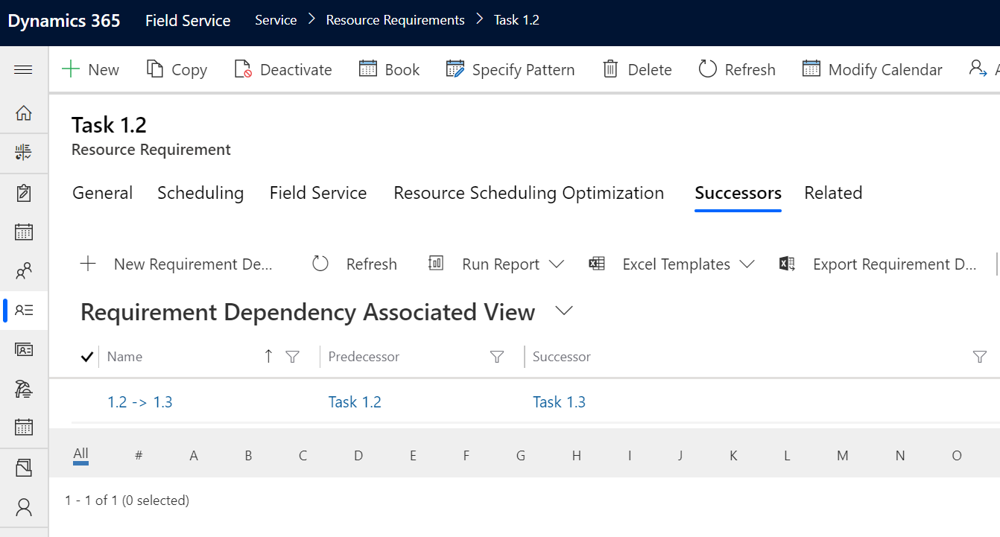

# Schedule in sequence with requirement dependencies

Ensure resource scheduling optimization autoschedules requirements in sequence by adding requirement dependencies.

Consider the following scenarios that might call for requirement dependencies:

1. A technician needs to travel to one location to pick up a unique part from the warehouse before performing at a customer's site.
2. A work order must be completed and approved before another work order can begin. For example, a physical installation must occur before an electrical connection.

Requirement dependencies let you schedule requirements in a specific order by relating them through a predecessor and successor dependency relationship. When resource scheduling optimization runs, it ensures the requirements are scheduled in the correct order where the start time of the defined predecessor is after the end time of the predecessor. 

> [!div class="mx-imgBorder"]
> 

In the previous screenshot, you can see resource scheduling optimization scheduled requirements "Task 2.1," "Task 2.2," and "Task 2.3" in order.

## Instructions

First, create two or more requirements. This can be done manually by creating two requirements, or by utilizing the requirements that are automatically created when a work order is created.

Go to the requirement that should be completed first, and then go to **Related** > **Successors**.

> [!div class="mx-imgBorder"]
> 

Add the first requirement as a predecessor and the second requirement as a successor. In the following example, we have two requirements - Task 1.1, which should be completed first followed by Task 1.2, which should be completed second. Leave **Dependency** type as _StartAfterEnd_.

> [!div class="mx-imgBorder"]
> 

For every requirement, add a requirement dependency. In our example, there's another requirement "Task 1.3" that must be performed after Task 1.2. To accomplish this, we added another requirement dependency record from requirement Task 1.2 as seen in the following screenshot.

> [!div class="mx-imgBorder"]
> 

After creating each requirement and adding the desired requirement dependencies, run resource scheduling optimization. Assuming the requirements are within resource scheduling optimization's scope, resource scheduling optimization will respect the dependencies. There's no need to add a constraint or objective to the optimization goal.

> [!div class="mx-imgBorder"]
> 

In the previous screenshot, the requirements Task 1.1, Task 1.2, and Task 1.3 were all scheduled in order. You can see there's expected travel time between Task 1.1 and Task 1.2; this indicates a different location and was respected by resource scheduling optimization. 

## Configuration considerations

- Requirement dependencies are only compatible with single requirements and not requirement groups.

- Dependencies will only work for single resource scenarios meaning successive requirements will only be scheduled to the same resource as the predecessor was scheduled to.

## Additional notes

- Requirement dependencies are not considered by the schedule assistant or when manually scheduling via the schedule board. 

- Resource scheduling optimization will ensure the start time of the successor is after the end time of the predecessor. If all requirements can't be completed on the same day, resource scheduling optimization will schedule the following day to the same resource assuming the following day is within the time scope of resource scheduling optimization. In the following screenshot, requirement "Task 2.3" was scheduled on the day following requirement "Task 2.2."  

> [!div class="mx-imgBorder"]
> 

- If needed, resource scheduling optimization will schedule successive requirements around existing bookings in cases where an existing booking is locked and cannot be moved. 

[!INCLUDE[footer-include](../includes/footer-banner.md)]