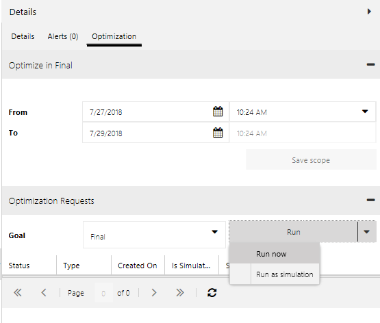
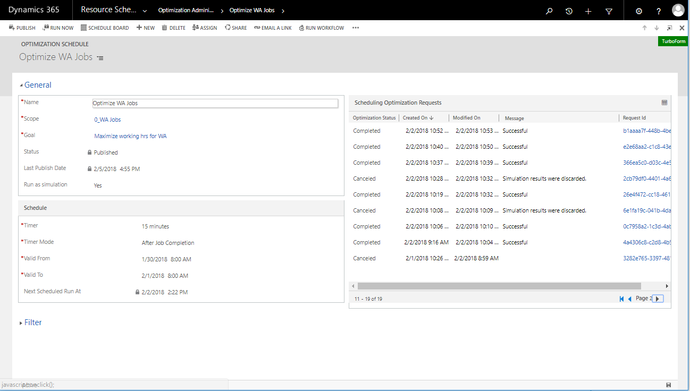
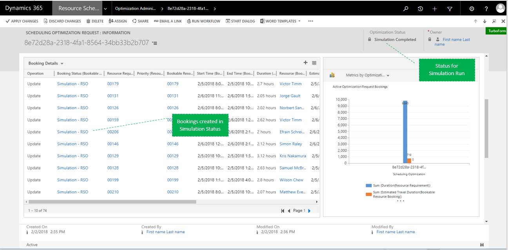
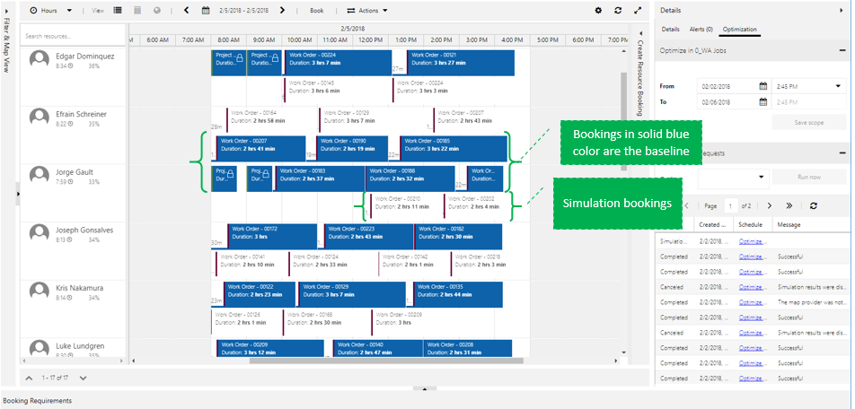
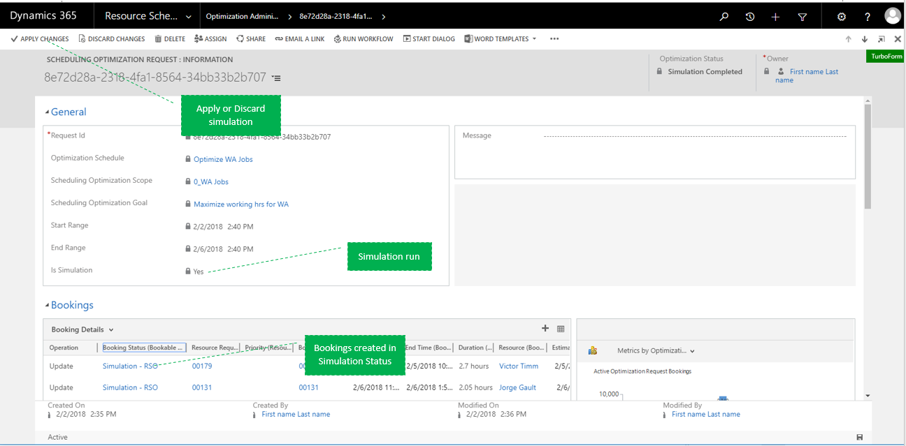
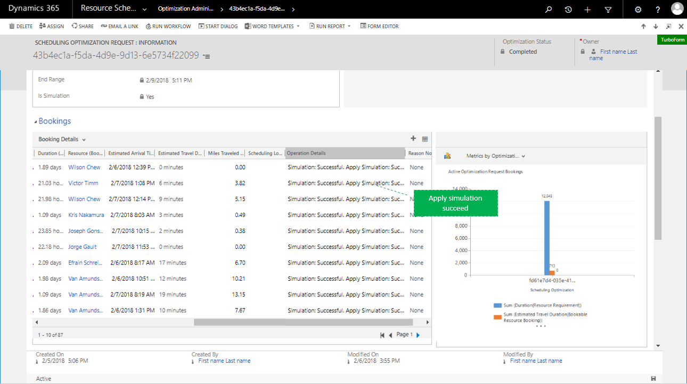

# Run resource scheduling optimization as a simulation

Running an optimization as a simulation allows resource scheduling optimization admins to better adjust:  

- Optimization scope (include/exclude more resources)
- Objectives (reorder objective rankings)
- Other parameters

With simulation runs, admins can see what optimization results will look like for each run before locking down the recurring schedule. The simulation feature also empowers admins to review optimization results before pushing the assignments to all resources, or to discard the results and rerun by adjusting optimization parameters.

## Prerequisites

- Resource scheduling optimization version 2.6+

## How to trigger a simulation run

There are two ways to run an optimization request in simulation mode:

1. **Triggering a simulation run through the schedule board.** To do this, open the resource scheduling optimization schedule board, select **Run**, and then select **Run as Simulation**. This triggers a simulation optimization request. Selecting **Run Now** triggers a regular optimization request.

  > [!div class="mx-imgBorder"]
  > 

2. **Triggering a simulation run from the optimization schedule.** While on the optimization schedule, check **Yes** for Run as Simulation. Then select **Run Now** to trigger an optimization request.

  > [!div class="mx-imgBorder"]
  > 

This is what an open optimization request looks like, allowing users to review simulated booking details and the optimization status.

> [!div class="mx-imgBorder"]
> 

Users can also review their simulations through the resource scheduling optimization schedule board, as shown in the following screenshot.

> [!div class="mx-imgBorder"]
> 

After reviewing the results of their simulation runs, users can then apply or discard the simulation.

> [!div class="mx-imgBorder"]
> 

> [!div class="mx-imgBorder"]
> 

[!INCLUDE[footer-include](../includes/footer-banner.md)]