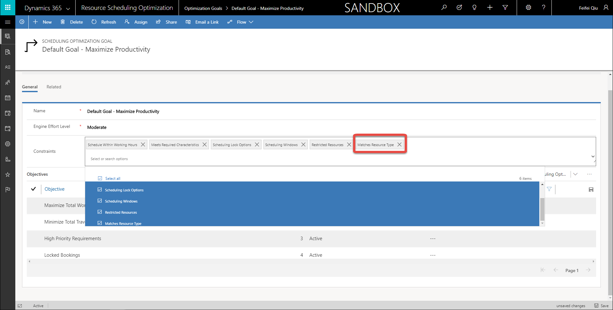
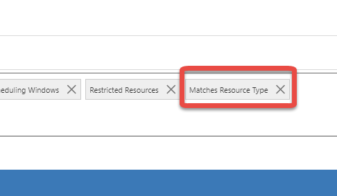

### add metadata

# Single resource optimization

The single resource optimization capability provides a quick way to re-optimize a resource's schedule and travel route after schedule changes and cancellations have occurred during the day. For example re-optimizing a resource's schedule corrects overlapping booking when the resource is assigned an emergency work order, or arrives at a customer location late due to traffic.

>

## Prerequisites

- Resource scheduling optimization version 2.8 or higher

- **Optimize Schedules** is set to **Yes** for the bookable resources

- Default goal in **Resource Scheduling Optimization** > **Optimization Goals**. A default goal is created automatically when optimization runs.

## Optimize the schedule for a single resource

There are two ways to use the schedule board to optimize the schedule for a single resource:

- **One click with defaults:** From any schedule board view, optimize the schedule with one click by setting a time range to the end of the current day for the default goal.

**Note:** One click with defaults requires Field Service version 8.0 or higher

- **Advanced with edits:** Optimize the schedule for a single resource by editing the goal and time range, running the optimization as a simulation, and then applying or discarding the results. This capability is only available from the schedule board view associated with the optimization scope.

### Optimize with one click

1. From the schedule board, right click the resource's name, and then select **Optimize Schedule**. 
>

  a. Yellow line indicates default optimization range, from now to the end of today (12am)
  b. Gray mask indicates default optimization range, from now to the end of today (12am)
  c. Optimization panel showing resource name, default range, default goal, and optimization request status
  
>

### Perform advanced optimization with edits

1. Set the optimization range to the date and time.

2. Select the optimization goal.

3. Select **Run Now** to run the optimization and schedule bookings.
>

- **Run Simulation** runs the optimization and schedules simulated bookings shown as white. Apply or discard simulation results. NOte that simulated bookings don't show on map with routes.

- Optimization panel showing optimization request status
>

## Additional notes

- A default goal is required for single resource optimization to work. A default goal is automatically created when deploying the optimization.
- Single resource optimization only re-optimizes current bookings and does not create new bookings.
- Single resource optimization can re-optimize bookings that were booked manually, booked via resource availability search, or booked from location agnostic requirements.

- This capability appears on the schedule board for all resources as long as optimization is deployed in the environment. However, single resource optimization only works if **Optimize Schedules** is set to **Yes** for the bookable resource. The single resource optimization capability can't be disabled or hidden.

>

# Other Enhancements

## Default optimization goal

When Resource Scheduling Optimization is deployed for the first time, the system will automatically create a default goal with some constraints and objectives enabled. As a reminder, a goal in Resource Scheduling Optimization is what the tool aspires to optimize. An example of a 2 goals is to maximize working hours or minimize travel time.

- Default goal has below constraints and objectives enabled, user can modify as needed

>
>

- The default goal is used when single resource optimization is selected from the schedule board.
>

- If needed, a user can create a new optimization goal and associate it as a default goal

## Enabled constraint for matching resource type

The latest version of Resource Scheduling Optimization has a new constraint called **Matches Resource Type**. As a reminder, a constraint is a resource and requirement attribute the optimization considers when automatically assigning jobs. With this new constraint, the optimization will match the resource type between requirements and resources to decide which type of resource can fulfill a requirement. This brings Resource Scheduling Optimization functionality closer to functionality available for Resource Availability Search.

Bookable Resources can have different resource types including:

• Generic *

• Users *

• Contacts *

• Accounts *

• Equipment *

• Facility *

• Crew

• Pool

\* indicates resource types the optimization will consider

In general, resource types define how the resource relates to the organization. As an example, resources with resource types of User are generally employees, whereas resource types of contacts or accounts may signify contractors.

Additionally, Requirements have a multi-select option to specify which resource types are desired for the given requirement.

>

With the new release, the optimization will now consider resource types of requirements when assigning resources to those requirements, if the resource type is one of the following:

• Generic

• Users

• Contacts

• Accounts

• Equipment

• Facility

To enable this feature, navigate to Optimization Goals and add it as a constraint.

>
>

If the Optimization Goal is related to an active Optimization Schedule, you will need to republish the schedule.

## Additional Notes

• Resource Scheduling Optimization will ignore requirements where resource type = pool or crew.

• If a requirement has resource type = user and crew (ie one resource type that is considered by optimization and one that is not) the optimization will attempt to find a User resource to fulfill the requirement.
