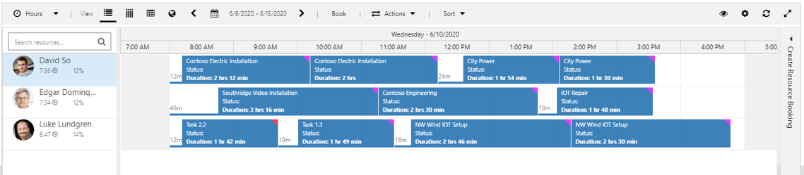
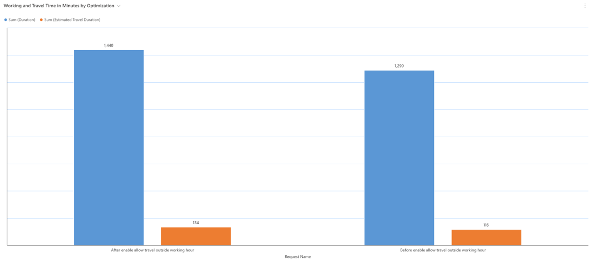
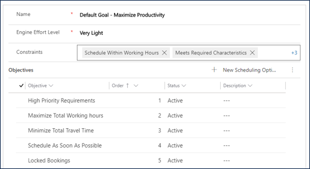
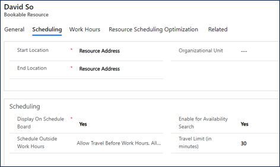
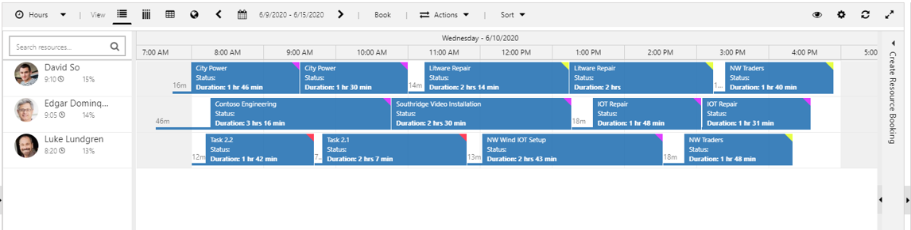

# Allow travel time outside of working hours with resource scheduling optimization

By default, resource scheduling optimization will act as though travel is a part of a technician's defined workday. But because different field service organizations have different policies around technician travel, this default isn't always ideal.

For example, a technician may have a work day defined as 8 AM to 5 PM. Without this configuration, the optimization will schedule the technician to begin traveling at 8 AM, which means the technician would not arrive or begin work until some time after 8 AM.

By enabling **Allow travel time outside of working hours** on an optimization goal, it gives the optimization permission to have the technician begin their day a little earlier, assuming it is spent traveling and not working. The optimization will schedule the technician to begin traveling before working hours and arrive at the work order location when their day begins (within defined limits).

In the following screenshot, you'll see a daily schedule *without* **Allow travel time outside of working hours** enabled.

> [!div class="mx-imgBorder"]
> 

In the next screenshot, you'll see that same schedule *with* **Allow travel time outside of working hours** enabled.

> [!div class="mx-imgBorder"]
> 

By not considering travel time as part of a technician's working hours, schedulers may see improved resource utilization.

> [!div class="mx-imgBorder"]
> 

In this article, we'll walk through how to enable **Allow travel time outside of working hours** in resource scheduling optimization.
For more information, see the following video for a walkthrough.

> [!VIDEO https://www.microsoft.com/videoplayer/embed/RE4Fe9O]

## Prerequisites

- Resource scheduling optimization v3.x+ (Field Service v8.x+).

## Edit resource scheduling optimization constraints

Go to **Resource Scheduling Optimization** > **Optimization Goals** and select or create an optimization goal.

On the optimization goal, remove the constraint **Schedule Within Working Hours**.

> [!div class="mx-imgBorder"]
> 

## Enable Resource for scheduling outside working hours

Once the optimization goal knows to ignore working hours during a run, it's time to define which resources we want to consider for travel outside of work hours.

Go to a bookable resource, and then the **Scheduling** section.

For **Schedule Outside Work Hours**, you can enter either of both of the following values: 

- **Allow Travel Before Work Hours**
- **Allow Travel After Work Hours**

Next, enter a **Travel Limit (in minutes)**, which will tell resource scheduling optimization how out from the resource's working hours it can consider. In our example, resource scheduling optimization will consider travel times 30 minutes outside of this resource's defined working hours.

> [!div class="mx-imgBorder"]
> 

## Run an optimization

Now it's time to test your work. You can either run resource scheduling optimization manually, through a defined schedule, or trigger it through a workflow.

Travel time begins before the start of working hours, as shown in the following screenshot.

> [!div class="mx-imgBorder"]
> 

Since we used 30 minutes as our travel time limit example, you'll see that is respected in this example optimized schedule.

Note too that in our previous example, if travel time exceeds our time limit outside of working hours, the travel time will adjust and push the work start time a bit later to respect the time limit.

## Configuration considerations

- You can't have different travel limits before and after working hours. For example, you can't configure a 30-minute travel limit before work and a 60-minute travel limit after work.

### Comparing the end of day for "Schedule within working hours" constraint and "Travel outside working hours"

When travel outside working hours is configured, the end time of the booking will be within working hours and travel time back to the resource's ending location will be outside working hours (end of day travel time is displayed as a blank space).

When the **Schedule within working hours** constraint is part of the goal, the end time will be within working hours _and_ travel time from the last booking to the resource's ending location will be within working hours.

When the **Schedule within working hours** constraint is *not* part of the goal, the end time of the booking may be near or even slightly after working hours.

[!INCLUDE[footer-include](../includes/footer-banner.md)]