# Enable an entity for scheduling

Field Service uses [Universal Resource Scheduling](./field-service/universal-resource-scheduling-for-field-service.md) (the "Resource Scheduling" app) to schedule work orders to the most appropriate resources by enabling the work order entity for scheduling by default. Based on your business processes, other entities in your system including custom entities can be enabled for scheduling. 

Enabling an entity for scheduling allows dispatchers to schedule that entity via the schedule board, the schedule assistant, and even resource scheduling optimization (RSO). 

In this article we will show how to enable an entity for scheduling and utilize the entity on the schedule board. 

**Scenario:** A solar energy company must perform consultations over the phone and on site at their customers' homes before a solar panel installation can take place because details regarding the home's structure, location, and local laws need to be discussed as part of the qualification process. The solar panel company would like to use the schedule board and other scheduling tools to assign leads to appropriate sales resources to perform the consultation and qualification process with potential customers. 

To configure this scenario, we will show how to enable the **Lead** entity for scheduling and add a new requirement view to the schedule board that specifically relates to Lead resource requirements. 

## Prerequisites
- Field Service v6.1+
- Logged in as a user with **Field Service - Administrator** or **System Administrator** security roles.

## Enable an entity for scheduling 

To enable an entity for scheduling, navigate to **Resource Scheduling > Administration > Enable Resource Scheduling for Entities**.

> [!div class="mx-imgBorder"]
> 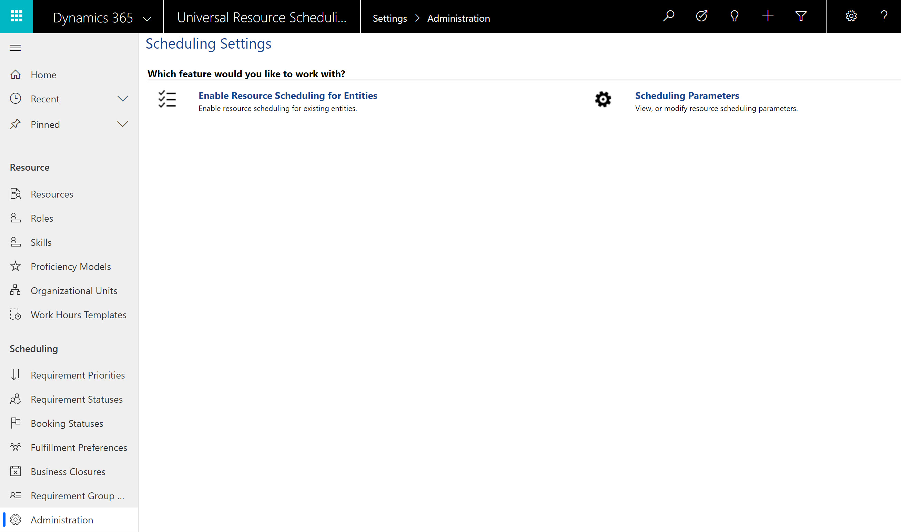
 
On the right is a list of entities that have been enabled for scheduling. Appointments, Projects, and Work Orders are enabled for scheduling by default if you have Field Service and Project Service Automation solutions installed.

On the left is the process to enable a new entity for scheduling. 

**Add Entity:** select the entity from the list fo entities in your Dynamics organization. In this example we will choose the **Lead** entity.

**Booking Relationship:** Select "Create New Relationship"

**Requirement Relationship:** Select "Create New Relationship"

> [!div class="mx-imgBorder"]
> 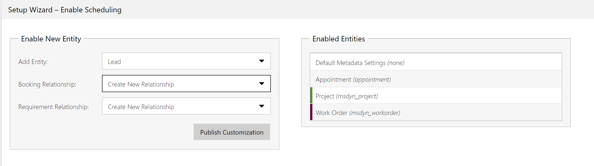

> [!Note]
> If you have previously created relationships from the entity to the Bookable Resource Booking or Resource Requirement entities then they can be selected here as well. 
 
Next, click **Publish Customizations**.  

To edit settings for how Leads are booked, double-click Leads once it appears in the Enabled Entities section. As an example, default booking statuses and whether the entity is enabled for [Quick scheduling](./field-service/quick-scheduling.md) can be edited.

> [!div class="mx-imgBorder"]
> 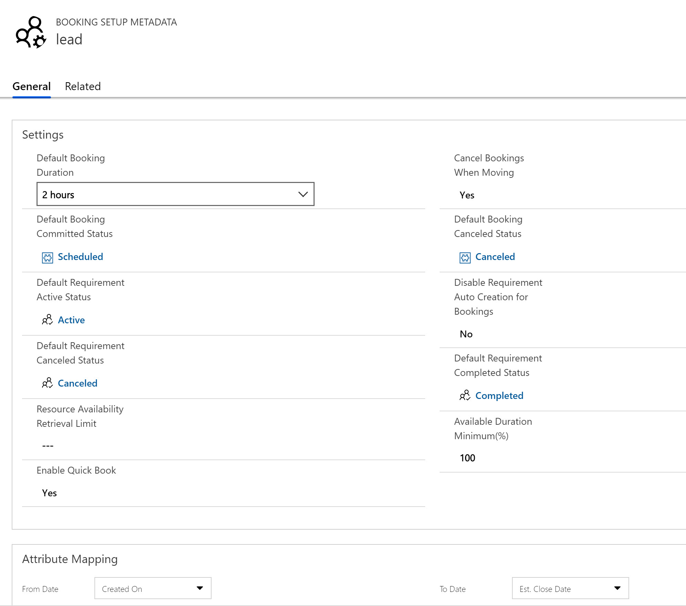
  
You have successfully enabled an entity for scheduling when
1) **Requirements** (also known as "Resource Requirements") show as a related entity and 
2) the **Book** button is displayed on the top ribbon.

> [!div class="mx-imgBorder"]
> 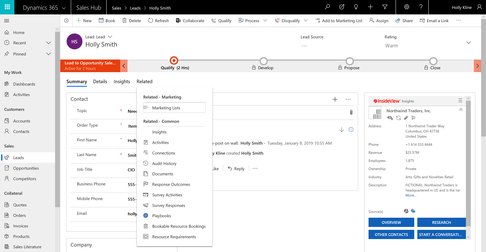

Before scheduling a Lead, a related Resource Requirement must be created. These can be created manually or created by a custom workflow. To create a Resource Requirement, navigate to the **Related** tab on the Entity and choose **Resource Requirements**.

> [!Note]
> As part of the Field Service solution, Requirements are automatically created when Work Orders are created.

Click the New button to create the new Resource Requirement.  

> [!div class="mx-imgBorder"]
> 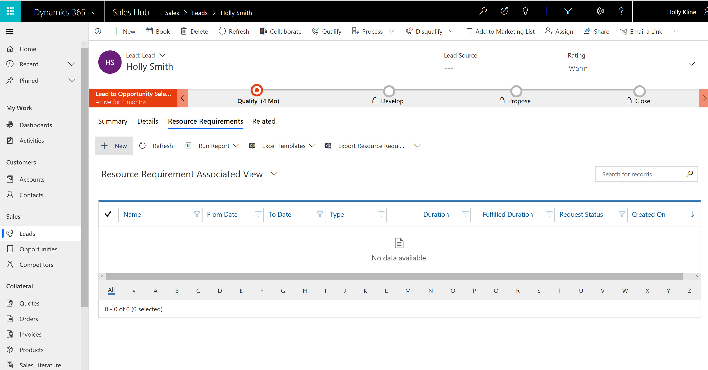
 
Populate the information that will provide details on what requirements are needed for a recourse to be scheduled to this Lead including dates, duration, priority and territory. 

> [!div class="mx-imgBorder"]
> 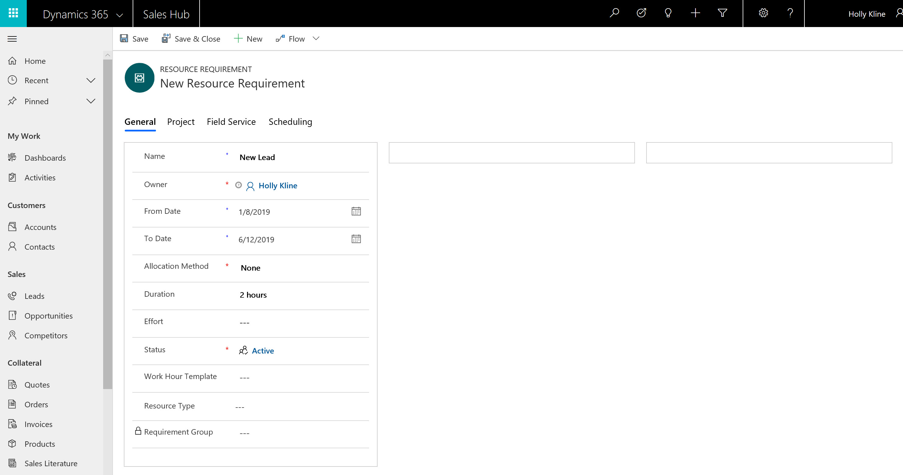

Once the Requirement is created, you can book the Lead to resources by selecting the Book button.

> [!div class="mx-imgBorder"]
> 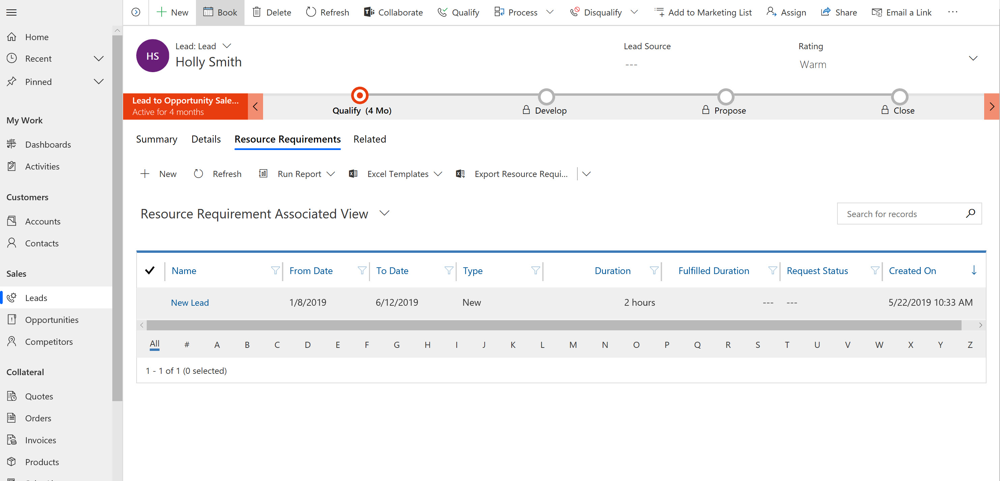

This will trigger the schedule assistant and display available resources that meet the criteria on the requirement.

> [!div class="mx-imgBorder"]
> 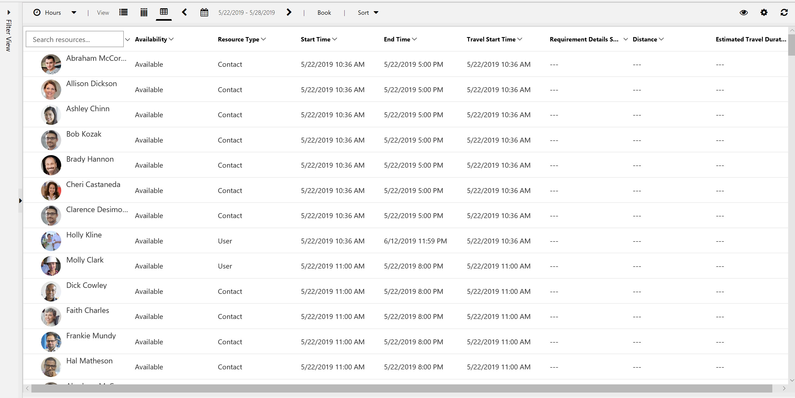

However if Quick Book is enabled for the entity, the Book button will trigger the Quick Scheduler side panel that also shows available resources that meet the criteria on the requirement.

> [!div class="mx-imgBorder"]
> 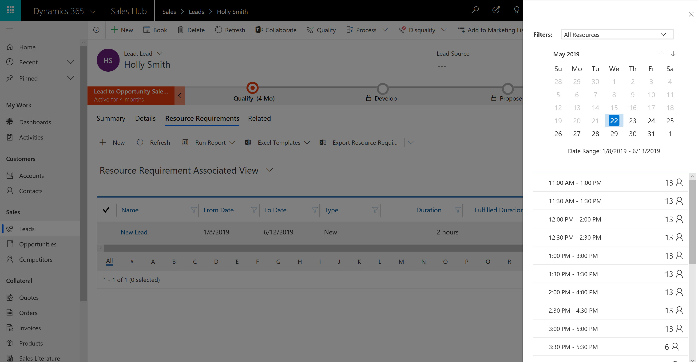
 
Once the Lead is booked, a new Bookable Resource Booking ("Booking") record is created and is also shown as a related entity.  

> [!div class="mx-imgBorder"]
> 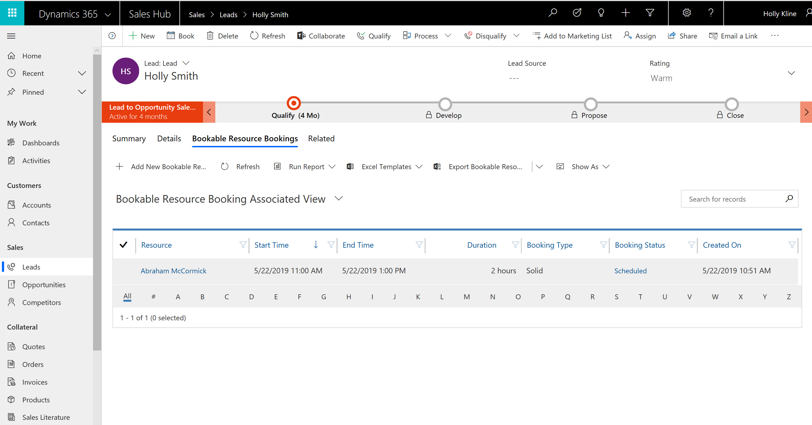

Next let's talk about scheduling Lead requirements from the schedule board.
  

## Add a requirement view to the schedule board

After creating a requirement for the Lead, it will appear in the Open Requirements view in the lower pane of the schedule board that shows all open requirements related to any scheduleable entity. This is a default view installed with Resource Scheduling.

> [!div class="mx-imgBorder"]
> 

However, the views in the lower pane of the schedule board are simply system views and can be edited and added to. It is common to add custom resource requirements views for solely work orders or leads in our example. Let's create a schedule baord view that shows only leads to be scheduled.

Navigate to **Settings > Customizations > Entities > Resource Requirement > Views**.  

> [!div class="mx-imgBorder"]
> 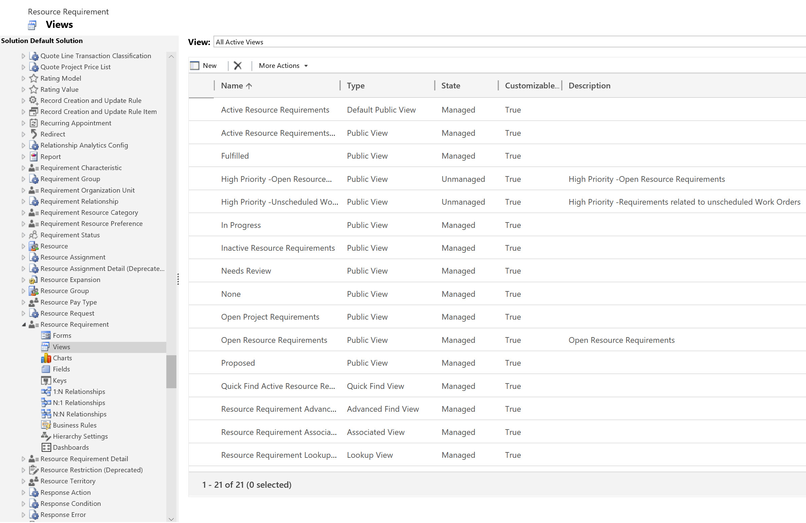

And create a new view and add fields to the view that will provide details to what you are scheduling. Use the drop down to capture fields from the Entity (in this case Lead). Then name the view using the properties or Save As functions. In this example we will call it "Unscheduled Leads." 

> [!div class="mx-imgBorder"]
> 
 

> [!div class="mx-imgBorder"]
> 
 
**Most importantly**, edit the Filter Criteria to display the appropriate records.  To ensure only the Lead Resource Requirements will be displayed, select the Lead entity and filter the records appropriately.  

> [!div class="mx-imgBorder"]
> 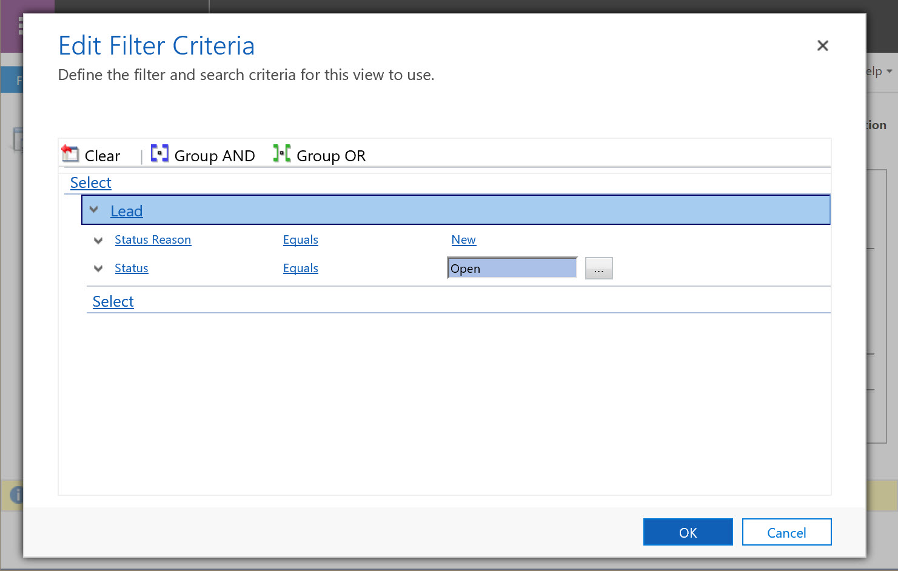
 
Save and Close & Publish.  

 
The final step to view this on the Schedule Board, is to edit the Schedule Board that you will be using to Schedule the Entity. 

Go to the Schedule Board and select the + icon in the top right to add a new tab.

> [!div class="mx-imgBorder"]
> 

> [!div class="mx-imgBorder"]
> 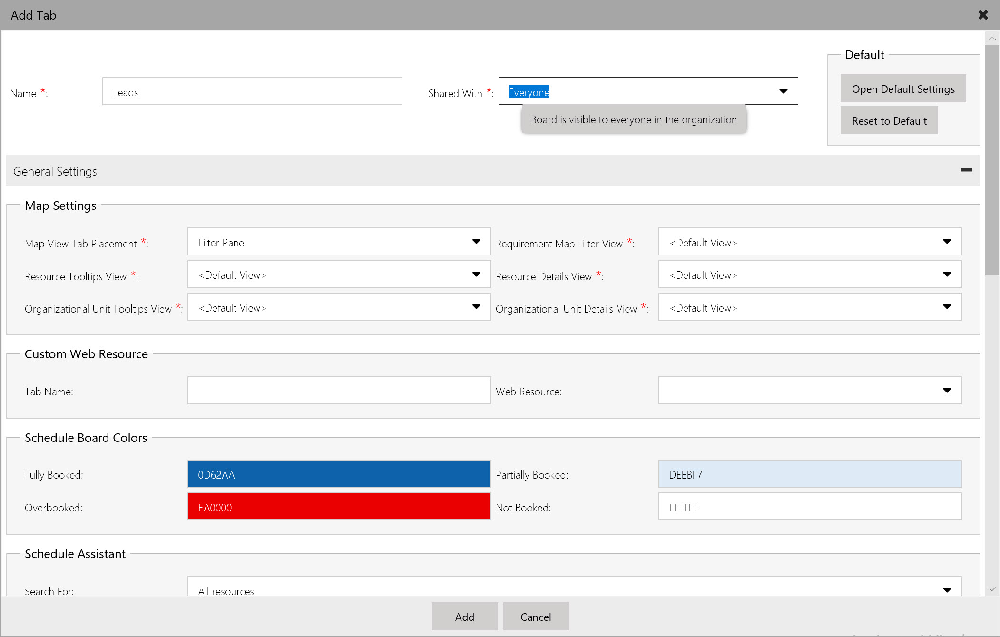

In the Requirement Panels section, add a Title and select the new View. Click + to add the view.  
Screenshot of

> [!div class="mx-imgBorder"]
> 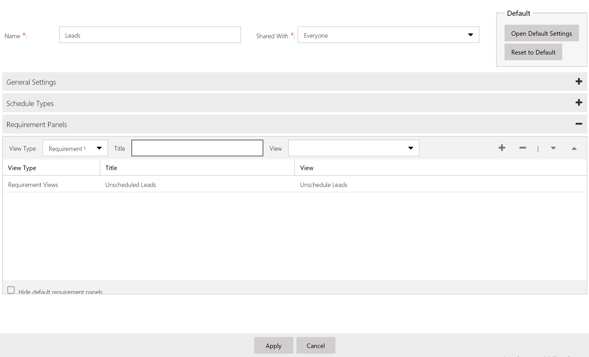
 
Choose “Hide default requirement panels” if you don’t want to display the other tabs.  

> [!div class="mx-imgBorder"]
> 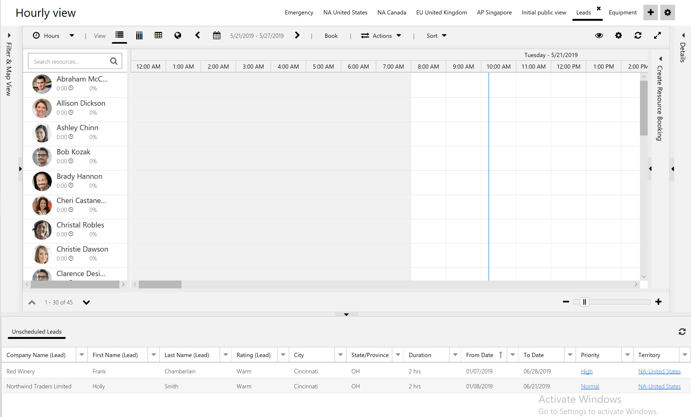

> [!Note]
> You may have many Lead records in the system, but if there are no requirements related to the leads, then no records will show on the schedule board. Resource requirements will need to be created for each Lead you want to schedule either manually or via a workflow to auto create upon creation of a Lead.  

## Configuration considerations
### Onsite Leads

If resources must perform work on site at the customer's location and travel time and distances should be considered when scheduling, it is recommended to use the Work order entity as it is designed for on site service. However if you would like to use Leads 

- schedule onsite leads and custom entities 
- BSM for default lat and long

> [!div class="mx-imgBorder"]
> 

## Additional Notes
- If the entity that you want to enable for scheduling is not displayed, you have to check the Managed Properties settings for that entity. If by chance the "Can be customized" setting is set to False, then that's the reason why the entity is not being displayed. This is true even if the entity is in unmanaged state (development environment). Another strange issue I've faced (and thanks to MS support I'd been able to fix) is changing that flag to False. The steps to solve this issue is creating a solution patch (using Clone as patch feature) from the solution that contains the custom entity. Then add that entity to the patch, update the Can be customized flag to True and publish entity. Then you can delete the patch.
- To turn off scheduling for the entity, on the command bar, click DEACTIVATE. On the Confirm Deactivation dialog box, click Deactivate.

