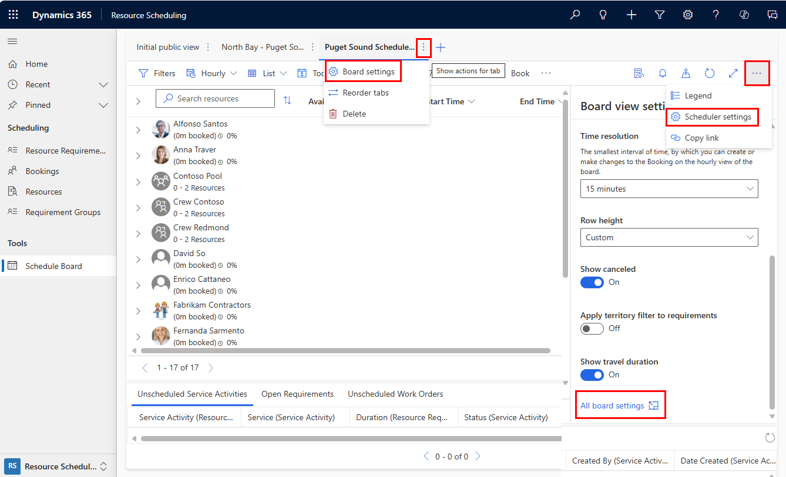

# Schedule Board Tab Settings

Schedule board tab settings allow you to define the layout and functions of schedule board tabs.

There are three ways to access a particular schedule board's tab settings:  

1. double click the name of the schedule board tab 
2. while viewing the schedule board tab, click the gear icon in the top right of the schedule board
3. while viewing the schedule board tab, choose the **settings icon > Open Tab Settings**

> [!div class="mx-imgBorder"]
> 

**Name:** this field dictates the name displayed at the top of the schedule board

**Shared With:** decides which users can view the schedule board tab
- Everyone
- Specific People - after choosing this option, you can select the specific people to share the schedule board with by doing an Advanced Find of the **Schedule Board Settings** entity and sharing the related schedule board record with the specific users  
- Just Me

> [!Note]
> Users with **Field Service - Administrator**, **Field Service - Dispatcher**, and **Field Service - Resource** security roles can edit schedule board tab settings of schedule boards they create or are shared with them specifically meaning the **Shared With** field = Everyone or Specific People AND the schedule board is shared with their user.

> [!div class="mx-imgBorder"]
> 

**Open Default Settings:** Lets you choose the default tab settings when new Schedule Boards are created. When values in a particular Schedule Board Tab Setting display **< Default View >**, this means the value is coming from the default tab settings. As in the image below, when the **Open Default Settings** button is selected, the **< Default View >** values are replaced by the actual values and you are now editing default schedule board tab settings.

> [!div class="mx-imgBorder"]
> 

**Reset to Default:** Selecting this button will reset the current tab setting values to the values outlined in the default settings.

## General

### Map Settings

The Map Settings section allows you specify the placement of the map and the views displayed when selecting or hovering over map records.

 
**Map View Tab Placement**

When set to **Filter Pane**, the map will be placed on the left-hand side. This allows schedulers to see both the map and the details of the selected record at the same time.

> [!div class="mx-imgBorder"]
> 
 
When set to **Details Pane**, the map will be placed on the right-hand side. This allows schedulers to see both the filter pane and the map at the same time. 
 
> [!div class="mx-imgBorder"]
> 
 
**Requirement Map Filter View**

This view dictates the resource requirement records displayed on the map. The setting lists public views related to the Resource Requirement entity for selection. Resource requirements need to have a latitude and longitude to display it on the map. Again, as a best practice copy the default view and apply changes to the copy.

**Resource Tooltips View**

This view dictates the fields displayed in a tooltip that appears when a scheduler hovers over a resource map pin. The setting lists views that are based on the Bookable Resource entity, only public views are available for selection. Even though you can change existing views, it is a better practice to copy the default view and apply changes to the copy.

> [!div class="mx-imgBorder"]
> 

**Resource Details View**

This view dictates the fields displayed in the details pane when a resource map pin is selected. The details pane is on the right-hand side of the schedule board and may have to be expanded. The setting lists public views related to the Bookable Resource entity for selection. 

> [!div class="mx-imgBorder"]
> 

**Organizational Unit Tooltips View**

This view dictates the fields displayed in a tooltip that appears when a scheduler hovers over a organizational unit map pin. The setting lists public views related to the Organizational Unit entity for selection. Even though you can change existing views, it is a better practice to copy the default view and apply changes to the copy.

> [!div class="mx-imgBorder"]
> 

**Organizational Unit Details View**

This view dictates the fields displayed in the details pane when an organizational unit map pin is selected. The details pane is on the right-hand side of the schedule board and may have to be expanded. The setting lists public views related to the Organizational Unit entity for selection.
 
> [!div class="mx-imgBorder"]
> 
 

### Custom Web Resource

Web resources represent files that can be used to extend the Microsoft Dynamics 365 web application such as html files, JavaScript, and Silverlight applications. This section allows you to utilize web resources from the schedule board, which can help dispatchers perform more functions and increase utilization. 

**Tab Name:** The chosen web resource will be displayed in the details pane on the right-hand side of the schedule board. A new tab with the name entered here will appear next to the alerts tab. In the example image below, "Web Resource" was entered for the tab name.

**Web Resource:** Select a web resource from your dynamics 365 organization.

> [!div class="mx-imgBorder"]
> 

### Schedule Board Colors

The colors chosen in this section only apply to the Days, Weeks, and Months views of the schedule board and represent resources' utilization. Utilization is calculated as the hours booked compared to working hours for the schedule board time range. 

In the image below is a Days view of the schedule board where each resource works 12 hours each day and the range is 2 days. 

**Fully Booked:** Blue because the total booking duration (12 hours) equals the working hours for that particular resource's day.

**Partially Booked:** Light Blue diagonal lines because the total booking duration (7 hours) is less than the working hours for that particular resource's day.

**Overbooked:** Red because the total booking duration (14 hours) exceeds the working hours for that particular resource's day.

**Not booked:** White because no bookings exist for that resource for that day.

> [!div class="mx-imgBorder"]
> 

### Schedule Assistant

**Search For** 

This setting decides the default value for the Search for field in the schedule assistant filter pane. Set to **All resources** to search for all applicable resources in the system that meet the schedule assistant filters for the requirement. Set to **Resources visible on board** to search for resources that meet the schedule assistant filters for that requirement AND meet the current schedule board resource filters (are visible on the schedule board the schedule assistant was triggered from). This schedule assistant filter value can still be manually changed by the dispatcher at the time of scheduling. If a scheduler is responsible for a specific schedule board and specific resources, then the **Resources visible on board** is recommended because this ensures the scheduler cannot schedule requirements to other resources he or she is not responsible for. For smaller organizations or organizations with less rigid resource and line of business divisions, the **All resources** setting will allow schedulers to search across all applicable resources across the entire organization. 

**Unavailable Resources** 

This setting decides how unavailable resources appear when the schedule assistant is triggered. Set to **Unavailable resources do not appear** to have resources that do not meet schedule assistant filter criteria to temporarily be removed from the view of available resources to schedule to. Set to **Unavailable resources appear dimmed (when searching for resources visible on board)** to have resources that do not meet schedule assistant filter criteria to remain on the schedule board but appear dimmed. For schedule boards with many resources, using the **Unavailable resources do not appear** setting can reduce the need to scroll and make it easier for scheduler to compare available resources.

**Book Based On** 

Though booking an on site requirement (typically a work order) will always have a total duration = travel time + requirement duration, this setting changes the schedule assistant visualization to make it easier to understand when travel time starts and when the estimated arrival time is. Set to **Start of Travel** to visualize the booking start as when travel begins. Set to **Estimated Arrival** to visualize the booking start as when the resource is estimated to arrive on site. One consideration is whether the scheduler is communicating with the customer in real time over the phone because customers are typically more interested in when the resource will arrive at their location, and therefore administrators should make it easier for the scheduler to communicate this time by selecting the **Estimated Arrival**. View this [blog post](https://blogs.msdn.microsoft.com/crm/2018/04/02/whats-new-in-universal-resource-scheduling-for-dynamics-365-april-2018-update/#BookbyETA) for more details.

**Available Color, Partially Available Color, Unavailable Color**

The colors selected in the Schedule Assistant section represent how resources' availability (or unavailability) appear when the schedule assistant is triggered from the Days, Weeks, or Months view.  

> [!div class="mx-imgBorder"]
> 

> [!div class="mx-imgBorder"]
> 

**Available Icon, Partially Available Icon, Unavailable Icon**

The icons selected in the Schedule Assistant section also apply when the schedule assistant is triggered from the Days, Weeks, or Months view and are displayed along with the colors chosen in the previous settings to represent if resources are available or unavailable. 

> [!div class="mx-imgBorder"]
> 

If the **Default Available Icon**, **Default Partially Available Icon**, or **Default Unavailable Icon** boxes are unchecked, then no icons will appear.

The icons can be customized by uploading new image files in **Customizations > Customize the System > Web Resources** and referencing the path in tab settings. 

### Other Settings 

**Requirement Page Count**

Controls the maximum number of resource requirement records displayed on a single page in the view in the lower pane of the schedule board.

> [!div class="mx-imgBorder"]
> 

**Non-Working Hours Color**

Controls the color of the shaded area when a resource is not working as dictated by the resource's working hours and time off requests.

> [!div class="mx-imgBorder"]
> 

**Current Timeline Color**

Controls the color of the vertical line that runs down the schedule board to indicate the current time of that particular schedule board taking into consideration the time zone of the schedule board.

> [!div class="mx-imgBorder"]
> 

**Booking Alerts View**

System view that can filter which Booking Alerts records are eligible to show up in the Alerts view in the right-hand Details pane of the schedule board. As an example, consider a scenario where the business has booking alerts being triggered based on events related to work orders, projects, and cases. What if the particular schedule board tab only deals with work order requirements and the dispatcher should only see booking alerts related to work orders? In this case, a booking alert system view can be used to filter to only booking alerts related to work orders to be eligible in the right-hand alerts pane. Note that booking alerts still needs to be triggered based on an alarm or workflow, but the view chosen here can further filter. 

> [!div class="mx-imgBorder"]
> 

**Booking Alerts Template**

Given a Booking Alert shows in the alerts pane, the HTML entered here dictates the fields in the alert box.

As a reference, the default HTML is as follows:

    <b class="bold">Subject: </b>{msdyn_msdyn_bookingalert_msdyn_bookingalertstatus_BookingAlert.subject} 
    <b class="bold">Due: </b>{msdyn_nexttimetoshow} 
    <b class="bold">Description: </b> 
    {msdyn_msdyn_bookingalert_msdyn_bookingalertstatus_BookingAlert.description}

> [!div class="mx-imgBorder"]
> 

**Filter Layout**

Controls the fields displayed in the filter pane on the left-hand side of the schedule board. These fields are used to filter which resources are displayed on the board.

> [!div class="mx-imgBorder"]
> 

**Resource Cell Template**

Controls the images, values, fields displayed in the box that holds the resource's name and utilization on the schedule board.

> [!div class="mx-imgBorder"]
> 

**Retrieve Resources Query**

Here you will find xml that basically defines how resource records are fetched/filtered/sorted when the schedule board loads. Retrieve Resources Query can utilize filter layout and resource cell templates to perform filtering and sorting in the background. One scenario this enables is filtering resources without having to expose the filter field in the filter layout, but instead the filtering is performed in the background as the schedule board loads without additional input from the dispatcher. 

**Disable Default Extensions**

Using the Schedule Board Client Extension framework, you can modify the CSS, add your own JavaScript files, and localize the schedule board changing labels and wording on certain supported areas of the board. You can always exclude certain boards from inheriting client extensions applied to the default board by disabling default extensions on that board.

For more details on editing filter layouts, resource cell templates, and client extensions see this [blog post](https://blogs.msdn.microsoft.com/crm/2017/10/16/blog-post-july-2017-update-for-field-service-and-project-service-automation-universal-resource-scheduling-part-1/) and [this topic](https://docs.microsoft.com/en-us/dynamics365/customer-engagement/common-scheduler/developer/extensibility-release-notes).
