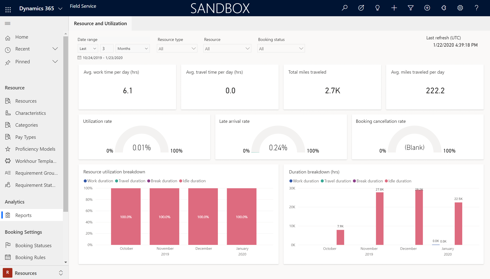
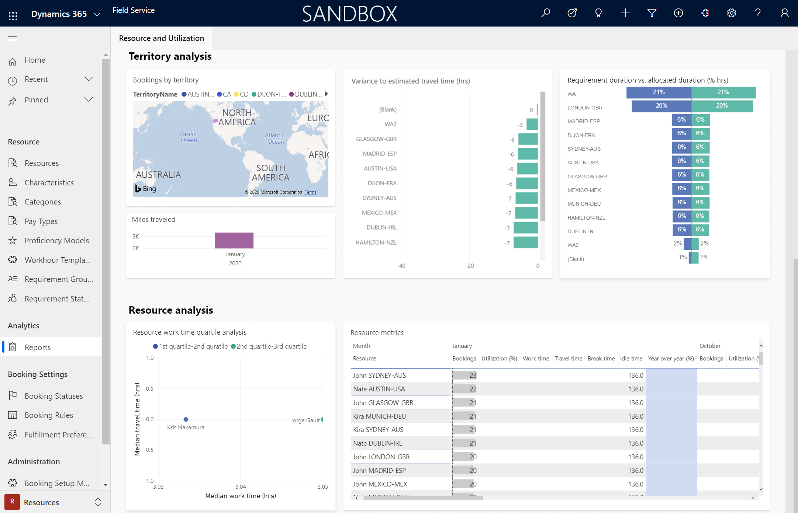
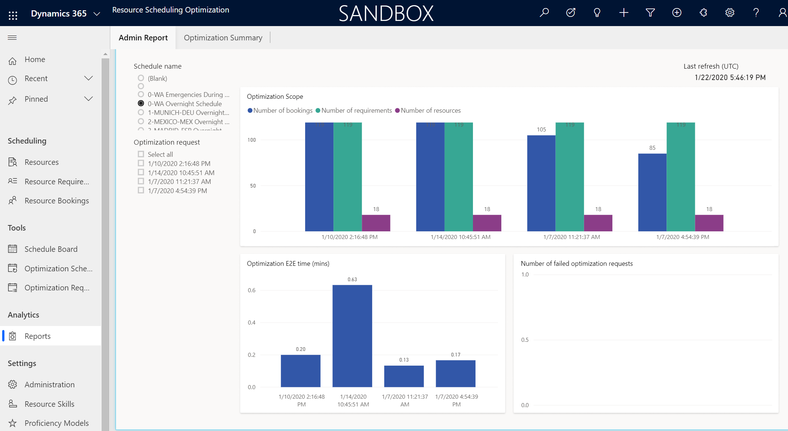
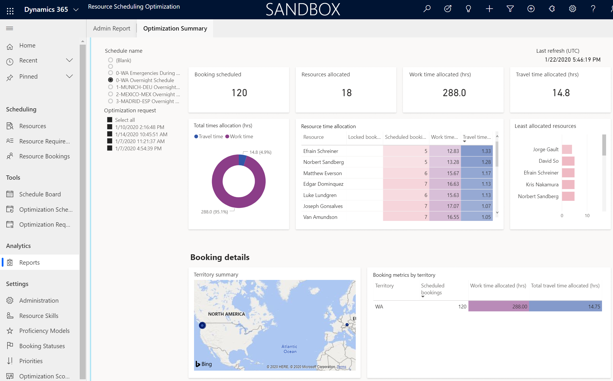
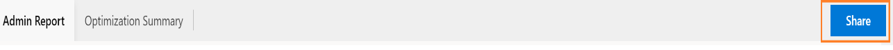
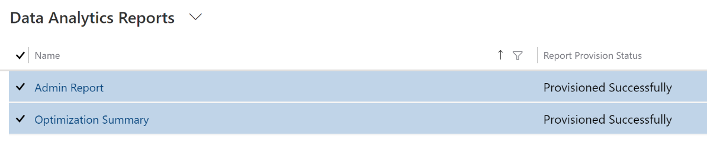
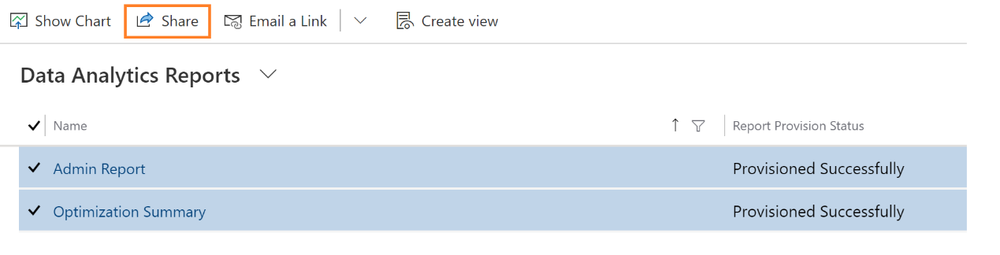
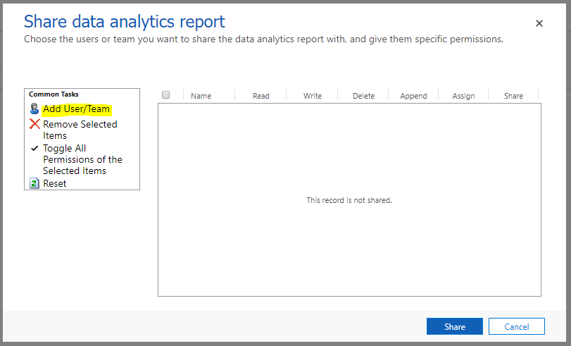
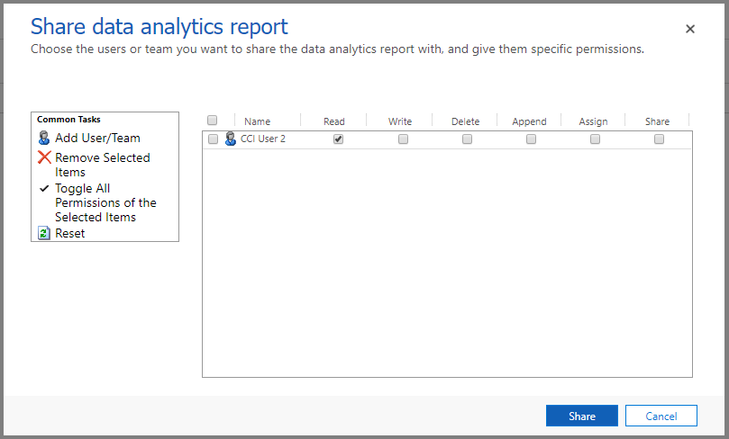

# Resource scheduling and optimization analytics dashboard

Resource and operations managers need to be able to monitor key operational metrics so that they can gauge resource and scheduling performance. Metric reports can help explore important business-related questions, like: 

-  Are my resources being effectively utilized over a certain period time? 
-  What is the average variance between estimated time and actual time for requirements and work orders? 
-  Are requirements and allocated resources balanced? 

By finding answers to these questions, scheduling managers can plan an effective resource scheduling strategy and provide better guidance to resources. Ultimately, a better strategy saves time and money, and allows for continuous improvement on customer experience. 

Field Service and resource scheduling optimization provide three reports focused on different scenarios and user personas:

1. Resource and utilization, included with Field Service
2. Resource scheduling optimization admin, included with resource scheduling optimization
3. Optimization summary, included with resource scheduling optimization
  

In this article, we'll take a look at these three reports in greater detail. 

## Prerequisites

- To get the resource and utilization report: 

  1. Install or upgrade Field Service
  2. The Resource and utilization report will appear in the Field Service app for users with **System Administrator** or **Field Service-Administrator** security roles. 

- To get both resource scheduling optimization reports:

  1. Install or upgrade Field Service
  2. Install or upgrade the **Resource Scheduling Optimization** add-in
  3. Both the resource scheduling optimization admin and the optimization summary reports will appear in the resource scheduling optimization app for users with **System Administrator** or **Field Service-Administrator** security roles. 

## Resource and utilization reports

Resource managers can use the resource and utilization report to perform the following tasks:  

- Monitor metrics across resource and utilization, time spent on bookings, and miles on truck rolls.   
- Unpack information on the territory as a whole, such as:
  - What's the allocation of bookings? 
  - Is there any territory imbalance between demand and supply? 
  - What's the estimated travel time versus the actual travel time?  
- Understand how an individual resource is using their time to react and resolve, and whether an individual resource is under- or over-utilized compared to others.  

Go to **Field Service** > **Resources** and find **Reports** under the **Analytics** section. 

> [!div class="mx-imgBorder"]
> 

Let's take a look at what each of these metrics are reporting. 

| Visuals |	Description |
| --- | --- |
| Avg. work time per day (hrs.)  |	Average length of time per day that a technician(s) works at the customer site. Total length of work time per count of days in the given time range. |
| Avg. travel time per day (hrs.) |	Average length of time per day that a technician(s) spends on travel. Total length of travel time per count of days in the given time range. 
| Total miles traveled |	Total miles on truck rolls in the given time range.  |
| Avg. miles traveled per day |	Average miles on truck rolls per day. |
| Utilization rate |The percentage of time a resource spends on work and travel in the given period from slicer. (Work duration plus travel duration) per available time on the calendar rule. Note: if the user does not set up the available time on the calendar then the default available time is 24 hours |
| Late arrival rate |	For all in-progress or completed bookings, the percentage of bookings where technician arrives later than the “Time to Promise” or “Estimated arrival time,” if “Time to Promise” is not enabled in the implementation.  |
|Booking cancellation rate |	For all in-progress or completed bookings, the percentage of bookings that have been canceled in the given time range. |
| Resource utilization breakdown  |	The visual shows the percentage of time on work, travel, break, and idle time over a period. It can break via booking status slicer, such as in progress job or completed job. Each bar in the chart shows the relative percentage of duration types in stacked columns, where the total of stacked columns always equals 100 percent. It doesn't show overtime values of any duration types. |
| Duration breakdown |	The graph shows the trend of total work time, travel time, break time, and idle time. You can also drill in to the information to see specific information for in-progress jobs or completed jobs. |

> [!div class="mx-imgBorder"]
> 

| Visuals |	Description | 
| --- | --- |
| Bookings by territory  |	Shows a map with color indicators for bookings in each territory. By hovering over a territory, you can see number of bookings, total work time, travel time, and break time. In order for this to render correctly, the territory must be a physical geographic location.  |
| Variance to estimated travel time |	Shows the variance by region between estimated travel times and actual travel times. |
| Requirement duration % vs. allocated resource duration % |	Gauge whether the total number of requirements in each territory is balanced with the total number of resources allocated to that territory. The resulting analysis shows the percentage of requirement duration versus percentage value of allocated resource duration.  |
| Miles traveled |	Shows the trend of total miles traveled per month. |
| Resource work time quartile analysis  |	Compares each resource's travel time to work time and ranks them into relative quartiles.  |
| Resource metrics |	Shows the breakdown of KPIs for each resource, including number of bookings, utilization percentage, year over year percentage change in utilization, work time, travel time, break time, and idle time. Sort the resources by number of bookings, or by year, month, week, or day. | 

## Resource scheduling optimization admin reports

The resource scheduling optimization admin report analyzes when and how resource scheduling optimization runs, but not the actual booking results.

Go to the **Resource Scheduling Optimization** app and find **Reports** under the **Analytics** section. 

To run the report, the resource scheduling optimization administrator needs to select one optimization schedule - for example, WA Schedule 1 - and select one or more optimization requests.  

> [!div class="mx-imgBorder"]
> 

| Visuals |	Description | 
| --- | --- |
| Optimization Scope: Number of bookings |	The average number of bookings in given schedule requests.  |
| Optimization Scope: Number of requirements |	The average number of requirements in given schedule requests. |
| Optimization Scope: Number of resources |	The average number of schedulable resources in given schedule requests. |
|Optimization E2E time |	This metric defines the optimization execution time. |
| Number of failed optimization requests |	The number of failed optimization requests in the given schedule requests. |

## Optimization summary reports

The optimization summary analyzes the automatically scheduled bookings and the effect this has on the business, such as an analysis of minimized travel time.

> [!div class="mx-imgBorder"]
> 

| Visuals |	Description | 
| --- | --- |
| Booking scheduled |	The total number of bookings scheduled in given schedule requests. | 
| Resource allocated |	The total number of resources allocated in given schedule requests. | 
| Work time allocated (hrs.) |	The total work time allocated in given schedule requests. |
| Travel time allocated (hrs.) |	The total travel time allocated in given schedule requests. |
|Total time allocation (hrs.) |	The breakdown percentage and value between work time and travel time. |
| Resource time allocation |	Within an optimization request, understand each resource's scheduled bookings, locked bookings, work time, and travel time. Overbooked resources are highlighted too. |
| Least allocated resource |	Ranks resources by lowest utilization. This can help dispatchers assign new emergency jobs accordingly. |
|Territory summary |	Displays optimized territories on a map, with the ability to drill down. |
| Booking metrics by territory | 	Shows scheduled bookings, work time allocated, and total travel time allocated for each territory. |

## Share reports

By default, the tenant administrator will be able to view all the reports. With the following steps, the reports can be shared with other users.

1.	Select **Share** in the top-right corner of the report.
 
> [!div class="mx-imgBorder"]
> 

2.	Select the reports.
 
 > [!div class="mx-imgBorder"]
> 
 
3.	Select **Share**.

> [!div class="mx-imgBorder"]
> 

4.	Select **Add User/Team** and select the user you want to give access to.
 
 > [!div class="mx-imgBorder"]
> 

5.	Make sure the **Read** access is selected and select **Share**.
  
  > [!div class="mx-imgBorder"]
> 

The user will now be able to access the report.

In order to share the resource and utilization reports, follow steps 1 through 5 in Field Service. Note that you need to select resource and utilization reports in Field Service.

## Configuration considerations

- Other than editing filters and the ability to drill down, the reports are not configurable or customizable. 

## Additional notes

- The reports explored in this article are all built on Microsoft Power BI.
- **Travel Calculation**: All travel calculation is based on the miles. 
- **SLA**: Data is refreshed every 24 hours. Reports will continue to be available during the refresh. If the reports are not refreshed within 24 hours, you can contact Microsoft Support. Note that currently, we do not support the custom refresh schedule.
- **Data Refresh for Inactive environments**: If an organization has no active usage of the reports for continuous two weeks, the data refresh will be paused. When the user opens the reports, the data will get refreshed in the next refresh cycle.
- Data is retained for 24 months. 
- We do not support environment minimal copy operations that are available for a Sandbox environment. If you perform any of these operations, you may encounter unexpected results. 
- Storage file size automatically increases with the analytics feature. If this increase causes issues or concerns, contact Microsoft Support.

**Data Availability for Entities**: We are consuming the following list of entities to generate these reports. If there is no data for any of the below entities, then the report may show blank. If you have customized these entities or not using the out of box entities, then the reports will show blank too. 

  Field Service entities:  
  - Bookableresource 
  - bookableresourcebooking 
  - msdyn_resourcerequirement 
  - Territory 
  - Calendarrule 
  - Bookableresourcegroup 
  - Bookingstatus 
  - msdyn_bookingtimestamp 
  - Organization 

  Resource Scheduling Optimization entities: 
  - Resource 
  - Bookableresource 
  - Territory 
  - Bookableresourcebooking 
  - msdyn_optimizationrequestbooking 
  - msdyn_resourcerequirement 
  - msdyn_priority 
  - msdyn_routingoptimizationrequest 
  - msdyn_routingprofileconfiguration 
  - Calendar 
  - Calendarrule 
  - bookableresourcegroup 
  - Bookingstatus 
      - Organization

### Error messages

| Error Message | Action |   
| --- | --- |
| Oops! No reports were found in CRM. You may not have access to these reports. Contact your system administrator. | Contact your organization's system administrator to access the reports | 
| Oops! Internal service error, please contact your system administrator with Error Code: {numeric value}. | Contact Microsoft Support and create a support ticket |
|Oops! There was a problem rendering the report. | Refresh the report. If it still doesn’t work, contact Microsoft Support and create a support ticket |
|Oops! There was a problem rendering the report, please try again. | Refresh the report. If it still doesn’t work, contact Microsoft Support and create a support ticket |

### Supported regions for reports

| Region | Name | 
| --- | --- |
| North America| NAM |
| South America | SAM |
| Canada | CAN |
| Europe | EUR |
| Asia Pacific Japan |APJ |
| Australia | OCE |
| Japan| JPN |
| India | IND |
| Great Britain |GBR |

### Disabling custom actions 

**msdyn_AnalyticsSaveDataInConfigStore custom action**

Do not disable this custom action because insights and analytics features in Dynamics 365 will not function properly; the **msdyn_AnalyticsSaveDataInConfigStore custom action** is for internal use only. Contact Microsoft support if you have any questions.

#### Parameters

| Name | Type | Required | Description |
|----------|----------|----------|---------|
| Key | String  |Yes | For internal use only. |
| Value | String | Yes | For internal use only. |
| ConfigName | String | No | For internal use only. |

[!INCLUDE[footer-include](../includes/footer-banner.md)]