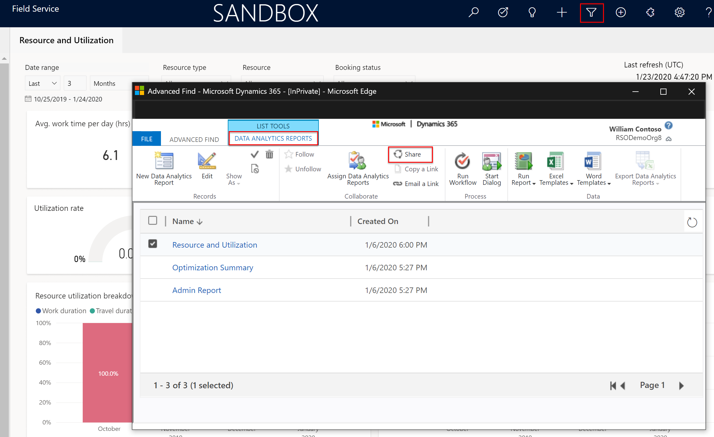

# Resource scheduling and optimization analytics dashboard

>![Note]
> This functionality is available in early access as of February 3, 2020. For more information, visit [this article on opting into early access features](https://docs.microsoft.com/power-platform/admin/opt-in-early-access-updates).

Resource and operations managers need to be able to monitor key operational metrics so that they can gauge resource and scheduling performance. Metric reports can shed light on important business-related questions, like: 

-  Are my resources being effectively utilized over a certain period time? 
-  What is the average variance between estimated time and actual time for requirements and work orders? 
-  Are requirements and allocated resources balanced? 

By finding answers to these questions, scheduling managers can plan an effective resource scheduling strategy and provide better guidance to resources. Ultimately, a better strategy saves time and money, and allows for continuous improvement on customer experience. 

Field Service and resource scheduling optimization (RSO) provide three reports focused on different scenarios and user personas:

1. Resource and utilization, included with Field Service
2. RSO admin, included with RSO
3. Optimization summary, included with RSO
  
In this topic, we'll take a look at these three reports in greater detail. 

## Prerequisites

- Since this feature is in early access, you must be opted-in to get this functionality. To opt in, visit [this article for instructions](https://docs.microsoft.com/power-platform/admin/opt-in-early-access-updates). 

- To get the resource and utilization report: 

  1. Install or upgrade Field Service
  2. Install the **Data Insights and Analytics for Resource Scheduling** solution in your instance.
  3. The Resource and utilization report will appear in the Field Service app for users with **System Administrator** or **Field Service-Administrator** security roles. 

> [!div class="mx-imgBorder"]
> 

- To get the both resource scheduling optimization reports:

  1. Install or upgrade Field Service
  2. Install or upgrade the **Resource Scheduling Optimization** add-in
  3. Install the **Data Insights and Analytics for Resource Scheduling** solution in your instance.
  4. Both the RSO admin and the optimization summary reports will appear in the resource scheduling optimization app for users with **System Administrator** or **Field Service-Administrator** security roles. 

## Resource and utilization reports

Resource managers can use the resource and utilization report to perform the following tasks:  

- Monitor metrics across resource and utilization, time spent on bookings, and miles on truck rolls.   
- Unpack insights on the territory as a whole, such as:
  - What's the allocation of bookings? 
  - Is there any territory imbalance between demand and supply? 
  - What's the estimated travel time versus the actual travel time?  
- Understand how an individual resource is using their time to react and resolve, and whether an individual resource is under- or over-utilized compared to others.  

> [!div class="mx-imgBorder"]
> 

Let's take a look at what each of these metrics are reporting. 

| Visuals |	Description |
| --- | --- |
| Avg. work time per day (hrs.)  |	Average length of time per day that a technician(s) works at the customer site. Total length of work time per count of days in the given time range. |
| Avg. travel time per day (hrs.) |	Average length of time per day that a technician(s) spends on travel. Total length of travel time per count of days in the given time range. 
| Total miles traveled |	Total miles on truck rolls in the given time range.  |
| Avg. miles traveled per day |	Average miles on truck rolls per day. Total miles per count of days in the given time range. |
| Utilization rate | The percentage of time a resource spends on work and travel in the given time period. Work duration combined with travel duration per available time on the calendar rule  |
| Late arrival rate |	For all in-progress or completed bookings, the percentage of bookings where technician arrives later than the “Time to Promise” or “Estimated arrival time,” if “Time to Promise” is not enabled in the implementation.  |
|Booking cancellation rate |	For all in-progress or completed bookings, the percentage of bookings that have been cancelled in the given time range. |
| Resource utilization breakdown  |	The graph shows the percentage of time on work, travel, break, and idle time over a period. You can also drill in to the information to see specific information for in-progress jobs or completed jobs. |
| Duration break down |	The graph shows the trend of total work time, travel time, break time, and idle time. You can also drill in to the information to see specific information for in-progress jobs or completed jobs. |

> [!div class="mx-imgBorder"]
> 

| Visuals |	Description | 
| --- | --- |
| Bookings by territory  |	Shows a map with color indicators for bookings in each territory. By hovering over a territory, you can see number of bookigns, total work time, travel time, and break time. In order for this to render correctly, the territory must be a physical geographic location.  |
| Variance to estimated travel time |	Shows the variance by region between estimated travel times and actual travel times. |
| Requirement duration % vs. allocated resource duration % |	Gauge whether the total number of requirements in each territory is balanced with the total number of resources allocated to that territory. The resulting analysis shows the percentage of requirement duration versus percentage value of allocated resource duration.  |
| Miles traveled |	Shows the trend of total miles traveled per month. |
| Resource work time quartile analysis  |	Shows the work time and travel time per resource given the time range. The chart segments individual resources compared with the work time quartile. Work time quartile: <1st quartile (25%), Between 1st -2nd quartile (25%-50%), Between 2nd to 3rd quartile (50%-75%), >3rd quartile (>75%)  |
| Resource metrics |	Shows the breakdown of KPIs for each resource, including number of bookings, utilization percentage, year over year percentage change in utilization, work time, travel time, break time, and idle time. Sort the resources by number of bookings, or by year, month, week, or day. | 

## RSO admin reports

The RSO admin report analyzes when and how RSO runs, but not the actual booking results.

> [!div class="mx-imgBorder"]
> 

| Visuals |	Description | 
| --- | --- |
| Avg bookings |	The average number of bookings in given schedule requests.  |
|Avg requirements |	The average number of requirements in given schedule requests. |
|Avg resources |	The average number of schedulable resources in given schedule requests. |
|Optimization E2E time |	This metric defines the optimization execution time |
| Number of failed optimization request |	The number of failed optimization request in the given schedule requests. |

## Optimization summary reports

The optimization summary analyzes the automatically scheduled bookings and the effect this has on the business, such as an analysis of minimized travel time.

> [!div class="mx-imgBorder"]
> 

| Visuals |	Description | 
| --- | --- |
| Booking scheduled |	The total number of bookings scheduled in given schedule requests. | 
| Resource allocated |	The total number of resources allocated in given schedule requests. | 
| Work time allocated (hrs.) |	The total work time allocated in given schedule requests. |
| Travel time allocated (hrs.) |	The total travel time allocated in given schedule requests. |
|Total time allocation (hrs.) |	The breakdown percentage and value between work time and travel time. |
| Resource time allocation |	Uncover RSO reports of the booking scheduled, locked bookings, work time and travel time per individual resource in given schedule requests.  Hight light the overloaded resource with color coding. |
| Least allocated resource |	Rank the resource based on lower utilization so the planner can squeeze new emergency to least allocated resource |
|Territory summary |	Show the filled map for each territory and you can filter the data by selecting one of Territory |
| Booking metrics by territory | 	Shows scheduled bookings, work time allocated, and total travel time allocated for each territory. |

## Configuration considerations

- Other than editing filters and the ability to drill down, the reports are not configurable or customizable. 

## Additional Notes

- The reports explored in this article are all built on Microsoft Power BI.

### Sharing reports

By default, the tenant administrator will be able to see all reports. In order to share reports, go to **Advanced Find** and search the **Data Analytics Reports** entity.

> [!div class="mx-imgBorder"]
> 

Each report will show as a record. Select the report you want to share, and then **Share** at the top.

Add the users or teams you want to give access to. Make sure the read access is selected, and select the Share button.

Users or teams the report is shared with will be able to see the report when they log in.

