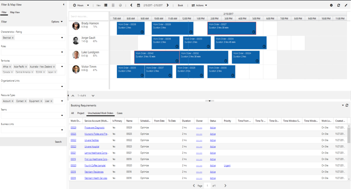
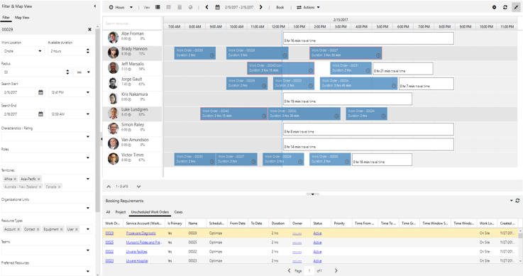
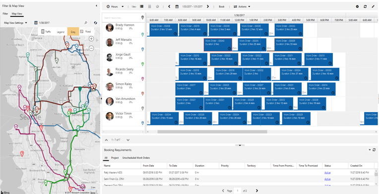

# Types of Field Service scheduling capabilities

Dynamics 365 Field Service includes a comprehensive set of scheduling capabilities. In this article, we'll take a look at the different types of scheduling in Field Service, and how they are used.

## Manual scheduling 

Manual service scheduling means using the schedule board to select requirements and create bookings - in other words, matching a requirement to a resource in a particular time slot.

Manual scheduling works well in the following scenarios:

- As part of a broader adoption to drive learning and understanding during a pilot implementation.
- To handle exceptions like emergency work.
- For less complex requirements or less mature scheduling processes.

  > [!div class="mx-imgBorder"]
  > 

> [!Note]
> The schedule board plays a big role across all types of scheduling, and is configurable and extensible to meet specific scheduling requirements.

## Schedule assistant 

The schedule assistant uses requirement details to recommend times and resources for bookings. It works well in the same scenarios as manual scheduling, as well as:

- To expose scheduling through a case or customer portal.
- To schedule a subset of requirements that may be less effective for optimization or automated scheduling

The schedule assistant is configurable and extensible, and can be used from within the schedule board or from within a work order. It can also be embedded on others forms (like case forms). 

  > [!div class="mx-imgBorder"]
  > 

## Optimized or automated scheduling 

Field service includes a set of optimized or automated capabilities called resource scheduling optimization that can be used in various combinations, including in combination with manual scheduling and the schedule assistant.

> [!div class="mx-imgBorder"]
> 

Resource scheduling optimization provides several different types of scheduling optimizations:

- **Overnight scheduling**: for a given subset of requirements and resources, schedulers may schedule work for the following 1 to 2 days. 

- **Single resource optimization**: as changes occur during the work day (like emergency work, cancellations, or delays), a single resource's remaining schedule can be reoptimized. Schedulers typically do this on the schedule board. Single resource optimization can also be used in combination with manual scheduling and the schedule assistant to optimize individual resources.

- **Inter-day optimization**: as changes occur during the work day, subsets of the overall schedule can be reoptimized. For example, a schedule can run every 30 minutes to reschedule those requirements and resources marked for reschedule.

In order to achieve the best scheduling outcomes, use a combination of the following capabilities:

- **Optimization scope**: determines which requirements, resources, and bookings are considered for a given resource scheduling optimization run. 

- **Optimization goals**: specifies objectives and constraints that resource scheduling optimization uses to evaluate and determine the best schedule given the optimization scope.

- **Schedule**: specifies the timing and pattern of resource scheduling optimization runs for a particular scope and goal.

- **Simulated runs**: a tool schedule analysts can use to evaluate the results of an optimization run, with the ability to apply or discard results.

- **Analytics**: provides numerical data on resource scheduling optimization runs and helps to determine if business objectives are being met.

- **Workflow**: a general Dynamics 365 capability used to change data values or trigger actions based on events. For example, a workflow could be used to set a “needs reoptimization” attribute on a resource given some business event (like an emergency booking, for instance).

- **Views**: a general Dynamics 365 capability used to select a subset of rows and fields for a given entity (like a requirement or resource).

[!INCLUDE[footer-include](../includes/footer-banner.md)]