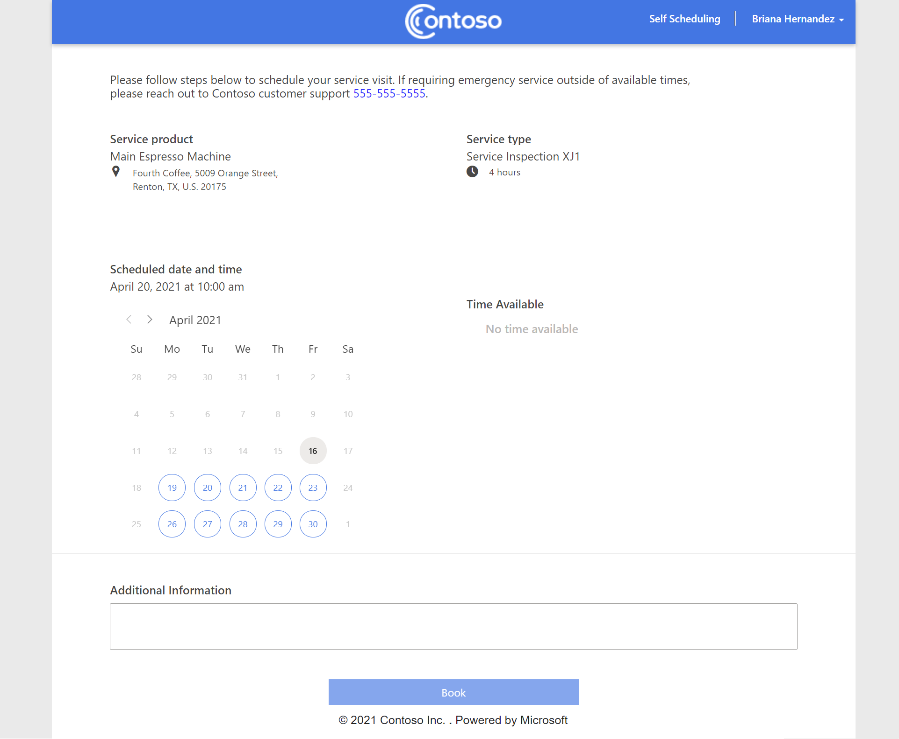

# Enable customers to self schedule service appointments

> [!Note]
A preview feature is a feature which is not complete, but is made available before it is officially in a release so customers can get early access and provide feedback. Prview features aren't menat for production use and may have limited or restricted functionality.    Microsoft does not provide support for thsi preview feature. Microsoft Dynamics 365 Technicial Support won't be able to help you with issues or questions. Preview features aren't meant for production use and subject to a sperate supplemental terms of user (add link here)

Field Service Self-Service Scheduling will improve your customers' scheduling experiences by providing them flexibility to schedule on their own time directly from their devices.
> [!div class="mx-imgBorder"]
> 

## Prerequisites

- Field Service version (8.8.30.103+)
- SMS provider supporting Microsoft Power Automate connector for mobile SMS communication.
- Office 365 Exchange account for email communications.

## Step 1: Set up the Field Service customer experiences portal (preview)

First, we need to set up the customer experience portal with Power Apps portals.

Go to  [http://make.powerapps.com](http://make.powerapps.com) and select **Create**.

Select **Field Service Portal**.

> [!div class="mx-imgBorder"]
> 

Enter your portal's name and desired subdomain and display language, then select **Create**.

You'll get an email when the portal has been provisioned, and you can move on to the next step.

## Step 2: Configure email and SMS connectors within Power Automate

Customers will be able to access their service portal with a unique link sent to their email or as a text message. Self-service scheduling requires Email for the scheduling invite code. See [Notifications](#notifications).

To configure email and SMS within Power Automate:

Go to [http://make.powerapps.com](http://make.powerapps.com) > **Solutions**. Select **Dynamics 365 Field Service PowerApps Portal – Flow** in the list.

> [!div class="mx-imgBorder"]
> 

Here you'll find three Power Automate flows. Email and SMS flows are off by default, so we'll need to configure both in order to enable them. 

 > [!div class="mx-imgBorder"]
> 

>[!Note]
> Exchange and Twilio are used here by default as popular providers. You can substitute an alternate connector by cloning the flows and configuring desired connector.

To configure email:

- Select **Field Service PowerApps Power Flow Email Notification**.
- Select **Edit**.
- Select the **Send an Email** Exchange connector.
- Add your Office 365 Exchange account connection.
- Save and **Turn On** the flow.

To configure SMS:

- Select **Field Service PowerApps Power Flow SMS Notification**.
- Select **Edit**.
- Select the Twilio connector.
- Add your Twilio account details.
- Save and **Turn On** the flow.

## Step 3: Set up the customer experience

> [!Note]
> When enabling this experience, messages can be sent to contacts of the Field Service Account associated with Bookings. If testing in non-production orgs, make sure your test data does not have real customer email addresses or phone numbers. If your org contains real data, you can prevent unnecessary communication by adding accounts to exclusion lists.

In Field Service, Go to **Field Service Settings** > **Customer Portal** > **Customer Portal Settings**.  

### General and Notification Settings

> [!Note]
> The same Field Service Customer Portal contains multiple customer-focused features including Self Scheduling (Preview) and Track My Technician. These features are indpendnetly enabled while sharing common configuration. Some Settings in the general tab only apply to one experience while others apply to mutliple.

Configure the following settings as needed: 

- **Send self-scheduling experience to Accoutn Contacts**: When enabled, new Contacts who are assosiated with active Field Service accounts will be sent an email which invites the contact to create a Power Portal account for self scheduling. For more information, see this section: [Notifications](#notifications).
    - When enabling this option you have the ability to send to only new contacts going forward, or send to all existing contacts. If a contact has already received the invite in the past they will not recieve a second email invite. 

- **Messaging**: Messages are sent at specific points in the Field Service customer lifecycle. These messages can be enabled or disabled indpenently. For details on each message see [Notifications](#notifications).

- **Communication Type**: Define whether the customer will receive email, SMS, or both message types. 

- **Send Messages To**: This feature is only used with [Track My Technician](https://docs.microsoft.com/en-us/dynamics365/field-service/reminders-arrival-time).  

- **Include Survey (Preview)**: This feature is used only with [Track My Technician](https://docs.microsoft.com/en-us/dynamics365/field-service/reminders-arrival-time). 

- **Exclusion lists**: These lists allow you to exclude specific service accounts or service types from all messaging.

> [!div class="mx-imgBorder"]
> 

You can also directly access the Power Automate Flows for Email and SMS setup from this Configuration Tab.

### Branding and content

Customize the branding and content for your customer portals.

From the customer portal settings, go to the **Display** tab.

Here you can customize:

- Font type and color for the online portal.
- Background and foreground colors.
- Code snippets: These snippets are dynamic content strings that when updated, reflect consistent content across the portal, email, and SMS when applicable. Some important code snippets to include:
  - Contact email
  - Contact phone
  - Company name
  - Page title
  - Page footer

> [!div class="mx-imgBorder"]
> 

> [!Note]
> To upload and update the portal header image, you will need to access the Power Portal Designer. There is direct link to the Designer experience from the Display Settings tab. For more information on Portal Designer, see the section: [Portal Designer](#portal-designer).

### Self Scheduling Settings

There are setting specific to the self scheduling experience:

- **Minimum lead time for new bookings**: This sets the minimum time in days from today where the customer could schedule their booking.
- **Maximum lead time for new bookings**: This sets the maximum time in days from today where the customer could schedule their booking.
- **Enable Asset Selection**: When enabled, the customer has the option to select a specific asset which is assosiated with their account while self scheduling.
- **Enable Additional Details**: Enables the customer to submit text to your organization while self scheduling. This text will be saved as a note on the booking Timeline.
- **Include Resource with maximum travel radius**: This is the maximum raidus from the scheudled location in which a resource could be scheduled. "0" means there is no maxium radius.

> [!div class="mx-imgBorder"]
> 

### Configure Incident Type
As part of the self scheduling experience the user can select their Incident Type (shown to the user as "Service Type") for which they are scheduling. As a Field Service Administrator, you can make specific indident types avialable to the end customer and set a user friendly Display Name for the incidnet type shown onthe Self Scheduling Portal.

> [!div class="mx-imgBorder"]
> 

### Authentication
The portal is an authenticated experience. By default Local Auth is enabled when the portal is provisioned. This can be reconfigured by the Org Admin. Configure authentication via Power Apps Portals experience.

To configure Authentication follow steps:  https://docs.microsoft.com/en-us/powerapps/maker/portals/configure/configure-portal-authentication

> [!div class="mx-imgBorder"]
> 

## Step 4: Testing the experience as an end user

To review and test changes, we recommend setting up an account and contact as if you are an end customer.  

1. Create an Account in Field Service
2. Add test Assets to the Account if they are used by your organization
3. Create a Contact in Field Service
4. Add the contact to your Account.
5. This will generate an invite email which is sent to the Contact. The invite will link to the Portal where you can create your Portal account.
6. After creating your account, sign in to self service scheduling portal.
7. You will observe an account Profile page. This is shown the first time after user creates their account. You can skip this page.
8. Scheudle service via the self-scheduling portal. You will receive an email confirming your Booking.
9. Observe Work Order and Booking is scheduled in CRM.

## Configuration considerations

### Notifications

Notifications are configured via [General Configuration](#general-configuration).  

**Self Scheduling Portal Invite**: As new contacts are added to accounts they will be sent an invite link which will allow the customer to create an account with the self scheduling portal. This notification is sent only as email.
> [!div class="mx-imgBorder"]
> 

**Booking Confirmed**: When a Contact self schedules via the Field Service CUstomer Portal, they will receive an email or SMS confirming their booking date and time with the option to reschedule.
> [!div class="mx-imgBorder"]
> 

**Booking Reminder**: When a contact self scheduled with the Field Service Customer Portal they will receive a reminder notification when within 1-7 days of the booking scheduled date. This reminder will include an option to reschedule. 
> [!div class="mx-imgBorder"]
> 

**Booking Reschedule**: When a booking is rescheduled, either by the system or the user via Customer Portal, they will receive a notificating stating the new date and time. This notification will include the option to reschedule.
> [!div class="mx-imgBorder"]
> 

**Booking Canceled**: When a booking is canceled the contact will receive a notification.
> [!div class="mx-imgBorder"]
> 

**Booking Completed**: When a booking is Completed the contact will receive a notification.
> [!div class="mx-imgBorder"]
> 

> [!Note]
> Notifications "Techncian Traveling" is relavent only to [Track My Technician](https://docs.microsoft.com/en-us/dynamics365/field-service/reminders-arrival-time) scenario and not avialable while only self scheduling is enabled.

### Portal Experience

Field Service Contacts assosiated with active Accounts can recieve an invite to the Field Service Customer Experiences Portal. The portal is an authenticated experience which supports multiple authentication types see [Authentication](#Authentication). After creating an account customers can login to the Portal.
> [!div class="mx-imgBorder"]
> 

The first time a user logins into the Field Service Customer Experiences Portal they will see their Portal Profile screen. Details here are optional. Clicking update, or the Self Scheduling link in the header navigation will continue into self scheduling experience.
> [!div class="mx-imgBorder"]
> 

From the self scheduling experience user follows steps to self-scheduler a booking.  Steps are as follows:
1. When enabled via [Self Scheduling Settings](#Self-scheduling-settings), user can select "Service Product" which is a list of Assets that are assosiated to their Account.
    - The address shown under the Service Product is by default the Account location. If a service product which has a different functional location is selected, the address for the booking is updated to that functional locaiton address.
2. User selects their Service Type, which is a list of Incidnet Typess made available to the end user. See (configuring incident types)[#configure-incident-type].
3. Based on the Service Prdouct and Incident Type, the user is presented a lits of dates and times which have technician availability based on skills required for the job.
5. When enabled via [Self Scheduling Settings](#Self-scheduling-settings), user can optionally enter additional details with their scheduling request. 
6. After clicking "Book", the user will be presented with a confirmation screen. 
> [!div class="mx-imgBorder"]
> 

With a sucessful scheduling request, the user is presented with a confirmation screen showing details of their booking. 
> [!div class="mx-imgBorder"]
> 

When Booking Confimration notification is enabled (See [notifications](#notifications)), the user wil receive an email and SMS confirming their scheduled booking. From this notification the user has the option to reschedule the bookings.   When re-entering the Portal to reschedule a booking, the Service Product and Service Type is pre-selected and they can adjust the date and time to reschedule their booking.
> [!div class="mx-imgBorder"]
> 

### Portal designer

As an alternative to using content snippets, you can update content and access some more advanced configuration as part of the portal designer experience. 

- Go to https://make.powerapps.com.
- Select **Apps**.
- Select **Edit** on the portal you created.

> [!div class="mx-imgBorder"]
> 

In the portal designer, selected content can be updated and will be reflected in the customer portal. Updating content snippets in the portal maker will also influence content in the messages when applicable.

The portal designer also lets you upload a customized header image or make more fine-tuned adjustments to CSS and the portal's header or footer.

> [!div class="mx-imgBorder"]
> 

> [!Note] Elements of the portal outside of header and footer - and the highlighted content snippets - are not editable.

### Notification settings

Notification settings provide a read-only view of all messages sent to customers. Here you can see which customers have received a message, the type of message, and the state of the message.

> [!div class="mx-imgBorder"]
> 

> [!div class="mx-imgBorder"]
> 

### Booking notification codes

With booking notification codes, Field Service admins can extend, expire, or block access to a portal link that has been shared with a customer.

> [!div class="mx-imgBorder"]
> 

> [!div class="mx-imgBorder"]
> 

## Additional notes

### Can an end customer Cancel a booking from the portal?

Users can only re-schedule bookings from the portal and not cancel. Check back soon for feature enhancements as we work towards a GA product.

### Can a customer self schedule a booking which requires groups of resources?

No, with Preview users will only be able to self schedule individual resources which meet all requirements of the booking. Check back soon for feature enhancements as we work towards a GA product.

### Who receives the notifications when a booking is self scehduled?

When a user self schedules, that user will be added as the "Reported By" contact assosiated with the Work Order for teh Booking. All future communcation including reminders, and reschedule notifications will be sent to that Reported By contact on the Work Order.

### Will all bookings result in notifications such as booking confirmed or booking reminders?

Only bookings which were created via the Self Scheduling portal will receive the notifications including confirmation, remiders, reschedule, and canceled. During Preview these bookings will carry a unique booking ID which is how the system knows they were scheduled via Self Scheduling portal.

### I tried to reset my password in the Field Service Customer Experiences Portal and never received an email?

Check to ensure you have the correct process enabled for this functionality.
1. Navigate to CRM - Settings - Processes
2. Search for "Send Password Reset to Contact"
3. Open process to edit and scroll down to click on "View Properties"
4. In resulting screen edit the From field to a user - likely the same account you use to send Notifications for the scheduling experience. Save and Close.
5. Go to Settings->Email Configuration->mailboxes. 
6. Select the user which you had set in the earlier Process. Select "Approve Email" and then "Test & Enable Mailbox".

> [!div class="mx-imgBorder"]
> 

### Does the Field Service Customer Experiences portal support all languages?

The portal will support Field Service languages with the exception of Arabic and Hebrew.

### How do I change the timing of reminder message?

Reminder messages are triggered by a flow that runs daily at 10:00 AM UTC. Any bookings that fall into your reminder message time period that are not part of exclusion lists will receive a reminder message.

To edit the reminder message:

- Go to https://make.powerapps.com > **Solutions** and find the solution **Dynamics 365 Field Service PowerApps Portal – Flow**.
- Edit the flow called **Create notification items for bookings**.
- Find the location recurrence connector and edit the **Flow Recurrence** value to new desired time.

> [!div class="mx-imgBorder"]
> 

### Can I still provision this Field Service customer experience portal if I already have an existing Power Apps portal?

Yes, you can have multiple portals; however, you can only have one copy of the Field Service customer experience portal per environment.

### Can I integrate this experience within an existing Power Apps portal?

Currently the Field Service customer portal is deployed as a standalone experience and cannot be integrated into an existing Power Apps portal.

### Will the Field Service customer experiences portal receive updates?

When we make updates to the customer experience portal, new features or enhancements will be unpublished and require the org admin to publish the update before they reflect on the live experience.

### I don't have a Twilio or Office 365 Exchange account. Are there other services I can use for messaging?

Yes, you can use alterative SMS or email providers as long as they have connectors supported by Power Automate. Clone the existing email and SMS flows, remove the current connectors, and add desired connectors.

### How do I edit email and SMS content?

General content and format of the notifications are following a fixed template and cannot be changed. You can update individual words within the email and SMS content with content snippets found in Field Service settings. 

### How do I update my Field Service customer experiences portal?

We will publish updates over time to introduce new features and functionality for the customer portal. Updates are not automically published to your portal; they must be applied by the organization administrator for your environment. To apply an update, go to https://admin.powerplatform.microsoft.com/, select the environment that has the Field Service customer experiences (preview) portal installed, and select "Portals." If an update is avialable, you'll see a message saying so, with an option to **Update now**. Select your portal and apply the update to our environment. 