# Enable customers to self-schedule service appointments in Field Service

> [!IMPORTANT]
> [!INCLUDE[cc_preview_features_definition](../includes/cc-preview-features-definition.md)]
> Microsoft doesn't provide support for this preview feature. Microsoft Dynamics 365 Technical Support won’t be able to help you with issues or questions. Preview features aren't meant for production use and are subject to a separate [supplemental terms of use](https://go.microsoft.com/fwlink/p/?LinkI

Field Service self-service scheduling aims to improve your customers' scheduling experiences by providing them flexibility to schedule on their own time, directly from their devices.

> [!div class="mx-imgBorder"]
> 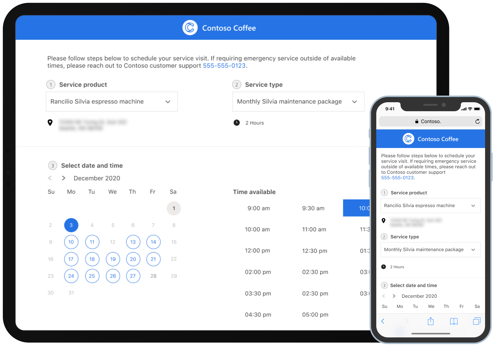

## Prerequisites

- Field Service version (8.8.30.103+)
- SMS provider supporting Microsoft Power Automate connector for mobile SMS communication.
- Office 365 Exchange account for email communications.

## Step 1: Set up the Field Service customer experiences portal (preview)

First, we need to set up the customer experience portal with Power Apps portals.

Go to [http://make.powerapps.com](http://make.powerapps.com) and select **Create**.

Select **Field Service Portal**.

> [!div class="mx-imgBorder"]
> 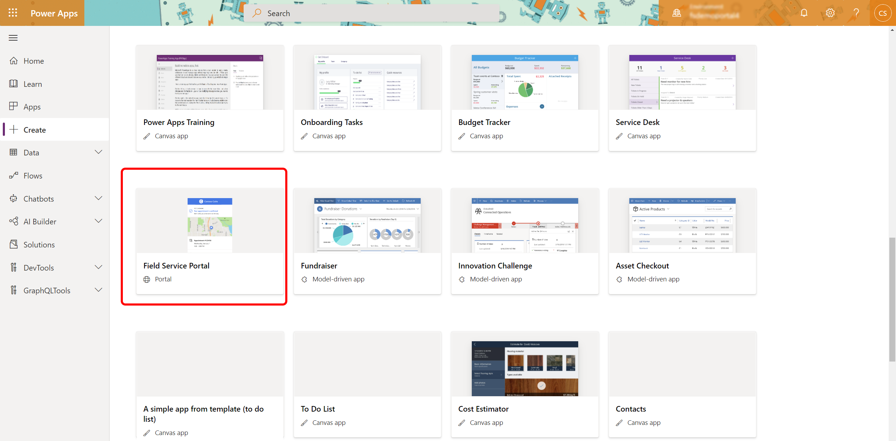

Enter your portal's name and desired subdomain and display language, then select **Create**.

You'll get an email when the portal has been provisioned, and you can move on to the next step.

## Step 2: Configure email and SMS connectors within Power Automate

Customers will be able to access their service portal with a unique link sent to their email or as a text message.

Next, we need to configure email and SMS within Power Automate:

Go to [http://make.powerapps.com](http://make.powerapps.com) > **Solutions**. Select **Dynamics 365 Field Service PowerApps Portal – Flow** in the list.

> [!div class="mx-imgBorder"]
> 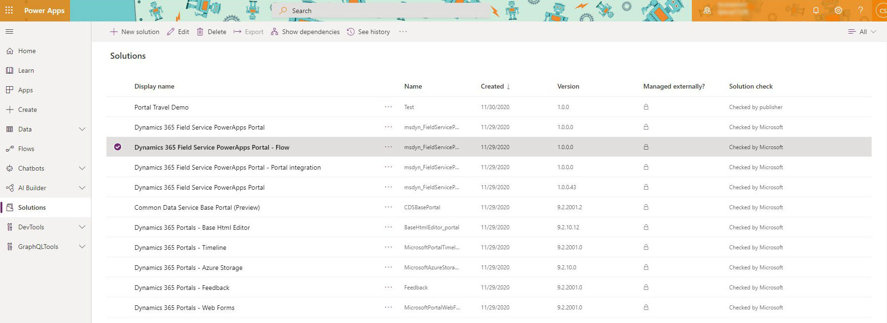

Here you'll find three Power Automate flows. Email and SMS flows are off by default, so we'll need to configure both in order to enable them. 

 > [!div class="mx-imgBorder"]
> 

>[!Note]
> Exchange and Twilio are used here by default as popular providers. You can substitute an alternate connector by cloning the flows and configuring desired connector.

To configure email:

- Select **Field Service PowerApps Power Flow Email Notification**.
- Select **Edit**.
- Select the **Send an Email** Exchange connector.
- Add your Office 365 Exchange account connection.
- Save and **Turn On** the flow.

To configure SMS:

- Select **Field Service PowerApps Power Flow SMS Notification**.
- Select **Edit**.
- Select the Twilio connector.
- Add your Twilio account details.
- Save and **Turn On** the flow.

## Step 3: Set up the customer experience

> [!Note]
> When enabling this experience, messages can be sent to contacts of the Field Service Account associated with Bookings. If testing in non-production orgs, make sure your test data does not have real customer email addresses or phone numbers. If your org contains real data, you can prevent unnecessary communication by adding accounts to exclusion lists.

In Field Service, Go to **Field Service Settings** > **Customer Portal** > **Customer Portal Settings**.  

### General and notification settings

> [!Note]
> The same Field Service customer portal contains multiple customer-focused features, including self-scheduling (preview) and **Track My Technician**. These features are indpendnetly enabled while sharing common configuration. Some settings in the general tab only apply to one experience while others apply to mutliple.

Configure the following settings as needed: 

- **Send self-scheduling experience to Account Contacts**: When enabled, new Contacts who are associated with active Field Service accounts will be sent an email, which invites the contact to create a Power Portal account for self-scheduling. For more information, see this section: [Notifications](#notification-types).
    - When enabling this option, you have the ability to send to only new contacts going forward, or send to all existing contacts. If a contact has already received the invite in the past, they won't receive a second email invite. 

- **Messaging**: Messages are sent at specific points in the Field Service customer lifecycle. These messages can be enabled or disabled independently. For information on each message, see this section: [Notifications](#notification-types).

- **Communication Type**: Define whether the customer will receive email, SMS, or both message types. 

- **Send Messages To**: This feature is only used with [Track My Technician](reminders-arrival-time.md).  

- **Include Survey (Preview)**: This feature is used only with [Track My Technician](https://docs.microsoft.com/dynamics365/field-service/reminders-arrival-time). 

- **Exclusion lists**: These lists allow you to exclude specific service accounts or service types from all messaging.

> [!div class="mx-imgBorder"]
> 

You can also directly access the Power Automate flows for email and SMS setup from the **Configuration** tab.

### Branding and content

Customize the branding and content for your customer portals.

From the customer portal settings, go to the **Display** tab.

Here you can customize:

- Font type and color for the online portal.
- Background and foreground colors.
- Code snippets: These snippets are dynamic content strings that when updated, reflect consistent content across the portal, email, and SMS when applicable. Some important code snippets to include:
  - Contact email
  - Contact phone
  - Company name
  - Page title
  - Page footer

> [!div class="mx-imgBorder"]
> 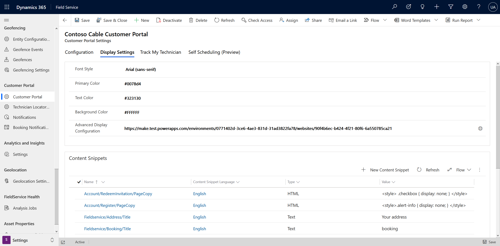

> [!Note]
> To upload and update the portal header image, access the Power Apps portal designer. There is a link to the designer from the **Display Settings** tab. For more information on the portal designer, see the section: [Portal designer](#portal-designer).

### Self-scheduling settings

Let's take a look at the self-scheduling settings, and what they do: 

- **Minimum lead time for new bookings**: Sets the minimum time in days from today where the customer could schedule their booking.
- **Maximum lead time for new bookings**: Sets the maximum time in days from today where the customer could schedule their booking.
- **Enable Asset Selection**: When enabled, the customer has the option to select a specific asset to associate with their account while self-scheduling.
- **Enable Additional Details**: When enabled, the customer can submit text to your organization while self-scheduling. This text will be saved as a note on the booking timeline.
- **Include Resource with maximum travel radius**: The maximum radius from the scheduled location in which a resource could be scheduled. "0" means there is no maximum radius.

> [!div class="mx-imgBorder"]
> 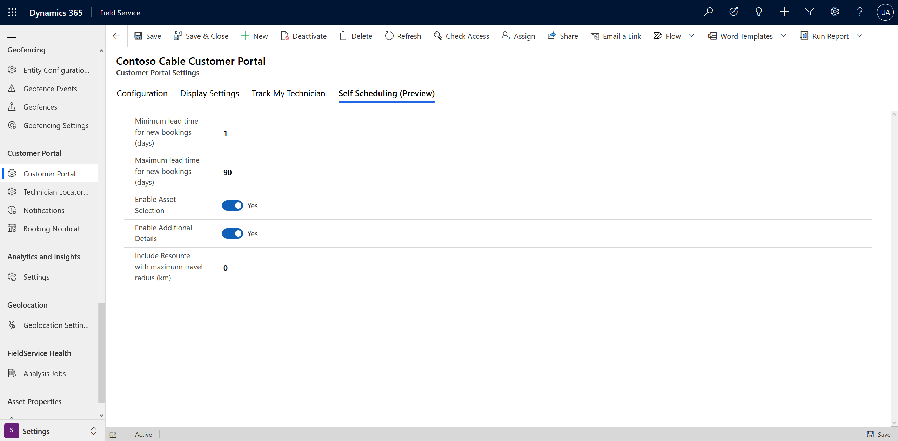

### Configure incident type

As part of the self-scheduling experience, the user can select the incident type (shown to the user as *Service Type*) that represents the work needed. As a Field Service administrator, you can make specific incident types available to your customers and set a user-friendly display name for the incident type shown on the self-scheduling portal.

> [!div class="mx-imgBorder"]
> 

### Authentication

The portal is an authenticated experience. By default, local auth is enabled when the portal is provisioned. This can be reconfigured by the organization's administrator. Configure authentication through Power Apps portals. 

For more information, see this article: [Overview of authentication in Power Apps portals](https://docs.microsoft.com/powerapps/maker/portals/configure/configure-portal-authentication)

> [!div class="mx-imgBorder"]
> 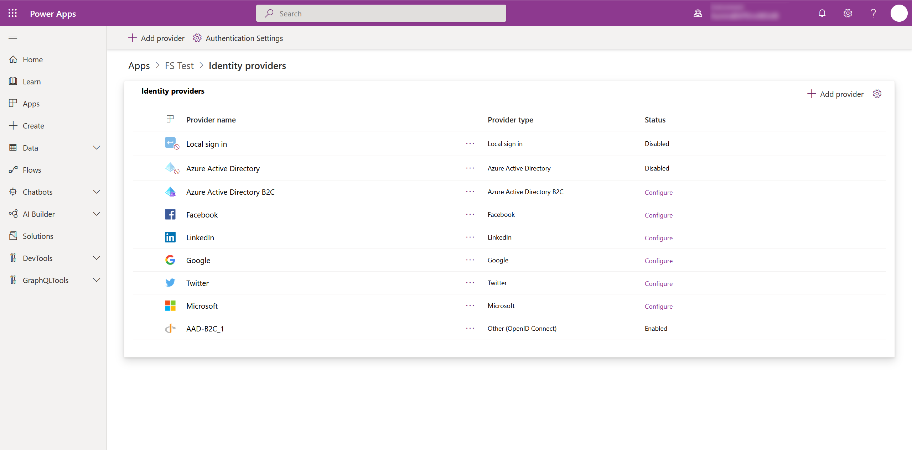

## Step 4: Testing the experience as an end user

To review and test changes, set up an account and contact in Field Service, as if you are an end customer.  

1. Create an account in Field Service.
2. Add test assets to the account if they are used by your organization.
3. Create a contact in Field Service.
4. Add the contact to your account.
5. This will generate an invite email, which is sent to the contact. The invite will link to the portal, where you can create your portal account.
6. After creating your account, sign in to self-service scheduling portal.
7. You'll be taken to a profile page. This page is shown the first time after a user creates their account. You can skip this page.
8. Schedule service via the self-scheduling portal. You will receive an email confirming your booking.
9. Back in Field Service, confirm that the work order and booking is scheduled.

## Configuration considerations

### Notification types

**Self-Scheduling Portal Invite**: As new contacts are added to accounts, they'll be sent an invite link that allows the customer to create an account with the self-scheduling portal. This notification is sent only as email.

> [!div class="mx-imgBorder"]
> 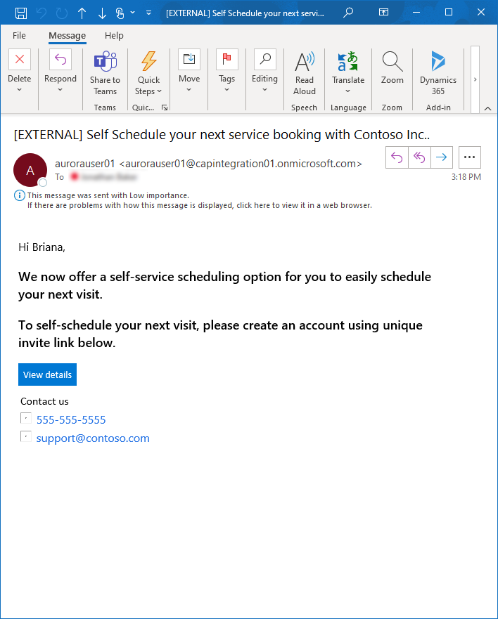

**Booking Confirmed**: When a contact self-schedules in the Field Service customer portal, they will receive an email or SMS confirming their booking date and time, with the option to reschedule.

> [!div class="mx-imgBorder"]
> 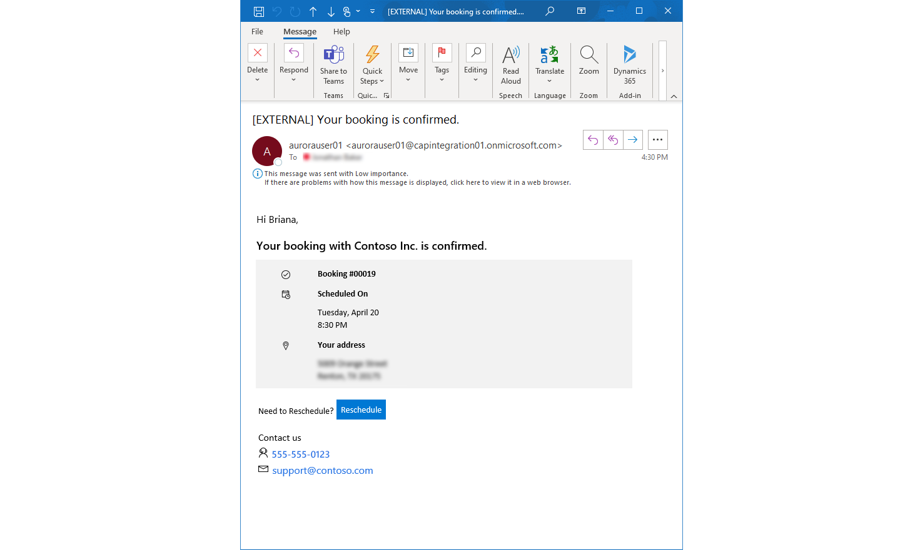

**Booking Reminder**: When a contact self-schedules with the Field Service customer portal, they'll receive a reminder when within one to seven days of the booking scheduled date. This reminder will include an option to reschedule. 

> [!div class="mx-imgBorder"]
> 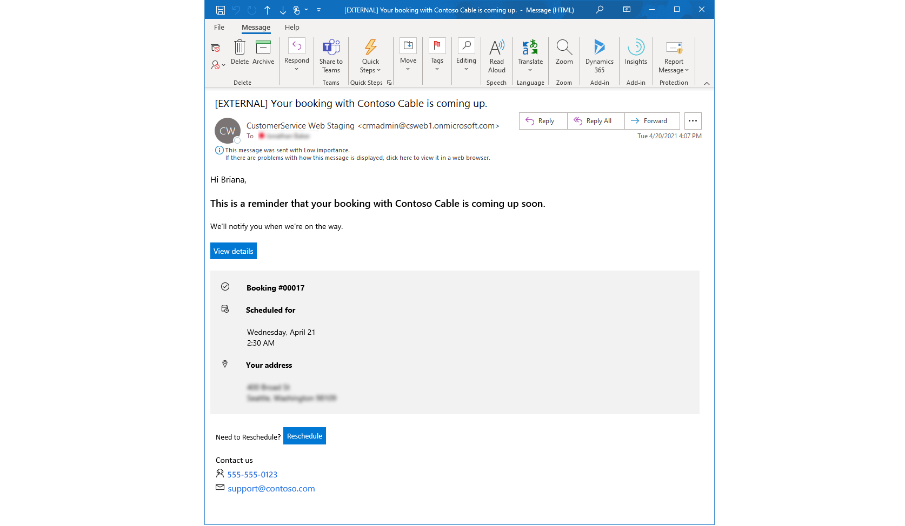

**Booking Reschedule**: When a booking is rescheduled, either by the system or a customer through the portal, they'll receive a notification stating the new date and time. This notification will include the option to reschedule.

> [!div class="mx-imgBorder"]
> 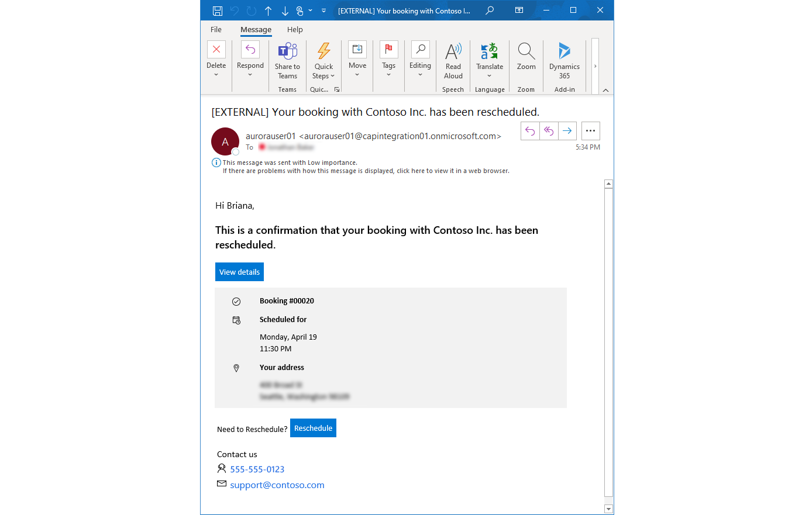

**Booking Canceled**: When a booking is canceled, the contact will receive a notification.

> [!div class="mx-imgBorder"]
> 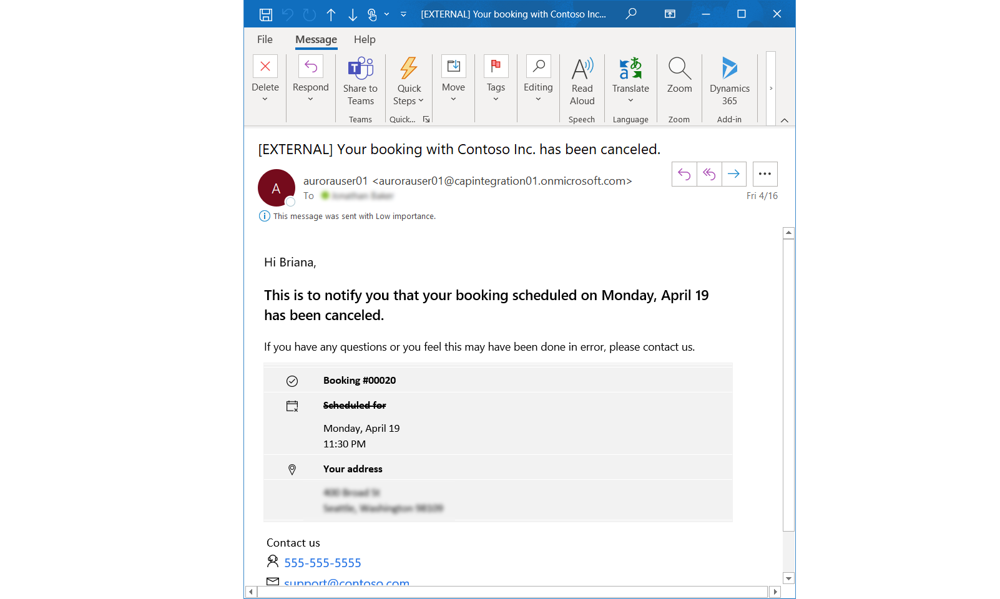

**Booking Completed**: When a booking is completed, the contact will receive a notification.

> [!div class="mx-imgBorder"]
> 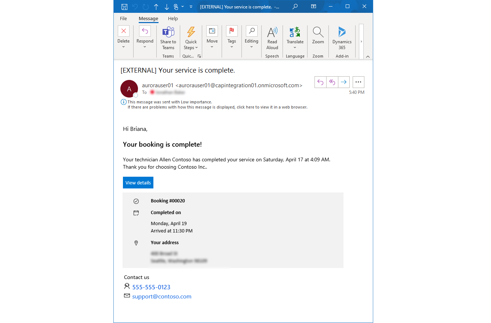

> [!Note]
> The **Techncian Traveling** notification is relevant only to the [**Track My Technician**](https://docs.microsoft.com/dynamics365/field-service/reminders-arrival-time) funcationality, and isnt' avialable while only self-scheduling is enabled.

### Portal experience

Field Service contacts associated with active accounts can receive invites to the Field Service customer experiences portal. After creating an account, customers can sign in to the portal.

> [!div class="mx-imgBorder"]
> 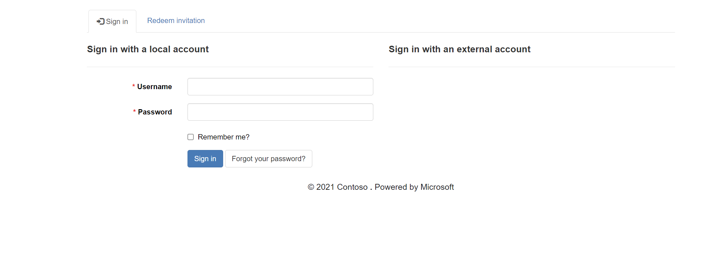

The first time a user signs into the Field Service customer portal, they'll see their portal profile. Details here are optional. 

> [!div class="mx-imgBorder"]
> 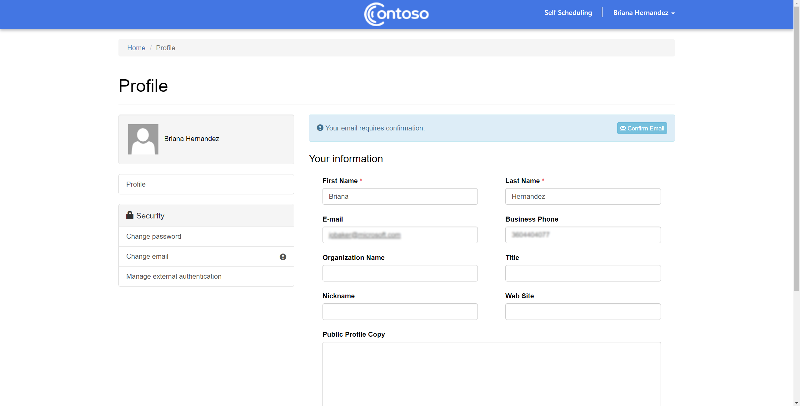

Select the **Self Scheduling** option in the header to access the scheduling experience. 

> [!div class="mx-imgBorder"]
> 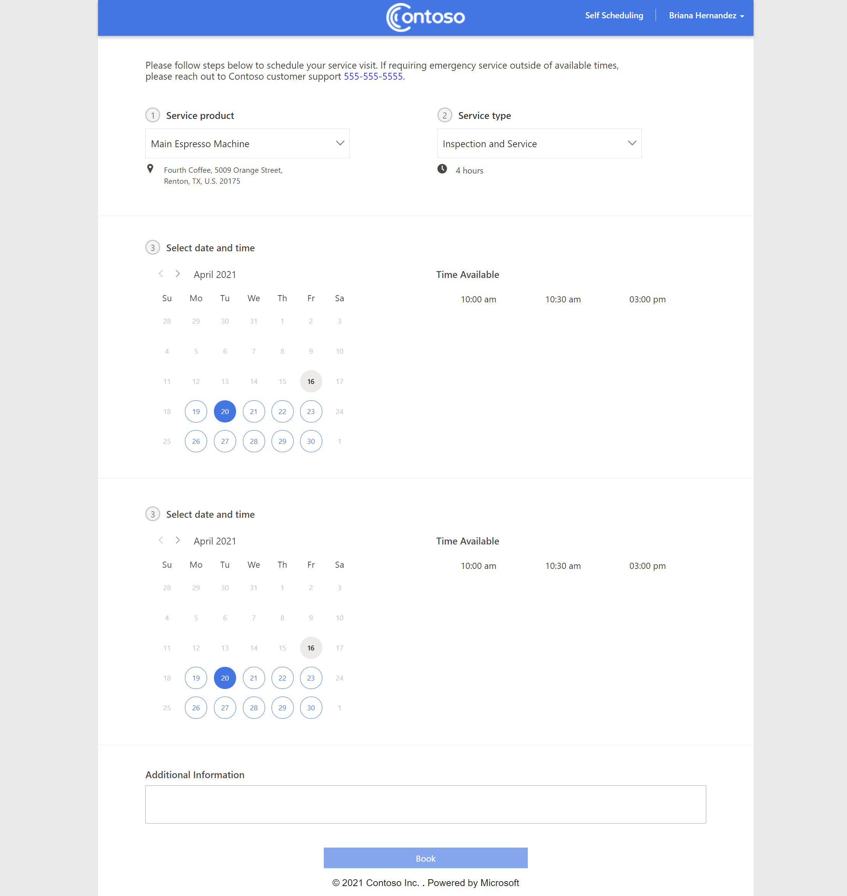

From the self-scheduling experience, customers can: 

1. Select their **Service Product**, which is a list of assets associated with their account. This functionality must be enabled in [self-scheduling settings](#self-scheduling-settings).
    - The address shown under the service product is the account location by default. If a service product with a different functional location is selected, the address for the booking is updated to that functional location address.
2. Select their **Service Type**, which is a list of incident types made available to the end user.
3. Based on the service product and service type, the user is presented a list of dates and times that technicians are available, based on skills required for the job.
4. When enabled via [self-scheduling settings](#self-scheduling-settings), the user can optionally enter additional details with their scheduling request. 
5. After selecting **Book**, the user will see a confirmation screen. 

After successfully submitting their scheduling request, the user will then see a confirmation, including the details for their booking.

> [!div class="mx-imgBorder"]
> 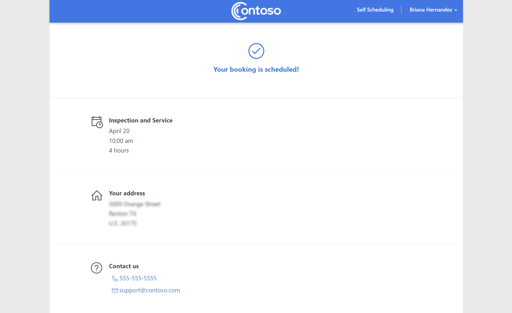

### Portal designer

As an alternative to using content snippets, you can update content and access more advanced configuration as part of the portal designer experience. 

- Go to https://make.powerapps.com.
- Select **Apps**.
- Select **Edit** on the portal you created.

> [!div class="mx-imgBorder"]
> 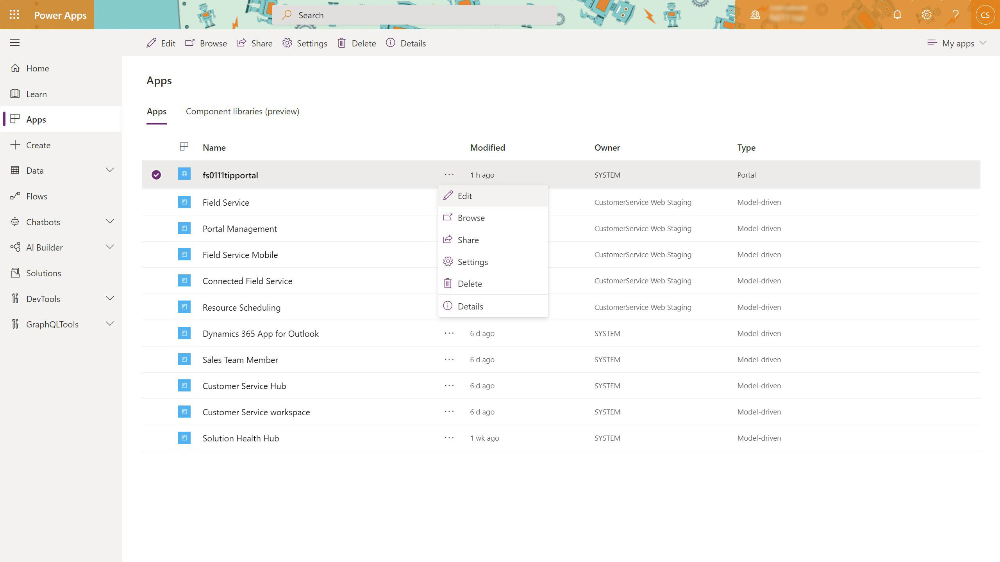

In the portal designer, selected content can be updated and will be reflected in the customer portal. Updating content snippets in the portal maker will also influence content in the messages when applicable.

The portal designer also lets you upload a customized header image or make more fine-tuned adjustments to CSS and the portal's header or footer.

> [!div class="mx-imgBorder"]
> 

> [!Note] 
> Elements of the portal outside of header and footer - and the highlighted content snippets - are not editable.

### Notification settings

Notification settings provide a read-only view of all messages sent to customers. Here you can see which customers have received a message, the type of message, and the state of the message.

> [!div class="mx-imgBorder"]
> 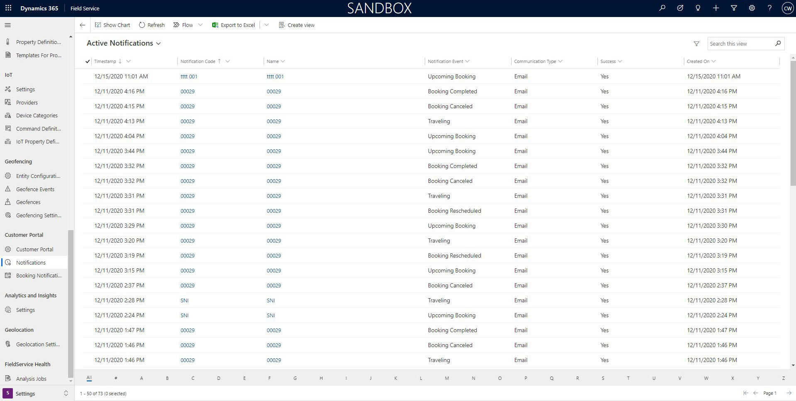

> [!div class="mx-imgBorder"]
> 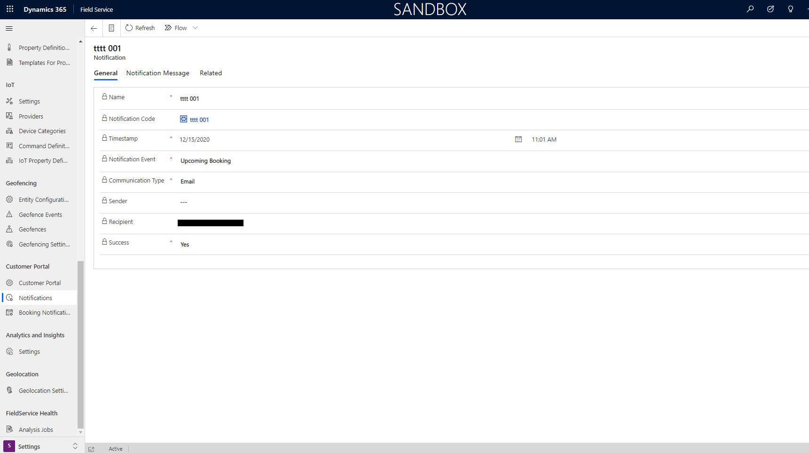

### Booking notification codes

With booking notification codes, Field Service admins can extend, expire, or block access to a portal link that has been shared with a customer.

> [!div class="mx-imgBorder"]
> 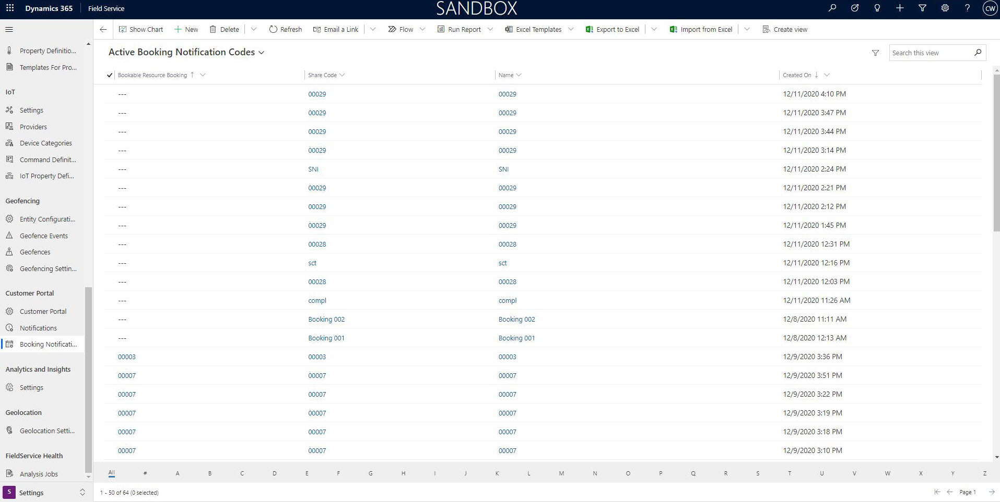

> [!div class="mx-imgBorder"]
> 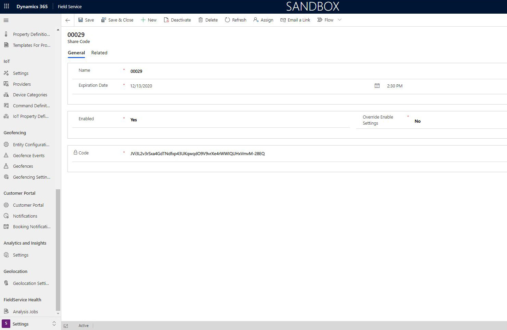

## Additional notes

### FAQs for self-scheduling portals

#### Can you cancel a booking from the portal?

You can only reschedule bookings from the portal; you can't cancel. Check back soon for feature enhancements as we work towards general availability!

#### Can you self-schedule a booking that requires groups of resources?

With this functionality in preview, you can only self-schedule individual resources that meet all requirements for the booking.

#### Who receives the notifications when a booking is self-scheduled?

When someone self-schedules, they will be added as the *Reported By* contact associated with the work order for the booking. All future communication - including reminders and reschedule notifications - will be sent to that *Reported By* contact on the work order.

#### Will all bookings result in notifications such as confirmations and reminders?

Only bookings that were created through the self-scheduling portal will receive the notifications. During the preview period, these bookings will carry a unique booking ID, which is how the system knows they were scheduled through the self-scheduling portal.

#### I tried to reset my password in the Field Service customer portal and never received an email. Why not?

Make sure you have the correct process enabled for this functionality.

1. Go to **Field Service** > **Settings** > **Processes**.
2. Search for "Send Password Reset to Contact."
3. Open the process to edit. Scroll down and select **View Properties**.
4. Edit the **From** field to a user - likely the same account you use to send notifications for the scheduling experience. **Save and Close**.
5. Go to **Settings** > **Email Configuration** > **Mailboxes**. 
6. Select the user you set in the earlier process. Select **Approve Email** and then **Test & Enable Mailbox**.

> [!div class="mx-imgBorder"]
> 

#### Does the Field Service customer experiences portal support all languages?

The portal will support Field Service languages with the exception of Arabic and Hebrew.

#### How do I change the timing of reminder message?

Reminder messages are triggered by a flow that runs daily at 10:00 AM UTC. Any bookings that fall into your reminder message time period that are not part of exclusion lists will receive a reminder message.

To edit the reminder message:

- Go to https://make.powerapps.com > **Solutions** and find the solution **Dynamics 365 Field Service PowerApps Portal – Flow**.
- Edit the flow called **Create notification items for bookings**.
- Find the location recurrence connector and edit the **Flow Recurrence** value to new desired time.

> [!div class="mx-imgBorder"]
> 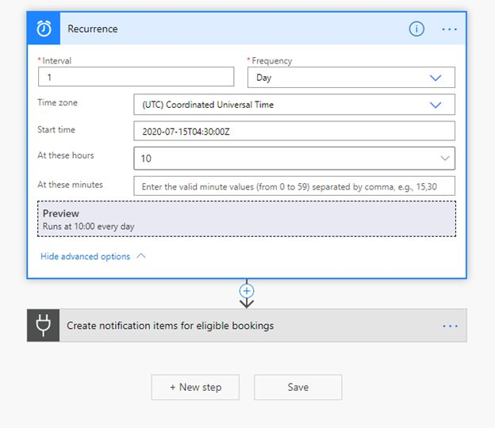

#### Can I still provision this Field Service customer experience portal if I already have an existing Power Apps portal?

Yes, you can have multiple portals; however, you can only have one copy of the Field Service customer experience portal per environment.

#### Can I integrate this experience within an existing Power Apps portal?

Currently the Field Service customer portal is deployed as a standalone experience and cannot be integrated into an existing Power Apps portal.

#### Will the Field Service customer experiences portal receive updates?

When we make updates to the customer experience portal, new features or enhancements will be unpublished and require the org admin to publish the update before they reflect on the live experience.

#### I don't have a Twilio or Office 365 Exchange account. Are there other services I can use for messaging?

Yes, you can use alterative SMS or email providers as long as they have connectors supported by Power Automate. Clone the existing email and SMS flows, remove the current connectors, and add desired connectors.

#### How do I edit email and SMS content?

General content and format of the notifications are following a fixed template and cannot be changed. You can update individual words within the email and SMS content with content snippets found in Field Service settings. 

#### How do I update my Field Service customer experiences portal?

We will publish updates over time to introduce new features and functionality for the customer portal. Updates are not automatically published to your portal; they must be applied by the organization administrator for your environment. To apply an update, go to https://admin.powerplatform.microsoft.com/, select the environment that has the Field Service customer experiences (preview) portal installed, and select "Portals." If an update is available, you'll see a message saying so, with an option to **Update now**. Select your portal and apply the update to our environment. 