# Set up bookable resources in Dynamics 365 Field Service

A bookable resource in Field Service is anything that needs to be scheduled. This most commonly includes people, equipment, and physical spaces (facilities).   

Each resource can have different attributes that distinguish it from others, including but not limited to:

- Characteristics (for example: Accounting)
- Categories (for example: Manager)
- Territories (for example: Washington State)
- Organizational Unit (for example: Seattle Service Delivery)
- Location (for example: Location Agnostic)
- Resource Type (for example: User)

In this article, we will walk through how to create a bookable resource and add details to distinguish it from other resources. We will also explore some common details for setting up field technician resources for Field Service organizations.

> [!VIDEO https://www.microsoft.com/videoplayer/embed/RE4yg5v]

> [!Note]
> For additional Field Service videos, see [this full playlist](https://aka.ms/fs-videos).

## Prerequisites

- Any version of Field Service
- You must be logged in as a user with **Field Service - Administrator** or **System Administrator** security roles

## Create a bookable resource  
  
1.  From the Field Service main menu, select **Resources** > **Resources entity**. 

2.  On the **Active Bookable Resources** screen, choose **New**.  

> [!div class="mx-imgBorder"]
> 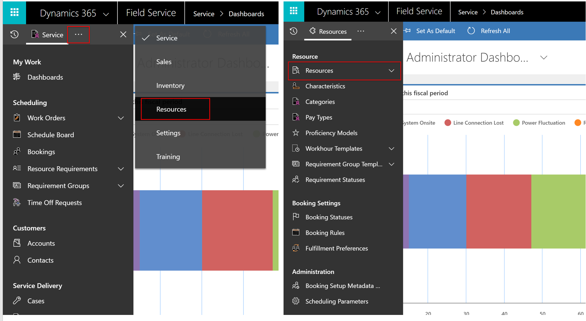

> [!div class="mx-imgBorder"]
> 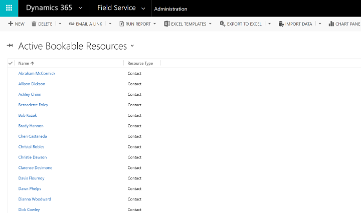

    
3.  Select a **Resource Type**. 
  
  Resource type is a classification that describes who or what the resource is and how the resource relates to your organization. 

   - **User**: Choose this option if the resource is a person and a member of your organization. This resource type must be chosen if the resource is a field technician who needs access to the Field Service Mobile app.
   - **Account** or **Contact**: Choose this option if the resource is not directly a part of your organization, but needs to be scheduled. A common example is subcontractors. This also allows the scheduling framework to more easily apply to an organization's existing Dynamics system that may be using accounts and contacts to manage workers, partners, and contractors before Field Service is purchased and implemented. 
  - **Equipment**: Choose this option if the resource is a piece of equipment, tool, or machine that must be scheduled.
  - **Crew**: Choose this option as the first step to create a crew to assemble a group of resources where scheduling the crew resource will schedule all crew members. A typical example has two or more people or a person and a vehicle. The general process is to create a crew header resource with the resource type of crew, and then add other resources of resource type user, account, or equipment as resource children to the crew header. For more information, see our article on [resource crews](resource-crews.md).
  - **Facility**: Choose this option if the resource is a physical space that needs to be scheduled, such as a building or room. For more information, see our article on [facility scheduling](facility-scheduling.md).
  - **Pool**: Choose this option as the first step to create a pool to assemble a group of similar resources to manage capacity. Among other differences, a pool differs from a crew in that scheduling a pool does not schedule all pool members. For more information, see our article on [resource pools](resource-pools.md).   
  
     
  
  After selecting a resource type, a lookup field will appear prompting you to choose a related record when applicable. For example, if **User** is selected, you will then need to select the related user record.

4.  **Name**: Enter a name. This can be different from the name of the related user, account, or contact record. The name entered here will appear on the schedule board.
5.  **Time Zone**: Select the time zone in which the resource is located. This is considered in the schedule process.  

6. **Start/End Location**: Decide where the resource starts and ends their working day for scheduling and routing purposes.
   - **Location agnostic** - select this option if the location of this resource is not required for the business need and does not need to be considered during the scheduling process. If the work location of a requirement is set to **On site**, location agnostic resources will not return in results. 
   - **Resource Address** - select this option if the resource starts and ends their day at a unique location. The exact location is derived from the latitude and longitude values on the related user, account, or contact records depending on the resource type. See the configuration considerations section in this article for an example of how resource type and start/end location work together. Be sure that you [connect to maps and turn on geo coding](https://docs.microsoft.com/dynamics365/customer-engagement/field-service/perform-initial-configurations-setup#step-1-resource-scheduling) in your environment. 
   - **Organizational Unit** - select this option if the resource starts and ends the day at an organizational unit, typically representing a company location. The exact location is derived from the latitude and longitude values on the selected organizational unit for which there is a lookup field on the bookable resource form. If the resource is of type facility, the organizational unit acts as the location of the facility.
7. **Organizational Unit**: Select the organizational unit the resource belongs to. This can represent a team the resource belongs to, an office the resource reports to, or the location where the resource starts and ends their day. 
8. **Display On Schedule Board**: This determines if the resource is eligible to be added to the schedule board. If set to **yes**, then the resource can be added to the schedule board or manually selected.
9. **Enable for Availability Search**: This determines if the resource is eligible to be returned in schedule assistant results given the resource attributes meet the filter criteria of the requirement.

> [!div class="mx-imgBorder"]
> 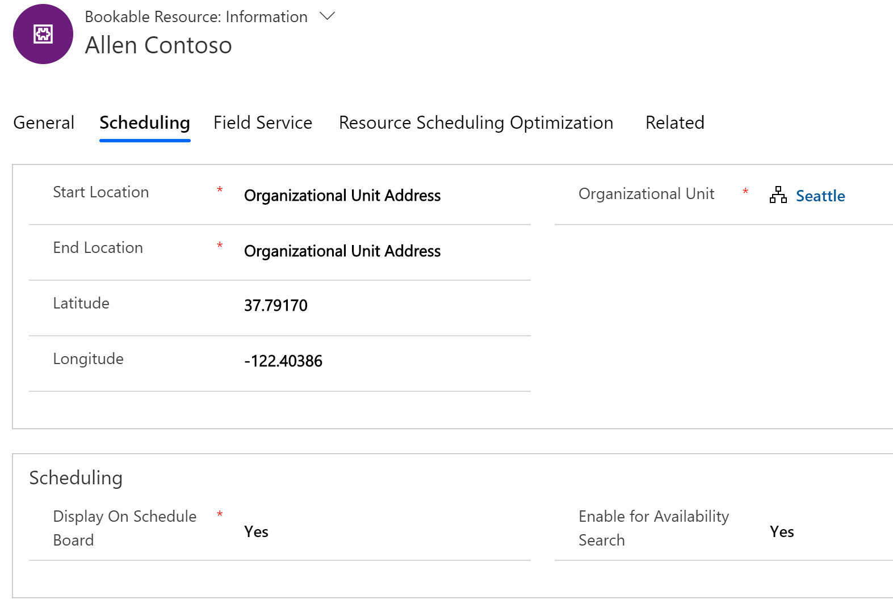

10. **Hourly Rate**: Enter the internal hourly cost of the resource. This is the hourly pay that the resource should be paid by the company. It is used by schedule journals to calculate pay for time worked.
11. **Warehouse**:  Select the default warehouse from which the resource will get their parts. 
12. **Time Off Approval Required**: Choose this if time off needs to be approved or not. If set to **No**, then a time-off request record will block time on the schedule board and show as nonworking hours for that resource. If set to **yes**, the same result will occur once the time-off request is approved. 
13. **Enable Drip Scheduling**: This controls how many bookings can appear on the Field Service Mobile app at one time. Set to **No** to allow all bookings for a resource to display  based on mobile settings (view and sync filters). Set to **Yes** to display a new field titled **Bookings to Drip**, where you can enter the total number of bookings displayed at one time. As a resource completes bookings (sets booking status to completed), more bookings will appear in the bookings tab of the Field Service Mobile app.
14. **Enabled for Field Service Mobile**: Set to **Yes** if the resource will need to use the Field Service Mobile (Xamarin) app on their phone or tablet. Leave as "No" if the resource will only use the Field Service (Dynamics 365) mobile app. 

**Save** the record.  
  
## Add work hours  

After saving the bookable resource, it's time to set the working hours of the resource. Working hours are considered by:

- The schedule board by displaying working and nonworking hours as different colors 
- The schedule assistant by only displaying resources that are working in the results
- Resource Scheduling Optimization, which automatically books requirements to resources that are working. 

Let's walk through how to set up working hours.

In the web interface (Field Service v7.x or earlier), select the arrow next to the resource name, and choose **Work Hours**.

In the unified client interface (Field Service v8.x or later), select **Show Working Hours** at the top of the form. 

 > [!div class="mx-imgBorder"]
> 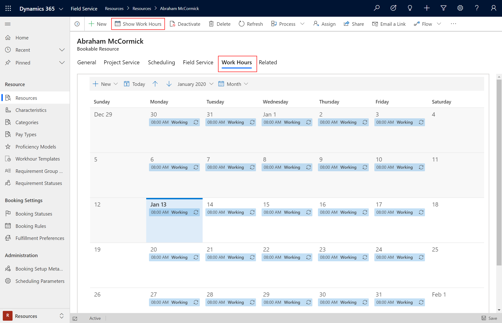

In Field Service **v8.8.14** or later the work hours are displayed directly in the form.

Select **+New** > **Working hours**.

> [!div class="mx-imgBorder"]
> 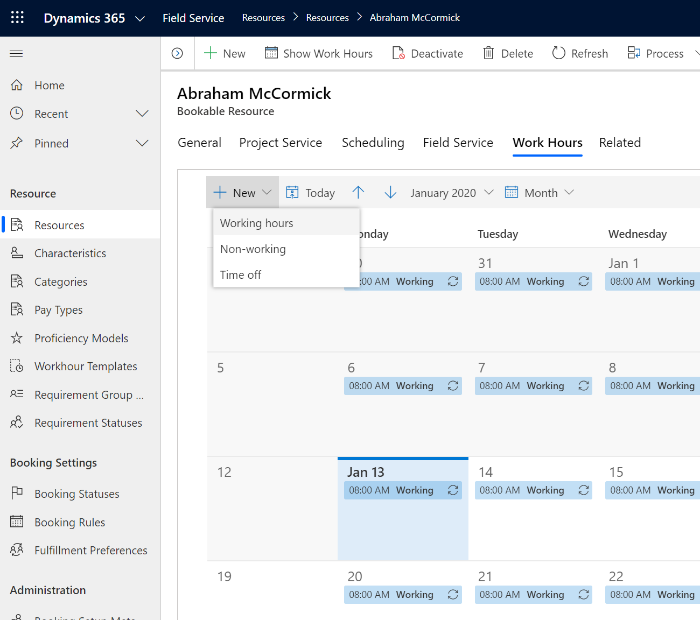

Choosing the beginning and end time of working hours, along with a repeat option such as "every day."

Then **Save**.

> [!div class="mx-imgBorder"]
> 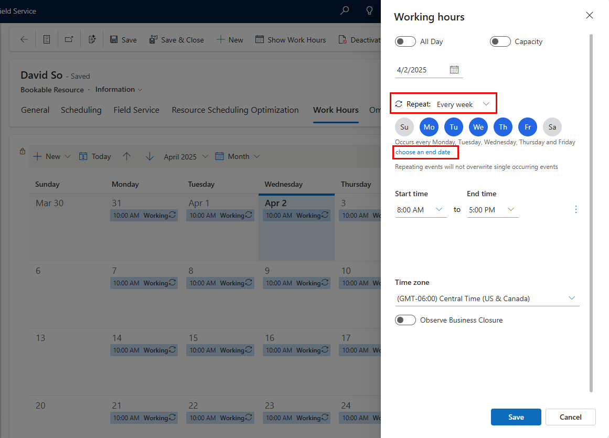

This will update the working hours calendar.

You can edit or delete the working hours bu double-clicking the time slot on the calendar. 

> [!div class="mx-imgBorder"]
> 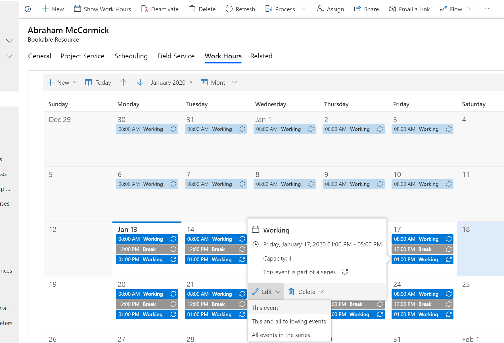 

> [!Note]
> Whether setting the working hours for a day or longer, make sure the time zone reflects where the resource is located, which is configured on the resource form.

In Field Service versions earlier than **8.8.14**, select the **Set-Up** drop-down list and choose one of the following as seen in the following screenshot:  
  
  - **New Weekly Schedule**: Set an ongoing weekly schedule for the resource.  
  
  - **Work Schedule for One Day**: Set the hours the resource can be scheduled for on a particular day.  
  
  - **Time Off**: Set the dates and times the resources can't work. 

> [!div class="mx-imgBorder"]
> 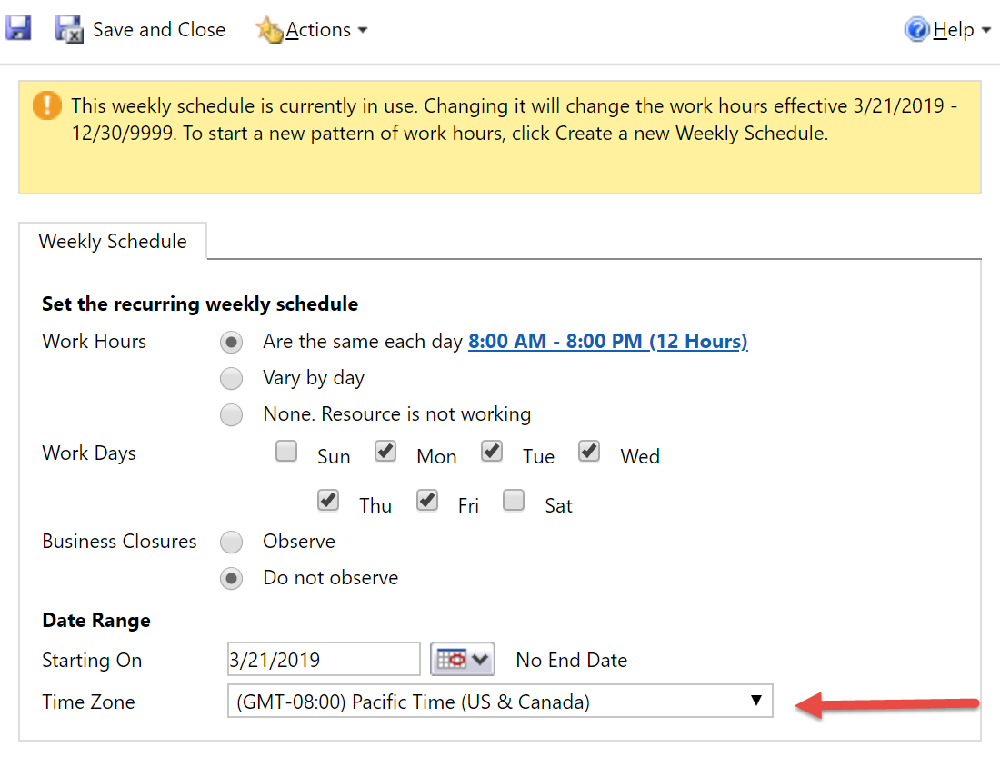
 
## Set up technician resources

At its simplest, a field technician is a mobile worker at your organization who uses the Field Service Mobile app on their mobile device to see Field Service entities like work orders.

A bookable resource that represents a field technician must have:
1. **Resource Type** set to **User**
2. **Enabled for Field Service Mobile** set to **Yes**

> [!div class="mx-imgBorder"]
> 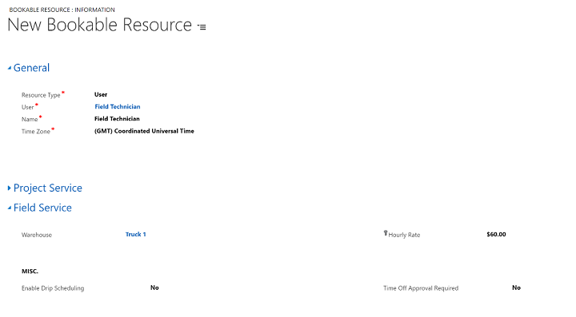

Other fields important for field technicians in field service scenarios are:

- **Start/End Location**: where the resource starts and ends their day is factored into schedule work order requirements to the closest field technician.
- **Display On Schedule Board**: displaying a field technician resource on the schedule board is crucial for enabling dispatchers to manage their schedules.
- **Enable for Availability Search**: the schedule assistant is a dispatcher's best way to assign field technicians to work orders. 
- **Warehouse**: this connects a field technician to a warehouse (typically the truck) to consume inventory on work orders. 

In Field Service v8.2+, latitude and longitude fields exist on the bookable resource entity and are populated with the latest location coordinates from the Field Service Mobile app. Fields may need to be added to the bookable resource form. For more information, see the article on [enabling location tracking](https://docs.microsoft.com/dynamics365/customer-engagement/field-service/geofencing#step-3-enable-location-auditing-for-the-field-service-mobile-app).

## Add characteristics, territories, and categories 

The most common attributes that distinguish resources are characteristics, territories, and categories.

> [!div class="mx-imgBorder"]
> 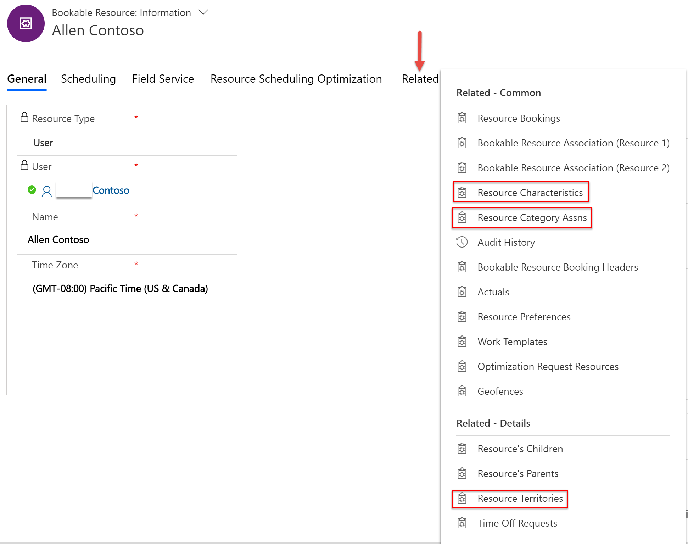

### Add characteristics 

Characteristics represent a resource's skills and certifications. This could be concrete, like a CPR certification; more general, like accounting or web development experience; or as simple as security clearance for a specific building or fluency in the Spanish language.

A resource can have multiple characteristics. Once the characteristic record is created, you can add it to a resource. Learn more on the [setting up characteristics article](../field-service/set-up-characteristics.md).
  
1. From the resource record, go to related entities and choose **Resource Characteristics**.  
  
2. Select **Add New Bookable Resource Characteristics**.  
  
3. Select a **Characteristic** from the lookup.

4. Select a **Rating Value** that represents the resource's proficiency in that skill. This can be a 1-to-10 rating, or even represent the score on a certification exam. 
   - Rating value can be left blank. 
   - You can customize or create new rating values by going to Proficiency Models.
   - When dispatchers are searching for resources to fulfill requirements, the dispatcher can choose which rating value is required for particular skills.
5. **Save & Close**. 

  
### Add categories 

Resource categories serve as roles and titles to distinguish resources. Common examples include service manager, junior field technician, senior field technician, and territory manager. You can add categories to resources via the resource category association entity.  

A resource can have multiple categories. Once the category record is created, you can add it to a resource. Learn more on the [setting up resource categories page](../field-service/set-up-bookable-resource-categories.md).

1. From the resource record, go to related entities and choose **Resource Category Assns**.  
  
2. Select **Add New Resource Category Assns**. 
  
3. Select a **Category** from the lookup then **Save & Close**.  

### Add territories 

Territories represent geographic regions in which the resource conducts work. Common examples include a city, county, specific zip codes, state, or a general region. A resource can be part of multiple territories, but requirements can only exist in a single territory. 

Once the territory record is created, you can add it to a resource. Learn more on the [setting up territories article](../field-service/set-up-territories.md).

1. From the resource record, go to related entities and choose **Resource Territories**.  
  
2. Select **Add New Resource Territory**. 
  
3. Select a **Territory** from the lookup then **Save & Close**.   

## Enable resource for resource scheduling optimization

If resource scheduling optimization is enabled in your organization, a new tab will appear on the bookable resource form. To allow resource scheduling optimization to automatically schedule requirements to the resource, go to the new tab and set **Optimize Schedule** to **Yes**.

Setting to yes does not mean requirements will automatically be scheduled to this bookable resource; instead it means that after resource scheduling optimization is set up and with the appropriate scope to include this bookable resource, it would then be eligible for automatic schedules.

> [!div class="mx-imgBorder"]
> 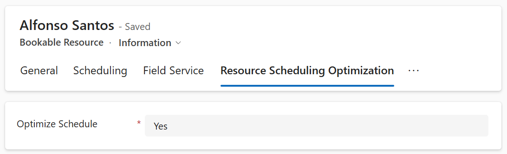

## Geolocate resources

Work order locations are defined by the latitude and longitude of either the work order form, or the related service account. It's important to also geolocate resources.

Navigate to **Resource Scheduling** > **Resources**.

For resources to appear on the schedule board map, they must have a geocoded starting and ending location.

There are **two ways** to geocode your resources.

### Option one

Set resource start/end location to **Resource address** and ensure the related resource record (user, account, contact) as defined by the resource type has latitude and longitude values.

> [!div class="mx-imgBorder"]
> 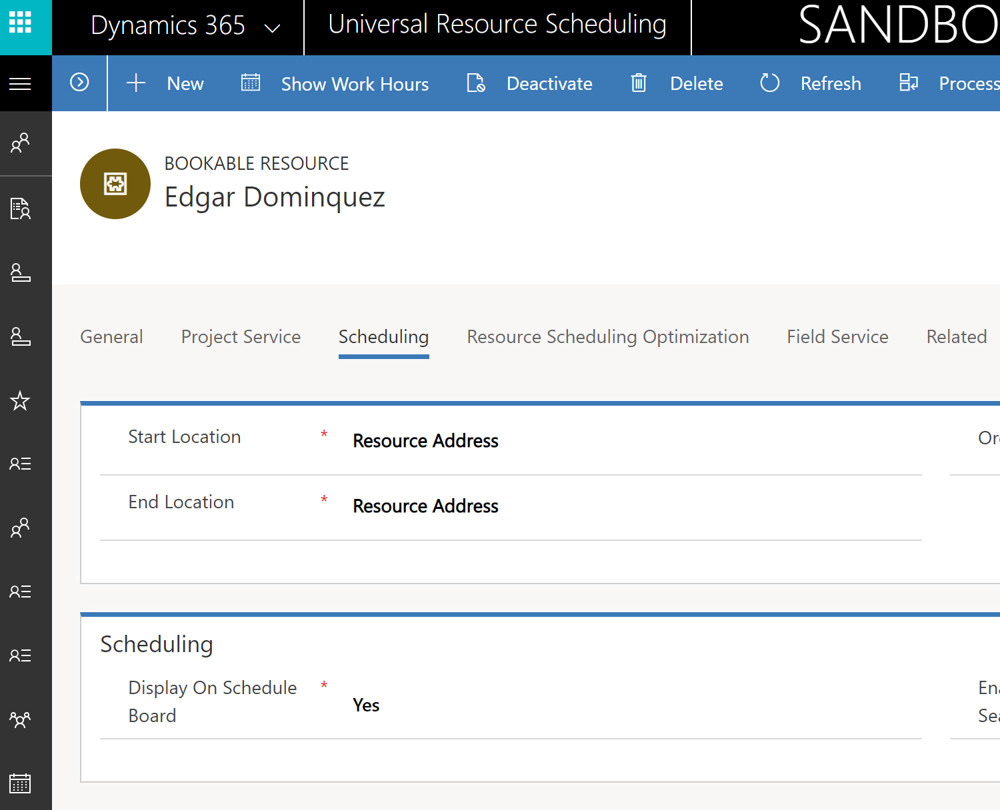

For example, in the following screenshot, the bookable resource has resource type set to **Contact**; the related contact record must be geocoded, meaning latitude and longitude fields must have values.

> [!div class="mx-imgBorder"]
> 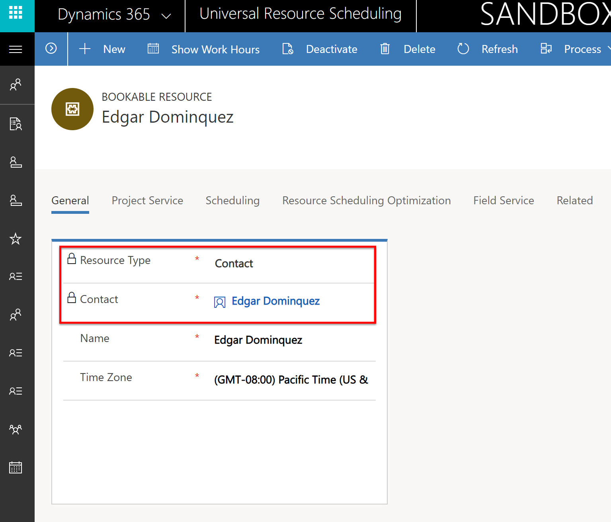

> [!NOTE]
> For routing purposes, the location of a resource is defined as the current work order location, current location of the mobile device, or the start and end location defined here when the other options are not applicable.

### Option two

Set resource start and end location to **Organizational Unit Address** and ensure the related organizational unit record is geocoded, meaning latitude and longitude fields must have values.

> [!div class="mx-imgBorder"]
> 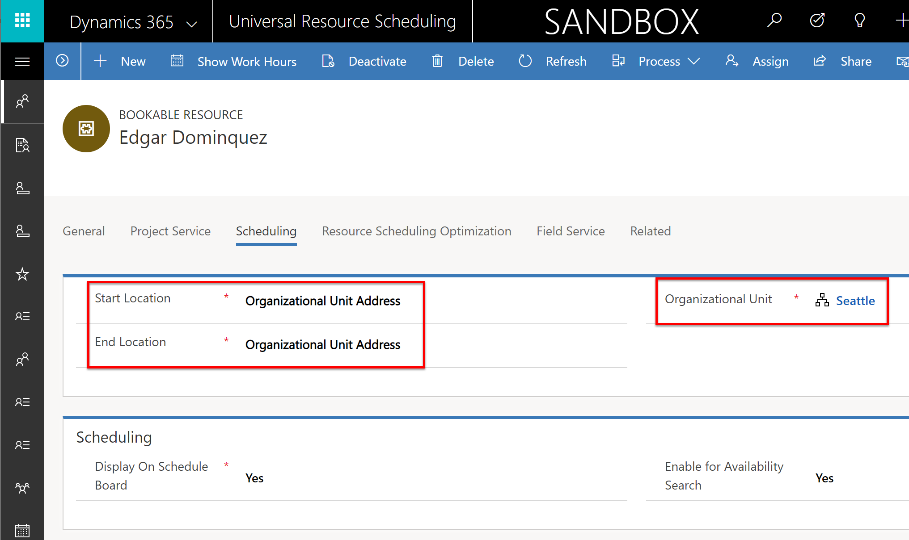

> [!NOTE] 
> You may need to add the latitude and longitude fields to the organizational unit entity form.

### Confirm geocoding works appropriately

To make sure resources are geocoded properly, go to **Universal Resource Scheduling** > **Schedule Board**. The resource should appear on the map. Select a resource's name to highlight their location pin on the map.

> [!div class="mx-imgBorder"]
> 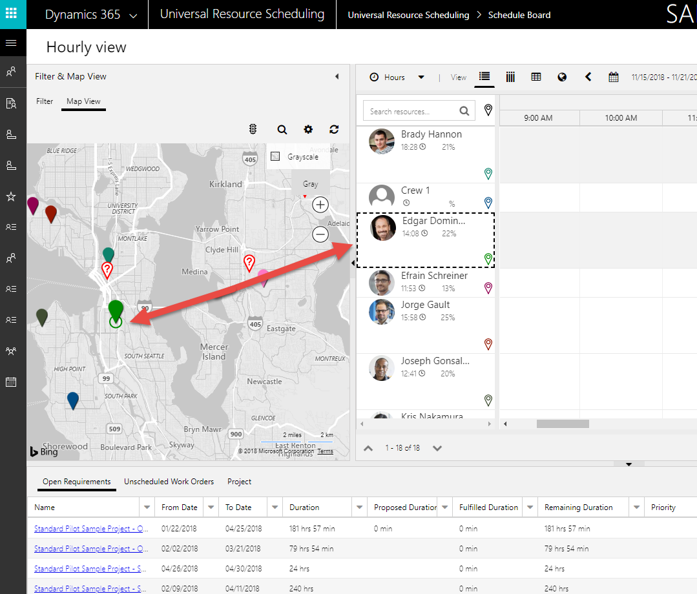

## Configuration considerations

Resource type and the start and end location of **resource address** work together to define a resource's location. 

For example, the following screenshot shows a bookable resource with resource type of **Contact** and a lookup to a contact record. Not shown is the start/end location field set to resource address.

> [!div class="mx-imgBorder"]
> 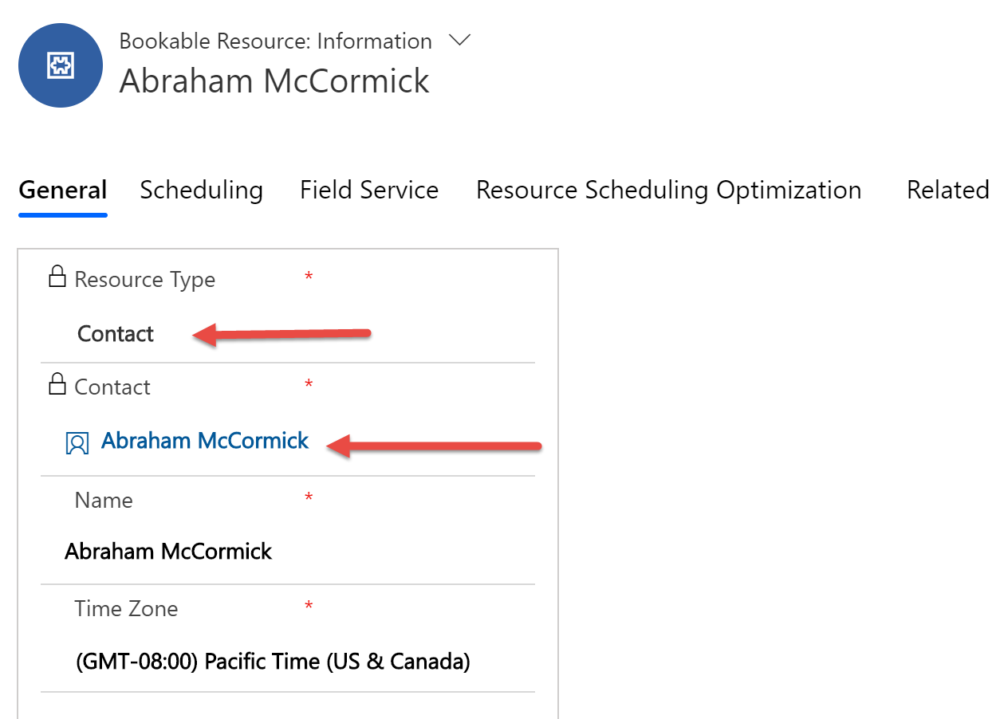

After going to the related contact record, you can add an address and then select the geo code button to populate latitude and longitude values that are used as the resource's start and end location for scheduling and routing purposes. This is also the resource's location displayed on the schedule board map.

The process is similar for resources with resource type of Account or User. **Editing a user record address may have to be done in the Microsoft 365 admin center.

> [!div class="mx-imgBorder"]
> 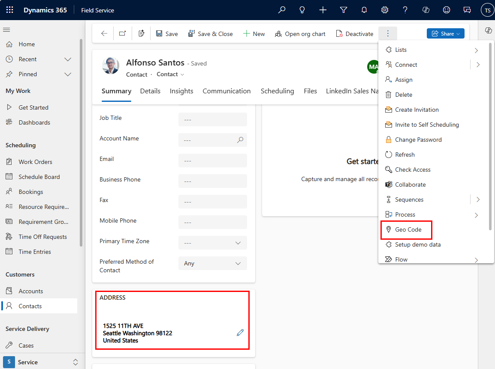

## Additional notes

- Only one resource record can be associated to a user record; however, multiple resources can be associated to a single account or contact record. 
- The start and end location of a resource is used as the resource's location during break hours if a break is configured when working hours are set up for that resource. 
- The new work hours control is added to the bookable resource out-of-the-box form. But if you have a custom form defined on this entity, you must enable the work hours tab on the form by following these steps:
  1. Create a tab with name as "work hours." Create a section in it and add the "calendar" field to it.
  2. Double-click on the calendar field, and change the control to "Work Hour Control." Save and publish the form.

### See also   
 
 [Set up bookable resource categories](../field-service/set-up-bookable-resource-categories.md)   
 [Set up characteristics](../field-service/set-up-characteristics.md)   
 [Set up resource pay types](../field-service/set-up-resource-pay-types.md) 

[!INCLUDE[footer-include](../includes/footer-banner.md)]