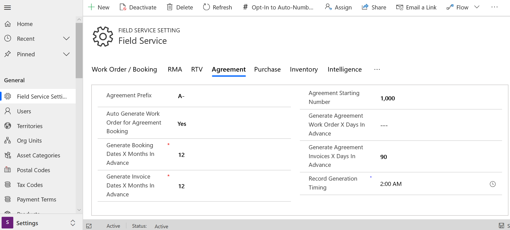
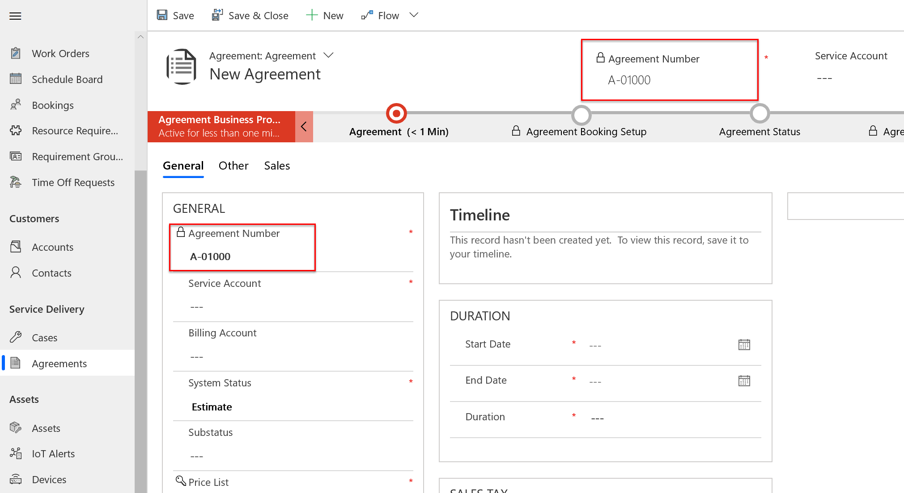
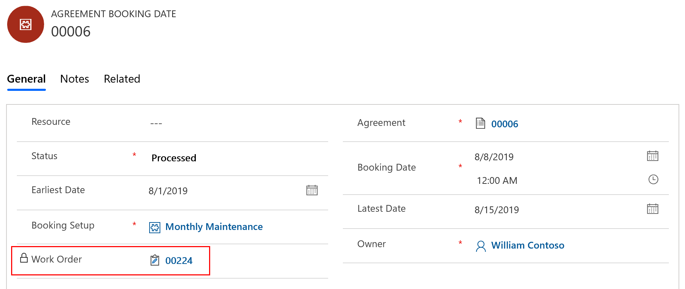

# Set up agreements to automatically generate work orders and invoices

Field Service Agreements allow organizations to automatically generate work orders and invoices with predefined details, frequency, and date range. Agreements are most commonly used for maintenance schedules where an organization must perform daily, weekly, or monthly inspections on equipment. 

Here are a few different ways agreements can be configured and utilized. The agreement generates:

- daily inspection work orders that dispatchers schedule via the schedule board or schedule assistant
- monthly maintenance work orders that are automatically scheduled by Resource Scheduling Optimization
- weekly work orders where the agreement assigns the same resource each time at a defined start time
- a single work order each month to inspect multiple customer assets at a customer location 
- multiple work orders each year to inspect multiple assets at a customer location
- quarterly invoices to bill customers for predefined products and services

To use agreements, first create the **Agreement**. This is where you'll define high level details such as the customer, date range, and price list. Next create an **Agreement Booking Setup** where you'll define how often work orders should be created for the agreement along with basic details of the eventual work orders like Work Order Type. After that, you'll add **Agreement Incidents, products, services, and service tasks** that define the specific details of the work to be performed as part of each work order that is generated. Finally, you'll **activate** the agreement and Agreement Booking Dates will be created along with work orders as the date approaches.

Let's walk through two scenarios to show how agreements can create work orders and invoices.

## Prerequisites
Field Service v6.1+

This article assumes you have work order related data such as accounts, incident types, products, services, and service tasks configured in your system. 

Consider specifying an agreement prefix and start number (optional). Go to **Field Service > Settings** then the Agreement section.

Enter an **Agreement Prefix** and **Agreement Starting Number**.

> [!div class="mx-imgBorder"]
> 

Doing so will dictate the Agreement Number when a new agreement is created. 

> [!div class="mx-imgBorder"]
> 

## Scenario 1: auto generate work orders for asset maintenance

An organization must perform monthly maintenance on a piece of equipment they installed at a customer's location for the next two years. They would like to use Dynamics 365 for Field Service to automatically generate the maintenance jobs in the middle of each month with some flexibility. They would like dispatchers to schedule the monthly maintenance jobs to the best and most appropriate field technicians and bill the customer for completed work at an agreed upon price.   

We will use agreements along with customer assets, incident types, and price lists to configure this scenario. 

### Step 1: Create an agreement

From the main menu, click **Field Services** > **Agreements** > **+New**.  
  
Fill in your information. Use the handy tooltips as a guide.  
    
**Service Account & Billing Account** - Fill in the basic information regarding the agreement, such as where the agreement work order will take place, and which account the invoices will go to.  

**System Status** - defines if the agreement is currently being executed. Set to **Estimate** while building a new agreement and adding details. We will set to **Active** later on when the details are set and we are ready to begin agreement work orders or invoices.

**Start & End dates** - define the duration of the agreement.
  
**price list** - controls the price list populated on work orders and invoices generated from this agreement and effectively work order product, work order service, and invoice product and invoice service prices. It is recommended to add the relevant products and services to the price list with the agreed upon prices to the price list entered here. Because agreements typically involve negotiation, it is common to create a specific price list solely for this agreement. The price list on resulting work orders and invoices can be manually updated as needed.

> [!div class="mx-imgBorder"]
> 

In the Other tab you can enter more details such as the **Service Territory** resulting work orders should be part of, and **Record Generation Time** which dictates the time of day work orders, invoices, and other records related to this agreement should be generated. This is important because some organizations do not want agreements creating work orders in the middle of the working day. 

Finally, **Save**.  

### Step 2: Set up booking recurrence

Once the agreement has been created, specify how often work orders are generated.  

In the **Booking Setups** section, click **+Add Booking Setup record**.  

> [!div class="mx-imgBorder"]
> 

Fill in your information to create the agreement schedule. Use the handy tooltips as a guide.

**Name** - enter the name of the agreement schedule. An example is "Montlhy Maintenance". Naming is important because an agreement can have multiple booking recurrences. As an example, the service organization may perform weekly and monthly maintenance as part of the same agreement.

### Work Order Settings  

**Auto Generate Work Order** - set to **Yes** to have this agreement automatically generate work orders. The system will generate work orders on a rolling basis. Generated work orders will appear in the active work order view with a status of open-unscheduled. If set to **No**, you have to manually generate the work order for each schedule date.   

**Generate Work Orders Day in Advance** - dictates how many days before the expected service date the work order will be generated. If you choose a large number of days in advance, you may have a lot of work orders just sitting there, but if you choose too few days in advance, you may not have time to prepare.
 
**Work Order Type**, **Priority**, **Work Order Summary**, and **Work Location** entered here are passed down to resulting work orders.

### Booking Settings

-   **Auto Generate Booking** - set to **Yes** to have the system book generated work orders (regardless of auto generated or manually generated). If set to Yes, you must specify a **Preferred Resource** and **Preferred Start Time** for the booking. If set to **No** the generated work orders must be scheduled via the normal scheduling process: manually, with the schedule assistant, or with resource scheduling optimization. 

> [!Note]
> Bookings made by agreements will not consider existing bookings, meaning it will double book on top of exisitng schedules.
  
**Pre Booking Flexibility** and **Post Booking Flexibility** fields specify how many days before and after the anticipated schedule date the work order is allowed to be scheduled. These will populate the **Date Window Start** and **Date Window End** fields on the generated work orders to aid the schedule assistant. As an example, if you plan to perform monthly maintenance on the 15th of each monthly, and set pre and post booking flexibility to 7 days; then the work orders can be scheduled between the 8th and the 22nd of each month.
  
   
**Time Window Start** and **Time Window End** can be specified to create a time window for generated work orders, and will be taken into account by the schedule assistant. (Example: Work Order should be scheduled between 8 a.m. and 12 p.m.).  

> [!div class="mx-imgBorder"]
> 

Next you need to define a pattern for work orders to be created by selecting **Booking Recurrence** on the command bar at the top.  
  
Use the pop up window to define a recurrence. 

> [!div class="mx-imgBorder"]
> 

Typical examples are:

- Weekly
- Monthly
- Every 3 months
- Yearly
- The first Monday of each month
- Every other Friday

You an also define custom dates work orders should be performed if a pattern does not reflect your business needs. An example is an agreement to perform service on various holidays throughout the year.

**End Date Behavoir** - entering specific start and end date behavior allows you to generate work orders for all or part of the agreement duration. Selecting **No End Date** implies the work orders should be generated until the agreement end date.

**Save**

### Step 3: Add agreement work details

After setting up the **Agreement** to define the high level details, and the **Agreement Booking Setup** to define a recurrence, the next step is to define the work that should be performed.

This is achieved by adding incident types, products, services, and service tasks to the agreement.

From the agreement booking setup, click **+Add Agreement Booking incident record**. Use the tooltips as a guide to specify the incident details, and then click **Save & Close**.

> [!div class="mx-imgBorder"]
> 

As you add incidents to the agreement the related products, services, service tasks, and characteristics (in background, not visualized) are added to the agreement and then to work orders as they are generated. See note about the "Copy Incident Items to Agreement" in Configuration considerations at the end of this article.

> [!div class="mx-imgBorder"]
> 

### Customer assets with agreements

By specifying a customer asset on the agreement incident, you can define recurring work that should be performed on specific equipment and build service history. Furthermore, you can add multiple incident types to an agreement booking setup each with a customer asset. 

Using the example of two incidents for monthly maintenance, an organization can:

1. perform two different types of maintenance procedures (incident types) on the same customer asset
2. perform the same maintenance procedure (incident type) on two different customer assets, as long as both assets are at the same location as defined by the service account.

> [!Note]
> A single agreement can have multiple booking setups. Each booking setup can have its own recurrence and work to be done. This means your organization can perform a weekly inspection and a monthly maintenance as part of the same agreement. 

### Step 4: Activate agreement and view work orders

Finally, after the high level details, recurrence, and work are defined, the last step is to **activate** the agreement to begin generating related records such as maintenance dates and work orders. This is typically done after manager review and customer acceptance. To add more details to the Agreement status, consider using the Agreement Sub-Status values. Custom agreement sub-statuses can be created.

> [!div class="mx-imgBorder"]
> 

From the agreement, set the **System Status** field to **Active**. Doing so will trigger the creation of booking dates that represent the dates service should be performed.

> [!div class="mx-imgBorder"]
> 

As time approaches the booking dates, work orders will be generated based on the "Generate Work Orders Days in Advance" field. The booking date will then have a status of Processed along with a lookup to the generated work order.

> [!div class="mx-imgBorder"]
> 

You also have the ability to manually generate work orders for each booking date. This is applicable if you set "Auto Generate Work Orders" to "No" or for unique business cases where you must generate a work order earlier than defined.

> [!div class="mx-imgBorder"]
> 

If you decided to have the agreement Auto Generate Bookings, the work orders will be scheduled to the preferred resource when the work orders are generated.

### Step 5: Perform agreement work order

As work orders are generated, they will appear among other work orders in the Active Work Orders view. 

The generated work orders will have all the details specified on the agreement such as price list, work order type, incident type(s), customer asset, etc.

> [!div class="mx-imgBorder"]
> 

A lookup to the agreement will also be noted in the Settings section.

> [!div class="mx-imgBorder"]
> 

After selecting the work order **Book** button and triggering the schedule assistant, the **Search start** and **Search end** time parameters will reflect the booking date and pre and post booking flexibility fields noted earlier on the agreement booking setup.

> [!div class="mx-imgBorder"]
> 

After an agreement work order is performed by a field technician and closed by a manager, an invoice for completed work will be created as part of the normal work order invoicing process. This is true whether a work order is part of an agreement or not. See the topic on [work order life cycle and statuses](/work-order-status-booking-status.md) for more details.

## Scenario 2: auto generate invoices

Agreement invoices are used to automatically generate invoices for products and services. The invoices will be generated at a defined recurrence and contain the same products at the same price each time. The invoices are generated and billed regardless of whether any work orders were performed or not. It is a similar model to how you may pay a monthly cell phone bill regardless of the number of phone calls or texts you send.

Let's configure the scenario where a customer pays a field service organization a quarterly amount for a service plan.

### Step 1: Create an agreement or select an existing one

You can add an agreement invoice to an existing agreement or add it to a new one. You can have an agreement with only an agreement invoice and no maintenance plan and even have multiple invoices for a single agreement.

In our example, we will add quarterly invoices to the agreement we just created. 

From the agreement, go to **Invoice Setup > Add New Agreement Invoice Setup**

> [!div class="mx-imgBorder"]
> 

### Step 2: Set up invoice recurrence and products

In the invoice products section, add the products you would like to bill the customer for on a regular basis. The price of the invoice products will be derived from the price list on the agreement.

> [!div class="mx-imgBorder"]
> 

> [!Note]
> Invoice products can only be products where Field Service Product Type = Inventory or Non-inventory. Service type products cannot be added.

Next define how often the invoices should be generated by selecting the **Invoice Recurrence** button at the top.

> [!div class="mx-imgBorder"]
> 

> [!div class="mx-imgBorder"]
> 

**Save**

### Step 3: Activate invoice recurrence and view invoices

Because this agreement is already Active, the invoice dates will generate after a short time but not immediately. If you added an agreement invoice setup to a new agreement or an existing one that has an estimate status, then you will need to activate the agreement.

> [!div class="mx-imgBorder"]
> 

Once the agreement is active, agreement invoice dates will generate not immediately but after a short time. 

> [!div class="mx-imgBorder"]
> 

Within Field Service Settings you can define how far in advance the system should generate agreement invoices dates and agreement invoices.

> [!NOTE]
>  The invoice will generate in advance depending on what you have set in the **Generate Agreement Invoices X Days in Advance** field in **Field Service Settings** under the **Agreement** section. This means the invoice due date is set based on your recurring invoice setup but it will be created `x` days in advance. If no value is entered for **Generate Agreement Invoices X Days in Advance**, the system will generate the invoice on the day of the invoice date at the **Record Generation Timing** field on 1) the agreement then 2) in field service settings.

> [!div class="mx-imgBorder"]
> 

## Configuration considerations

In Field Service Settings there are important defaults that can be set for agreements that help administrators control how the organization creates agreements.

> [!div class="mx-imgBorder"]
> 

**Generate Booking Dates X Months in Advance** - Agreement booking dates can help organizations plan for maintenance. However if an agreement spans a long time period, then you may not want to generate all booking dates at one time but rather X months in advance. The default is 12 months.

**Generate Agreement Work Order X Days in Advance** - this value exists on the agreement booking setup and can vary for each booking recurrence, but a default can be set here.

record generation time is time of user 

Agreement with multiple incident types
- how are you tracking assets - if one asset for a work order you can ensure all time spent on that work order was for that asset
- multiple people 

Agreement with multiple recurrences
- if youre doing something monthly, quartlery, and yearly, multiple recurrences

Schedule agreement work orders with RSO
- make sure the requirements of generated work orders are set to optimize. this can be achieved with a workflow, or by default for all work flows. 

using invoices and work orders on same agreement?
- could be the same
- pay cell phone whether make calls or not

entitilements/SLAs?
- pre and bost bookings are effectively your SLA
- dont bill for work orders from the agreement by setting up entitlement at the incident type level because organizations commonly create incident types specifically for agreements. can be done with price list.

location/account

## Additional Notes

agreements work with the sales opp quote order process. 
- service-maintenance based lead
- opportunity > opportunity lines with service based lines > monthly maintenance and start and end date 
- (can go straight to quote) quote > quote lines (service based lines) > quote booking setup > won > order > active agreement

if no number is entered, when will invoices be generated? day of at record generation

if no number is entered, when will work orders be generated? day of at record generation

generate agreement dates x months - use those to understand work

if generate WO is no and generate booking is yes, booking will happen when WO is generated.

copy incident items to agreement -   There is a field on the incident type record called **Copy incident item to agreement** and if marked **Yes**, then when you link the incident to the agreement booking setup then all service task, products, and services that are associated with the incident will be copied to agreement booking setup. If you need to make changes to service tasks, products, or services you can do so from the service task, product, and services section within the agreement booking setup record. This information is automatically copied over to any work order that is created for the agreement booking setup. If copy incident item to agreement is marked, **No** then the information is not copied over from the agreement booking setup but rather when work orders are created the service tasks, products, and services will inherited directly from the incident type service task, products, and services.  

 when are items copied to agreements? on add or on activate? looks like on add. what about when no? asynchronous 

an agreement can only be for a single location - yes

what about the characteristics of the agreement incident

what can you do after activating an agreement?

quote invoice as a substitute

you cannot manually generate agreement invoices like you can with agreement work orders

agreement sub status note

can pick an incidet type with requirement groups for an agreemnt

changing booking recurrence will update booking dates   

**Tips**:  
  
-   A single agreement can have numerous agreement schedules. As an example, you may create an agreement schedule called "Weekly Visits" that creates work orders every week with specified incidents, products, services, and service tasks. Additionally, within the same agreement, you may have another agreement scheduled titled "Monthly Visits" that creates work orders every month with different incidents, products, services, and service tasks.  
  
-   The price list on the agreement specifies the price of all products and services related to an agreement. It is important to add all products and services that will be used during the agreement to the agreement price list. Agreements usually contain a negotiated price for goods and services that are usually reflected in an entirely new price list.  
  
-   Though the agreement provides a framework to generate work orders, details can still be edited at the work-order level. As an example, though a work order may be generated from an agreement, more products and services can be added to the work order "ad hoc", and other details, such as price list and work order type, can be changed, assuming sufficient permissions.  

> [!div class="mx-imgBorder"]
> 
  
### See also   

