# Territories for accounts, work orders, and scheduling in Dynamics 365 Field Service

Territories help you divide your business into geographical regions for work order management, scheduling, and reporting. You can group your customers, work orders, and resources based on city, state, county, postal code, or even define a custom territory such as "West region."

By using territories with work orders and resources, you can make sure dispatchers only schedule work orders to field technicians (resources) with a matching territory. This also means that territories serve as a filter on the schedule board, schedule assistant, and resource scheduling optimization.

Territories are also important for reporting because many organizations want to measure first-time fix rate, work order count by type, and work order invoice revenue by territory.

To configure and use territories in Dynamics 365 Field Service:

1. Create your territories
2. Associate territories with resources
3. Add accounts to territories
4. Use territories during work order scheduling
5. Use territories on the schedule board
 
   
## Create a territory 

Create all of your territories as master data in Field Service settings. Sometimes this is done via importing an Excel sheet.
  
1.  From the main menu, go to **Field Service** > **Administration**, and then choose **Territories**.  

> [!div class="mx-imgBorder"]
> 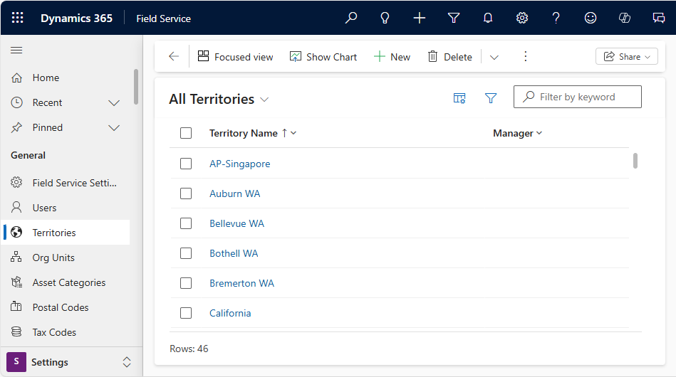

2.  On the **All Territories** screen, select **+New** in the upper left corner.  
  
3.  Fill in your information: 

> [!div class="mx-imgBorder"]
> 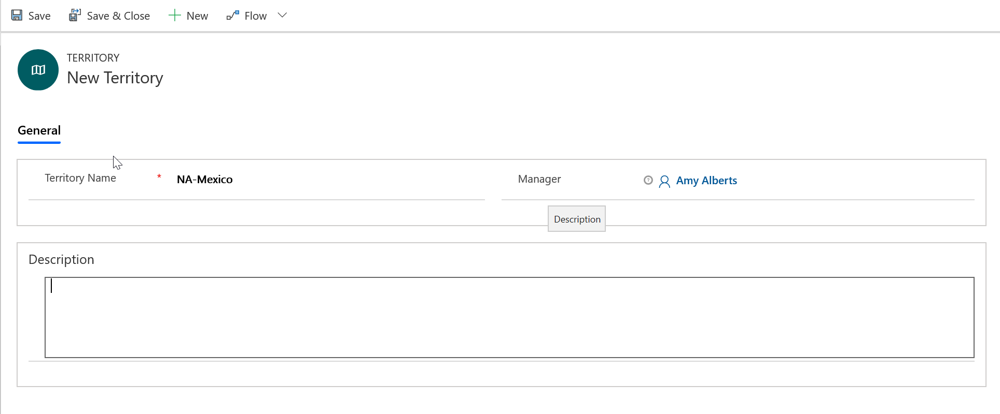
  
  - **Name**: Enter the geographical name for the territory, such as the name of a city, country or region, or a state.  
  
  - **Manager**: Enter the name of the user who manages this territory. This person typically assigns leads to salespeople.  
  
  - **Description**: Enter any details that you'd like to include for this territory,   
  
4.  **Save & Close**.  

 
## Assign resources to territories

Field technicians, equipment, and facilities - represented in the system as **Bookable Resources** - can belong to one or more territories in order to define the geographic territories they work in.
  
1. Go to **Resources** in the main menu and select the resource you want to add to a territory.  
  
2. From the resource form, go to **Related** > **Resource Territories**.  

> [!div class="mx-imgBorder"]
> 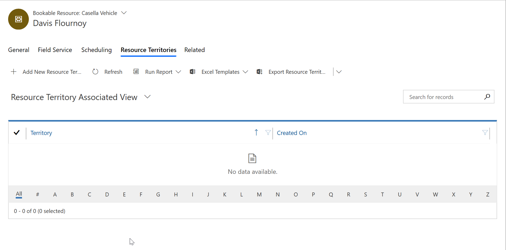

3. Select **+ Add New Resource Territory**.

> [!div class="mx-imgBorder"]
> 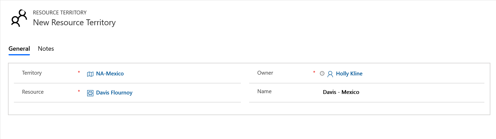

4. Populate the **Territory**, **Resource**, and **Name** (optional).  

> [!div class="mx-imgBorder"]
> 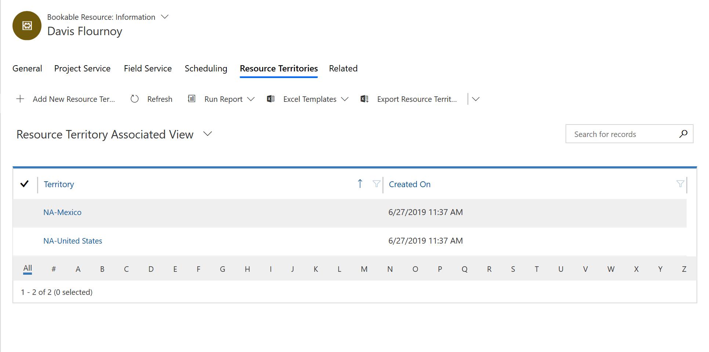

> [!Note]
> Resources can be a part of multiple territories, but accounts and work orders can only belong to 1. 
 
## Add accounts to territories

Next, mark each account as part of a service territory. 

This is done in the **Service Territory** lookup field on the **Field Service** tab of the **Account** form, which is exposed when the Field Service app is installed in your Dynamics 365 environment. 

> [!div class="mx-imgBorder"]
> 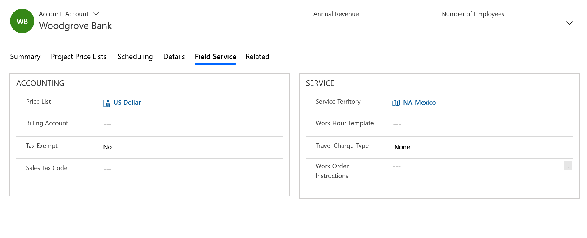
 
> [!Note]
> An account can only be part of 1 service territory.
 

## Territories for scheduling

When scheduling work orders and other entities, you can match the required service territory to the resources in those territories.

For example, when you assign a service account to a work order as required, the service territory of the account will autopopulate on the work order, assuming the service account belongs to a service territory.

> [!div class="mx-imgBorder"]
> 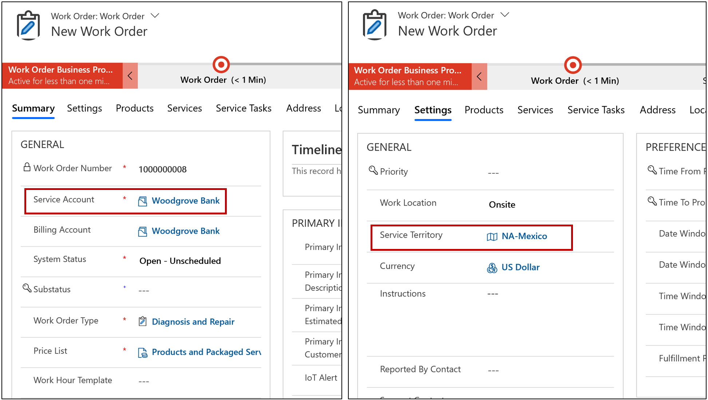

Otherwise, a service territory can be added manually on the work order form.

When you attempt to book a work order with the schedule assistant by selecting **Book** from the work order form or with the schedule board, the **Service Territory** will autopopulate as a filter, and only display related resources. 

> [!div class="mx-imgBorder"]
> 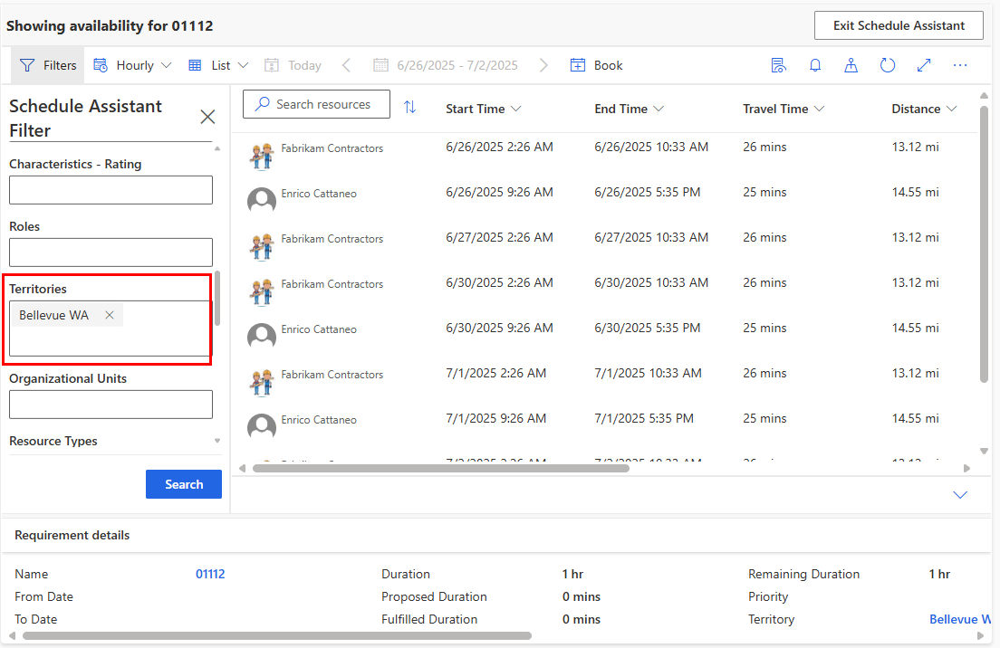

The resources displayed will be part of that territory. 

You can also manually add multiple territories as filters; this searches for resources in either territory.

> [!div class="mx-imgBorder"]
> 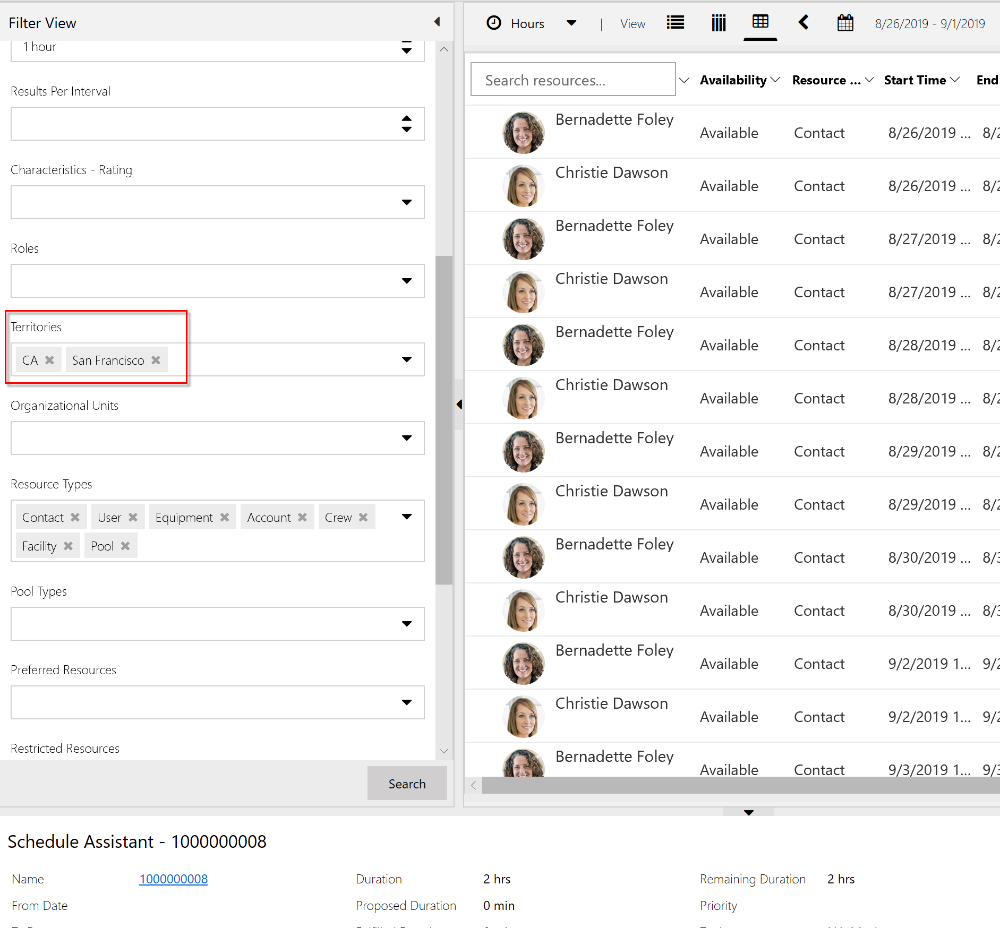

## Territories on the schedule board

Territories are also used on the schedule board to more effectively manage resources. You can create schedule board tabs specific to a single territory that is managed by a dispatcher.

From the schedule board, add one or more territories as filters, and the resources displayed will adjust accordingly. Then choose **Options** > **Save Current Filters as Default** to ensure the filters remain the next time you return to the schedule board tab.

> [!div class="mx-imgBorder"]
> 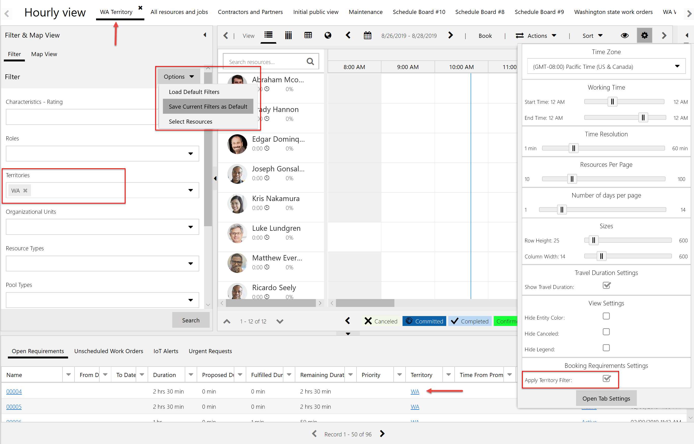

To filter requirements by territories in the lower pane, select the gear in the top right to access schedule board configurations and select **Apply Filter Territory**. As demonstrated in the previous screenshot, this filters the requirements in the lower panel to those in the "WA territory." Now both the resources and the requirements in the schedule board tab belong to the same territory.

## Configuration considerations

In **Resource Scheduling** > **Settings** > **Administration** > **Scheduling Parameters**, there is a setting called **Auto Filter Service Territory** that will filter requirements on the schedule board tab based on the filtered territory by default. This corresponds with the example in the previous section.

> [!div class="mx-imgBorder"]
> 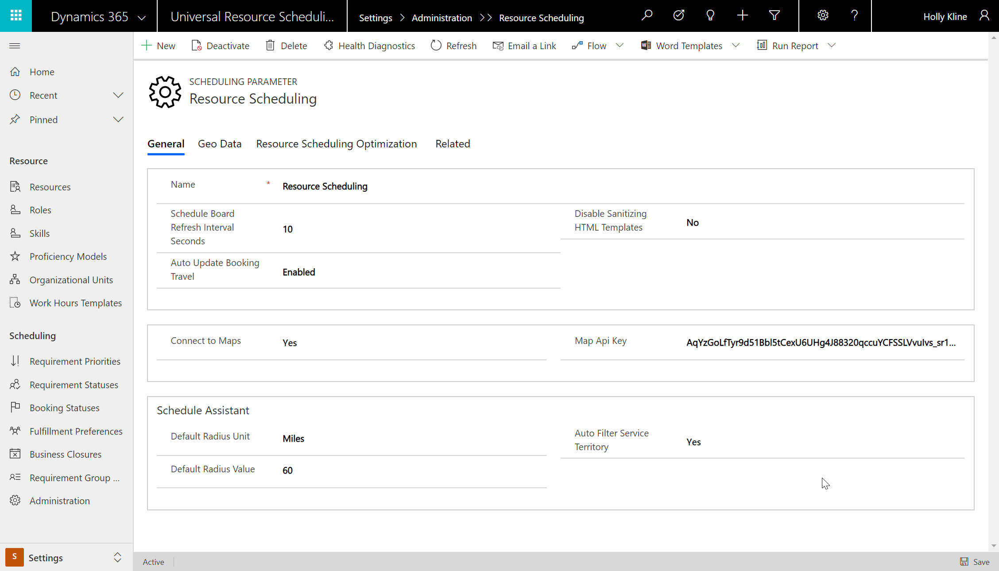

### Postal codes

You can define territories based on postal codes (zip codes). When creating a territory, add one or more related postal codes. When the postal code is present on the account or work order address, the related territory will autopopulate.

> [!div class="mx-imgBorder"]
> 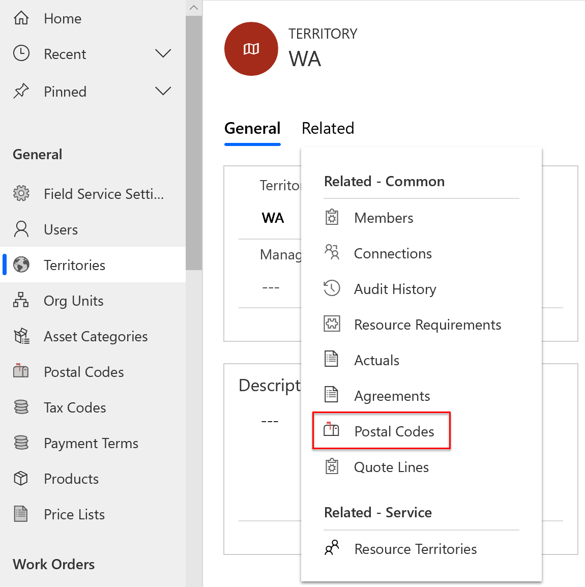

## Additional notes

### Implementation notes

- **Territories as more than location.** Organizations frequently use territories to represent more than location by combining it with the purpose of the resource group. For example, if there are resources who operate in Seattle and some are responsible for maintenance and others inspection, the organization can create two territories: "Seattle - maintenance" and "Seattle - inspection." This is also helpful if different dispatchers are managing each territory because you can have different schedule board tabs for each.
- **Using territories for non-field service scenarios.** Beyond field service, territories can be used for other scenarios. A common example is dividing salespeople into sales territories and scheduling time with leads, quotes, or opportunities. For this scenario, you can use a lookup to the service territory on the **Resource Requirement** form. For more information, see the article on [enabling an entity for scheduling](schedule-new-entity.md).
- **Variable territories.** An organization may need resources to belong to different territories during different time periods. One example is during the day a resource may cover a small territory, but at night when demand is low, a resource may be responsible for a larger territory. This is not supported out of the box; however, one option is to use a workflow to add and remove a resource from a territory based on the time of day.

> [!div class="mx-imgBorder"]
> 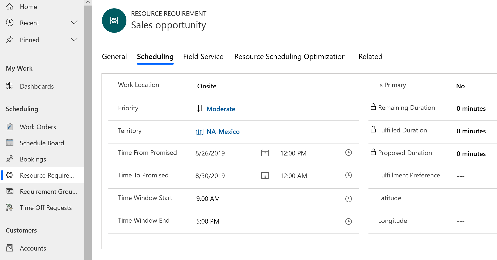

### Other notes

- Territories are not hierarchical or associative.
- **Crews**: if a schedule board is filtered to show resources for the Washington territory, and the crew header resource is part of that territory, it will be displayed. This is true even if resource children are not part of that territory. For more information, see the article on [enabling an entity for scheduling](resource-crews.md).
- You can't allocate the same user (not resource entity, but user entity) to multiple territories. If you need to assign a user to a large area (more than one existing territory), create a new territory that includes the existing territories, and then assign the user to that new territory. 

### See also

- [Universal Resource Scheduling for Field Service](universal-resource-scheduling-for-field-service.md)
- [Set up bookable resources](set-up-bookable-resources.md)

  

[!INCLUDE[footer-include](../includes/footer-banner.md)]