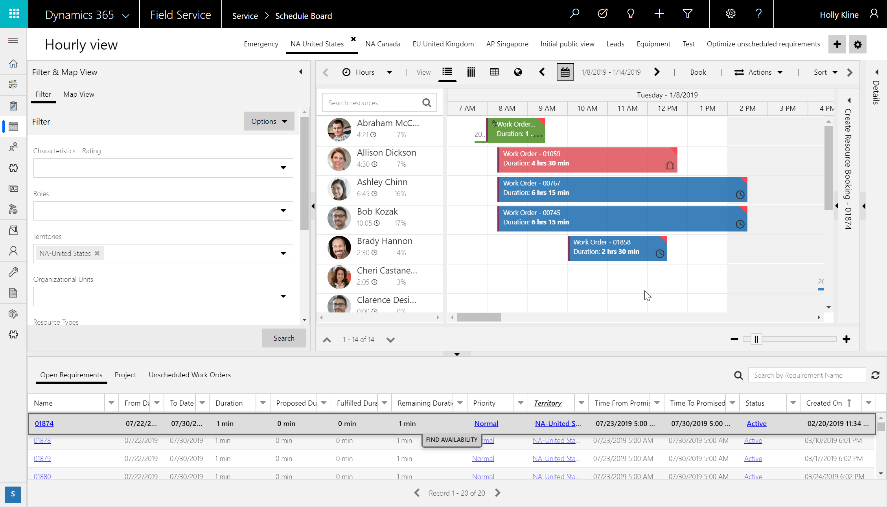

# Territories for accounts, work orders, and scheduling

Territories help you divide your business into geographical regions for work order management, scheduling, and reporting. You can group your customers, work orders, and resources based on city, state, county, postal code, or a custom territory such as "West region."

By using territories with work orders and resources, you can ensure dispatchers only schedule work orders to field technicians (resources) with a matching territory. In other words, territories serve as a filter on the schedule board, schedule assistant, and resource scheduling optimization.

Territories are also important for reporting because many organizations want to report on first time fix rate, work order count and type, and work order invoice revenue **by territory**.

Using territories in the Field Service solution includes:

1. Creating your territories
2. Associating territories to resources
3. Adding accounts to territories
4. Using territories for work order scheduling
5. Using territories on the schedule board
 
   
## Create a territory  
  
1.  From the main menu, click **Field Services** > **Administration**, and then choose **Territories**.  
  
2.  On the **All Territories** screen, click **+New** in the upper left corner.  
  
3.  Fill in your information:  
  
    - **Name**: Enter the geographical name for the territory, such as the name of a city, country/region, or a state.  
  
    - **Manager**: Enter the name of the user who manages this territory. This person typically assigns leads to salespeople.  
  
    - **Important**: You can't allocate the same user to multiple territories. If you need to assign a user to a large area (more than one existing territory), create a new territory that includes the existing territories, and then assign the user to that new territory.  
  
    - **Description**: Enter any details that you'd like to include for this territory; for example, "Sales territory created for education and training".  
  
4.  When you're done, on the command bar, click **Save** or **Save & Close**.  

Territories are managed in Field Service Settings
 
To add a new Territory, click the New button.  Populate the Territory Name and the Manager.  

Create all of your territories as master data in Field Service Settings. Sometimes this is done via importing an Excel sheet.

> [!div class="mx-imgBorder"]
> 

> [!div class="mx-imgBorder"]
> 
 
## Assign resources to territories  
  
1.  To assign members to a sales territory, open the territory and then, in the left pane, under **Common**, choose **Members**.  
  
2.  At the top of **Users**, click **Add Members**.  
  
3.  In the **Look Up Records** dialog box, select a user, and then click **Add**.  

To add Resources to the Territory, navigate to a Resource record. Click the Related button to find Resource Territories.  
 

Click Add New Resource Territory.  Populate the Territory, Resource and Name.  
 
Resources can be a part of multiple Territories. 

Associate one more territories to resources to represent the geographic territories they work in.

> [!div class="mx-imgBorder"]
> 

> [!div class="mx-imgBorder"]
> 

> [!div class="mx-imgBorder"]
> 
 
## Add accounts to territories

Mark each account as part of a service territory. An account can only be part of one service territory.

> [!div class="mx-imgBorder"]
> 
Accounts can be assigned a Service Territory on the Field Service tab.  
 

## Territories for scheduling

If a service territory is assigned to a service account record, and a work order is generated for that service account, then the work order will inherit the service territory from the service account. 

When you are scheduling a work order using the scheduling assistant, the suggested available resources can be filtered based on the resources that are assigned to the same territory as the work order. 

By assigning a Territory to a Work Order, either manually or automatically through a workflow or mapping, the Scheduling Engine will use the Territory to find a resource in the matching territory.  This will ensure resources stay within their assigned territories.  To ensure the Territory will be used, enable the filter by default in the Scheduling Parameter. This setting is found in the Universal Resource Scheduling App, Administration.   Verify Auto Filter Service Territory set to Yes.
 
 
When a Work Order is Booked, the Service Territory will be auto populated in the Filter. 

> [!div class="mx-imgBorder"]
> 

## Territories on the schedule board

Using territories also helps dispatchers manage the schedules more efficiently when managing the schedule board. 

> [!div class="mx-imgBorder"]
> 

Territories can also be leveraged to create a segmented Schedule Board.  By simply using the Territory filter and saving the filters, organizations can have focused territory boards.  

## Configuration considerations

> [!div class="mx-imgBorder"]
> 

## Additional notes

- postal codes - works with account and work order
- other uses for territories, Sometimes, they're an overlap of functional area and geography. 
- workflows that add and remove resources to territories by day of week
- territories are not hierarchical 
- territories for non work order scenarios- traveling sales person