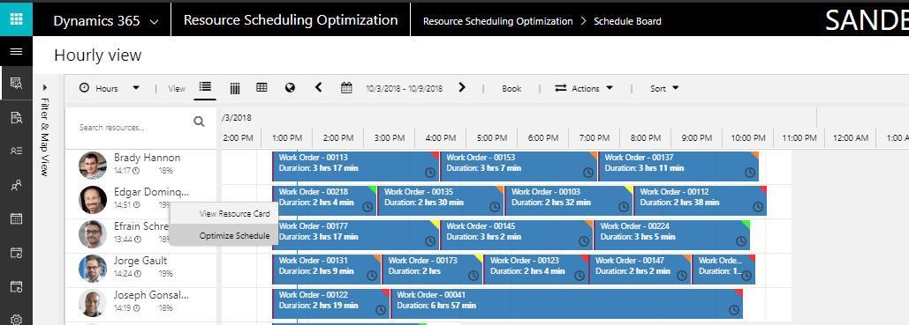
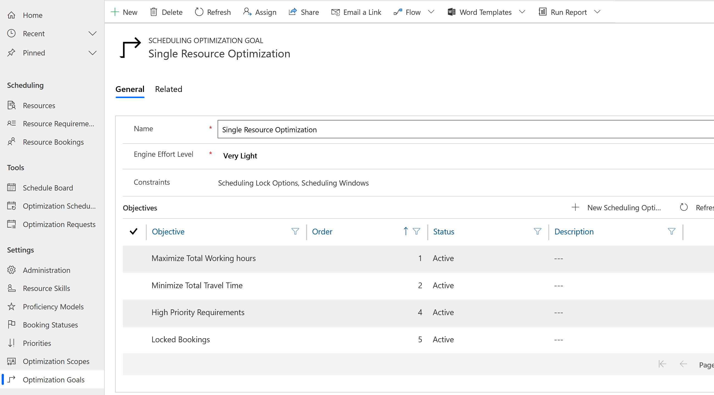
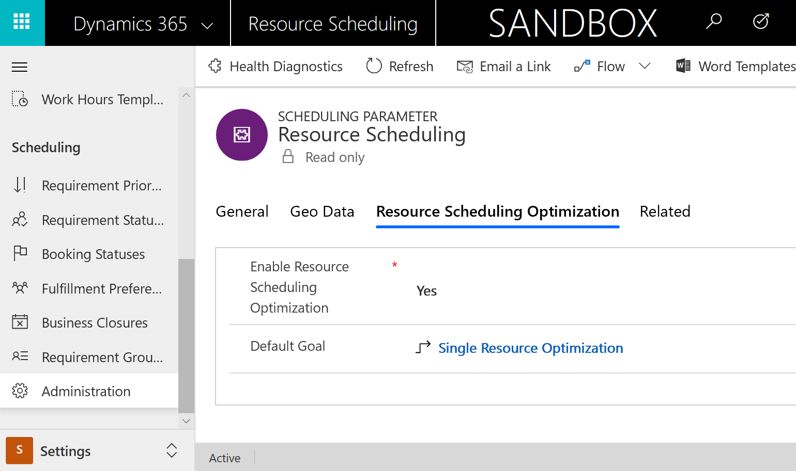
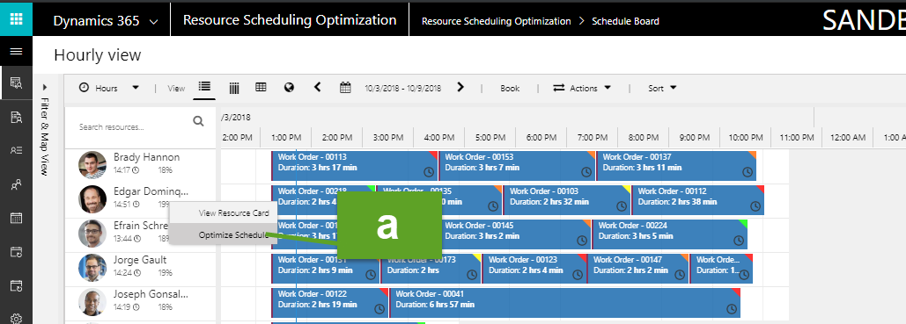
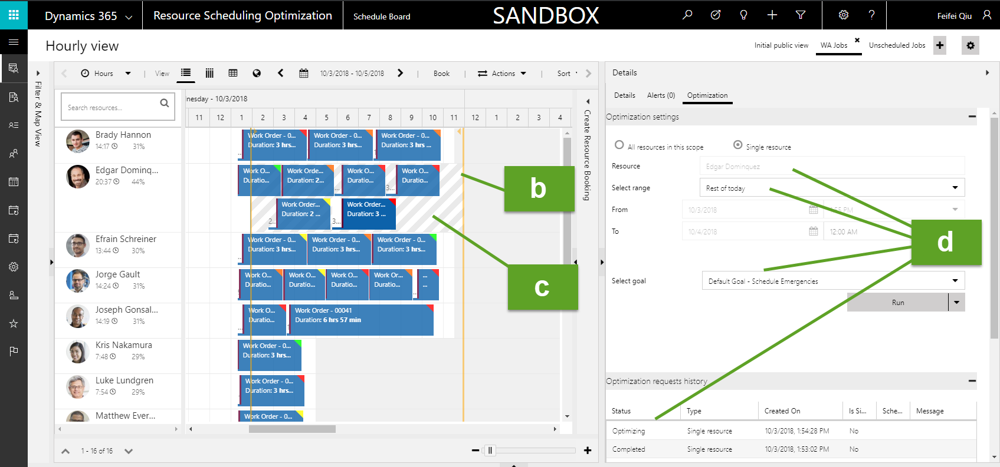
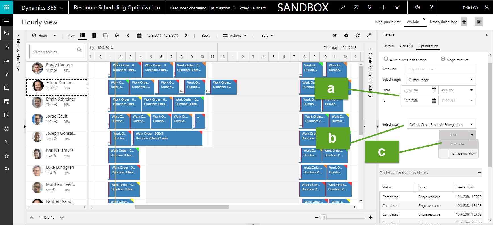
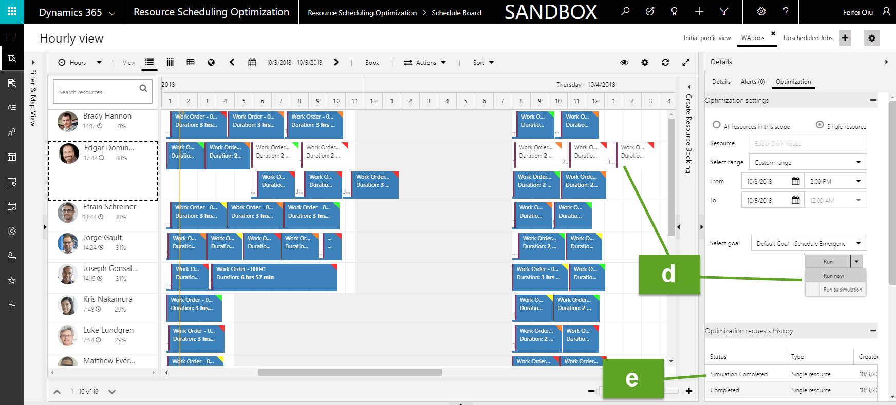

---
title: "Single resource optimization for resource scheduling optimization | MicrosoftDocs"
description: Learn about single resource optimization for resource scheduling optimization in Dynamics 365 Field Service
ms.custom: dyn365-fieldservice
ms.date: 11/04/2019
ms.reviewer: krbjoran
ms.service: dynamics-365-customerservice
ms.topic: article 
author: FieldServiceDave
ms.author: daclar
ms.manager: shellyhaverkamp
search.app: 
  - D365CE
  - D365FS
--- 

# Single resource optimization for resource scheduling optimization

Resource scheduling optimization is flexible and can be configured to run optimizations based on your organization's scheduling needs. Sometimes you might need to optimize only a single resource's schedule, rather than a set of available resources.

Single resource optimization provides a quick way to reoptimize a resource's schedule and travel route after schedule changes have occurred during the day. 

This is helpful for when a resource:

- Has a gap in their schedule due to a cancellation.
- Is double-booked because an emergency work order was assigned.
- Is running late due to traffic or previous work.
- Has a schedule that was put together manually and wants a travel route with minimal travel.

If an individual resource's schedule needs to be reoptimized, a dispatcher can manually run single resource optimization. It can also be triggered by a workflow. 

> [!Note]
> Unlike other resource scheduling optimization scenarios, single resource optimization runs can't be scheduled.

> [!div class="mx-imgBorder"]
> 

## Prerequisites

- Dynamics 365 Field Service version 8.x+.
- Resource scheduling optimization version 2.8+.
- **Optimize Schedules** is set to **Yes** for the bookable resource you need to individually optimize.

## Step 1: Set up a goal

> [!Note]
> Single resource optimization is the only resource scheduling optimization scenario that doesn't require you to first set up an optimization scope. This is because the scope is automatically defined as *bookings for the resource in a defined date range*.
 
Goals define what resource scheduling optimization should consider and prioritize.

Go to **Resource Scheduling Optimization** > **Optimization Goals** > **+New**.

> [!div class="mx-imgBorder"]
> 

When creating a goal for single resource optimization, keep in mind that single resource optimization is typically used to clean up a schedule that was altered throughout the day. Consider the following recommendations:

1. Set **Engine Effort Level** to **Very Light**. This will hasten the single resource optimization run, which helps dispatchers react more quickly to scheduling needs.

2. Remove the **Schedule Within Working Hours** constraint to allow more bookings to fit in the resource's schedule. This can be helpful if a  dispatcher adds an additional emergency work order to the schedule. When this constraint is removed, the start time of a booking must fall within working hours and can spill over into non-working hours. When this constraint is added, resource scheduling optimization ensures there is time to travel back to the resource's ending location.

3. Remove constraints related to matching territory, roles, and characteristics because the scenario assumes the *dispatcher knows best*. This could lead to a situation where the dispatcher assigns a work order to a resource, runs single resource optimization, and single resource optimization deletes the booking because it does not match the resource's attributes. 

4. Add **Scheduling Lock Options** and **Scheduling Windows** constraints so single resource optimization upholds time promises or SLAs with the customer.

Select **Save**.

Next, add your single resource optimization goal as the default goal.

Go to **Resource Scheduling** > **Settings** > **Administration** > **Scheduling Parameter** > **Resource Scheduling Optimization** and enter your newly created default goal. 

> [!div class="mx-imgBorder"]
> 

> [!Note]
> A default goal is created automatically when resource scheduling optimization is deployed.

## Step 2: Run and view results

> [!Note]
> Most resource scheduling optimization scenarios require that you also set up a schedule, but this isn't necessary for single resource optimizations. This is because the single resource optimization is manually run from the schedule board or through a workflow.

There are three ways to run single resource optimization:

- One click with defaults.
- Run after making changes to defaults.
- Run as simulation.

### One click with defaults

In Field Service version 8.0+, you can right-click a resource from any schedule board view and select **Optimize Schedule**.

> [!div class="mx-imgBorder"]
> 

You will now see:

1. A yellow line on the schedule board that indicates default optimization range, from now to the end of today (12:00 AM).
2. A gray mask behind the resources on the schedule board that indicates default optimization range, from now to the end of today (12:00 AM).
3. An **Optimizations** panel showing the resource's name, default range, default goal, and optimization request status. 

   > [!div class="mx-imgBorder"]
   >  

> [!Note]
> Optimization side panel is only displayed in schedule board tabs created by resource scheduling optimization scopes.

   
### Run after making changes to defaults

You can also change the default goal and time range before running the optimization. For instance, extending the time range to a second day means that single resource optimization might take jobs from the next day and fit them in the first day if the resource has availability. 

Select a resource's name and then go to the **Optimizations** panel.

> [!Note]
> This capability is **only** available from the schedule board view associated with the optimization scope.

> [!div class="mx-imgBorder"]
> 

Set the optimization range to the date and time.

Select the optimization goal.

Select **Run Now** to run the optimization and schedule bookings.

  
### Run as simulation 

By running single resource optimization as a simulation, you can see the resulting optimization before committing to it. Proposed bookings appear on the schedule board in white, as seen in the following screenshot.

> [!div class="mx-imgBorder"]
> 

To run a simulation, right-click a resource and select **Optimize Schedule**. 

This time, instead of selecting **Run**, select **Run as simulation**.

Finally, go to the **Optimization Request** to **Apply** or **Discard** simulation results.

> [!Note]
> Simulated bookings don't show on maps with routes.

## Additional notes

- A default goal is required for single resource optimization to work. A default goal is automatically created when deploying the optimization.
- Single resource optimization only reoptimizes current bookings and does not create new bookings.
- Single resource optimization can reoptimize bookings that were booked manually, through resource availability search, or based on location agnostic requirements.
- This capability appears on the schedule board for all resources as long as optimization is deployed in the environment. However, single resource optimization only works if **Optimize Schedules** is set to **Yes** for the bookable resource. The single resource optimization capability can't be disabled or hidden.

[!INCLUDE[footer-include](../includes/footer-banner.md)]