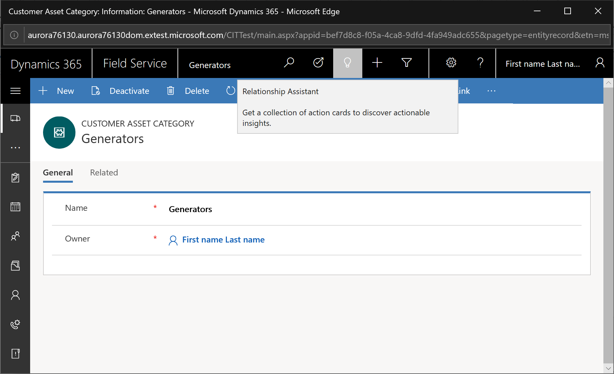

# Service Level Agreements (SLA) for Work Orders

Enable SLA on Work Order.
> [!div class="mx-imgBorder"]
> 

Navigate to the Field Service Settings record. Navigate the tab "Field Service SLA Configuration." Add any new KPIs pertinent to your organization. OOTB we ship two KPIs for WO that can be used once SLA is enabled:
•	Work Order Arrival Time KPI (which is already set up as an SLA Type of Arrival Time)
•	Work Order Resolution KPI
> [!div class="mx-imgBorder"]
> 

Navigate to Settings > Service Management > Service Level Agreements (in the Web client - SLA is not yet Unified Interface compatible).
> [!div class="mx-imgBorder"]
> 

Create a new SLA for Work Order entity.
> [!div class="mx-imgBorder"]
> 

If appropriate, assign a Business Hours calendar and save.
> [!div class="mx-imgBorder"]
> 

Create SLA Details on the KPI that was identified as Arrival Time related.
> [!div class="mx-imgBorder"]
> 

Activate the SLA.
> [!div class="mx-imgBorder"]
> 

Add the SLA field to the WO form. The SLA field is created when SLA functionality is enabled for the work order entity.
> [!div class="mx-imgBorder"]
> 

Create a Work Order associated to your SLA.
> [!div class="mx-imgBorder"]
> 

Asynchronously (meaning not instantaneously but along with other system jobs cadence typically one minute to five minutes), **Time From Promised** and **Time To Promised** will be populated according to the applied SLA and appropriate SLA Item.

> [!div class="mx-imgBorder"]
> 

Furthermore, Schedule Assistant and Resource Schedule Optimization consider Time From Promised and Time To Promised fields and therefore will respect the SLA.

> [!div class="mx-imgBorder"]
> 

## Configuration Considerations

## Additional Notes
- Multiple SLAs and multiple business hours/calendars can be created and utlized for different customers, however a work order can only have one SLA assigned to it.
- SLAs on work orders will overwrite existing values for **Time From Promised** and **Time To Promised**
- Pausing an SLA timer on the work order will update **Time From Promised** and **Time To Promised** fields when resumed.

## Other

> [!div class="mx-imgBorder"]
> 