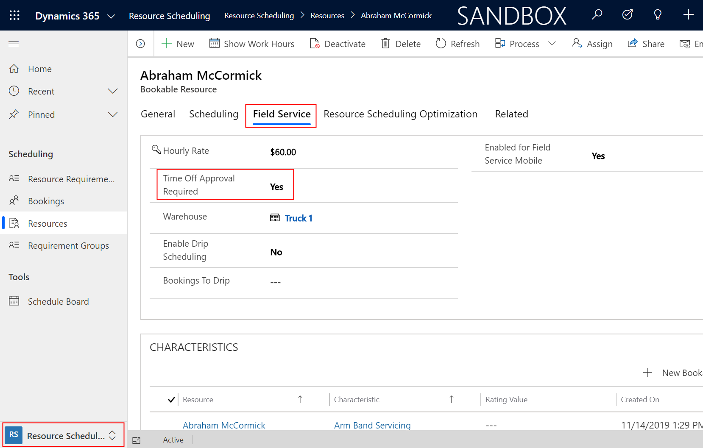
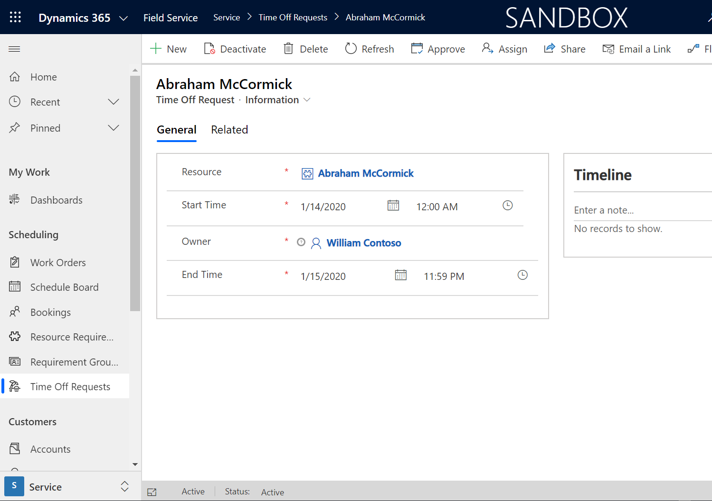
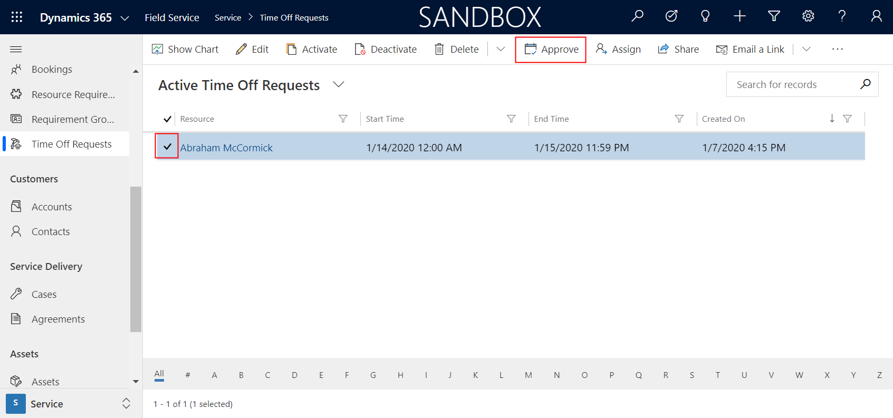
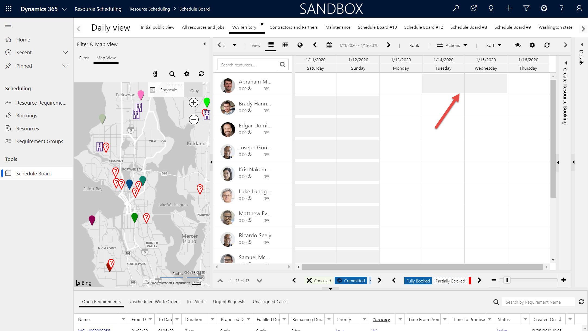
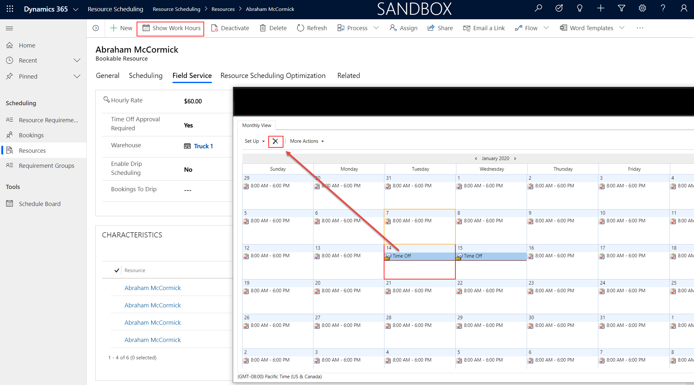

# Submit and approve time-off requests in Dynamics 365 Field Service

Keep the schedule board in Dynamics 365 Field Service up to date by logging time-off requests.  
  
For example, if one of your field technicians is taking a vacation, it's important to log the request so that a dispatcher can see the time-off request on the schedule board when scheduling a work order.  
  
When a resource has an approved time-off request, the scheduling assistant will not recommend that resource for a job in that time period, and the time slots for that resource will be grayed-out on the schedule board to provide a visual notification to the dispatchers that the resource is not available during that time period.  
  
If a bookable resource is set to require time-off approval, then when a time-off request is created for that resource, an approval request will be sent to that user's manager, before the time-off request is reflected in the schedule assistant and on the schedule board.  

## Prerequisites

For each resource, determine if their time-off requests must be approved in order to take effect and show as unavailable on the schedule board. 

Go to **Resource Scheduling** > **Resources** then edit a bookable resource. 

> [!div class="mx-imgBorder"]
> 

Set **Time-Off Approval Required** to *Yes* if the time-off needs to be approved in order to take effect, or *No* if it should take effect immediately once the time-off is submitted. This value is *No* by default.

## Submit a time-off request  

From the main menu, go to **Field Service** > **Time Off Requests**.  
  
On the **Active Time Off Request** screen, select **New**.  
  
Use the tooltips to help fill in your information, and then select **Save**.  

> [!div class="mx-imgBorder"]
> 

## Approve a time-off request  

If the related resource requires an approval, a Field Service administrator or dispatcher can approve the request. 
  
Log into Field Service as a user with the correct security role to approve time off requests (**Field Service-Administrator** or **Field Service-Dispatcher**).

From the main menu, go to **Field Service** > **Time Off Requests**.

From the list of views, select the arrow, then select **Active Time Off Requests**, which shows a list of unapproved time-off requests.

To approve a request, select it, and in the command bar at the top, select **Approve**.

When the approval is completed, select **OK**.

> [!div class="mx-imgBorder"]
> 

Approved time-off requests will change to a status of *Inactive*. Inactive records can be found in the **Inactive Time Off Requests** view. Additionally, time off requests will show in the resource's calendar along with their normal working hours.

## View time off on the schedule board

Once the time-off request is created or approved, depending on whether the resource requires approval or not, the resource's time-off time range will show as unavailable on the schedule board.

> [!div class="mx-imgBorder"]
> 

These time-off hours are displayed and treated the same as non-working hours.

## Edit and delete a time-off request

Time off requests can be edited or deleted from the resource's calendar only.

Go to the bookable resource record for whom the time-off belongs, and select **Show Work Hours**.

To **edit**, double-click the time-off that was created when the time-off request was created or approved.

To **delete**, select and highlight the time-off and select the delete icon.

> [!div class="mx-imgBorder"]
> 

> [!Note]
> Deleting a time-off request record will not delete the time-off from the schedule board or resource's calendar.

## Additional notes

- Users with **Field Service-Administrator** or **Field Service-Resource** security roles can approve time-off requests.
  
### See also  
    
- [Set up bookable resources](../field-service/set-up-bookable-resources.md)   

[!INCLUDE[footer-include](../includes/footer-banner.md)]