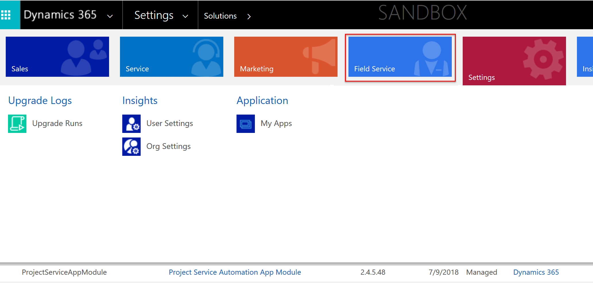
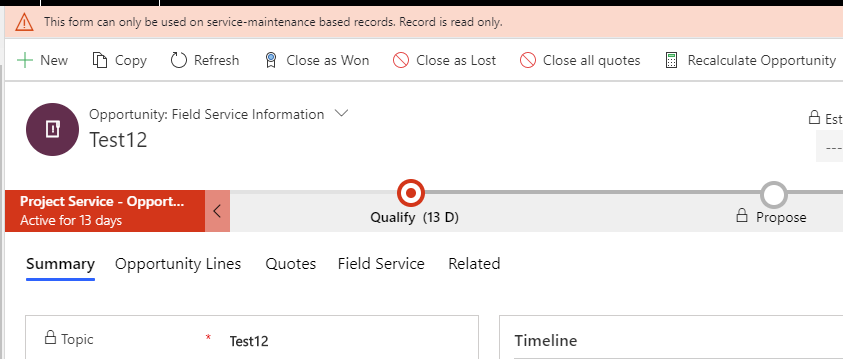
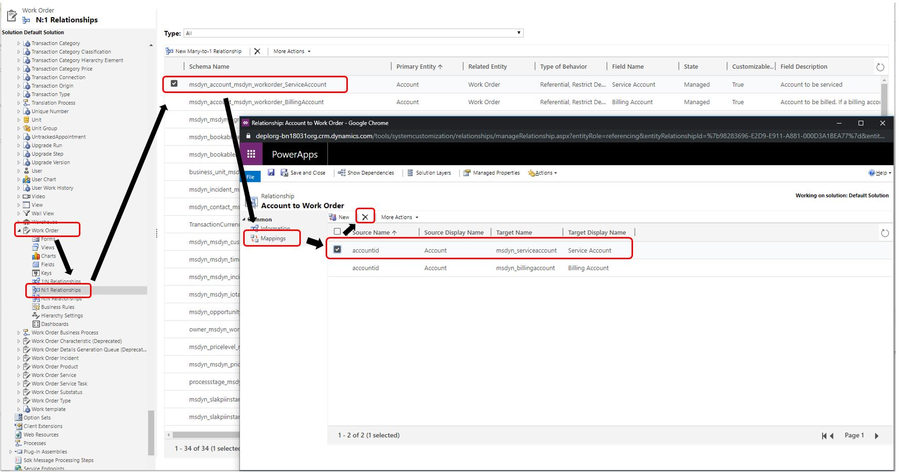
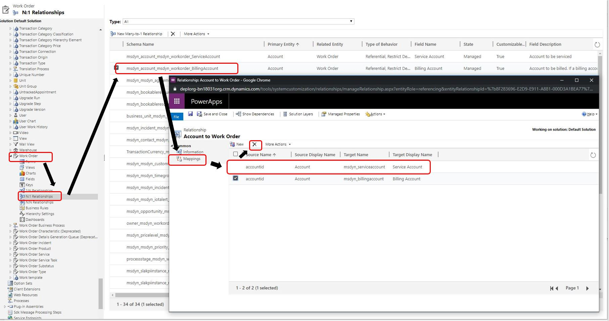

# Frequently asked questions for Dynamics 365 Field Service - General

> [!Note]
> If you're looking for help with **errors**, **unexpected behavior**, **crashes**, and **bugs**, create a [Dynamics 365 support ticket](https://dynamics.microsoft.com/contact-us/). 

## Why did I receive an email or Message Center notification about a Field Service update?

Roughly once a month, Field Service pushes a standard update to customers on Field Service version 8.8.6 and higher. A message is sent each month prior to this update highlighting that an update is planned. For more information on this update, see our [documentation](https://docs.microsoft.com/dynamics365/field-service/upgrade-field-service#when-are-field-service-updates-released) on the different kinds of Field Service updates and [when Field Service updates are planned](https://docs.microsoft.com/dynamics365/field-service/version-history#latest-version-availability).

The other type of update messages that some may have received highlights that one or more of your environments are on a version of Field Service lower than 8.8.6. This message advises that you need to upgrade your environment as soon as possible or Microsoft will conduct the update for you. Be sure to take action as soon as possible.

As this message states, **we strongly recommend that customers conduct this update on their own, as soon as possible. Updating yourself means that you can take appropriate testing measures and change management steps.** The only validation that we are able to conduct will confirm that the upgrade will succeed based on the environment configuration at the time of our test. Our validation will not validate other potential functional disruptions following an unmanaged update.

To get all of our customers to the latest version of Field Service, Microsoft will be conducting these updates between now and December. These Microsoft-applied updates will happen in a phased manner; when your environments are selected to receive this update, you'll receive a message highlighting a specific date that your environment will be updated, with additional language highlighting some additional details about the process.

## Why is Field Service missing from the sitemap navigation?

As of Field Service v8.x, you can find Field Service among the other Dynamics 365 apps by selecting Dynamics 365 in the top left and selecting **Field Service**.

> [!div class="mx-imgBorder"]
> 

The navigation is different from previous versions (7.x and 6.x), where Field Service was found in the menu as seen in the following screenshot.

> [!div class="mx-imgBorder"]
> 

## Can I customize out-of-the-box web resources, option sets, security roles, or workflows? 

No. Customizing, taking dependencies, or custom invocation of these components is not supported and could result in unintended system behaviors. Organizations that customize these components may not immediately cause the environment to break; but eventually, as Microsoft releases changes to the customized components, the changes will not be applied to the top layer of that component. The specific customized layer will override all future changes, which will eventually cause the instances that have customized these components to experience unpredictable errors and behavior.  

## Why are there work orders with duplicate work order numbers?

This issue is known and was fixed in Field Service version **8.6.0.274+**, which lets you apply the Dynamics 365 auto numbering system to the work order entity. Be sure to:

1. Opt in to the **Auto Numbering** function in **Field Service Settings**.
2. Manage it in **Dynamics Settings** > **Administration** > **Auto-Numbering**.

## Why can't cascade crew changes be disabled for a booking scheduled to a crew or group

This issue happens when a booking is assigned from a resource (not crew or group) to a crew or group and the value of **msdyn_CascadeCrewChanges** in the booking is set to false. To overcome this issue, open the booking and set the value of **msdyn_CascadeCrewChanges** to **Yes**. Then, reperform the booking assignment to a crew, which will fix the error the user sees when assigning the booking to a crew.

## Can I modify, edit, or delete Field Service date fields or statuses?

No. Modifying, editing, or deleting date fields and statuses can affect business logic and may disrupt solution upgrades. Examples of work order date fields include date window start, date window end, time from promised, and time to promised. Examples of status fields include work order system status and agreement system status.

## Why do I get the error message "This form can only be used on service-maintenance based records. Record is read only"?

> [!div class="mx-imgBorder"]
> 

Field Service makes the out-of-the-box Field Service opportunity, lead, quote, and invoice forms read-only once Field Service detects the record is not a service-maintenance based record. Field Service forms or the forms copied from Field Service forms do not support opportunity, lead, quote, and invoice records other than Field Service opportunity, lead, quote, and invoice. If you want to use an opportunity form for non-Field Service-related opportunities, use the out-of-the-box opportunity (**Opportunity: Opportunity**) form shipped by Dynamics 365 Sales or copy this form for further customization. The same is true for lead, quote, and invoice.

In addition, some organizations may see this error after upgrading from versions of Field Service earlier than version 8. In this scenario, the issue is usually with copied forms on these entities; customers might have to update the event handlers to call either the x.Library.load for Field Service forms or x.Library.loadStandardForm handlers for these entities’ standard, out-of-the-box forms.

## Why do I get an AttributeMap error when upgrading and how do I fix it?  

You may have encountered one of these two errors during upgrade: 

- "An AttributeMap, with ID: GUID, between attribute customerid and msdyn_serviceaccount of entity incident and msdyn_workorder, has an unmanaged base instance and therefore cannot be updated by a managed solution."
- "An AttributeMap, with ID: GUID, between attribute customerid and msdyn_billingaccount of entity incident and msdyn_workorder, has an unmanaged base instance and therefore cannot be updated by a managed solution."

You can resolve this issue by following the steps outlined below. The attribute maps will be automatically recreated by upgrading to a newer version. Review these two attribute maps and delete them in your environment.

### Error with customerid and msdyn_serviceaccount

1. Go to **Settings** > **Customization** > **Customize the System**.
2. Go to **Entities** > **Work Orders** > **N:1 Relationships**.
3. Double-click on the row called **msdyn_account_msdyn_workorder_ServiceAccount**.
4. Select **Mappings**.
5. Select the **Service Account** mapping and delete it.
6. Run upgrade again.

> [!div class="mx-imgBorder"]
> 

### Error with customerid and msdyn_billingaccount

1. Go to **Settings** > **Customization** > **Customize the System**.
2. Go to **Entities** > **Work Orders** > **N:1 Relationships**.
3. Double-click on the row called **msdyn_account_msdyn_workorder_BillingAccount**.
4. Select **Mappings**.
5. Select the **Billing Account** mapping and delete it.
6. Run upgrade again.

> [!div class="mx-imgBorder"]
> 

## What is the msdyn_postponegenerationuntil field that is found on many Field Service entities?

The **msdyn_postponegenerationuntil** field is intended for internal use only as it is used for workflow record generation design. Manipulating values in this field or taking dependencies on it is not supported and can lead to unexpected system behavior.

This field is found in the following entities:

1.	Agreement Booking Setup (msdyn_agreementbookingsetup)
2.	Agreement Booking Date (msdyn_agreementbookingdate)
3.	Agreement Invoice Setup (msdyn_agreementinvoicesetup)
4.	Agreement Invoice Date (msdyn_agreementinvoicedate)
5.	Order Invoicing Setup (msdyn_orderinvoicingsetup)
6.	Order Invoicing Setup Date (msdyn_orderinvoicingsetupdate)
7.	Order Invoicing Date (msdyn_orderinvoicingdate)
8.	Incident Types Setup (msdyn_incidenttypessetup)
9.	Quote Booking Setup (msdyn_quotebookingsetup)

## What about Product Bundles? I'd like to use them in Field Service scenarios.

Unfortunately, at this time, using product bundles within FS is not supported.

## See also

- [Resource Scheduling Optimization FAQs](rso-faq.md)
- [Field Service Mobile FAQs](activate-fs-mobile-app-license.md)
- [Get help for Field Service Mobile](mobile-get-help.md)

[!INCLUDE[footer-include](../includes/footer-banner.md)]
