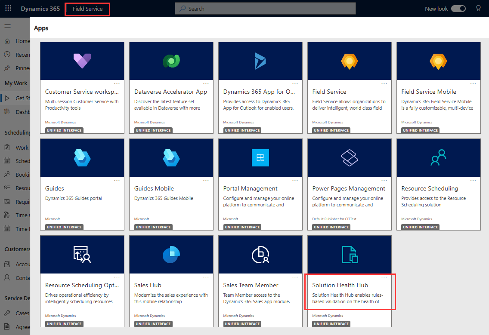
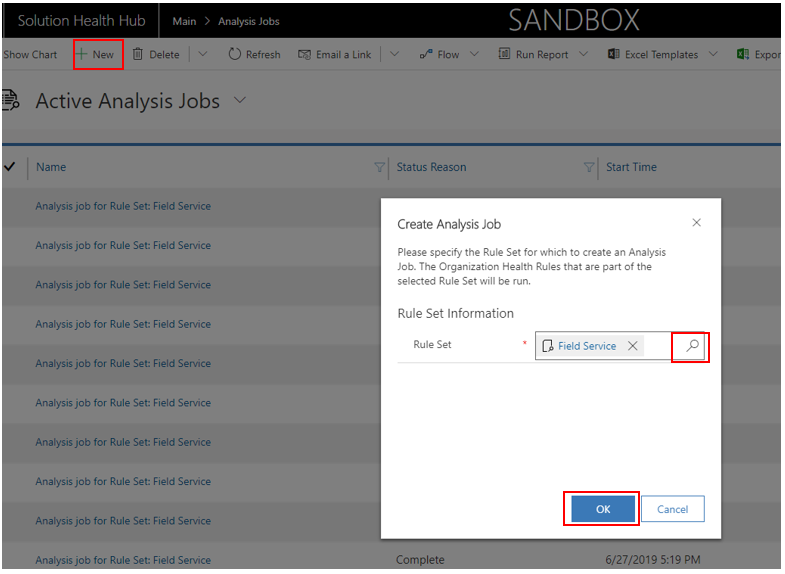
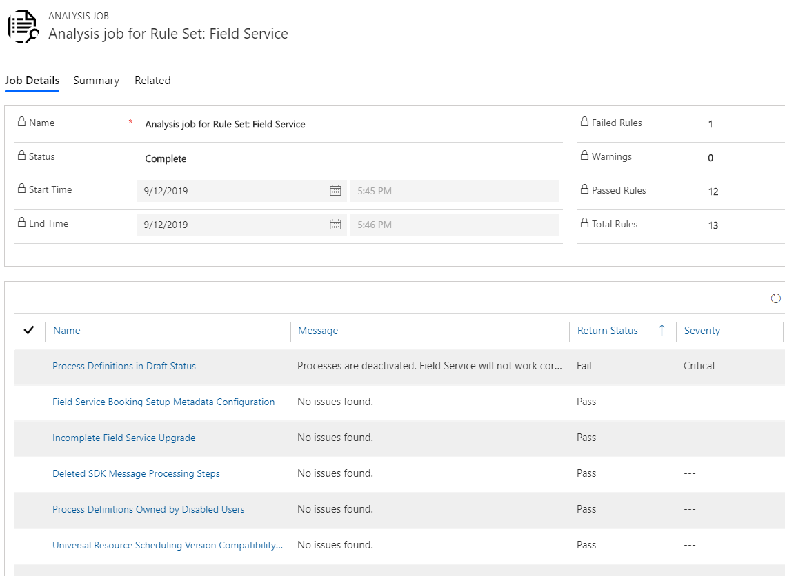

# Troubleshoot Dynamics 365 Field Service issues with Solution Health Hub

Solution Health Hub allows you to get a better picture of the state of your environment and detect issues with your Dynamics 365 environment. The Solution Health Hub runs rules within an instance to validate the environment's configuration, which might change over time through natural system operations. Some of the rules are specific to Dynamics 365 Field Service and you can run the rules on demand when you encounter an issue. Some rules automatically trigger when Field Service is installed or updated. Regularly run the Field Service ruleset to monitor the health of your environment.

Here are a few common issues the Solution Health Hub detects:

1. If critical Field Service processes are deactivated
2. If processes that will cause an upgrade to fail are assigned to disabled users 
3. Customized web resources that will later lead to runtime issues

## Prerequisites

- Field Service v8.4.0.338+ (Unified Interface) or v7.5.7.87+ (Web)
- The Solution Health Hub extends the [Power Apps checker](https://docs.microsoft.com/powerapps/maker/common-data-service/use-powerapps-checker) to ensure continued healthy operation of an environment. 

> [!Note]
> Currently, the ruleset uses 15 rules to verify the environment is in a good state. 

## Run a health check

To run an analysis job for Field Service:

1.	Open the Solution Health Hub app.

> [!div class="mx-imgBorder"]
> 

2.	Select **Analysis Jobs** and create a new analysis job.
3.	When the dialog box opens, select **Field Service**.
4.	Select **OK** and the analysis job will begin.


> [!div class="mx-imgBorder"]
> 

## View health check results

Once you run the analysis job, you will be directed to the overview page, which will automatically refresh when the run has finished. See the following screenshot for an example overview of a run.


> [!div class="mx-imgBorder"]
> 


When running an analysis job, you will see a **Return Status** for each rule, which indicates whether the rule passed, failed, or there was a configuration error. Rules also return a severity if they are failing, which shows how severe each problem is. All possible return status outcomes are listed in the following table. 


| Rule return status | 	Recommendation|
| --- | --- |  
| Fail	| Highlight specific failures within the system; fix the rule as suggested.| 
| Warning	| Be aware of the implications mentioned in the rule message.| 
| Pass	| Indicates that there are no problems with this rule. All rules should be in this state.| 

## Agreement Work Order Generation

Severity: High

### What it checks

Verifies that all work orders that were supposed to be generated over the last seven days were correctly generated by agreements.

### Why it fails

There are agreement recurrences that haven't been processed correctly, and work orders haven't been generated that should have been.

### How to fix

## Check failing workflow related to agreement

Severity: High

### What it checks

Checks for failing workflow related to agreement, returns agreement booking setup, or agreement invoice setup record of failure.

### Why it fails

This rule fails if there is a failing workflow related to an agreement record.

### How to fix

This rule provides an automated resolution step that can be resolved via the **Resolve** button in the Solution Health Hub form for this rule failure. Alternatively, they can be viewed individually and resolved using the same steps for the "check failing workflow related to agreement" rule.

## Check for removed form libraries

Severity: Medium

### What it checks

Detects if there are Field Service forms in the system that missing Field Service libraries.

### Why it fails

Field Service forms depend on its libraries to function properly. Without this, some functionality might be broken.

> [!Note]
> This is currently known to show a false-positive failure on ‘Price Level’ form. This will be addressed in an upcoming release.

### How to fix

Add back the missing libraries to the form. You might get the list of required libraries by comparing to another form of the same entity or on other org. Reach out to support for additional assistance.

## Customizations on 'Connected Field Service' app module

Severity: Low

### What it checks

Checks whether there are customizations to the Connected Field Service app module that is being deprecated and shouldn’t be customized.

### Why it fails

If there are any customizations on the Connected Field Service app module in the organization, this check fails.

### How to fix

Remove customizations from the Connected Field Service App module.

## Customized option sets

Severity: High

### What it checks

Detects whether any option set in Field Service that is not supposed to be customized has been customized. Customizing option sets can lead to unexpected behavior.

> [!Note]
> This is currently known to show a failure on ```msdyn_billingtype``` even when it was not customized, and happens when the Project Service Automation solution is also installed. This rule was updated to address this known failure.

### Why it fails

Fails if there are any customizations on any of the default Field Service options sets. Additions to the option sets do not count as failures, only modifications to the options within the option sets.

### How to fix

Manually Remove customizations from the Field Service Option sets

## Customized web resources

Severity: High

### What it checks

Detects which web resources have been customized by solutions that are not part of the Field Service package. This will lead to those web resources not being updated on upgrade and can lead to different functionality issues after upgrade.

### Why it fails

Fails if any web resource has been customized by a solution that is not part of the Field Service package.

### How to fix

Remove the customizations via the solution layers UI on the web resources that have been customized. When Field Service upgrades, the web resources can be correctly upgraded.

## Delete Field Service unique numbers workflow check

Severity: Low to medium

### What it checks

Validates if the bulk delete auto number workflow runs correctly.

### Why it fails

Fails if the delete unique number workflow has been failing.

### How to fix

This rule provides an automated resolution step that can be resolved via the **Resolve** button in the Solution Health Hub form for this rule failure.

## Deleted processes

Severity: High

### What it checks

Verifies that there are no deleted processes.

### Why it fails

Fails if any of the out of the box processes for Field Service are deleted.

### How to fix

Contact support.

## Deleted Sdk message processing steps

Severity: High

### What it checks

Verifies that there are no deleted SDK message processing steps.

### Why it fails

Fails if any of the shipped Field Service SDK message processing steps have been deleted from the system.

### How to fix

Contact support.

## Deleted web resources

Severity: High

### What it checks

Checks whether there are any deleted web resources.

### Why it fails

Fails if any of the shipped Field Service web resources have been deleted from the system.

### How to fix

Contact support.

## Disabled Sdk message processing steps

Severity: High

### What it checks

Checks whether there are any SDK message processing steps that are disabled. Disabled SDK message processing steps will lead to incorrect behavior when using Field Service.

### Why it fails

Fails if any of the Field Service SDK message processing steps are disabled.

### How to fix

Enable the disabled SDK message processing steps.

## Field Service Booking Setup Metadata configuration

Severity: High

### What it checks

Checks that the Field Service booking setup metadata record exists correctly in the system. If this record is missing, scheduling functionality might not work as expected.

### Why it fails

Fails if the Field Service booking setup metadata record does not exist in the system.

### How to fix

Contact support.

## Field Service Settings

Severity: High

### What it checks

Checks that the Field Service settings record exists correctly in the system.

### Why it fails

Fails if the Field Service settings record does not exist or is not configured properly.

### How to fix

The system will recreate this record if it's found to not exist during the course of normal usage of Field Service. If the record is not automatically regenerated, contact support.

## Forms missing execution context

Severity: High

### What it checks

Detects if there are any forms in the system that have event handlers referencing Field Service libraries without passing the execution context parameter.

### Why it fails

Field Service code expects the execution context parameter to be passed in the OnLoad event handler. If this value is missing. it might cause errors while using the form.

> [!Note]
> The most common scenario where this rule presents a failure is when a copy of one of the out-of-the-box forms is present (Field Service versions earlier than 8.X) and then Field Service is upgraded. In such scenarios, these copied forms from earlier versions of Field Service would be missing the ```ExecutionContext parameter``` in these non-out-of-the-box forms.

### How to fix

Open the form in the designer > double-click on each OnLoad event handler > enable "pass execution context as first parameter" > save and publish the form.

## Incomplete Field Service upgrade

Severity: Low

### What it checks

Detects whether a Field Service upgrade has started but not successfully completed.

### Why it fails

Fails if a Field Service upgrade has started but not successfully completed.

### How to fix

Restart the Field Service upgrade. Once the upgrade succeeds, this rule will return a pass. If upgrade fails again, contact support.

## Process definitions in draft status

Severity: High

### What it checks

Checks whether there are any process definitions in draft status. If there are processes in draft status, Field Service will not work correctly.

### Why it fails

Fails if there are process definitions found in the draft state

> [!Note]
> Field Service modern flows can cause failures. This rule was updated to validate based on enhanced background processing setting in UR 24; in versions prior to UR 24, it may incorrectly fail on business process flow (BPF) type records.

### How to fix

Reactivate the process definitions so they are not in draft state.

## Process definitions owned by disabled users

Severity: Medium to high

### What it checks

Checks whether there are any process definitions in the system that are assigned to users that are disabled. If that’s the case, upgrade will fail.

### Why it fails

Fails if there are any process definitions in the system that are assigned to disabled users, which can cause upgrades to fail.

> [!Note]
> Validates based on the enhanced background processing setting in UR 24.

### How to fix

For workflows: Change the owner of process to an active user.

## Universal Resource Scheduling version compatibility check

Severity: Low

### What it checks

Verifies that the current installed version of Field Service is compatible with the version of Universal Resource Scheduling.

### Why it fails

Fails if the Universal Resource Scheduling solution installed in the org is not compatible with the installed version of Field Service. This can happen if another package that contains the Universal Resource Scheduling solution has been installed that updates the version of the Universal Resource Scheduling solution.

> [!Note]
> The fail status for this rule was changed to "Warning" instead of "Fail" to align with the low severity for this rule in UR 23 release.

### How to fix

The warning message displayed by the rule will indicate which solution needs to be upgraded in order to be compatible with Field Service.

## Verify auto numbering is opted

Severity: Low

### What it checks

Verifies if autonumbering is opted in for the org. We recommend customers use the new autonumbering functionality to ensure uniqueness in numbering of Field Service tables.

### Why it fails

Fails if autonumbering is not opted-in for the org.

### How to fix

Opt into autonumbering.

## Verify Field Service and Project Service Automation solutions are compatible

Severity: Low

### What it checks

Verifies that the current installed version of Field Service is compatible with the version of Project Service Automation installed.

### Why it fails

Fails if the version of Project Service Automation solution installed in the org is not compatible with the Field Service solution installed in the org.

### How to fix

The warning message displayed by the rule will indicate which solution needs to be upgraded in order to be compatible with Field Service.

## Verify if there are any work order types

Severity: Low

### What it checks

Checks if there are any work order types defined in the system.

### Why it fails

Fails if there are no work order types defined in the system.

### How to fix

Take advantage of additional functionality by creating work order types.

## Waiting workflow instances owned by disabled users

Severity: High

### What it checks

Detects waiting workflow instances that are assigned to disabled users. These will fail to correctly generate the records that they are supposed to generate.

### Why it fails

Fails if there are workflow instances in the suspended state with the reason of _Waiting_ that are assigned to disabled user accounts.

### How to fix

Retrigger the workflow. Refer to general documentation or contact support.

### See also

- [Frequently asked questions](./troubleshoot-faq.md)


[!INCLUDE[footer-include](../includes/footer-banner.md)]