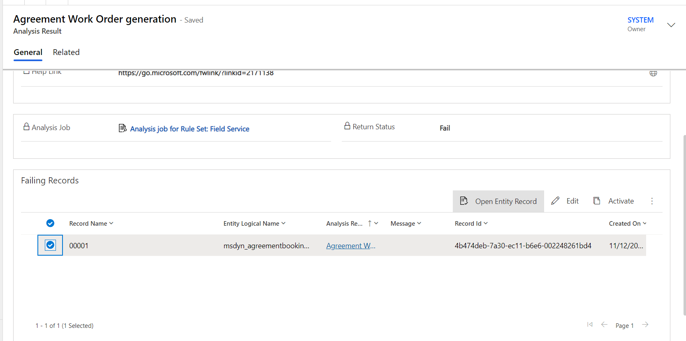

# Troubleshoot issues with Solution Health Hub

Solution Health Hub allows you to get a better picture of the state of your environment and detect issues with your Dynamics 365 environment. The Solution Health Hub runs rules within an instance to validate the environment's configuration, which might change over time through natural system operations. Some of the rules are specific to Dynamics 365 Field Service and you can run the rules on demand when you encounter an issue. Some rules automatically trigger when Field Service is installed or updated. Regularly run the Field Service ruleset to monitor the health of your environment.

Here are a few common issues the Solution Health Hub detects:

- If critical Field Service processes are deactivated.
- If processes that cause an upgrade to fail are assigned to disabled users.
- If customized web resources lead to runtime issues.

In addition to running Solution Health Hub, check out [best practices for customizing Dynamics 365 Field Service](field-service-customization-best-practices.md) and [running Solution Checker to improve scripts, plugins, HTML, and workflows](/powerapps/maker/data-platform/use-powerapps-checker)

## Prerequisites

- Field Service v8.4.0.338+ (Unified Interface) or v7.5.7.87+ (Web)
- The Solution Health Hub extends the [Power Apps checker](/powerapps/maker/common-data-service/use-powerapps-checker) to ensure continued healthy operation of an environment.

## Run a health check

To run an analysis job for Field Service:

1. Open the Solution Health Hub app.

   :::image type="content" source="media/troubleshoot-solution-health-nav.png" alt-text="Screenshot of the Solution Health Hub in the navigation.":::

1. Select **Analysis Jobs** and create a new analysis job.
1. When the dialog box opens, select **Field Service**.
1. Select **OK** and the analysis job starts.

## View health check results

When the analysis job finishes running, the system opens the overview page.

:::image type="content" source="media/troubleshoot-solution-health-fs-rules-analysis.svg" alt-text="Screenshot of a complete analysis job overview.":::

In the analysis job, each rule shows a **Return Status** indicating whether the rule passed, failed, or has a configuration error. If a rule fails, a **Severity** indicates how severe the problem is.

| Rule return status | Recommendation|
| --- | --- |  
| Fail | Highlight specific failures within the system; fix the rule as suggested.|
| Warning | Be aware of the implications mentioned in the rule message.|
| Pass | Indicates that there are no problems with this rule. All rules should be in this state.|

## Agreement Work Order generation

Severity: High

### What it checks

This rule verifies that all work orders were correctly generated based on agreements.

### Why it fails

This rule fails because agreement recurrences didn't process correctly and work orders didn't generate that should have.

### How to fix

1. Identify the reason the work order wasn't generated and the cause of failure.
1. Fix the issue.
1. To restart the record generation, change the agreement **System Status** back to 'Estimate'. Then change it to 'Active'.

> [!CAUTION]
> Changing the agreement status deletes all existing agreement booking data records with an active status but only regenerates records for future dates.

> [!div class="mx-imgBorder"]
> 

## Check failing workflow related to agreement

Severity: High

### What it checks

This rule checks for failing workflows related to agreements.

### Why it fails

This rule fails if there's a failing workflow related to the agreement booking setup or agreement invoice setup records.

### How to fix

Select the analysis result and select **Resolve**.

## Check for active agreements having past end dates

Severity: High

### What it checks

This rule checks for agreements where **System Status** is 'Active', but the end date is in the past. The status should be 'Expired.'

### Why it fails

This rule fails if the system status of an agreement is active even though its end date is in the past.

### How to fix

Select the analysis result, review the agreement, and select **Resolve**.

### Notes and limitations

- The rule validates for agreements having an end date in the last 90 days.
- The rule considers the top 5,000 agreements with an active system status and end date in the past.
- The rule validates only agreements having Agreement booking setups and Agreement booking dates.

## Check for removed form libraries

Severity: Medium

### What it checks

This rule detects if there are Field Service forms in the system that are missing Field Service libraries.

### Why it fails

This rule fails if any Field Service libraries are missing for a Field Service form.

> [!Note]
> This rule might show a false-positive failure on the 'Price Level' form.

### How to fix

Add the missing libraries to the form. You might get the list of required libraries by comparing to another form from the same table or on other organization. Reach out to support for assistance.

## Check if forms have unhealthy customizations

Severity: High

### What it checks

For all work order forms, this rule checks whether the number of subgrid controls or lookup controls exceed the limit, which might affect performance. The limit is 4 subgrids or 20 lookups. This rule triggers a notification to system administrators stating which forms have too many subgrid controls or lookup controls.

A [subgrid control](/powerapps/developer/model-driven-apps/clientapi/reference/grids) is a table in the form that lists records of another table. For example, the work order product subgrid control on the work order form that is included in Field Service out of the box.

A lookup control is a field on the form that searches the records of another table and allows you to select one or more records to populate the field.

### Why it fails

This rule fails if the default tab (the first tab) of any work order form has more than either 4 subgrid controls or 20 lookup controls. The number of controls on the default tab of the form impacts load performance.

### How to fix

Reduce the number of lookup fields and subgrid controls on the default tab. Either move them to other tabs on the form or hide them from the form if not needed.

Check out more ways to [Improve form load time](/dynamics365/customerengagement/on-premises/customize/optimize-form-performance?view=op-9-1&preserve-view=true).

## Check if the required level of fields is modified

Severity: High

### What it checks

This rule checks if the required level of a system-required field on the Work Order or Agreement form is modified.

### Why it fails

This rule fails if the required level of a system-required field in the out-of-the-box Field Service Work Order or Agreement form is modified.

### How to fix

1. In Power Apps, select **Tables** > **All** and search for Work Order or Agreement.
1. Select the table.
1. Under **Schema**, select **Columns**. Find and select the field listed in the analysis.
1. In the **Edit column** pane, change **Required** to 'Business Required' and save.

> [!Note]
> This rule is implemented for the out-of-the-box required field on the Work Order and Agreement forms only.

## Checks For Revision mismatch on Agreement Booking Dates with Agreement Booking Setups

Severity: High

### What it checks

This rule validates whether **Agreement Booking Date** revisions match the revisions of the corresponding **Agreement Booking Setup**.

### Why it fails

This rule fails if there's a mismatch with the revision value of an agreement booking date and its corresponding agreement booking setup. This rule considers only active booking date records whose booking date is less than 90 days. If there's a mismatch, then the system might not generate a work order for that booking date.

### How to fix

Contact support.

### Notes and limitations

This rule considers the top 5,000 active **Agreement Booking Date** records in the last three months based on the latest booking date.

## Checks For Revision Mismatch on Agreement Invoice Dates with Agreement Invoice Setups

Severity: High

### What it checks

This rule validates whether **Agreement Invoice Date** revisions match the revision of the corresponding **Agreement Invoice Setup**.

### Why it fails

This rule fails if there's a mismatch with the revision value of agreement invoice date and its corresponding agreement invoice setup. This rule considers active agreement invoice date records whose invoice date is less than 90 days. If there's a mismatch, then the system might not generate an invoice for that invoice date.

### How to fix

Contact support.

### Notes and limitations

This rule considers the top 5,000 active **Agreement Invoice Date** records in the last three months based on the latest invoice date.

## Customizations on the 'Connected Field Service' app module

Severity: Low

### What it checks

This rule checks whether there are customizations to the Connected Field Service app module that is being deprecated and shouldn’t be customized.

### Why it fails

This rule fails if there are any customizations on the Connected Field Service app module in the organization.

### How to fix

Remove customizations from the Connected Field Service App module.

## Customized option sets

Severity: High

### What it checks

This rule detects whether there are customizations to any option set in Field Service that shouldn't be customized. Customizing option sets can lead to unexpected behavior.

### Why it fails

This rule fails if there are any customizations on any of the default Field Service option sets. Additions to the option sets don't count as failures, only modifications to the options within the option sets.

### How to fix

Manually remove customizations from the Field Service option sets.

## Customized web resources

Severity: High

### What it checks

This rule detects which customized web resources aren't part of the Field Service package. Customized web resources don't update with a Field Service update and can lead to functionality issues.

### Why it fails

This rule fails if any customized web resource that isn't part of the Field Service package exists.

### How to fix

Remove the customizations via the solution layers UI on the web resources that are customized. When Field Service upgrades, the web resources can be correctly upgraded.

## Delete Field Service unique numbers workflow check

Severity: Low to medium

### What it checks

This rule validates if the bulk delete auto number workflow runs correctly.

### Why it fails

This rule fails if the delete unique number workflow is failing.

### How to fix

Select the analysis result and select **Resolve**.

## Deleted processes

Severity: High

### What it checks

This rule checks for any deleted processes.

### Why it fails

This rule fails if any of the out-of-the-box processes for Field Service are deleted.

### How to fix

Contact support.

## Deleted SDK message processing steps

Severity: High

### What it checks

This rule checks for any deleted SDK message processing steps.

### Why it fails

This rule fails if any of the out-of-the-box Field Service SDK message processing steps are deleted.

### How to fix

Contact support.

## Deleted web resources

Severity: High

### What it checks

This rule checks for any deleted web resources.

### Why it fails

This rule fails if any of the out-of-the-box Field Service web resources were deleted from the system.

### How to fix

Contact support.

## Disabled SDK message processing steps

Severity: High

### What it checks

This rule checks for any disabled SDK message processing steps. Disabled SDK message processing steps lead to incorrect behavior when using Field Service.

### Why it fails

This rule fails if any of the Field Service SDK message processing steps are disabled.

### How to fix

Enable the disabled SDK message processing steps.

## Field Service Booking Setup Metadata configuration

Severity: High

### What it checks

This rule validates that the Field Service booking setup metadata record exists correctly in the system. If this record is missing, scheduling functionality might not work as expected.

### Why it fails

This rule fails if the Field Service booking setup metadata record doesn't exist in the system.

### How to fix

Contact support.

## Field Service Settings

Severity: High

### What it checks

This rule validates that the Field Service settings record exists correctly in the system.

### Why it fails

This rule fails if the Field Service settings record doesn't exist or isn't configured properly.

### How to fix

The system recreates this record if it doesn't exist during normal usage of Field Service. If the record isn't automatically regenerated, contact support.

## Forms missing execution context

Severity: High

### What it checks

This rule detects if there are any forms in the system that have event handlers referencing Field Service libraries without passing the execution context parameter.

### Why it fails

This rule fails because Field Service code expects the execution context parameter to be passed in the OnLoad event handler. If this value is missing, it might cause errors while using the form.

> [!Note]
> The most common scenario where this rule presents a failure is when a copy of one of the out-of-the-box forms is present (Field Service versions earlier than 8.X) and then Field Service is upgraded. In such scenarios, these copied forms from earlier versions of Field Service would be missing the `ExecutionContext parameter` in these non-out-of-the-box forms.

### How to fix

1. In Power Apps, select **Tables** > **All** and search for Work Order or Agreement.
1. Select the table.
1. Under **Data experiences**, select **Forms**.
1. Select the **Events** tab.
1. Select each **Event Handler** and enable **Pass execution context as first parameter**.
1. Save and publish the form.

## Incomplete Field Service upgrade

Severity: Low

### What it checks

This rule detects whether a Field Service upgrade was started but not successfully completed.

### Why it fails

This rule fails if a Field Service upgrade was started but not successfully completed.

### How to fix

Restart the Field Service upgrade. Once the upgrade succeeds, this rule repeats a pass. If the upgrade fails again, contact support.

## Latitude and Longitude values on account record

Severity: Low

### What it checks

This rule checks if any latitude or longitude values are on an account record.

### Why it fails

This rule fails if latitude, longitude, or both aren't present on an account record.  

### How to fix

Check if the address on the account form is provided. If so, then geocode the account by selecting the geocode button on the command bar of the account form.

## Privilege check for Agreement Booking Setup owners

Severity: High

### What it checks

This rule checks if agreement booking setup record owners have the required privileges to create work orders.

### Why it fails

This rule fails if agreement booking setup owners don’t have the following privilege:

`1.prvCreatemsdyn_workorder`

### How to fix

Assign the privilege to each agreement booking setup record owner.

## Privilege check for Agreement Invoice Setup owners

Severity: High

### What it checks

This rule checks if agreement invoice setup record owners have the required privileges to create invoices.

### Why it fails

This rule fails if agreement invoice setup owners don’t have the following privilege:

`1.prvCreateInvoice`

### How to fix

Assign the privilege to each agreement invoice setup record owner.

## Process definitions in draft status

Severity: High

### What it checks

This rule checks if any process definitions are in draft status. If there are processes in draft status, Field Service doesn't work correctly.

### Why it fails

This rule fails if any process definition is in a draft status.

### How to fix

Reactivate the process definitions so they aren't in draft status.

## Process definitions owned by disabled users

Severity: Medium to high

### What it checks

This rule checks if any process definitions are assigned to users that are disabled.

### Why it fails

This rule fails if any process definitions are assigned to disabled users, which can cause upgrades to fail.

### How to fix

Change the owner of the process to an active user.

## Recurrence on Agreement Booking Setup

Severity: High

### What it checks

This rule checks if the recurrence setting is configured on an agreement booking setup and if it's a valid recurrence setting value.

### Why it fails

This rule fails if an agreement has **System Status** as 'Active' and its Agreement booking setup record has **Auto Generate Work Order** set to 'Yes', but the recurrence setting isn't configured or isn't configured correctly.

### How to fix

Configure a valid recurrence on Agreement Booking Setup and select **Agreement** > **Agreement Booking Setup** > **Booking Recurrence**.

## Universal Resource Scheduling version compatibility check

Severity: Low

### What it checks

This rule verifies that the current installed version of Field Service is compatible with the version of Universal Resource Scheduling.

### Why it fails

This rule fails if the Universal Resource Scheduling solution installed in the organization isn't compatible with the installed version of Field Service. It can happen if another package that contains the Universal Resource Scheduling solution is installed that updates the version of the Universal Resource Scheduling solution.

### How to fix

Upgrade the solution listed in the warning message so that it's compatible with Field Service.

## Verify autonumbering is enabled

Severity: Low

### What it checks

This rule verifies if autonumbering is opted in for the organization. We recommend customers use the new autonumbering functionality to ensure uniqueness in numbering of Field Service tables.

### Why it fails

This rule fails if autonumbering isn't opted in for the organization.

### How to fix

Opt in to autonumbering in Field Service. In the **Settings** area, select **# Auto-Numbering**.

## Verify Field Service and Project Service Automation solutions are compatible

Severity: Low

### What it checks

This rule verifies that the current installed version of Field Service is compatible with the version of Project Service Automation installed.

### Why it fails

This rule fails if the version of Project Service Automation solution installed in the organization isn't compatible with the Field Service solution installed in the organization.

### How to fix

Upgrade the solution listed in the warning message so that it's compatible with Field Service.

## Verify mobile user security roles

Severity: High

### What it checks

This rule checks if frontline workers with access to the Field Service mobile app are assigned the **Field Service-Resource** role and the **Field Service-Resource** field security profile.

### Why it fails

This rule fails if a frontline worker has access to the Field Service mobile app without the **Field Service-Resource** role or the **Field Service-Resource** field security profile. If there's more than one business unit in the organization, the business unit for the user appears.

### How to fix

Add the **Field Service-Resource** security role and the **Field Service-Resource** field security profile to the user. Learn more: [Set up frontline workers](/dynamics365/field-service/frontline-worker-set-up).

## Waiting workflow instances owned by disabled users

Severity: High

### What it checks

This rule checks if any waiting workflow instances are assigned to users that are disabled. Such workflows fail to correctly generate the records that they're supposed to generate.

### Why it fails

This rule fails if a suspended workflow is assigned to a disabled user account in the suspended state with the reason 'Waiting'.

### How to fix

Retrigger the workflow. Refer to general documentation or contact support.

## Next steps

- [Dynamics 365 Field Service troubleshooting](/troubleshoot/dynamics-365/field-service/welcome-field-service)

[!INCLUDE[footer-include](../includes/footer-banner.md)]
