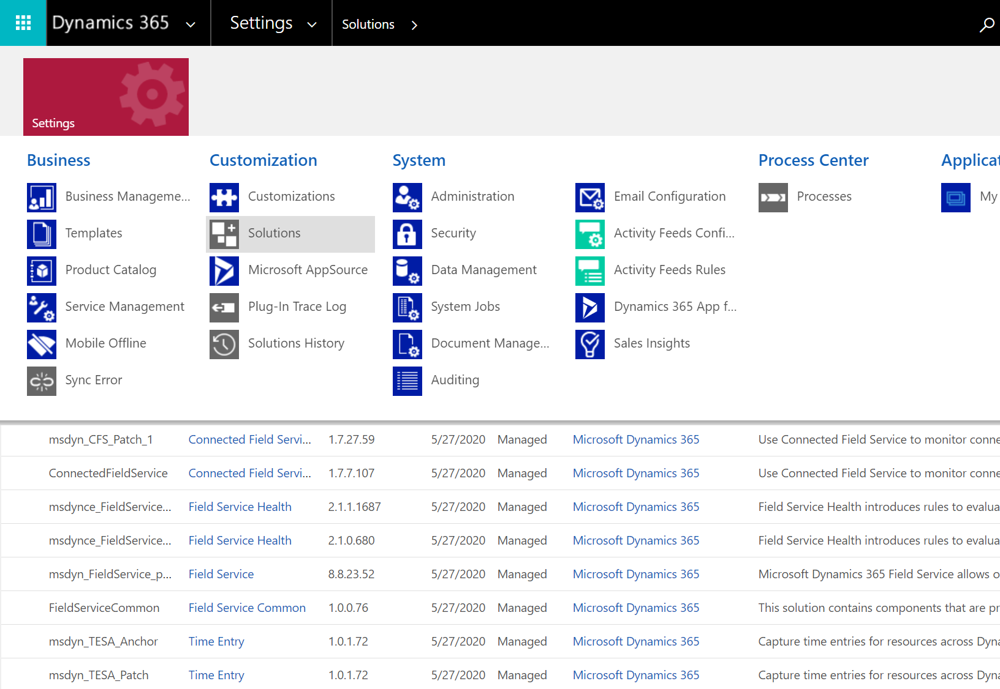

# Uninstall Dynamics 365 Field Service

To uninstall Field Service, administrators can go to **Settings** > **Solutions** to remove solutions in the order listed in the following table.

> [!div class="mx-imgBorder"]
> 

>[!Note]
> Some solutions are shared with other apps like Project Service Automation, and should not be removed unless you intend to uninstall those apps too. Skip those solutions.

| Order | Solution name                         | Note                                                      |
|-------|---------------------------------------|-----------------------------------------------------------|
| 1     | FieldServiceUpgradeScripts            |                                                           |
| 2     | FieldService_Anchor                   |                                                           |
| 3     | msdyn_OneFSSCM                        | Required for DualWrite (with Dynamics 365 Finance or Dynamics 365 Supply Chain Management)  |
| 4     | msdyn_InsightsAnalyticsFSConfiguration|                                                           |
| 5     | msdyn_DataInsightsAndAnalyticsForFS  |                                                           |
| 6     | msdyn_DataInsightsAndAnalytics       |                                                           |
| 7     | msdyn_FieldServiceGuides             |                                                           |
| 8     | msdyn_GeofenceAlert                  |                                                           |
| 9     | msdyn_FSMNotifications_Patch_1       |                                                           |
| 10    | msdyn_FSMNotifications               |                                                           |
| 11    | msdyn_FieldServiceGeofencing         |                                                           |
| 12    | msdyn_Geofencing_Patch_1             |                                                           |
| 13    | msdyn_Geofencing                     |                                                           |
| 14    | msdyn_CFS_Patch_1                    |                                                           |
| 15    | ConnectedFieldService                |                                                           |
| 16    | msdynce_FieldServiceHealth_Patch     |                                                           |
| 17    | msdynce_FieldServiceHealth           |                                                           |
| 18    | msdyn_FieldService_patch_xx          | Patch name or number may vary                             |
| 19    | msdyn_FieldService                   |                                                           |
| 20    | FieldServiceCommon                   | Required for DualWrite (with Dynamics 365 Finance or Dynamics 365 Supply Chain Management)  |
| 21    | msdyn_AssetCommon                    | Required for DualWrite (with Dynamics 365 Finance or Dynamics 365 Supply Chain Management)              |
| 22    | msdyn_TESA_Anchor                    | Required for Project Service Automation       |
| 23    | msdyn_TESA_Patch                     | Required for Project Service Automation       |
| 24    | msdyn_TESA                           | Required for Project Service Automation       |
| 25    | ResourceSchedulingControls           | Required for Project Service Automation                   |
| 26    | MicrosoftDynamicsScheduling_Patch_xx | Required for Project Service Automation                   |
| 27    | MicrosoftDynamicsScheduling          | Required for Project Service Automation                   |
| 28    | msdynce_3DViewer                     |                                                           |

[!INCLUDE[footer-include](../includes/footer-banner.md)]
