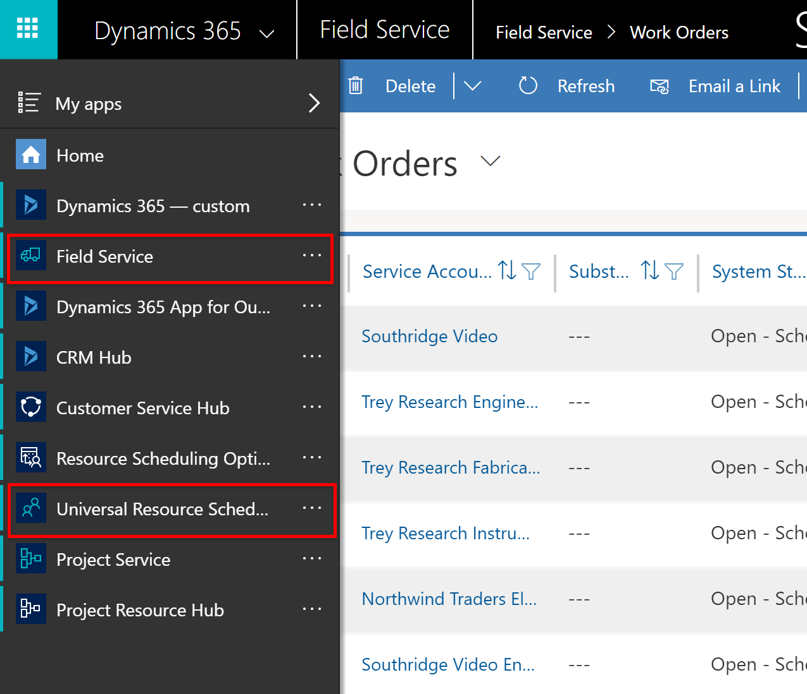
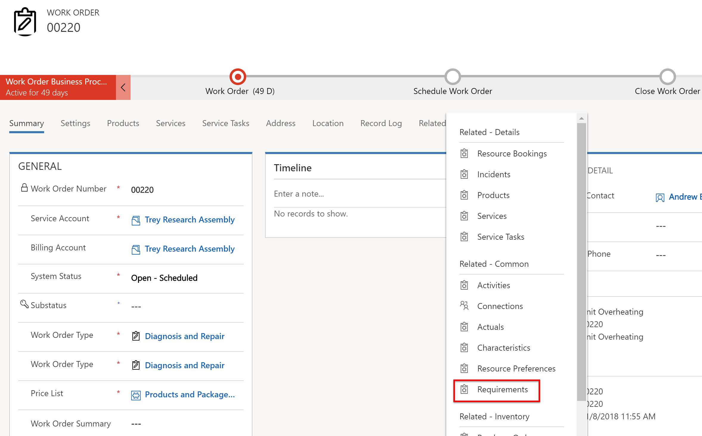
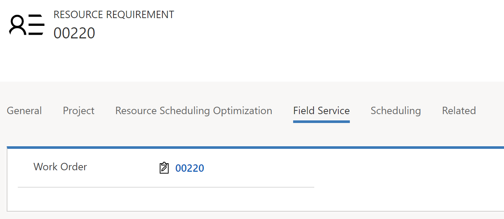
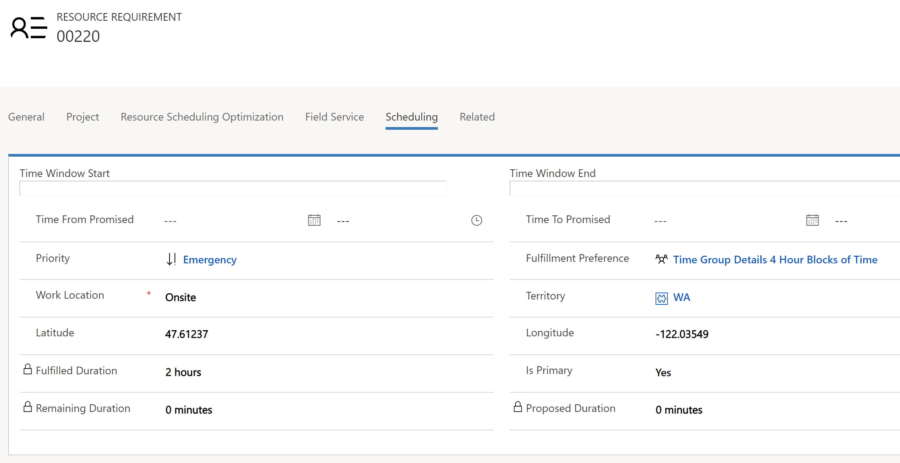
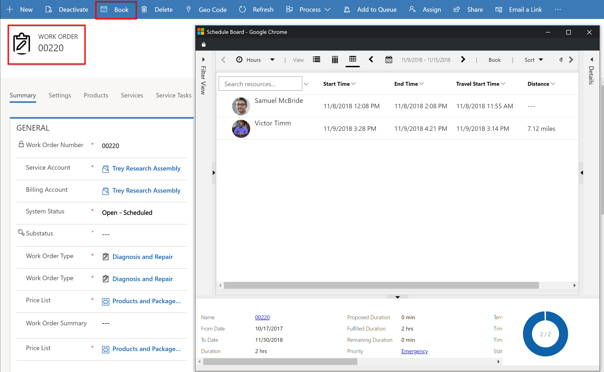
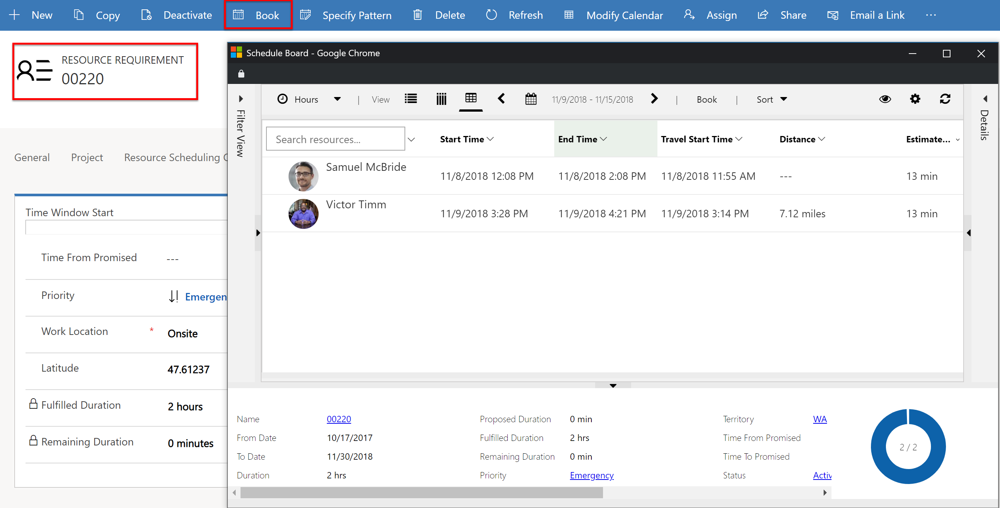
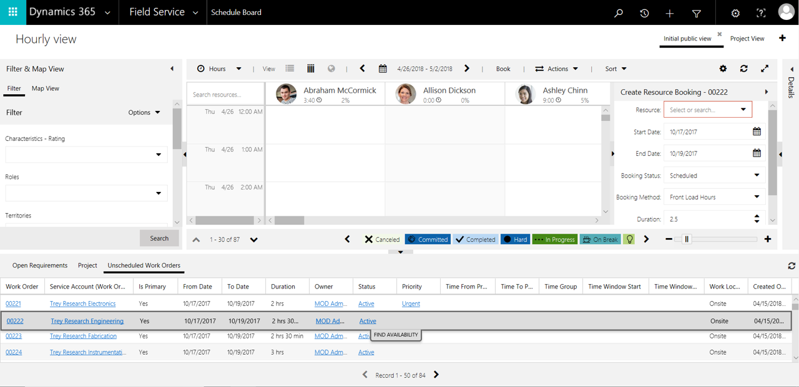
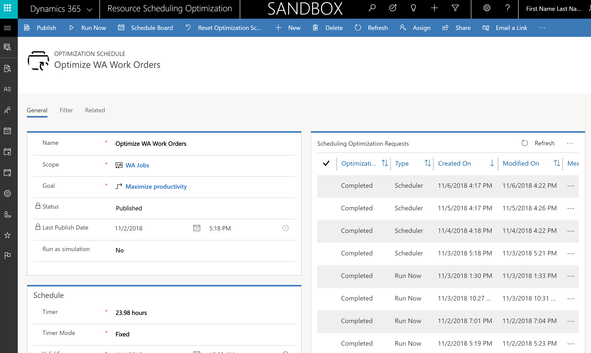
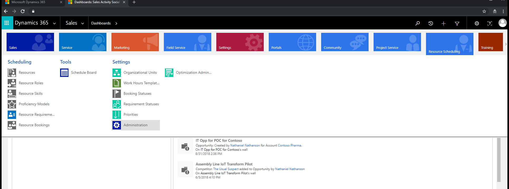
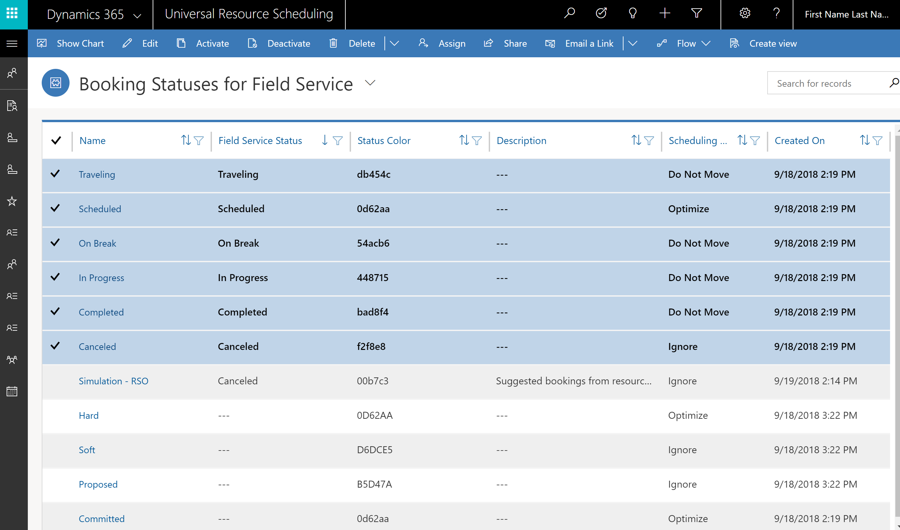

# Universal Resource Scheduling for Dynamics 365 Field Service

This article describes how Dynamics 365 Field Service uses Universal Resource Scheduling. We'll also take a look at how to configure Universal Resource Scheduling for onsite field service scenarios.

## Overview

[Universal Resource Scheduling](../common-scheduler/schedule-anything-with-universal-resource-scheduling.md) is a Dynamics 365 solution that allows organizations from different industries with different scenarios to assign resources to jobs and tasks. 

Universal Resource Scheduling assigns the best resources to jobs and tasks based on:

- Resource availability
- Required skills
- Promised time windows
- Business unit
- Geographic territory and more

**Field service organizations** most frequently use Universal Resource Scheduling to schedule mobile resources to location-specific jobs and tasks (known as work orders) as the resources travel to various customer locations. Because work orders are generally performed onsite, Universal Resource Scheduling schedules the resources with **closest proximity** to work orders, reducing travel time and costs. 

In this article, we'll take a quick look at: 

- Universal Resource Scheduling components
- How Universal Resource Scheduling works with Field Service work orders
- How to schedule work orders with Universal Resource Scheduling
- Basic configuration 

For more detailed information on Universal Resource Scheduling, visit the [Universal Resource Scheduling documentation](../common-scheduler/schedule-anything-with-universal-resource-scheduling.md).

## Components 
When Dynamics 365 Field Service is installed, Universal Resource Scheduling installs automatically, and appears in the menu as shown in the following screenshot.
 
> [!div class="mx-imgBorder"]
>  

In general, work orders and related entities are a part of Field Service, while resource- and requirement-related entities are part of Universal Resource Scheduling. All work seamlessly together.

In other words, field service work orders define **what** work needs to be done and **where**, while Universal Resource Scheduling defines **who** can perform the work and **when**.

The following list shows which components correspond to Field Service and Universal Resource Scheduling:

- Work orders (**Field Service**)
- Bookable resources (**Universal Resource Scheduling**) 
- Resource requirements (**Universal Resource Scheduling**)
- Resource bookings (**Universal Resource Scheduling**)
- Schedule tools - schedule board, schedule assistant (**Universal Resource Scheduling**)
- Resource Scheduling Optimization (installed separately) (**Universal Resource Scheduling**)

For more information, visit the [Universal Resource Scheduling documentation](../common-scheduler/schedule-anything-with-universal-resource-scheduling.md).

## How Universal Resource Scheduling works with Field Service work orders 

Now that we've looked at how the various components correspond with Field Service and Universal Resource Scheduling, let's look at what happens when Universal Resource Scheduling interacts with Field Service work orders.

### Creating work orders creates requirements

When a work order is created and saved, a related requirement automatically generates in the background. This requirement (which is a separate entity) outlines the specific details for resources that can perform the work order. The requirement is what will be scheduled to resources, and it simply references the work order.

By default, one requirement is created but a single work order can have multiple requirements. Additionally, a requirement group with multiple requirements can also be added to a work order.

> [!div class="mx-imgBorder"]
>  

### Fields passed from work order to requirements

When a requirement is created, it inherits attributes from the work order, including but not limited to:

- Name (work order number text)
- Work order (look-up reference to work order)
- Work location 
- Latitude
- Longitude
- Service Territory
- Duration 
- Start / End date
- Priority
- Characteristics
- Preferred/restricted resources
- Fulfillment preference

> [!div class="mx-imgBorder"]
>  

> [!div class="mx-imgBorder"]
>  

Updating work order attributes will update requirement attributes. Manual edits to requirements can be made before scheduling, too.

> [!NOTE]
> Many work order attributes are added to the work order when work order incident types are created, including duration and characteristics. 

## Scheduling work orders with Universal Resource Scheduling

After a work order and related requirement are ready to be scheduled, Universal Resource Scheduling scheduling tools can be used to **book** the requirement to the most appropriate resource.

After a work order requirement is booked, a bookable resource booking record is created documenting the resource, travel time, and start/end time. The booking relates to both the work order and requirement.

You can book from: 

- Work orders
- Requirements
- Schedule board
- Resource Scheduling Optimization (RSO)

### Book from the work order

Selecting **Book** from the work order will trigger the Universal Resource Scheduling schedule assistant to match the related work order requirement with available resources.

> [!div class="mx-imgBorder"]
>  

### Book from the requirement

Like with work orders, the same booking experience can be triggered from the requirement entity, by selecting **Book** while on the requirement.

> [!div class="mx-imgBorder"]
>  

### Book from the schedule board

The lower schedule board pane displays requirement records and can be configured to show only requirements related to work orders with a view filter.

> [!div class="mx-imgBorder"]
>  

The requirement can be dragged and dropped onto a resource on the schedule board to schedule the work order. Alternatively, selecting  **find availability** on the requirement in the lower pane will trigger the schedule assistant, which recommends the most appropriate resources. 

### Book with Resource Scheduling Optimization

Resource Scheduling Optimization can automatically schedule work order requirements based on predefined schedules or triggers. You can also manually accomplish this by selecting the **Run Now** button.

> [!div class="mx-imgBorder"]
> 

## Configure Universal Resource Scheduling for Field Service 

There are a few things you'll need to configure before getting started with Universal Resource Scheduling for Field Service.

### Enable work orders for scheduling

Go to **Resource Scheduling** > **Administration** > **Enable Resource Scheduling for Entities**.

> [!div class="mx-imgBorder"]
> 

This is where administrators decide which entities can be scheduled to resources. When Field Service is installed, work orders are enabled for resource scheduling by default. 

Double-click work orders to define default behavior when scheduling work order requirements.

### Connect to maps

> [!Important]
> By connecting to a mapping service, you are allowing the system to share your data, including but not limited to addresses and coordinates, with external systems outside of your Microsoft Dynamics 365 environment. (Mapping service refers to Bing Maps or other third-party mapping service designated by you or your operating system). This also applies to Government Cloud environments. Your use of the mapping service will also be subject to their separate terms of use. Data imported from such external systems into Microsoft Dynamics 365 are subject to the [Microsoft Privacy Statement](https://privacy.microsoft.com/privacystatement).

Connecting to a mapping service is critical if you want to geographically display work orders and route field technicians.

1. To connect a mapping service, navigate to **Resource Scheduling > Administration > Scheduling Parameters**.

> [!div class="mx-imgBorder"]
>   

1. Set **Connect to Maps** to **Yes**. Then save and close.

The API key will populate automatically and use the Bing Maps API.

> [!div class="mx-imgBorder"]
>   

> [!Note]
> In Field Service version 8.8.10.44+ the Bing Maps API key is hidden. 

### Configure booking statuses

Resources (field technicians) interact with booking statuses to communicate to stakeholders the progress of their work. For Field Service, booking statuses can update work order system statuses. This is done by noting a Field Service Status on the Booking Status.

Navigate to **Resource Scheduling > Booking Statuses**

See the following screenshot for the recommended out-of-the-box values.

> [!div class="mx-imgBorder"]
> 

### Geo-locate resources

Work order locations are defined by the latitude / longitude of either the work order form, or the related service account. It's important to also geo-locate resources.

Navigate to **Resource Scheduling > Resources**.

To ensure resources can appear on the schedule board map, they must have a geocoded starting and ending location. 

There are **two ways** to geocode your resources.

#### Option one

Set resource start/end location to **Resource address** and ensure the related resource record (User, Account, Contact) as defined by the resource type has latitude and longitude values.

> [!div class="mx-imgBorder"]
> 

For example, in the following screenshot, the bookable resource has resource type = Contact; this means the related contact record must be geo-coded, meaning latitude and longitude fields must have values. 

> [!div class="mx-imgBorder"]
> 

> [!NOTE]
> For routing purposes, the location of a resource is defined as the current work order location, current location of the mobile device, or the start/end location defined here when the other options are not applicable.

#### Option two

Set resource start/end location to **Organizational Unit Address** and ensure the related organizational unit record is geo-coded, meaning latitude and longitude fields must have values.

> [!div class="mx-imgBorder"]
> 

> [!NOTE] 
> You may need to add the latitude/longitude fields to the organizational unit entity form.

#### Confirm geocoding works appropriately

To make sure resources are geocoded properly, navigate to **Universal Resource Scheduling** > **Schedule Board**. The resource should appear on the map. Select a resource's name to highlight their location pin on the map.

> [!div class="mx-imgBorder"]
> 

## Additional notes

If the work order or requirement doesn't have a latitude or longitude, the location is treated as location-agnostic, which means the location of resources isn't considered during scheduling. If the work order or requirement has a latitude and longitude and work location is set to **onsite**, resource locations, travel time, and routes are considered during scheduling.

### See also

- [Universal Resource Scheduling documentation](../common-scheduler/schedule-anything-with-universal-resource-scheduling.md)
- [Resource Scheduling Optimization overview](rso-overview.md)
- [Frequently asked questions about the mobile solution](https://www.resco.net/mobilecrm/support.aspx) 
- [Woodford guide (PDF)](https://www.resco.net/downloads/Woodford_Guide.pdf) 
