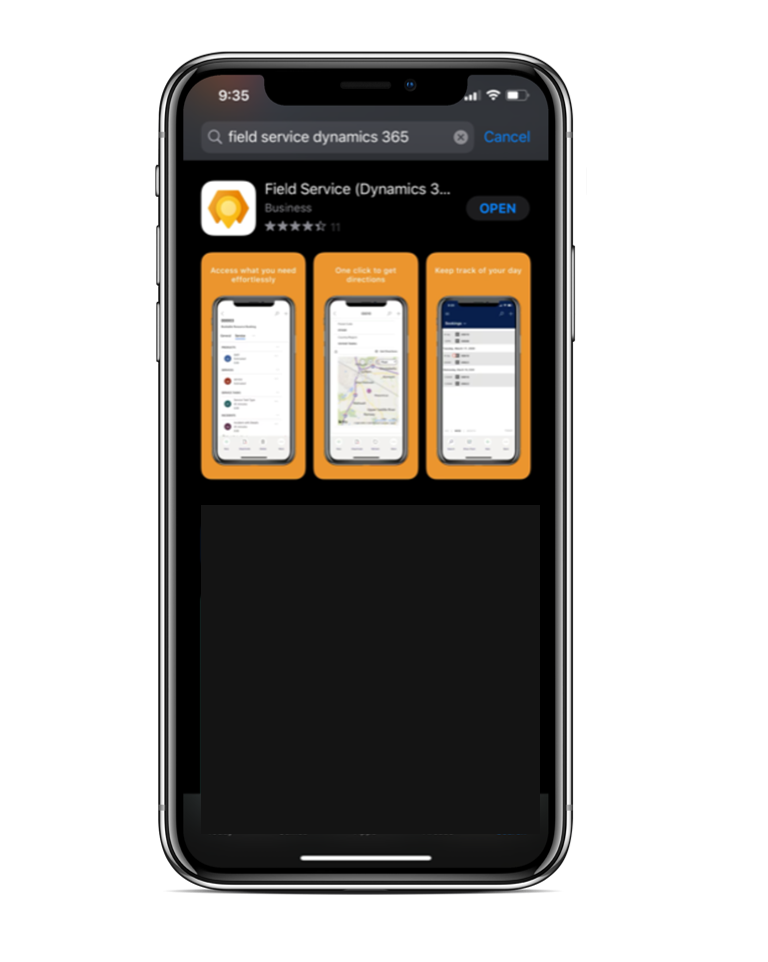

# Upgrade Dynamics 365 Field Service

Microsoft releases updates to the Dynamics 365 Field Service app and related solutions to add new capabilities, enhance the performance and usability of existing features, and fix bugs. In this article we will provide details on upgrading Field Service, including the related mobile app and resource scheduling solutions.

## Field Service

### When are Field Service updates released?
Multiple Field Service updates are released every year.

**Minor updates** are released each month and will include only non-disrupting bug fixes. All updates that have the potential to disrupt will be held until the major update periods.

**Major updates** are released twice each year in April and October. Major releases include major new features, as well as minor new features, enhancements, and bug fixes.

Though it is rare, occasionally a critical "hot fix" will be released outside of the monthly minor updates or the bi-yearly major updates.

The details of upcoming major and minor releases are listed in the [upcoming release plans](/dynamics365/release-plans/) once they are committed. As an example, April 2020 release plans will include major and minor updates from November 2019 through April 2020; and October 2020 release plans will include major and minor updates from May 2020 through October 2020.

### How do I upgrade my environment?

The Field Service app will be updated automatically as part of the Dynamics 365 platform [One version](https://cloudblogs.microsoft.com/dynamics365/bdm/2018/07/06/modernizing-the-way-we-update-dynamics-365/) initiative.

Before your organization updates to 8.8.6+ or later, you can manually apply updates by going to the Microsoft 365 Admin Center.

Sign in to [https://login.microsoftonline.com](https://login.microsoftonline.com) with administrator credentials. 

Go to **Admin**.

> [!div class="mx-imgBorder"]
> 

Then go to the Dynamics 365 Admin Center. 

> [!div class="mx-imgBorder"]
> 

You can also go directly to [https://admin.powerplatform.microsoft.com/environments](https://admin.powerplatform.microsoft.com/environments)

Select and highlight the environment that has the Field Service app you want to upgrade. In the top ribbon, select **Resources** > **Dynamics 365 apps**. 

> [!div class="mx-imgBorder"]
> 

In the list of solutions, find and select the Field Service app. It will indicate if an upgrade is available. Then select the **Update** in the top.

> [!div class="mx-imgBorder"]
> 

In addition, once your organization begins receiving automatic updates with version **8.8.6+**, you can manually upgrade the app in the seven days between the update release and when the automatic update applies. Manual updates can be done via the admin center process above.

> [!Note]
> All new Dynamics 365 Field Service trial environments are given the latest generally available solution when a trial is created via [https://trials.dynamics.com](https://trials.dynamics.com).

### What gets updated?

When the Field Service app is upgraded, the Field Service solution is upgraded and multiple other solutions can be upgraded as well such as Universal Resource Scheduling (also called "Resource Scheduling"), Geofencing for Field Service, Field Service Mobile Push Notifications, and more.

> [!div class="mx-imgBorder"]
> 

To understand what version of the Field Service solution is in your environment, look at the version of the solution named **FieldService_anchor**. 

### Best practices

1. Before upgrading your production instance of Field Service, make a copy of the production instance and upgrade the copy first. Then test your business processes to understand consequences and upgrade the actual production instance after.
2. Upgrading from Field Service version 7.x to 8.x is considered a major upgrade because it's upgrading to the [Unified Client Interface (UCI)](/power-platform/admin/about-unified-interface). For more information, see the [Field Service UCI Upgrade Playbook](https://aka.ms/fsuciupgrade). 
3. If your organization is using Project Service Automation along with Field Service, it is recommended to upgrade both at the same time or soon after each other due to shared functionality.
4. Editing out-of-the-box web resources is unsupported and can cause functional issues after upgrading. You can use [Solution Health Hub](./troubleshoot-field-service-solution-health.md) to understand if web resources have been edited.

## Field Service (Dynamics 365) mobile app

> [!div class="mx-imgBorder"]
> 

There are two steps to upgrade the Field Service (Dynamics 365) mobile app.

**Step 1.** Upgrade Field Service (as described in the previous section). Upgrading Field Service will also upgrade the "Field Service Mobile" model-driven app. For example, upgrading to [Field Service v8.8.32.59](./version-history.md#883259) includes an update to Field Service and the Field Service mobile app.

**Step 2.** After Field Service is upgraded, you must upgrade the mobile app on your mobile phone or tablet. You can do this the same way you upgrade any app on your phone or tablet, either manually or with automatic updates.

> [!Note]
> **Best practice**: Turn on automatic app updates on your device. For more information, see these articles: [iOS: automatic app updates iOS](https://support.apple.com/HT202180#automatic) or [Android: automatic app updates](https://support.google.com/googleplay/answer/113412). 

## Resource Scheduling

Resource Scheduling, also called Universal Resource Scheduling, is the app that powers Field Service scheduling. You cannot upgrade Resource Scheduling on its own; it's upgraded with Field Service, Project Service Automation, or Customer Service. 

However, before upgrading Resource Scheduling consider: 

1. Running the Resource Scheduling: Service Health Diagnostics
2. Planning for updated Universal FetchXML (UFX) queries on the schedule board and schedule assistant.

### Run Resource Scheduling: Service Health Diagnostics

Before upgrading, run the **Resource Scheduling: Service Health Diagnostics** tool to understand if any critical web resources or JavaScript files were edited. If so, they will get skipped during upgrade, which could cause functional issues and missed functionality. 

Go to **Resource Scheduling app** > **Settings** > **Administration** > **Scheduling Parameters**

Then select **Health Diagnostics** in the top ribbon.

> [!div class="mx-imgBorder"]
> 

If the diagnostic tool flags any web resources that should not have been edited, you will need to remove the customizations from the web resources and then run the upgrade. Not all customized web resources will be flagged by this tool, only the ones that could have critical impact. 

### Plan for updated Universal FetchXML (UFX) queries

Occasionally, Resource Scheduling releases will include updates to the Universal FetchXML (UFX) queries that control how resources and requirements are fetched and loaded on the schedule board or in schedule assistant results. For more information, see the article on [schedule board tab settings](./schedule-board-tab-settings.md#other-settings).

For example, a new version of Resource Scheduling may add a new resource filter to the left panel of the schedule board. To make this update possible, the update will come with a new UFX query for the **Retrieve Resources Query** as seen in the screenshot below.

> [!div class="mx-imgBorder"]
> 

However, the XML in each UFX can be edited based on your specific needs. If a UFX query has been edited by your organization, the Resource Scheduling upgrade will import the new UFX query, but **will not apply it**. Therefore, you'll need to add your customizations to the new UFX query and select and apply it manually from the Schedule Board Tab Settings. One option is to use GitHub to understand the differences between the old XML file with your custom queries and the new XML file as part of the Resource Scheduling upgrade.

All UFX queries, both custom ones your organization creates and queries included with the Resource Scheduling app, are listed as records in the configurations entity, and each record holds the XML queries.  

> [!div class="mx-imgBorder"]
> 

## Resource scheduling optimization

Resource scheduling optimization is the app that allows for automated scheduling of work orders, projects tasks, cases, and more. Major and minor updates are released throughout the year. Unlike Universal Resource Scheduling, resource scheduling optimization can be upgraded independently.

First, check if a resource scheduling optimization update is available. 

From the Power Platform admin center located at [https://admin.powerplatform.microsoft.com/](https://admin.powerplatform.microsoft.com/), go to **Environments**, select your environment, and choose **Dynamics 365 apps**. In the list of solutions, it will indicate if there is an upgrade available for resource scheduling optimization.

To upgrade resource scheduling optimization, in the left pane select **Resources** > **Dynamics 365 apps**, find resource scheduling optimization, and select **Manage**.

> [!div class="mx-imgBorder"]
> 

Then select **Upgrade to new version**.

> [!div class="mx-imgBorder"]
> 

**Pro Tip:** By selecting **Change Organization**, you can point resource scheduling optimization at a different environment to optimize those work orders, projects, cases, etc. Doing so will initiate an upgrade. Furthermore, your resource scheduling optimization data and configurations (optimization scopes, goals, and schedules) will remain in the previous environment in case you ever want to switch it back.

[!INCLUDE[footer-include](../includes/footer-banner.md)]
